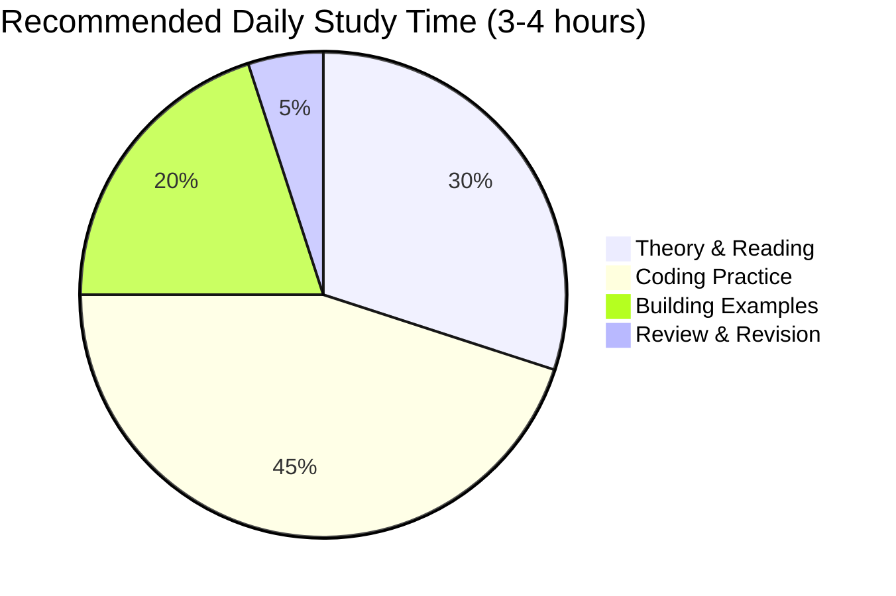
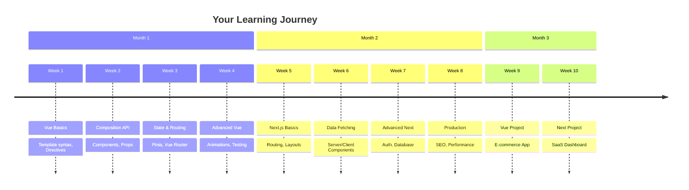
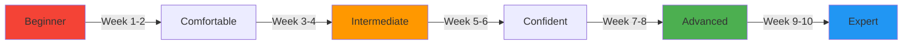

# Complete Vue.js & Next.js Learning Roadmap 📚

**10-Week Structured Course**

---

## 🗺️ Master Learning Flow

```mermaid
flowchart TD
    START[Start Your Journey] --> PHASE1[Phase 1: Vue.js Foundation]
    PHASE1 --> W1[Week 1: Vue Basics]
    PHASE1 --> W2[Week 2: Composition API]
    
    W1 --> W1D1[Day 1: Setup & Instance]
    W1 --> W1D2[Day 2: Template Syntax]
    W1 --> W1D3[Day 3: Directives]
    W1 --> W1D4[Day 4: Event Handling]
    W1 --> W1D5[Day 5: Forms & v-model]
    W1 --> W1D6[Day 6: Computed & Watchers]
    W1 --> W1D7[Day 7: Mini Project]
    
    W2 --> W2D1[Day 8: Components Basics]
    W2 --> W2D2[Day 9: Props & Emit]
    W2 --> W2D3[Day 10: Slots]
    W2 --> W2D4[Day 11: Lifecycle Hooks]
    W2 --> W2D5[Day 12: Composables]
    W2 --> W2D6[Day 13: Provide/Inject]
    W2 --> W2D7[Day 14: Week Project]
    
    PHASE1 --> PHASE2[Phase 2: Vue.js Advanced]
    PHASE2 --> W3[Week 3: State & Routing]
    PHASE2 --> W4[Week 4: Advanced Patterns]
    
    W3 --> W3TOPICS[Pinia, Vue Router, Navigation Guards]
    W4 --> W4TOPICS[Transitions, Teleport, Performance]
    
    PHASE2 --> PHASE3[Phase 3: Next.js Foundation]
    PHASE3 --> W5[Week 5: Next.js Basics]
    PHASE3 --> W6[Week 6: App Router]
    
    W5 --> W5TOPICS[Setup, Routing, Pages, Layouts]
    W6 --> W6TOPICS[Server Components, Data Fetching]
    
    PHASE3 --> PHASE4[Phase 4: Next.js Advanced]
    PHASE4 --> W7[Week 7: Advanced Features]
    PHASE4 --> W8[Week 8: Production Ready]
    
    W7 --> W7TOPICS[Server Actions, Middleware, Auth]
    W8 --> W8TOPICS[Performance, SEO, Deployment]
    
    PHASE4 --> PHASE5[Phase 5: Real Projects]
    PHASE5 --> W9[Week 9: Vue E-commerce]
    PHASE5 --> W10[Week 10: Next.js SaaS]
    
    W9 --> PROJECT1[Full Vue App with Pinia & Router]
    W10 --> PROJECT2[Full Next.js App with Database]
    
    PROJECT2 --> MASTER[🎓 Full Stack UI Developer]
    
    style START fill:#4CAF50
    style MASTER fill:#FFD700
    style PHASE1 fill:#42b883
    style PHASE2 fill:#42b883
    style PHASE3 fill:#9C27B0
    style PHASE4 fill:#9C27B0
    style PHASE5 fill:#F44336
```

---

## 📅 Daily Time Commitment

---

## 📊 Weeks 1-10 Complete Breakdown

### **Week 1: Vue.js Fundamentals** 🌱

| Day | Topic | Key Concepts |
|-----|-------|--------------|
| Day 1 | Setup & Vue Instance | createApp, reactive data, SFC structure |
| Day 2 | Template Syntax | Interpolation, bindings, expressions |
| Day 3 | Directives | v-if, v-for, v-show, conditional rendering |
| Day 4 | Event Handling | @click, event modifiers, methods |
| Day 5 | Forms & v-model | Two-way binding, form inputs |
| Day 6 | Computed & Watchers | Derived state, reactive dependencies |
| Day 7 | **Project: Todo App** | Apply week's concepts |

### **Week 2: Composition API & Components** 🧩

| Day | Topic | Key Concepts |
|-----|-------|--------------|
| Day 8 | Component Basics | SFC, component registration, naming |
| Day 9 | Props & Emit | Parent-child communication |
| Day 10 | Slots | Content distribution, named slots |
| Day 11 | Lifecycle Hooks | mounted, updated, unmounted |
| Day 12 | Composables | Reusable composition functions |
| Day 13 | Provide/Inject | Dependency injection |
| Day 14 | **Project: Blog Component System** | Reusable components |

### **Week 3: State Management & Routing** 🗺️

| Day | Topic | Key Concepts |
|-----|-------|--------------|
| Day 15 | Pinia Setup | Stores, state, getters, actions |
| Day 16 | Pinia Advanced | Composing stores, plugins |
| Day 17 | Vue Router Basics | Routes, navigation, router-view |
| Day 18 | Dynamic Routing | Params, query, nested routes |
| Day 19 | Navigation Guards | beforeEach, route protection |
| Day 20 | Route Meta & Lazy Loading | Code splitting |
| Day 21 | **Project: Multi-page App** | Router + Pinia |

### **Week 4: Advanced Vue Patterns** 🚀

| Day | Topic | Key Concepts |
|-----|-------|--------------|
| Day 22 | Transitions & Animations | transition, transition-group |
| Day 23 | Teleport & Suspense | Portal pattern, async components |
| Day 24 | Custom Directives | v-focus, v-click-outside |
| Day 25 | Plugins | Global functionality |
| Day 26 | Performance Optimization | Lazy loading, virtual scrolling |
| Day 27 | Testing with Vitest | Unit tests, component tests |
| Day 28 | **Project: Dashboard with Animations** | Advanced patterns |

### **Week 5: Next.js Fundamentals** ⚡

| Day | Topic | Key Concepts |
|-----|-------|--------------|
| Day 29 | Next.js Setup | App router, project structure |
| Day 30 | File-based Routing | page.tsx, layout.tsx |
| Day 31 | Layouts & Templates | Nested layouts, route groups |
| Day 32 | Navigation & Links | Link component, useRouter |
| Day 33 | Static & Dynamic Routes | [id], [...slug] |
| Day 34 | Loading & Error States | loading.tsx, error.tsx |
| Day 35 | **Project: Multi-page Website** | Basic Next.js app |

### **Week 6: Data Fetching & Server Components** 🔄

| Day | Topic | Key Concepts |
|-----|-------|--------------|
| Day 36 | Server Components | RSC, server-side rendering |
| Day 37 | Client Components | 'use client', interactivity |
| Day 38 | Data Fetching Patterns | fetch, cache, revalidate |
| Day 39 | Parallel & Sequential Data | Promise.all, waterfall |
| Day 40 | Streaming & Suspense | Streaming SSR, boundaries |
| Day 41 | TanStack Query | Client-side data fetching |
| Day 42 | **Project: Blog with API** | Data fetching patterns |

### **Week 7: Advanced Next.js** 💪

| Day | Topic | Key Concepts |
|-----|-------|--------------|
| Day 43 | Server Actions | Form actions, mutations |
| Day 44 | Middleware | Request interception |
| Day 45 | Authentication | NextAuth.js, JWT |
| Day 46 | API Routes | Route handlers, REST API |
| Day 47 | Database Integration | Prisma, PostgreSQL |
| Day 48 | File Uploads | FormData, image handling |
| Day 49 | **Project: Full Auth System** | Login, register, protected routes |

### **Week 8: Production & Optimization** 🎯

| Day | Topic | Key Concepts |
|-----|-------|--------------|
| Day 50 | Image Optimization | next/image, lazy loading |
| Day 51 | Font Optimization | next/font, web fonts |
| Day 52 | SEO & Metadata | Metadata API, sitemap |
| Day 53 | Performance | Core Web Vitals, metrics |
| Day 54 | Caching Strategies | ISR, on-demand revalidation |
| Day 55 | Deployment | Vercel, environment variables |
| Day 56 | **Project: Optimized Portfolio** | SEO + Performance |

### **Week 9: Vue.js E-commerce Project** 🛒

| Day | Topic | Deliverable |
|-----|-------|-------------|
| Day 57 | Project Setup | Vite + Vue 3 + TypeScript + Pinia |
| Day 58 | Product Catalog | List, filter, search |
| Day 59 | Shopping Cart | Add, remove, update quantities |
| Day 60 | Checkout Flow | Multi-step form |
| Day 61 | Order Management | Order history, details |
| Day 62 | UI Polish | Transitions, loading states |
| Day 63 | **Deploy & Present** | GitHub Pages / Netlify |

### **Week 10: Next.js SaaS Dashboard** 📊

| Day | Topic | Deliverable |
|-----|-------|-------------|
| Day 64 | Project Setup | Next.js 14 + Prisma + PostgreSQL |
| Day 65 | Authentication | NextAuth, user management |
| Day 66 | Dashboard UI | Shadcn UI, charts, tables |
| Day 67 | CRUD Operations | Create, read, update, delete |
| Day 68 | Real-time Features | WebSocket or polling |
| Day 69 | Testing & Polish | E2E tests, error handling |
| Day 70 | **Deploy & Present** | Vercel deployment |

---

## 🎯 Learning Milestones

---

## 📈 Skill Progression

---

## ✅ Prerequisites Checklist

- [ ] JavaScript ES6+ (arrow functions, destructuring, spread operator)
- [ ] TypeScript basics (types, interfaces, generics)
- [ ] HTML5 & CSS3 fundamentals
- [ ] Node.js & npm installed
- [ ] Git basics
- [ ] VS Code or preferred IDE
- [ ] Terminal/Command line familiarity

---

## 🛠️ Tools You'll Use

**Vue.js Stack:**

- Vue 3 (Composition API)
- Vite
- Pinia (State Management)
- Vue Router
- Vitest (Testing)

**Next.js Stack:**

- Next.js 14+ (App Router)
- React 18+
- TanStack Query
- Prisma ORM
- PostgreSQL
- Shadcn UI
- Tailwind CSS

---

## 📚 How to Use This Roadmap

1. **Follow Sequentially**: Start Week 1 Day 1, don't skip ahead
2. **Complete Exercises**: Each day has practice exercises
3. **Build Projects**: Week-end projects solidify learning
4. **Review Diagrams**: Visual learners benefit from Mermaid diagrams
5. **Take Notes**: Create your own examples
6. **Join Communities**: Vue/Next Discord, Reddit, Stack Overflow

---

## 🎓 Certification Path (Optional)

After completing this course, consider:

- Vue.js Certified Developer (Official)
- Next.js Partner Directory
- Build 3-5 portfolio projects
- Contribute to open source

---

**Ready to start? Open `week1/day1/README.md`** 🚀
