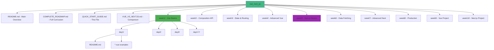
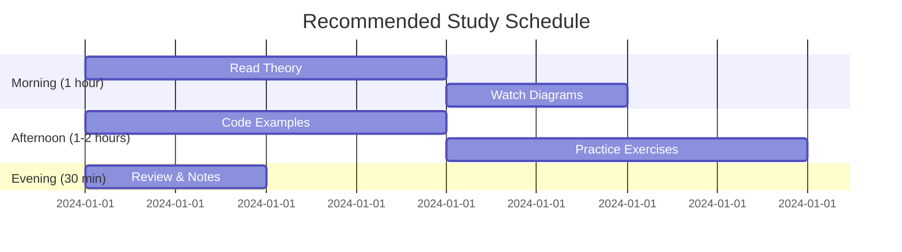
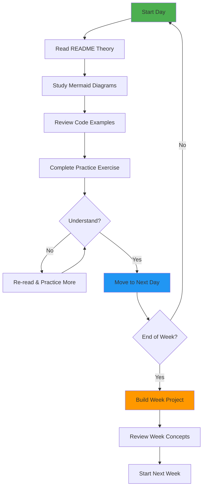
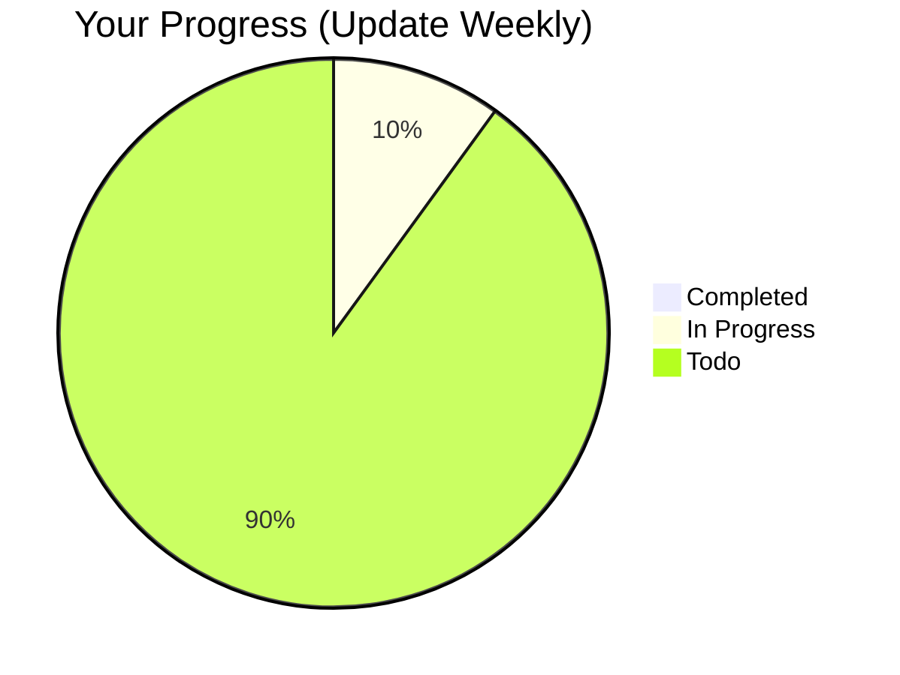
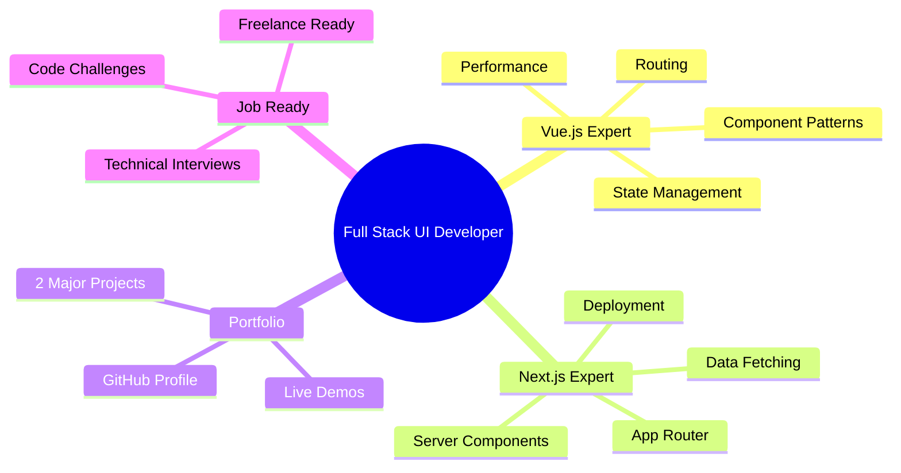

# Quick Start Guide 🚀

**Get started with your Vue.js & Next.js learning journey!**

---

## 📁 Repository Structure



---

## 🎯 How to Use This Course

### **Step 1: Read the Overview**

Start with `README.md` for the big picture.

### **Step 2: Check Complete Roadmap**

Review `COMPLETE_ROADMAP.md` to see all 70 days.

### **Step 3: Begin Week 1**

Navigate to `week1/day1/README.md` and start learning!

### **Step 4: Follow Daily Pattern**

Each day includes:

1. **README.md** - Theory and concepts
2. **Code examples** (.vue or .tsx files)
3. **Practice exercises** - Hands-on coding
4. **Mermaid diagrams** - Visual explanations

### **Step 5: Build Projects**

Complete weekly projects to solidify learning.

---

## ⏰ Study Schedule



---

## 💡 Learning Tips

### **For Visual Learners**

Focus on the Mermaid diagrams in each README. They show:

- Data flow
- Component relationships
- Architecture patterns
- Decision trees

### **For Hands-on Learners**

Jump straight to the code examples and modify them.

### **For Concept Learners**

Read the theory sections carefully and take notes.

---

## 🔄 Learning Flow



---

## 🛠️ Setup Your Environment

### **Prerequisites**

```bash
# Check versions
node --version  # v18+ required
npm --version   # v9+ required
```

### **For Vue.js (Weeks 1-4)**

```bash
# Install Vue CLI (optional)
npm install -g @vue/cli

# Create project (when needed)
npm create vite@latest my-vue-app -- --template vue-ts
cd my-vue-app
npm install
npm run dev
```

### **For Next.js (Weeks 5-8)**

```bash
# Create project (when needed)
npx create-next-app@latest my-next-app
cd my-next-app
npm run dev
```

---

## 📊 Progress Tracking

Create a progress tracker:



### **Track Your Progress**

- [ ] Week 1: Vue Fundamentals
- [ ] Week 2: Composition API
- [ ] Week 3: State & Routing
- [ ] Week 4: Advanced Vue
- [ ] Week 5: Next.js Basics
- [ ] Week 6: Data Fetching
- [ ] Week 7: Advanced Next.js
- [ ] Week 8: Production
- [ ] Week 9: Vue E-commerce Project
- [ ] Week 10: Next.js SaaS Project

---

## 🎓 Completion Goals

By the end of 10 weeks, you will:



---

## 🆘 When You're Stuck

1. **Re-read the README** - Often the answer is there
2. **Check the diagrams** - Visual explanation helps
3. **Modify examples** - Learn by experimenting
4. **Google the error** - Most issues are common
5. **Ask in communities** - Vue/Next Discord, Reddit
6. **Take a break** - Fresh eyes help

---

## 🔗 Important Links

### **Vue.js Resources**

- [Vue.js Docs](https://vuejs.org/)
- [Vue Composition API](https://vuejs.org/api/composition-api-setup.html)
- [Pinia Docs](https://pinia.vuejs.org/)
- [Vue Router](https://router.vuejs.org/)

### **Next.js Resources**

- [Next.js Docs](https://nextjs.org/docs)
- [Next.js Learn](https://nextjs.org/learn)
- [React Docs](https://react.dev/)
- [Vercel Docs](https://vercel.com/docs)

### **Communities**

- [Vue Discord](https://discord.com/invite/vue)
- [Next.js Discord](https://discord.gg/nextjs)
- [r/vuejs](https://reddit.com/r/vuejs)
- [r/nextjs](https://reddit.com/r/nextjs)

---

## 🎉 Ready to Start?

**Navigate to:** `week1/day1/README.md`

**Remember:** Consistency beats intensity. Spend 3-4 hours daily for 10 weeks, and you'll be a proficient UI developer!

---

**Good luck on your journey! 🚀**
