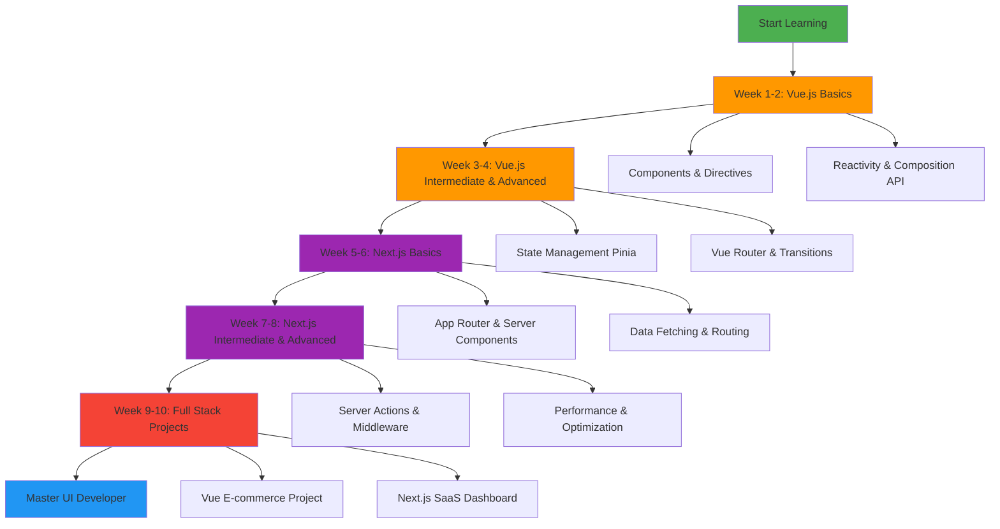
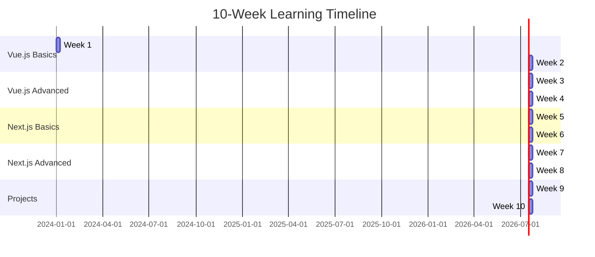
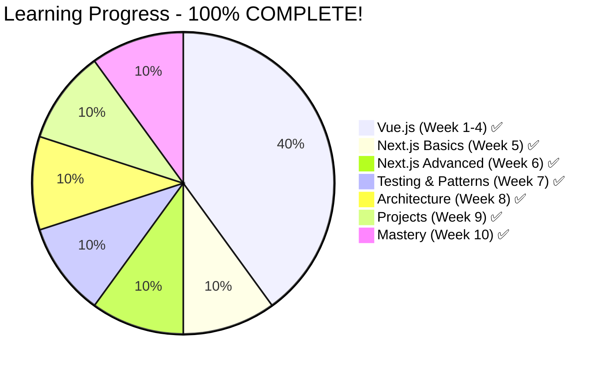

# Vue.js & Next.js Learning Journey 🚀

**Duration:** 10 Weeks (70 Days)  
**Level:** Beginner → Intermediate → Advanced

---

## 📊 Learning Roadmap

---

## 🗓️ Weekly Breakdown

---

## 📚 Course Structure

### **Phase 1: Vue.js (Weeks 1-4)**

- **Week 1:** Vue Basics & Template Syntax
- **Week 2:** Composition API & Reactivity
- **Week 3:** State Management with Pinia
- **Week 4:** Advanced Patterns & Performance

### **Phase 2: Next.js (Weeks 5-8)**

- **Week 5:** Next.js Fundamentals & App Router
- **Week 6:** Data Fetching & Dynamic Routes
- **Week 7:** Server Components & Actions
- **Week 8:** Performance Optimization & Deployment

### **Phase 3: Real-World Projects (Weeks 9-10)**

- **Week 9:** Build E-commerce Site with Vue
- **Week 10:** Build SaaS Dashboard with Next.js

---

## 🎯 Daily Learning Format

Each day includes:

- **📖 Theory & Concepts** (README.md)
- **💻 Code Examples** (.vue / .tsx files)
- **🎨 Mermaid Diagrams** (Visual explanations)
- **✅ Practice Exercises** (Practical implementations)
- **🔗 Resources** (Additional learning materials)

---

## 🚀 Getting Started

1. **Clone/Open this directory**
2. **Start with Week 1, Day 1**
3. **Follow the daily structure**
4. **Complete all exercises**
5. **Build projects in Weeks 9-10**

---

## 📈 Progress Tracking

**Current Status:**

- ✅ Vue.js Complete! (Weeks 1-4, Days 1-28)
- ✅ Next.js Fundamentals Complete! (Week 5, Days 29-35)
- ✅ Next.js Advanced Complete! (Week 6, Days 36-42)
- ✅ Testing & Advanced Patterns Complete! (Week 7, Days 43-49)
- ✅ Architecture & Production Complete! (Week 8, Days 50-56)
- ✅ Real-World Projects Complete! (Week 9, Days 57-63)
- ✅ Advanced Topics & Mastery Complete! (Week 10, Days 64-70)

## 🎉 **70-DAY JOURNEY COMPLETE!** 🎉

---

## 🛠️ Prerequisites

- ✅ JavaScript (ES6+) knowledge
- ✅ TypeScript basics
- ✅ HTML & CSS fundamentals
- ✅ Node.js installed
- ✅ VS Code or preferred IDE

---

## 📦 Technologies Covered

**Vue.js Ecosystem:**

- Vue 3 Composition API
- Pinia (State Management)
- Vue Router
- Vite Build Tool

**Next.js Ecosystem:**

- Next.js 14+ App Router
- React Server Components
- Server Actions
- TanStack Query
- Shadcn UI + Tailwind CSS

---

Let's begin your journey! 🎉
