# Visual Learning Path 🎨

**Complete visual guide to your 10-week journey**

---

## 🌊 Learning Wave Pattern

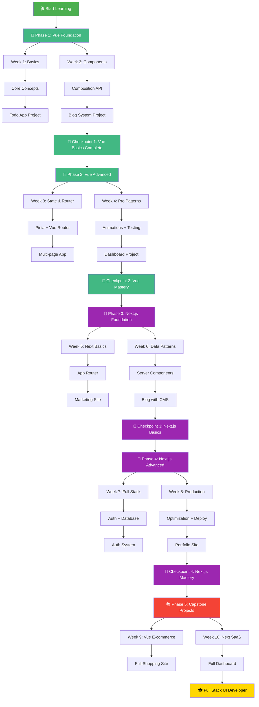

---

## 📊 Skill Acquisition Timeline

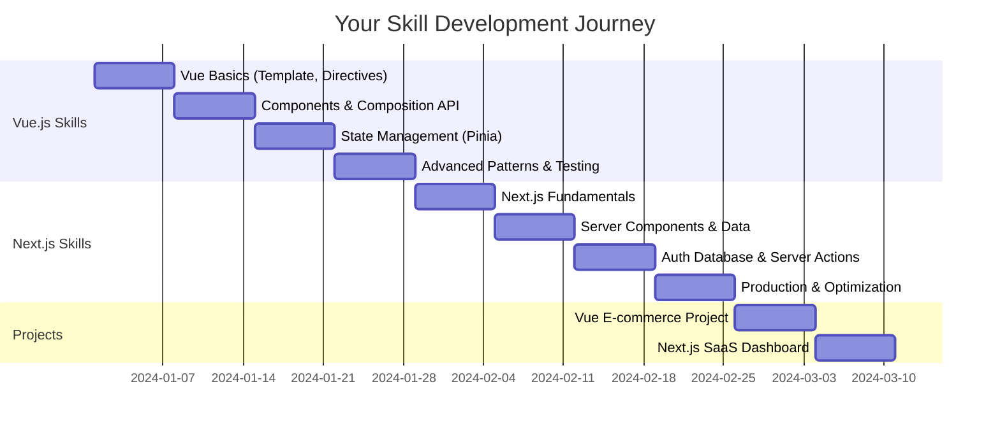

---

## 🎯 Difficulty Progression

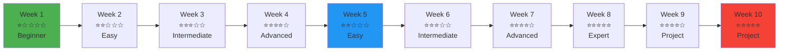

---

## 🧠 Concept Dependencies

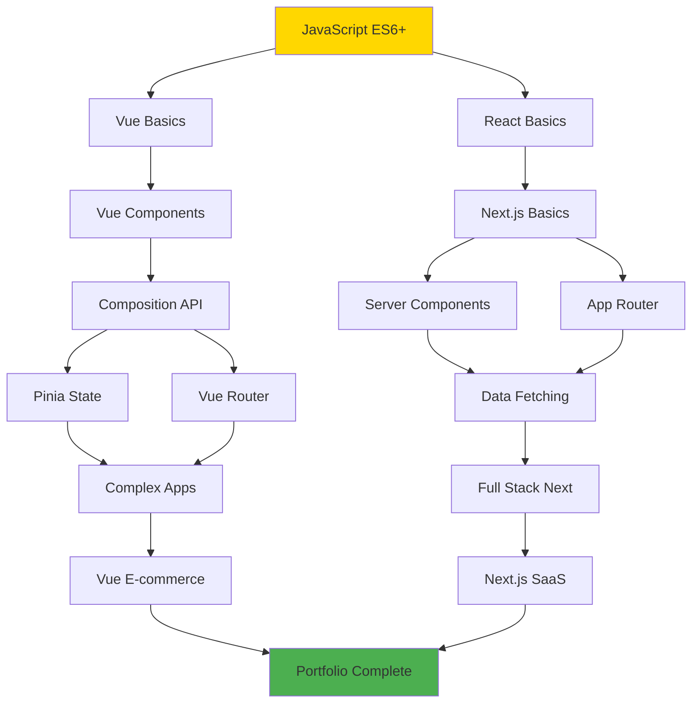

---

## 📈 Knowledge Build-up

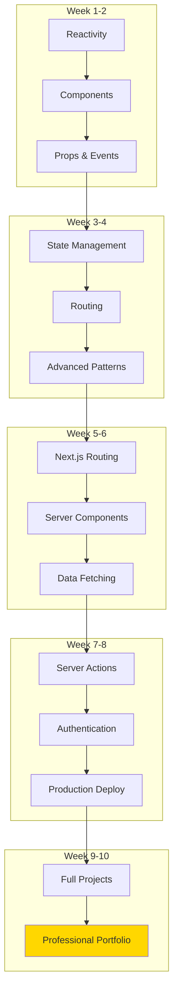

---

## 🎨 Daily Learning Cycle

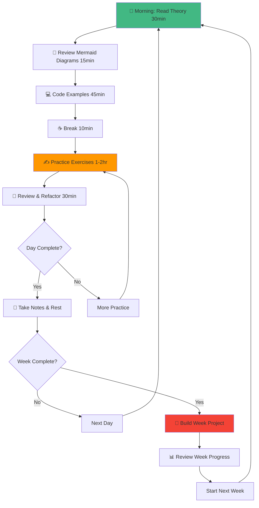

---

## 🔄 Concept Interconnections

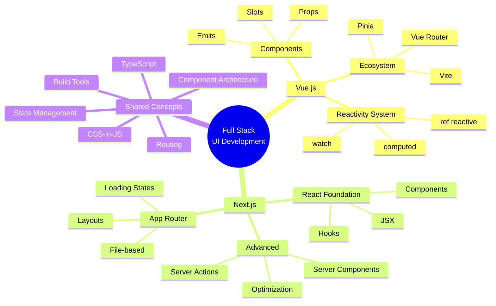

---

## 🏆 Milestone Achievements

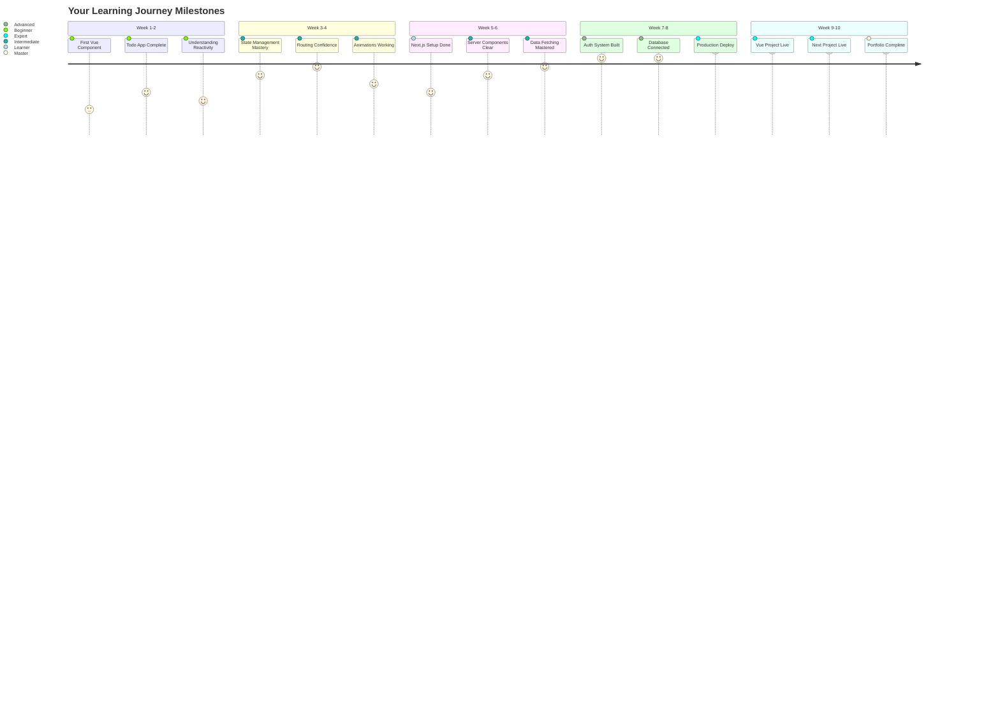

---

## 🎓 Certification Path

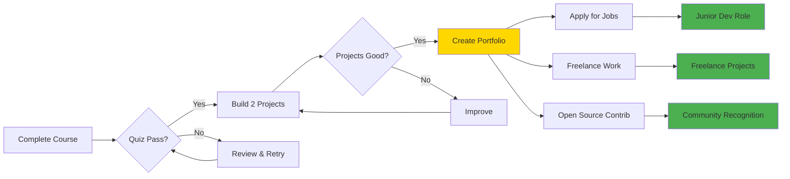

---

## 📱 Multi-device Learning

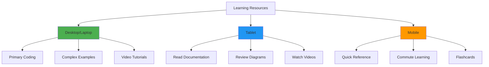

---

## 🌟 Success Formula

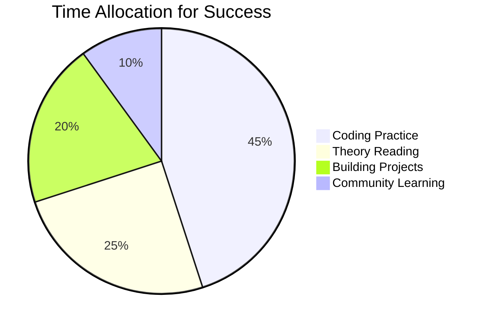

---

## 🔗 Learning Feedback Loop

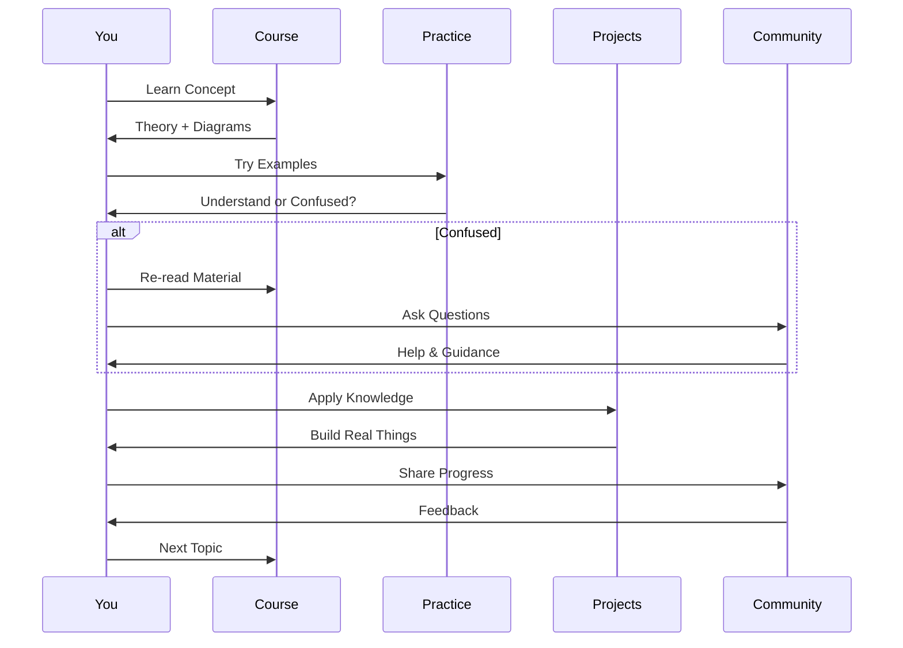

---

## 🎯 Your Path to Mastery

**Follow this visual guide alongside your daily learning. Each diagram represents a concept you'll master step by step!**

**Ready? Start with `week1/day1/README.md`** 🚀
