# Vue.js vs Next.js: Complete Comparison 🆚

**Understanding the similarities and differences**

---

## 🎯 Framework Philosophy

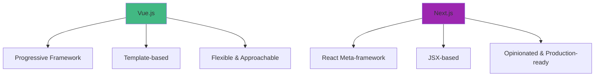

---

## 📊 Side-by-Side Comparison

| Feature | Vue.js | Next.js |
|---------|--------|---------|
| **Type** | Frontend framework | Full-stack React framework |
| **Syntax** | Template-based (HTML-like) | JSX (JavaScript + XML) |
| **Learning Curve** | Easier | Moderate |
| **Routing** | Vue Router (separate) | Built-in file-based |
| **State Management** | Pinia (separate) | Context/Zustand (separate) |
| **SSR** | Nuxt.js needed | Built-in |
| **API Routes** | Not built-in | Built-in |
| **Data Fetching** | Manual/libraries | Built-in patterns |
| **TypeScript** | Good support | Excellent support |
| **Build Tool** | Vite (fast) | Webpack/Turbopack |
| **Bundle Size** | Smaller | Larger |
| **Best For** | SPAs, interactive UIs | Full-stack apps, SEO-heavy |

---

## 🔄 Component Comparison

### **Vue Component**

```vue
<template>
  <div class="card">
    <h2>{{ title }}</h2>
    <p>{{ description }}</p>
    <button @click="handleClick">Click Me</button>
  </div>
</template>

<script setup lang="ts">
import { ref } from 'vue'

const title = ref('Hello Vue')
const description = ref('This is a Vue component')

const handleClick = () => {
  console.log('Clicked!')
}
</script>

<style scoped>
.card {
  padding: 20px;
  border: 1px solid #ddd;
}
</style>
```

### **Next.js Component**

```tsx
'use client'
import { useState } from 'react'

export default function Card() {
  const [title] = useState('Hello Next.js')
  const [description] = useState('This is a Next.js component')
  
  const handleClick = () => {
    console.log('Clicked!')
  }
  
  return (
    <div className="card">
      <h2>{title}</h2>
      <p>{description}</p>
      <button onClick={handleClick}>Click Me</button>
      
      <style jsx>{`
        .card {
          padding: 20px;
          border: 1px solid #ddd;
        }
      `}</style>
    </div>
  )
}
```

---

## 🧩 Architecture Patterns

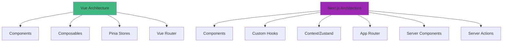

---

## 🔀 Reactivity Systems

### **Vue's Reactivity**

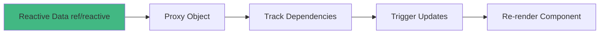

**Vue Example:**

```typescript
const count = ref(0)
count.value++ // Automatically triggers update
```

### **React's Reactivity (used in Next.js)**

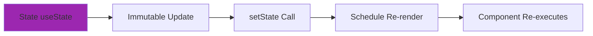

**Next.js Example:**

```typescript
const [count, setCount] = useState(0)
setCount(count + 1) // Triggers re-render
```

---

## 🚦 Routing Comparison

### **Vue Router**

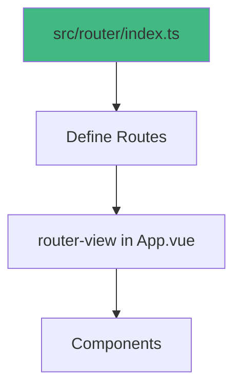

```typescript
// Vue Router
const routes = [
  { path: '/', component: Home },
  { path: '/about', component: About },
  { path: '/blog/:id', component: BlogPost }
]
```

### **Next.js App Router**

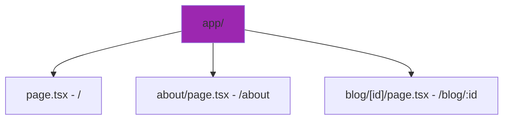

```
File-based routing:
app/
  page.tsx          → /
  about/page.tsx    → /about
  blog/[id]/page.tsx → /blog/:id
```

---

## 📦 State Management

### **Vue with Pinia**

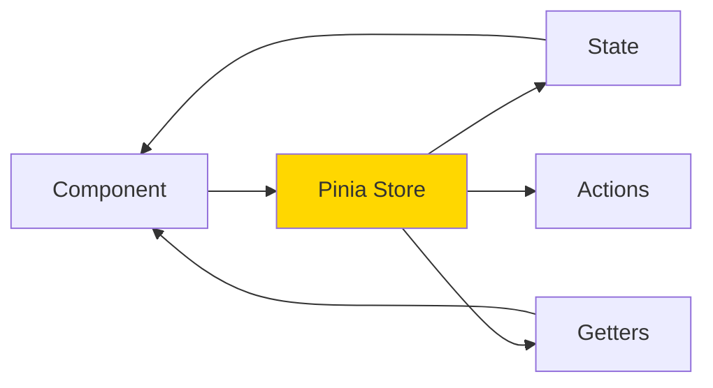

```typescript
// Pinia Store
export const useCounterStore = defineStore('counter', () => {
  const count = ref(0)
  const double = computed(() => count.value * 2)
  const increment = () => count.value++
  
  return { count, double, increment }
})
```

### **Next.js with Zustand**

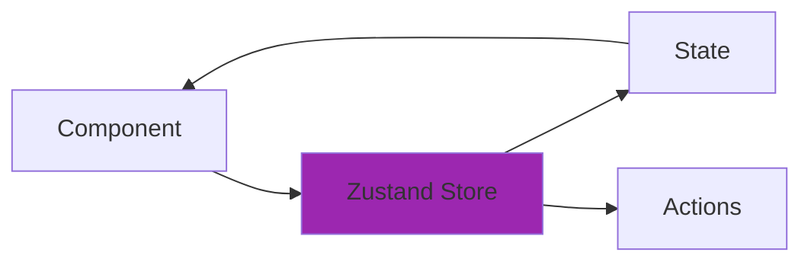

```typescript
// Zustand Store
const useCounterStore = create((set) => ({
  count: 0,
  increment: () => set((state) => ({ count: state.count + 1 }))
}))
```

---

## 🌐 Rendering Strategies

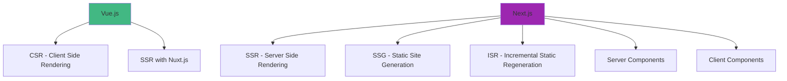

---

## ⚡ Performance

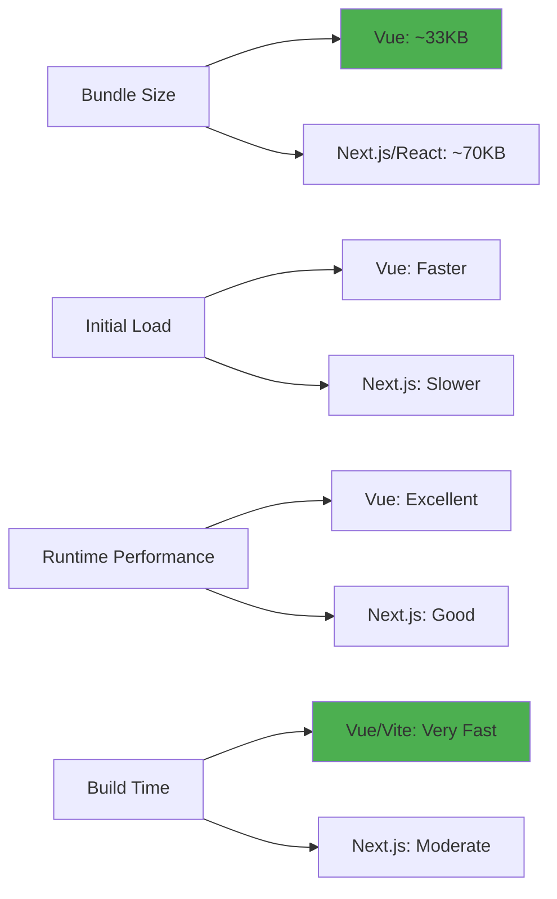

---

## 🎯 Use Cases

### **Choose Vue.js When:**

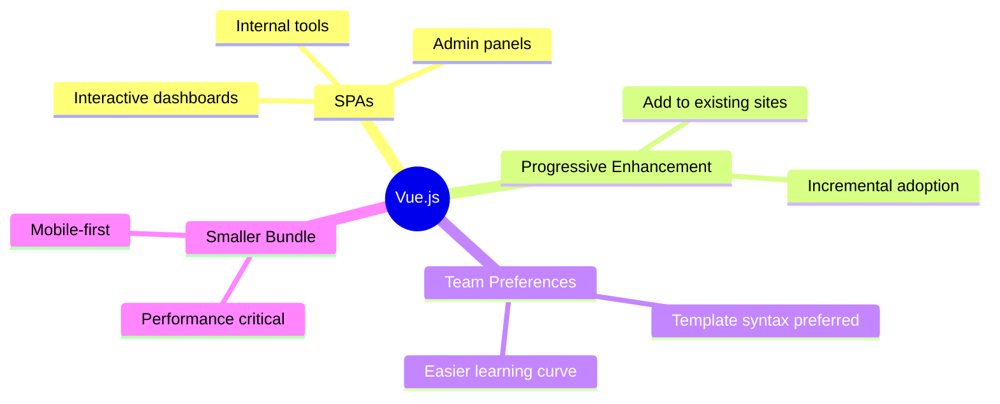

### **Choose Next.js When:**

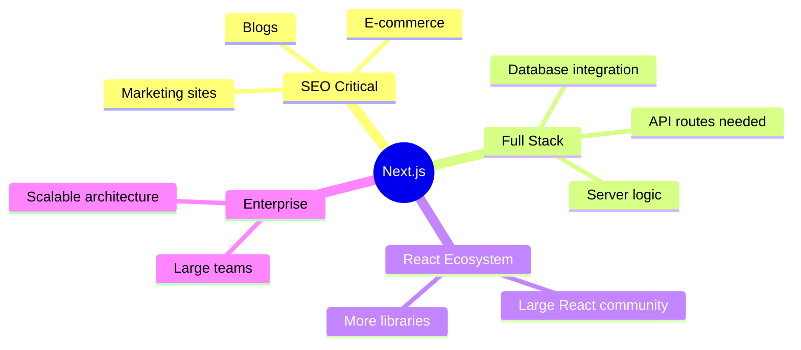

---

## 📈 Popularity & Job Market

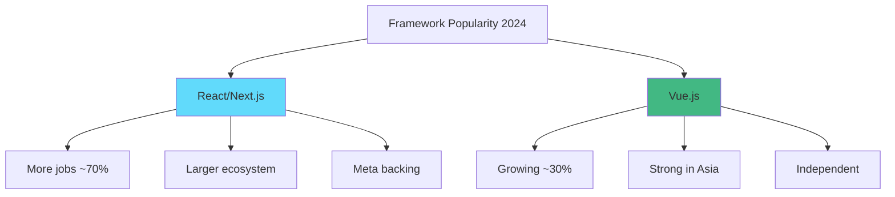

---

## 🔄 Migration Path

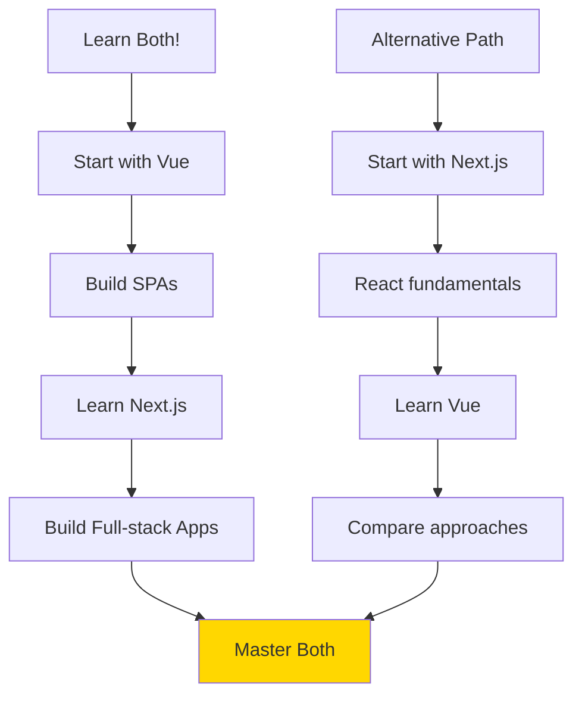

---

## 🎓 Learning Recommendation

**My Suggestion for You:**

1. **Weeks 1-4:** Master Vue.js first (easier learning curve)
2. **Weeks 5-8:** Learn Next.js (builds on concepts)
3. **Weeks 9-10:** Build projects in both
4. **Result:** You'll understand both paradigms!

---

## 💡 Key Takeaways

| Aspect | Vue.js | Next.js |
|--------|--------|---------|
| **Easier to Learn** | ✅ | ❌ |
| **Built-in SSR** | ❌ (needs Nuxt) | ✅ |
| **Smaller Bundle** | ✅ | ❌ |
| **More Jobs** | ❌ | ✅ |
| **Flexible** | ✅ | ❌ |
| **Opinionated** | ❌ | ✅ |
| **Best for SPAs** | ✅ | ❌ |
| **Best for SEO** | ❌ | ✅ |

---

## 🚀 The Best Part?

**Learning both makes you a versatile developer!**

- Vue skills transfer to Nuxt.js
- Next.js skills transfer to other React frameworks
- Understanding both paradigms makes you more employable
- You can choose the right tool for each project

---

**Continue to your learning journey!** 📚
