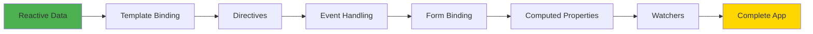
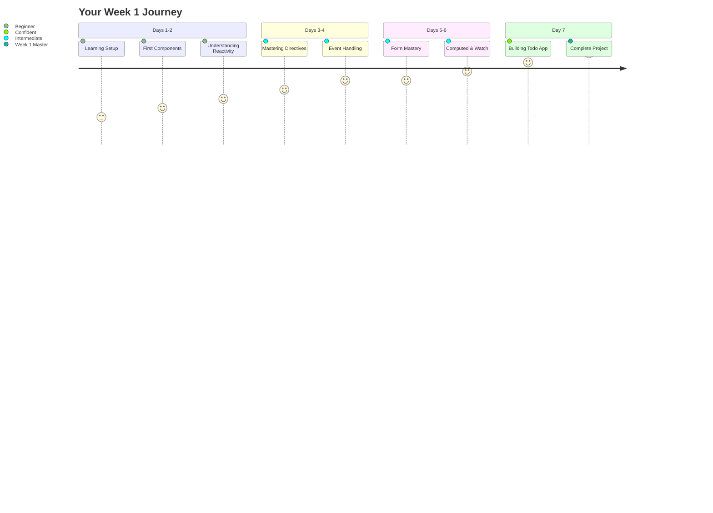

```mermaid
graph TD
    A[Week 1: Vue Fundamentals] --> B[Day 1: Setup & Instance]
    A --> C[Day 2: Template Syntax]
    A --> D[Day 3: Directives]
    A --> E[Day 4: Event Handling]
    A --> F[Day 5: Forms & v-model]
    A --> G[Day 6: Computed & Watchers]
    A --> H[Day 7: Todo App Project]
    
    B --> B1[README.md]
    B --> B2[app-example.vue]
    B --> B3[reactivity-example.vue]
    
    C --> C1[README.md]
    C --> C2[template-practice.vue]
    
    D --> D1[README.md]
    D --> D2[directives-practice.vue]
    
    E --> E1[README.md]
    E --> E2[event-handling-practice.vue]
    
    F --> F1[README.md]
    F --> F2[forms-practice.vue]
    F --> F3[registration-form.vue]
    
    G --> G1[README.md]
    G --> G2[shopping-cart.vue]
    
    H --> H1[README.md]
    H --> H2[TodoApp.vue]
    
    style A fill:#42b883,color:#fff
    style H fill:#FFD700
```

# Week 1: Vue.js Fundamentals - Complete Index 📑

**Your roadmap for Week 1 learning**

---

## 🗂️ Week Structure



---

## 📅 Daily Learning Path

### **Day 1: Setup & Vue Instance** ⭐
**Time:** 2-3 hours | **Difficulty:** Easy

**What You'll Learn:**
- Setting up Vue 3 with Vite
- Understanding createApp()
- Reactive data with ref() and reactive()
- Single File Component structure

**Files:**
- 📖 [`day1/README.md`](day1/README.md) - Complete guide
- 💻 [`day1/app-example.vue`](day1/app-example.vue) - First Vue app
- 💻 [`day1/reactivity-example.vue`](day1/reactivity-example.vue) - Reactivity demo

**Key Concepts:**
```vue
<script setup lang="ts">
import { ref, reactive } from 'vue'
const count = ref(0)
const user = reactive({ name: 'John' })
</script>
```

---

### **Day 2: Template Syntax** ⭐
**Time:** 2-3 hours | **Difficulty:** Easy

**What You'll Learn:**
- Text interpolation `{{ }}`
- Attribute binding `:attr`
- Class and style binding
- JavaScript expressions in templates

**Files:**
- 📖 [`day2/README.md`](day2/README.md) - Template guide
- 💻 [`day2/template-practice.vue`](day2/template-practice.vue) - User profile card

**Key Concepts:**
```vue
<template>
  <div :class="{ active: isActive }">
    {{ message }}
  </div>
</template>
```

---

### **Day 3: Directives** ⭐⭐
**Time:** 3-4 hours | **Difficulty:** Medium

**What You'll Learn:**
- Conditional rendering (v-if, v-show)
- List rendering (v-for with :key)
- When to use v-if vs v-show
- Avoiding v-for + v-if anti-pattern

**Files:**
- 📖 [`day3/README.md`](day3/README.md) - Directives deep dive
- 💻 [`day3/directives-practice.vue`](day3/directives-practice.vue) - All directive examples

**Key Concepts:**
```vue
<template>
  <div v-if="show">Conditional</div>
  <div v-show="visible">Toggle</div>
  <div v-for="item in items" :key="item.id">
    {{ item.name }}
  </div>
</template>
```

---

### **Day 4: Event Handling** ⭐⭐
**Time:** 2-3 hours | **Difficulty:** Medium

**What You'll Learn:**
- Click, input, submit events
- Event modifiers (.stop, .prevent, .once)
- Keyboard events (.enter, .esc)
- Mouse events (hover, mousemove)

**Files:**
- 📖 [`day4/README.md`](day4/README.md) - Event handling guide
- 💻 [`day4/event-handling-practice.vue`](day4/event-handling-practice.vue) - Interactive examples

**Key Concepts:**
```vue
<template>
  <button @click="handleClick">Click</button>
  <form @submit.prevent="onSubmit">Submit</form>
  <input @keyup.enter="search" />
</template>
```

---

### **Day 5: Forms & v-model** ⭐⭐
**Time:** 2-3 hours | **Difficulty:** Medium

**What You'll Learn:**
- Two-way binding with v-model
- Text inputs, textarea
- Checkboxes, radio buttons, selects
- v-model modifiers (.lazy, .number, .trim)
- Form validation

**Files:**
- 📖 [`day5/README.md`](day5/README.md) - Forms complete guide
- 💻 [`day5/forms-practice.vue`](day5/forms-practice.vue) - Basic forms
- 💻 [`day5/registration-form.vue`](day5/registration-form.vue) - Full registration form

**Key Concepts:**
```vue
<template>
  <input v-model="text" />
  <input v-model.number="age" type="number" />
  <input type="checkbox" v-model="agreed" />
  <select v-model="country">...</select>
</template>
```

---

### **Day 6: Computed & Watchers** ⭐⭐⭐
**Time:** 3-4 hours | **Difficulty:** Hard

**What You'll Learn:**
- Computed properties and caching
- Computed vs methods vs watchers
- watch() for side effects
- watchEffect() for auto-tracking
- Deep watching objects

**Files:**
- 📖 [`day6/README.md`](day6/README.md) - Computed & watch deep dive
- 💻 [`day6/shopping-cart.vue`](day6/shopping-cart.vue) - Shopping cart with all features

**Key Concepts:**
```vue
<script setup lang="ts">
import { ref, computed, watch } from 'vue'

const count = ref(0)
const doubled = computed(() => count.value * 2)

watch(count, (newVal, oldVal) => {
  console.log(`Changed from ${oldVal} to ${newVal}`)
})
</script>
```

---

### **Day 7: Todo App Project** ⭐⭐⭐
**Time:** 4-6 hours | **Difficulty:** Project

**What You'll Build:**
A complete Todo application with:
- ✅ Add, edit, delete todos
- ✅ Mark complete/incomplete
- ✅ Filter (All, Active, Completed)
- ✅ Search functionality
- ✅ localStorage persistence
- ✅ Statistics
- ✅ Form validation

**Files:**
- 📖 [`day7/README.md`](day7/README.md) - Project specifications
- 💻 [`day7/TodoApp.vue`](day7/TodoApp.vue) - Complete Todo app

**This project combines ALL Week 1 concepts!**

---

## 📚 Additional Resources

### **Week Summary**
- 📊 [`WEEK1_SUMMARY.md`](WEEK1_SUMMARY.md) - Complete week recap
- 📖 [`README.md`](README.md) - Week overview

---

## 🎯 Learning Checklist

Track your progress:

**Fundamentals:**
- [ ] Day 1: Setup & Vue Instance
- [ ] Day 2: Template Syntax
- [ ] Day 3: Directives
- [ ] Day 4: Event Handling
- [ ] Day 5: Forms & v-model
- [ ] Day 6: Computed & Watchers
- [ ] Day 7: Todo App Project

**Skills:**
- [ ] Can create Vue apps with Vite
- [ ] Understand reactive data (ref/reactive)
- [ ] Can use template syntax confidently
- [ ] Master directives (v-if, v-for, v-show)
- [ ] Handle events with modifiers
- [ ] Create forms with v-model
- [ ] Use computed properties effectively
- [ ] Implement watchers for side effects
- [ ] Build complete CRUD applications
- [ ] Persist data with localStorage

---

## 📊 Concepts Map

```mermaid
mindmap
  root((Vue.js<br/>Week 1))
    Reactivity
      ref primitives
      reactive objects
      .value syntax
    Templates
      {{ }} interpolation
      :attr binding
      :class :style
    Directives
      v-if v-show
      v-for :key
      v-model
      @event
    Computed
      Cached values
      Derived state
      Performance
    Watchers
      Side effects
      Async operations
      localStorage
    Project
      Todo App
      CRUD
      All concepts
```

---

## 🔄 Concept Dependencies



**Each concept builds on the previous ones!**

---

## 💻 Code Statistics

**Week 1 Totals:**
- 📖 **8 README files** with comprehensive explanations
- 💻 **12 Vue component files** with working examples
- 📊 **60+ Mermaid diagrams** for visual learning
- 📝 **2000+ lines of documented code**
- 🎯 **1 complete production-ready project**

---

## 🎨 Visual Learning Highlights

Every day includes:
- ✅ Concept flow diagrams
- ✅ Data flow sequences
- ✅ Decision trees
- ✅ Architecture graphs
- ✅ Comparison charts
- ✅ Mind maps

**Perfect for visual learners!**

---

## 🚀 How to Use This Week

### **Option 1: Sequential Learning (Recommended)**
1. Start with Day 1, read README
2. Study the Mermaid diagrams
3. Run the example files
4. Complete practice exercises
5. Move to next day

### **Option 2: Concept-Focused**
1. Identify concepts you need
2. Jump to specific day
3. Study that topic deeply
4. Practice with examples
5. Move to related concepts

### **Option 3: Project-First**
1. Start with Day 7 Todo App
2. Identify unfamiliar concepts
3. Go back to specific days
4. Learn as needed
5. Complete the project

---

## 📈 Progress Tracking

**Beginner → Intermediate Progress:**



---

## 🎓 Certification Checklist

Before moving to Week 2, ensure you can:

**Core Skills:**
- [ ] Create a new Vue project
- [ ] Define reactive data
- [ ] Bind data to templates
- [ ] Use directives correctly
- [ ] Handle user events
- [ ] Create and validate forms
- [ ] Use computed properties
- [ ] Implement watchers

**Project Skills:**
- [ ] Build a CRUD app
- [ ] Implement filtering/searching
- [ ] Persist data
- [ ] Validate user input
- [ ] Handle edge cases
- [ ] Write clean, maintainable code

---

## 💡 Pro Tips

> 💡 **Tip 1:** Always use `:key` with `v-for` for better performance
>
> 💡 **Tip 2:** Prefer `computed` over methods for derived data (it's cached!)
>
> 💡 **Tip 3:** Use `v-show` for frequent toggles, `v-if` for rare changes
>
> 💡 **Tip 4:** Watch for side effects, compute for derived values
>
> 💡 **Tip 5:** The Todo App is the best way to practice everything!

---

## 🎉 Ready to Continue?

**Completed Week 1?** Amazing! 

**Next Steps:**
1. Review [`WEEK1_SUMMARY.md`](WEEK1_SUMMARY.md)
2. Polish your Todo App
3. Take a break! 🎊
4. Continue to **Week 2: Components & Composition API**

---

## 📞 Need Help?

- Re-read the day's README
- Study the Mermaid diagrams
- Modify the example code
- Build small variations
- Check Vue.js official docs
- Join Vue Discord community

---

**Happy Learning! You're doing great! 🚀**

**Continue to:** [`../week2/README.md`](../week2/README.md)
