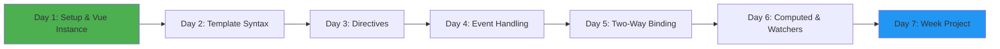
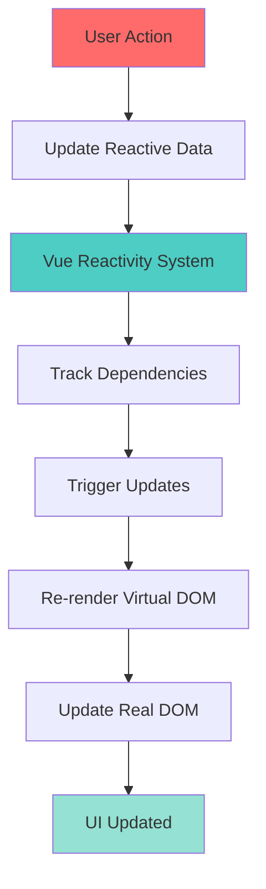

# Week 1: Vue.js Fundamentals 🌱

**Focus:** Understanding Vue 3 basics, reactive data, templates, and components

---

## 📅 Weekly Overview

---

## 🎯 Learning Objectives

By end of Week 1, you will:

- ✅ Set up Vue 3 projects with Vite
- ✅ Understand Vue reactivity system
- ✅ Master template syntax and directives
- ✅ Handle events and user input
- ✅ Create computed properties and watchers
- ✅ Build a small interactive app

---

## 📚 Daily Topics

| Day | Topic | Difficulty |
|-----|-------|-----------|
| **Day 1** | Vue Setup & Instance | ⭐ Easy |
| **Day 2** | Template Syntax & Interpolation | ⭐ Easy |
| **Day 3** | Directives (v-if, v-for, v-show) | ⭐⭐ Medium |
| **Day 4** | Event Handling & Methods | ⭐⭐ Medium |
| **Day 5** | Two-Way Binding (v-model) | ⭐⭐ Medium |
| **Day 6** | Computed Properties & Watchers | ⭐⭐⭐ Hard |
| **Day 7** | Mini Project: Todo App | ⭐⭐⭐ Hard |

---

## 🔄 Vue Reactivity Concept

---

Start with **Day 1** and progress sequentially! 🚀
