# Week 1 Visual Learning Guide 🎨

**All concepts explained through diagrams**

---

## 🌊 Complete Learning Flow

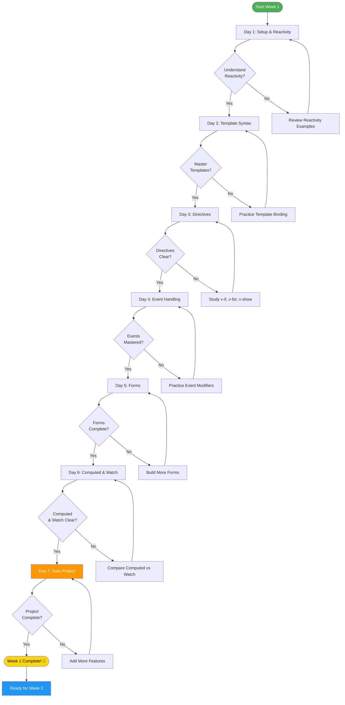

---

## 🧠 Reactivity System Deep Dive

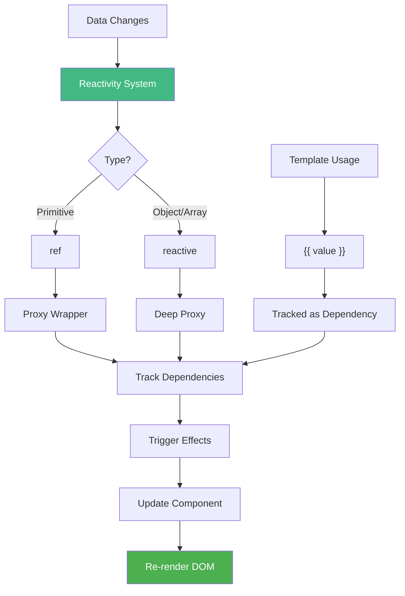

**Key Points:**
- `ref()` for primitives, needs `.value` in script
- `reactive()` for objects, no `.value` needed
- Templates automatically unwrap refs
- Reactivity is **automatic** and **efficient**

---

## 📐 Template Syntax Hierarchy

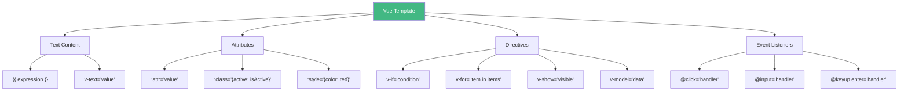

---

## 🔀 Directive Decision Tree

```mermaid
flowchart TD
    START{Need to<br/>manipulate DOM?} -->|No| BINDING[Use : or {{ }}]
    START -->|Yes| TYPE{What type?}
    
    TYPE -->|Show/Hide| CONDITIONAL{How often<br/>toggles?}
    TYPE -->|Loop| LIST[Use v-for]
    TYPE -->|Form| FORM[Use v-model]
    TYPE -->|Event| EVENT[Use @event]
    
    CONDITIONAL -->|Rarely| VIF[Use v-if]
    CONDITIONAL -->|Often| VSHOW[Use v-show]
    
    VIF --> VIF1[Removes from DOM]
    VSHOW --> VSHOW1[CSS display toggle]
    
    LIST --> KEY{Has unique ID?}
    KEY -->|Yes| GOODKEY["v-for='item in items' :key='item.id'"]
    KEY -->|No| BADKEY[Add unique identifier first]
    
    FORM --> FORMTYPE{Input type?}
    FORMTYPE -->|Text| TEXT["v-model='text'"]
    FORMTYPE -->|Checkbox| CHECK["v-model='array'"]
    FORMTYPE -->|Radio| RADIO["v-model='value'"]
    FORMTYPE -->|Select| SELECT["v-model='selected'"]
    
    EVENT --> MODIFIER{Need modifier?}
    MODIFIER -->|Stop propagation| STOP["@click.stop"]
    MODIFIER -->|Prevent default| PREVENT["@submit.prevent"]
    MODIFIER -->|Once only| ONCE["@click.once"]
    MODIFIER -->|None| BASIC["@click='handler'"]
    
    style VIF1 fill:#4CAF50
    style VSHOW1 fill:#2196F3
    style GOODKEY fill:#4CAF50
    style BADKEY fill:#F44336
```

---

## ⚡ Event Flow Visualization

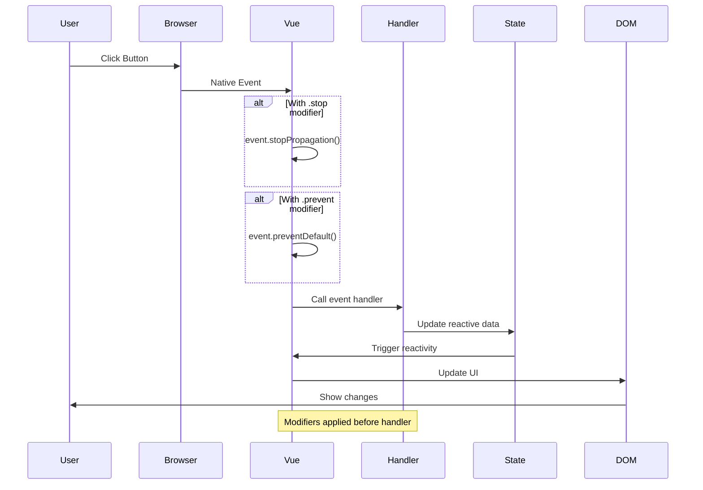

---

## 📋 Form Binding Patterns

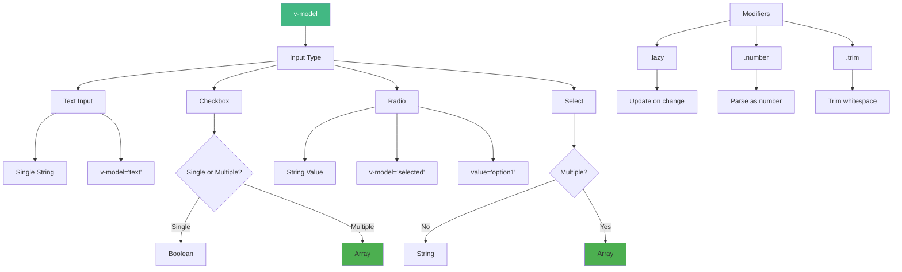

---

## 🧮 Computed vs Watch Decision

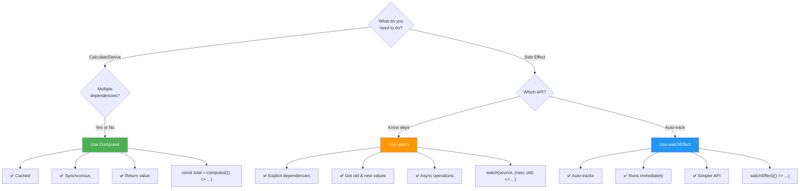

---

## 🎯 Todo App Architecture

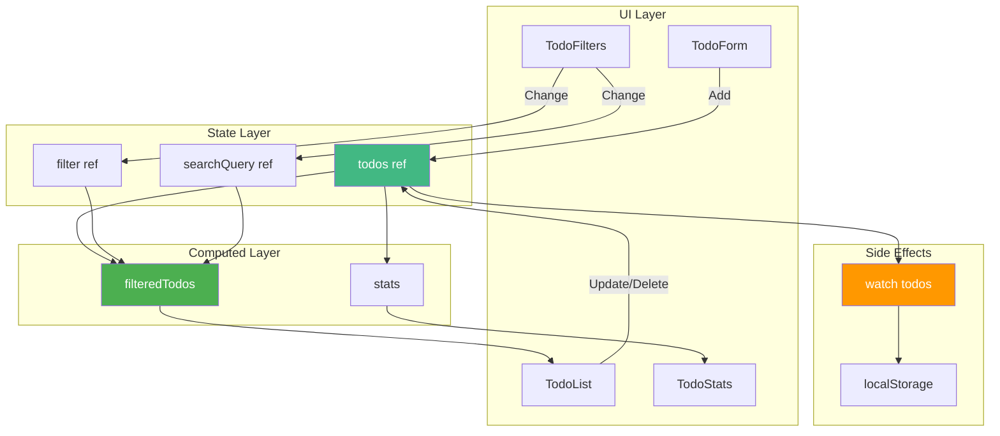

---

## 📊 Performance Optimization Map

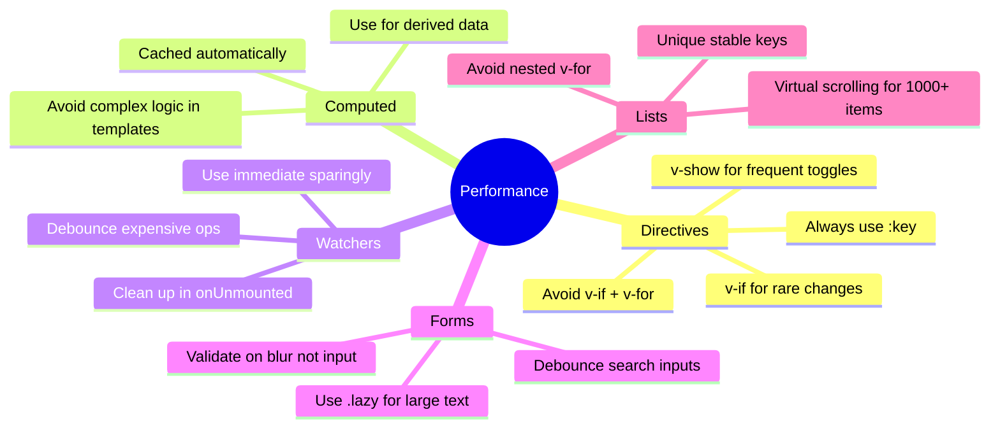

---

## 🔄 Component Lifecycle (Preview for Week 2)

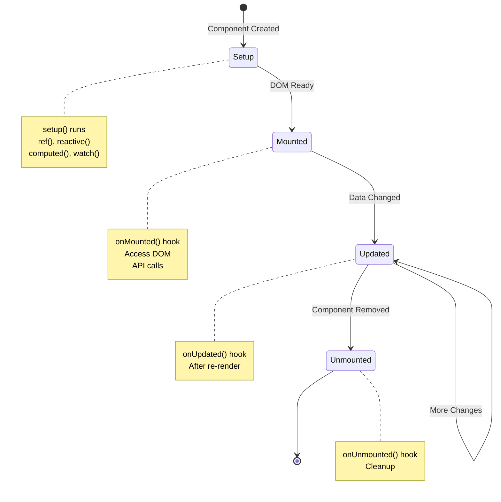

---

## 🎨 Data Flow Patterns

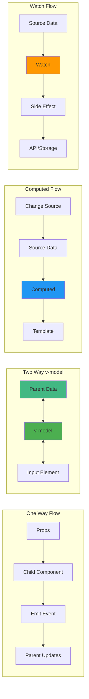

---

## ✅ Mastery Checklist Visualization

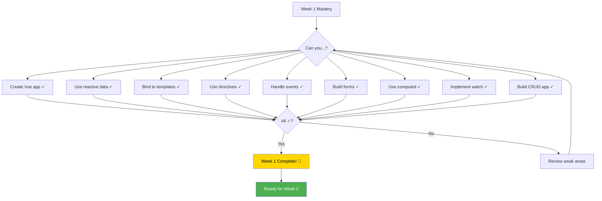

---

## 🚀 Your Progress Journey

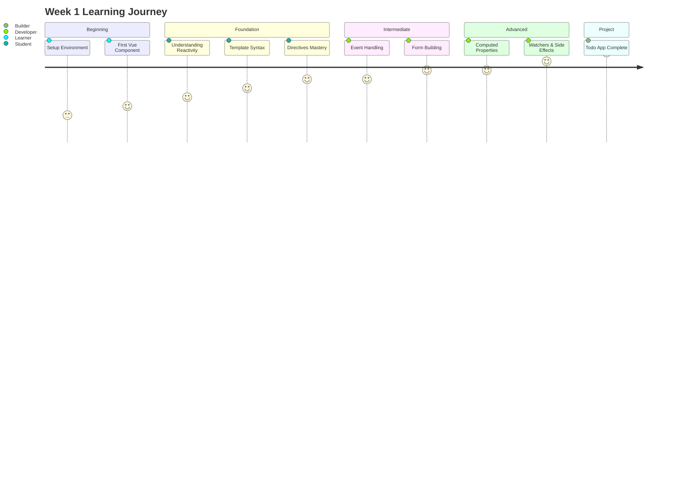

---

## 📈 Skill Level Progression

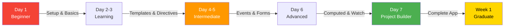

---

## 🎓 Graduation Certificate

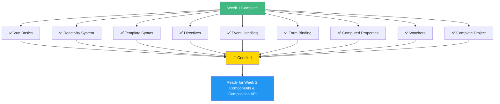

---

**Congratulations on completing Week 1! 🎊**

**Every diagram above represents a concept you now understand!**

**Continue your journey:** [`../week2/README.md`](../week2/README.md)
