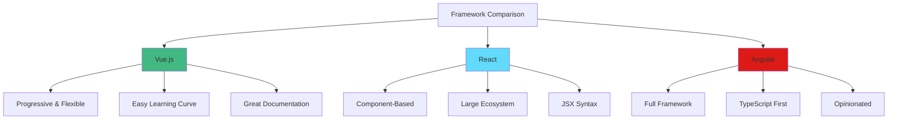
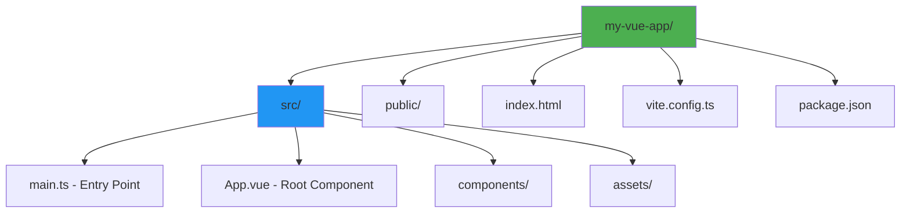
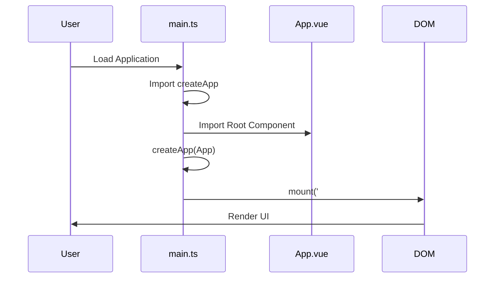
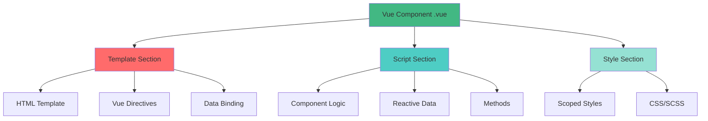

# Day 1: Vue Setup & Instance 🎯

**Duration:** 2-3 hours  
**Difficulty:** ⭐ Easy

---

## 📖 Learning Objectives

- Understand what Vue.js is and why use it
- Set up a Vue 3 project with Vite
- Create your first Vue instance
- Understand the Vue application structure
- Learn about reactive data

---

## 🧠 What is Vue.js?

Vue.js is a **progressive JavaScript framework** for building user interfaces. It's designed to be incrementally adoptable.

```mermaid
graph LR
    A[Vue.js] --> B[Declarative Rendering]
    A --> C[Component System]
    A --> D[Reactivity System]
    A --> E[Ecosystem Tools]
    
    B --> B1[Templates]
    C --> C1[Reusable Components]
    D --> D1[Automatic Updates]
    E --> E1[Router, Pinia, Vite]
    
    style A fill:#42b883
    style B fill:#35495e
    style C fill:#35495e
    style D fill:#35495e
    style E fill:#35495e
```



---

## 🚀 Vue vs React vs Angular



---

## 🛠️ Setup Vue 3 Project

### Step 1: Create Project with Vite

```bash
npm create vite@latest my-vue-app -- --template vue-ts
cd my-vue-app
npm install
npm run dev
```

### Step 2: Project Structure



---

## 💻 Your First Vue Instance

### The Vue Application Lifecycle



---

## 📝 Code Example: main.ts

```typescript
import { createApp } from 'vue'
import App from './App.vue'
import './style.css'

// Create Vue application instance
const app = createApp(App)

// Mount to DOM element with id="app"
app.mount('#app')
```

---

## 📝 Code Example: App.vue

See `app-example.vue` for the complete component structure.

---

## 🔄 Vue Component Anatomy



---

## ✅ Practice Exercise

**Task:** Create a simple Vue app that displays your name and age.

1. Create a new Vue component
2. Define reactive data for name and age
3. Display them in the template
4. Add a button that increases age by 1

**Expected Output:**
```
Name: John Doe
Age: 25
[Increase Age Button]
```

---

## 🔗 Additional Resources

- [Vue.js Official Docs](https://vuejs.org/)
- [Vite Documentation](https://vitejs.dev/)
- [Vue School (Free courses)](https://vueschool.io/)

---

## 📌 Key Takeaways

- Vue uses a **component-based architecture**
- `createApp()` creates a Vue application instance
- `.mount()` connects Vue to the DOM
- Components have **template**, **script**, and **style** sections
- Data defined in `data()` or `ref()` is **reactive**

---

**Tomorrow:** Template Syntax & Interpolation 🎨
