# Day 2: Template Syntax & Interpolation 🎨

**Duration:** 2-3 hours  
**Difficulty:** ⭐ Easy

---

## 📖 Learning Objectives

- Master Vue template syntax
- Understand text and HTML interpolation
- Learn attribute binding
- Use JavaScript expressions in templates
- Understand template directives basics

---

## 🔄 Data Flow in Vue Templates

```mermaid
graph LR
    A[Component Data] --> B[Template Expressions]
    B --> C[Interpolation {{ }}]
    B --> D[Attribute Binding :]
    B --> E[Event Binding @]
    
    C --> F[Rendered Text]
    D --> G[HTML Attributes]
    E --> H[Event Handlers]
    
    style A fill:#42b883
    style F fill:#4CAF50
    style G fill:#2196F3
    style H fill:#FF9800
```

---

## 📝 1. Text Interpolation

**Mustache Syntax:** `{{ }}`


### Example

```vue
<template>
  <p>{{ message }}</p>
  <p>{{ 1 + 1 }}</p>
  <p>{{ ok ? 'YES' : 'NO' }}</p>
</template>

<script setup lang="ts">
import { ref } from 'vue'
const message = ref('Hello Vue!')
const ok = ref(true)
</script>
```

---

## 🏷️ 2. Attribute Binding

Use `v-bind:` or shorthand `:`


### Example

```vue
<template>
  <!-- Full syntax -->
  
  
  <!-- Shorthand -->
  
  <a :href="url">Link</a>
  <button :disabled="isDisabled">Click</button>
  <div :class="activeClass">Content</div>
</template>
```

---

## 🎨 3. Class and Style Binding


### Example

```vue
<template>
  <!-- Class binding -->
  <div :class="{ active: isActive, 'text-bold': isBold }">
    Class Object
  </div>
  
  <div :class="[baseClass, activeClass]">
    Class Array
  </div>
  
  <!-- Style binding -->
  <div :style="{ color: textColor, fontSize: fontSize + 'px' }">
    Styled Text
  </div>
</template>
```

---

## 🔢 4. JavaScript Expressions


### Allowed

```vue
<template>
  <p>{{ number + 1 }}</p>
  <p>{{ ok ? 'YES' : 'NO' }}</p>
  <p>{{ message.split('').reverse().join('') }}</p>
  <p>{{ items.filter(i => i.active).length }}</p>
</template>
```

### NOT Allowed

```vue
<template>
  <!-- ❌ Wrong: This is a statement -->
  <p>{{ if (ok) { return 'YES' } }}</p>
  
  <!-- ❌ Wrong: Multiple statements -->
  <p>{{ var a = 1; a + 1 }}</p>
</template>
```

---

## 📌 5. Raw HTML with v-html

```mermaid
sequenceDiagram
    participant Data
    participant vhtml as v-html
    participant DOM
    
    Data->>vhtml: HTML String
    Note over vhtml: Security Check
    vhtml->>DOM: Render as HTML
    Note over DOM: ⚠️ XSS Risk
```



### Example

```vue
<template>
  <div v-html="htmlContent"></div>
</template>

<script setup lang="ts">
const htmlContent = ref('<strong>Bold Text</strong>')
</script>
```

**⚠️ Warning:** Never use v-html with user-provided content (XSS vulnerability)!

---

## ✅ Practice Exercise

Create a **User Profile Card** with:

1. Dynamic name and avatar
2. Conditional "Online" badge (green if online, gray if offline)
3. Dynamic email link
4. Bio text with character count
5. Style the card background based on user status

See `template-practice.vue` for starter code.

---

## 🔗 Key Concepts Summary


---

## 📌 Key Takeaways

- Use `{{ }}` for text interpolation
- Use `:attribute` for dynamic attributes
- Use `:class` and `:style` for dynamic styling
- Template expressions must be single expressions
- Never use `v-html` with untrusted content

---

**Tomorrow:** Directives (v-if, v-for, v-show) 🔀
