# Day 3: Vue Directives (v-if, v-for, v-show) 🔀

**Duration:** 3-4 hours  
**Difficulty:** ⭐⭐ Medium

---

## 📖 Learning Objectives

- Master conditional rendering (v-if, v-else, v-else-if, v-show)
- Understand list rendering with v-for
- Learn when to use v-if vs v-show
- Work with keys in v-for
- Handle edge cases and best practices

---

## 🎯 Vue Directives Overview


---

## 🔀 1. Conditional Rendering: v-if


### Example:
```vue
<template>
  <div v-if="type === 'A'">Type A</div>
  <div v-else-if="type === 'B'">Type B</div>
  <div v-else>Type C</div>
  
  <!-- Group multiple elements -->
  <template v-if="isLoggedIn">
    <h1>Welcome back!</h1>
    <p>Your dashboard</p>
  </template>
</template>
```

---

## 👁️ 2. v-show vs v-if


### Performance Comparison:
```vue
<template>
  <!-- v-if: Element not in DOM when false -->
  <div v-if="isVisible">
    Removed from DOM when hidden
  </div>
  
  <!-- v-show: Element in DOM, display:none when false -->
  <div v-show="isVisible">
    Always in DOM, just hidden
  </div>
</template>
```

**When to use:**
- **v-if**: Condition rarely changes, expensive components
- **v-show**: Toggle frequently, simple elements

---

## 🔁 3. List Rendering: v-for


### Basic v-for Syntax:
```vue
<template>
  <!-- Array iteration -->
  <li v-for="item in items" :key="item.id">
    {{ item.name }}
  </li>
  
  <!-- With index -->
  <li v-for="(item, index) in items" :key="item.id">
    {{ index }}: {{ item.name }}
  </li>
  
  <!-- Object iteration -->
  <div v-for="(value, key) in user" :key="key">
    {{ key }}: {{ value }}
  </div>
  
  <!-- Range -->
  <span v-for="n in 10" :key="n">{{ n }}</span>
</template>
```

---

## 🔑 4. The Importance of :key


### Why :key is important:
```vue
<template>
  <!-- ❌ Bad: No key or index as key -->
  <div v-for="item in items">{{ item.name }}</div>
  <div v-for="(item, index) in items" :key="index">{{ item.name }}</div>
  
  <!-- ✅ Good: Unique, stable key -->
  <div v-for="item in items" :key="item.id">{{ item.name }}</div>
</template>
```

---

## 🎨 5. v-for with v-if (Avoid!)

```mermaid
graph TD
    A[v-for + v-if on same element] --> B[❌ Anti-pattern]
    B --> C[v-for has higher priority]
    C --> D[Inefficient filtering]
    
    E[Solution 1] --> F[Computed Property]
    E[Solution 2] --> G[Template wrapper]
    
    F --> H[✅ Filter before render]
    G --> I[✅ Conditional wrapper]
    
    style B fill:#F44336
    style H fill:#4CAF50
    style I fill:#4CAF50
```



### Anti-pattern (Avoid):
```vue
<template>
  <!-- ❌ Bad: v-if on same element as v-for -->
  <li v-for="user in users" v-if="user.isActive" :key="user.id">
    {{ user.name }}
  </li>
</template>
```

### Solution 1: Computed Property:
```vue
<template>
  <!-- ✅ Good: Use computed property -->
  <li v-for="user in activeUsers" :key="user.id">
    {{ user.name }}
  </li>
</template>

<script setup lang="ts">
import { computed } from 'vue'

const activeUsers = computed(() => 
  users.value.filter(u => u.isActive)
)
</script>
```

### Solution 2: Template Wrapper:
```vue
<template>
  <!-- ✅ Good: Wrap with template -->
  <template v-for="user in users" :key="user.id">
    <li v-if="user.isActive">
      {{ user.name }}
    </li>
  </template>
</template>
```

---

## 🧩 Complex Example: Todo List


See `directives-practice.vue` for implementation.

---

## ✅ Practice Exercise

Build a **Product Catalog** with:
1. List of products with v-for
2. Filter by category using v-if/v-else-if
3. Toggle product details with v-show
4. Display "No products" message conditionally
5. Sort products by price

**Required Features:**
- Array of products with id, name, category, price
- Category filter buttons (All, Electronics, Clothing, Books)
- "Show Details" toggle for each product
- Proper :key usage

---

## 📌 Key Takeaways


---

## 🔗 Cheat Sheet

| Directive | Purpose | Performance | Use Case |
|-----------|---------|-------------|----------|
| `v-if` | Conditional render | Higher toggle cost | Rare changes |
| `v-show` | Toggle visibility | Lower toggle cost | Frequent toggles |
| `v-for` | List rendering | N/A | Iterate collections |
| `v-else-if` | Alternative condition | N/A | Multiple conditions |
| `v-else` | Fallback | N/A | Default case |

---

**Tomorrow:** Event Handling & Methods ⚡
