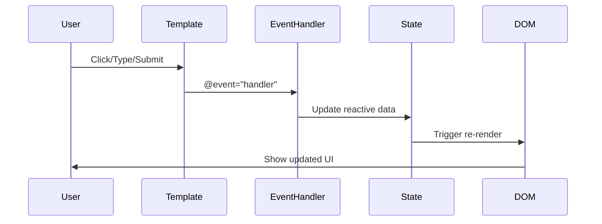
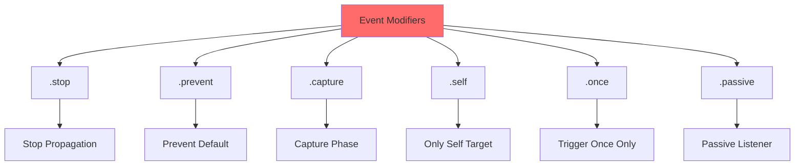
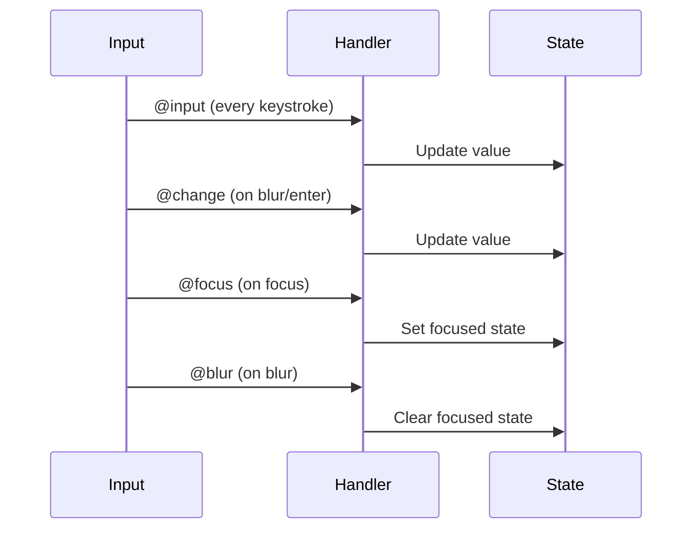

# Day 4: Event Handling & Methods ⚡

**Duration:** 2-3 hours  
**Difficulty:** ⭐⭐ Medium

---

## 📖 Learning Objectives

- Handle user events (click, input, submit)
- Use event modifiers
- Understand method vs inline handlers
- Work with event objects
- Handle keyboard and mouse events

---

## 🎯 Event Handling Flow



---

## 🖱️ Event Binding Syntax

```mermaid
graph TD
    A[Event Handling] --> B[@click or v-on:click]
    
    B --> C[Inline Handler]
    B --> D[Method Handler]
    
    C --> C1["@click='count++'"]
    D --> D1["@click='handleClick'"]
    
    E[Common Events] --> E1[@click]
    E --> E2[@submit]
    E --> E3[@input]
    E --> E4[@keyup]
    E --> E5[@mouseenter]
    
    style A fill:#42b883
```

---

## 📝 Basic Event Handling

```vue
<template>
  <div>
    <!-- Inline handler -->
    <button @click="count++">Clicked {{ count }} times</button>
    
    <!-- Method handler -->
    <button @click="handleClick">Click Me</button>
    
    <!-- With parameter -->
    <button @click="greet('Hello')">Greet</button>
    
    <!-- Access event object -->
    <button @click="showEvent">Show Event</button>
  </div>
</template>

<script setup lang="ts">
import { ref } from 'vue'

const count = ref(0)

const handleClick = () => {
  console.log('Button clicked!')
}

const greet = (message: string) => {
  alert(message)
}

const showEvent = (event: MouseEvent) => {
  console.log('Event:', event.target)
}
</script>
```

---

## 🔧 Event Modifiers



### Examples:
```vue
<template>
  <!-- Stop propagation -->
  <div @click="parentClick">
    <button @click.stop="childClick">Stop Event Bubbling</button>
  </div>
  
  <!-- Prevent default -->
  <form @submit.prevent="handleSubmit">
    <button type="submit">Submit (No page reload)</button>
  </form>
  
  <!-- Chain modifiers -->
  <a @click.stop.prevent="handleClick">Multiple Modifiers</a>
  
  <!-- Trigger only once -->
  <button @click.once="initializeOnce">Initialize</button>
  
  <!-- Only if event target is self -->
  <div @click.self="onlySelf">Click me, not children</div>
</template>
```

---

## ⌨️ Keyboard Events

```mermaid
graph LR
    A[Keyboard Events] --> B[@keyup]
    A --> C[@keydown]
    A --> D[@keypress]
    
    E[Key Modifiers] --> F[.enter]
    E --> G[.tab]
    E --> H[.delete]
    E --> I[.esc]
    E --> J[.space]
    E --> K[.ctrl / .alt / .shift]
    
    style A fill:#4ECDC4
```

### Examples:
```vue
<template>
  <!-- Enter key -->
  <input @keyup.enter="handleEnter" placeholder="Press Enter" />
  
  <!-- Escape key -->
  <input @keyup.esc="handleEscape" placeholder="Press Esc" />
  
  <!-- Ctrl + Enter -->
  <textarea @keyup.ctrl.enter="handleSubmit"></textarea>
  
  <!-- Arrow keys -->
  <div 
    @keyup.up="moveUp"
    @keyup.down="moveDown"
    @keyup.left="moveLeft"
    @keyup.right="moveRight"
  >
    Use arrow keys to navigate
  </div>
</template>
```

---

## 🖱️ Mouse Events

```mermaid
flowchart TD
    A[Mouse Events] --> B[@click]
    A --> C[@dblclick]
    A --> D[@mouseenter]
    A --> E[@mouseleave]
    A --> F[@mousemove]
    A --> G[@mousedown]
    A --> H[@mouseup]
    
    I[Mouse Buttons] --> J[.left]
    I --> K[.right]
    I --> L[.middle]
    
    style A fill:#95E1D3
```

### Examples:
```vue
<template>
  <!-- Double click -->
  <div @dblclick="handleDoubleClick">Double click me</div>
  
  <!-- Hover effects -->
  <div 
    @mouseenter="isHovered = true"
    @mouseleave="isHovered = false"
    :class="{ hovered: isHovered }"
  >
    Hover over me
  </div>
  
  <!-- Track mouse position -->
  <div @mousemove="trackMouse">
    Mouse: {{ mouseX }}, {{ mouseY }}
  </div>
  
  <!-- Right click (prevent context menu) -->
  <div @contextmenu.prevent="handleRightClick">
    Right click me
  </div>
</template>

<script setup lang="ts">
import { ref } from 'vue'

const isHovered = ref(false)
const mouseX = ref(0)
const mouseY = ref(0)

const trackMouse = (event: MouseEvent) => {
  mouseX.value = event.clientX
  mouseY.value = event.clientY
}
</script>
```

---

## 📋 Form Events



### Examples:
```vue
<template>
  <!-- Input event (real-time) -->
  <input 
    @input="handleInput" 
    placeholder="Type something"
  />
  <p>You typed: {{ inputValue }}</p>
  
  <!-- Change event (on blur) -->
  <input 
    @change="handleChange"
    placeholder="Change event"
  />
  
  <!-- Focus/Blur -->
  <input 
    @focus="isFocused = true"
    @blur="isFocused = false"
    :class="{ focused: isFocused }"
  />
  
  <!-- Form submit -->
  <form @submit.prevent="handleFormSubmit">
    <input v-model="formData.email" type="email" required />
    <button type="submit">Submit</button>
  </form>
</template>
```

---

## ✅ Practice Exercise

Build an **Interactive Counter** with:
1. Increment/Decrement buttons
2. Reset button (only fires once using .once)
3. Keyboard controls (arrow keys)
4. Double-click to add 10
5. Form to set counter to specific value
6. Prevent negative values

---

## 📌 Key Takeaways

- Use `@event` shorthand instead of `v-on:event`
- Event modifiers simplify common patterns
- Access event object with `(event)` parameter
- Chain multiple modifiers: `.stop.prevent`
- Use key modifiers for keyboard shortcuts

---

**Tomorrow:** Forms & Two-Way Binding (v-model) 📝
