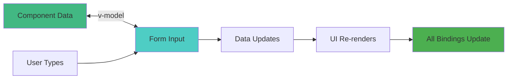
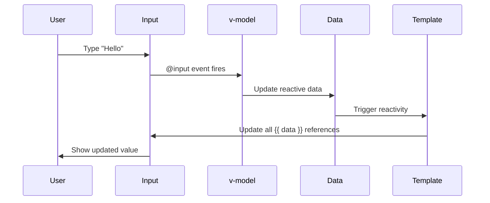
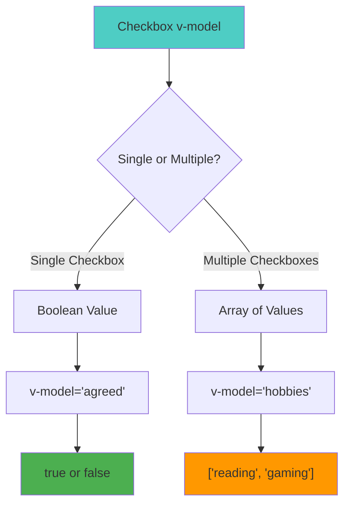
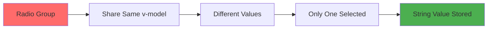
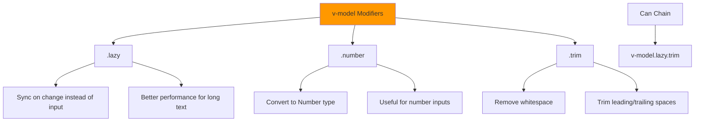
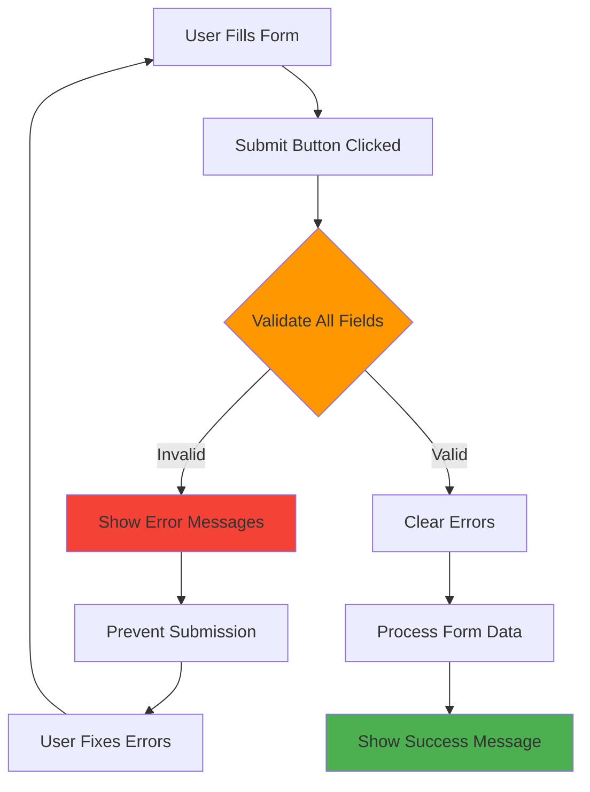
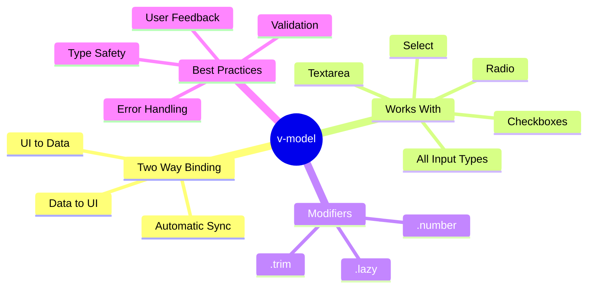

# Day 5: Forms & Two-Way Binding (v-model) 📝

**Duration:** 2-3 hours  
**Difficulty:** ⭐⭐ Medium

---

## 📖 Learning Objectives

- Master v-model two-way binding
- Handle different input types
- Work with checkboxes and radio buttons
- Validate form inputs
- Use v-model modifiers

---

## 🔄 Two-Way Binding Concept



**v-model creates a two-way data binding between form inputs and component state.**

---

## 📝 v-model Internals



### Under the Hood:
```vue
<!-- This -->
<input v-model="text" />

<!-- Is equivalent to -->
<input 
  :value="text"
  @input="text = $event.target.value"
/>
```

---

## 📋 Form Input Types

```mermaid
graph TD
    A[v-model Works With] --> B[Text Inputs]
    A --> C[Textarea]
    A --> D[Checkboxes]
    A --> E[Radio Buttons]
    A --> F[Select Dropdowns]
    
    B --> B1[text, email, password, number, url, search]
    D --> D1[Single: Boolean | Multiple: Array]
    E --> E1[String value]
    F --> F1[Single: String | Multiple: Array]
    
    style A fill:#42b883
```

---

## 📝 Text Input Examples

```vue
<template>
  <div class="text-inputs">
    <!-- Basic text input -->
    <div>
      <label>Name:</label>
      <input v-model="form.name" type="text" placeholder="Enter name" />
      <p>Value: {{ form.name }}</p>
    </div>
    
    <!-- Email input -->
    <div>
      <label>Email:</label>
      <input v-model="form.email" type="email" />
      <p>{{ form.email }}</p>
    </div>
    
    <!-- Password -->
    <div>
      <label>Password:</label>
      <input v-model="form.password" type="password" />
      <p>Length: {{ form.password.length }} characters</p>
    </div>
    
    <!-- Number input -->
    <div>
      <label>Age:</label>
      <input v-model.number="form.age" type="number" />
      <p>Age: {{ form.age }} (type: {{ typeof form.age }})</p>
    </div>
    
    <!-- Textarea -->
    <div>
      <label>Bio:</label>
      <textarea v-model="form.bio" rows="4"></textarea>
      <p>Characters: {{ form.bio.length }}</p>
    </div>
  </div>
</template>

<script setup lang="ts">
import { reactive } from 'vue'

const form = reactive({
  name: '',
  email: '',
  password: '',
  age: 0,
  bio: ''
})
</script>
```

---

## ☑️ Checkbox Binding



### Single Checkbox (Boolean):
```vue
<template>
  <label>
    <input type="checkbox" v-model="terms" />
    I agree to terms and conditions
  </label>
  <p>Agreed: {{ terms }}</p>
</template>

<script setup lang="ts">
import { ref } from 'vue'
const terms = ref(false)
</script>
```

### Multiple Checkboxes (Array):
```vue
<template>
  <div>
    <h3>Select your skills:</h3>
    <label>
      <input type="checkbox" v-model="skills" value="vue" />
      Vue.js
    </label>
    <label>
      <input type="checkbox" v-model="skills" value="react" />
      React
    </label>
    <label>
      <input type="checkbox" v-model="skills" value="angular" />
      Angular
    </label>
    <label>
      <input type="checkbox" v-model="skills" value="svelte" />
      Svelte
    </label>
    
    <p>Selected skills: {{ skills }}</p>
  </div>
</template>

<script setup lang="ts">
import { ref } from 'vue'
const skills = ref<string[]>([])
</script>
```

---

## 🔘 Radio Button Binding



```vue
<template>
  <div>
    <h3>Select your experience level:</h3>
    <label>
      <input type="radio" v-model="level" value="beginner" />
      Beginner (0-1 years)
    </label>
    <label>
      <input type="radio" v-model="level" value="intermediate" />
      Intermediate (1-3 years)
    </label>
    <label>
      <input type="radio" v-model="level" value="advanced" />
      Advanced (3+ years)
    </label>
    
    <p>Selected: {{ level }}</p>
  </div>
</template>

<script setup lang="ts">
import { ref } from 'vue'
const level = ref('beginner')
</script>
```

---

## 📋 Select Dropdown Binding



```mermaid
flowchart TD
    A[Select Element] --> B{Single or Multiple?}
    
    B -->|Single Select| C[String Value]
    C --> C1["<select v-model='country'>"]
    
    B -->|Multiple Select| D[Array of Values]
    D --> D1["<select v-model='colors' multiple>"]
    
    E[Options] --> E1[value attribute]
    E1 --> F[Stored in v-model]
    
    style A fill:#9C27B0
```

### Single Select:
```vue
<template>
  <div>
    <label>Choose country:</label>
    <select v-model="country">
      <option disabled value="">Please select</option>
      <option value="us">United States</option>
      <option value="uk">United Kingdom</option>
      <option value="ca">Canada</option>
      <option value="au">Australia</option>
    </select>
    <p>Selected: {{ country }}</p>
  </div>
</template>

<script setup lang="ts">
import { ref } from 'vue'
const country = ref('')
</script>
```

### Multiple Select:
```vue
<template>
  <div>
    <label>Choose colors (hold Ctrl/Cmd):</label>
    <select v-model="colors" multiple size="4">
      <option value="red">Red</option>
      <option value="blue">Blue</option>
      <option value="green">Green</option>
      <option value="yellow">Yellow</option>
    </select>
    <p>Selected: {{ colors }}</p>
  </div>
</template>

<script setup lang="ts">
import { ref } from 'vue'
const colors = ref<string[]>([])
</script>
```

---

## 🔧 v-model Modifiers



### .lazy Modifier:
```vue
<!-- Updates on 'change' event (blur) instead of 'input' -->
<input v-model.lazy="message" />
```

### .number Modifier:
```vue
<!-- Automatically parses as number -->
<input v-model.number="age" type="number" />

<!-- Without .number, value would be string "25" -->
<!-- With .number, value is number 25 -->
```

### .trim Modifier:
```vue
<!-- Removes leading/trailing whitespace -->
<input v-model.trim="username" />
```

### Combining Modifiers:
```vue
<input v-model.lazy.trim="searchQuery" />
```

---

## ✅ Form Validation Pattern



See `registration-form.vue` for complete example.

---

## ✅ Practice Exercise

Build a **User Registration Form** with:

**Required Fields:**
1. Full Name (text, required, trim whitespace)
2. Email (email type, validation)
3. Password (min 8 characters, show strength)
4. Confirm Password (must match)
5. Age (number, 18+ only)
6. Gender (radio buttons)
7. Country (select dropdown)
8. Interests (multiple checkboxes)
9. Terms & Conditions (checkbox, required)
10. Bio (textarea, max 200 characters)

**Features:**
- Real-time validation
- Error messages for each field
- Disable submit until form is valid
- Show success message on submit
- Reset button to clear form

---

## 📌 Key Takeaways



---

## 🔗 Cheat Sheet

| Input Type | v-model Binds To | Example |
|------------|------------------|---------|
| Text input | String | `<input v-model="name">` |
| Number input | Number (with .number) | `<input v-model.number="age" type="number">` |
| Checkbox (single) | Boolean | `<input type="checkbox" v-model="agreed">` |
| Checkbox (multiple) | Array | `<input type="checkbox" v-model="skills" value="vue">` |
| Radio | String | `<input type="radio" v-model="gender" value="male">` |
| Select | String or Array | `<select v-model="country">` |
| Textarea | String | `<textarea v-model="message">` |

---

**Tomorrow:** Computed Properties & Watchers 🔍
