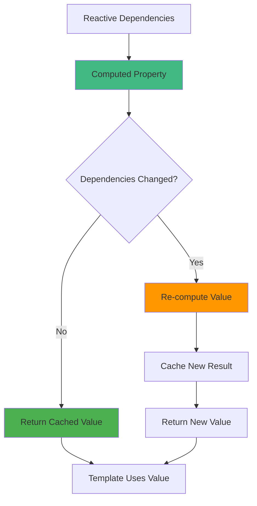
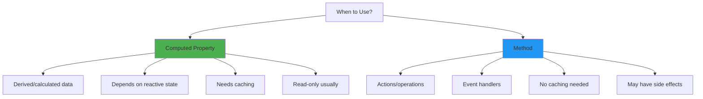
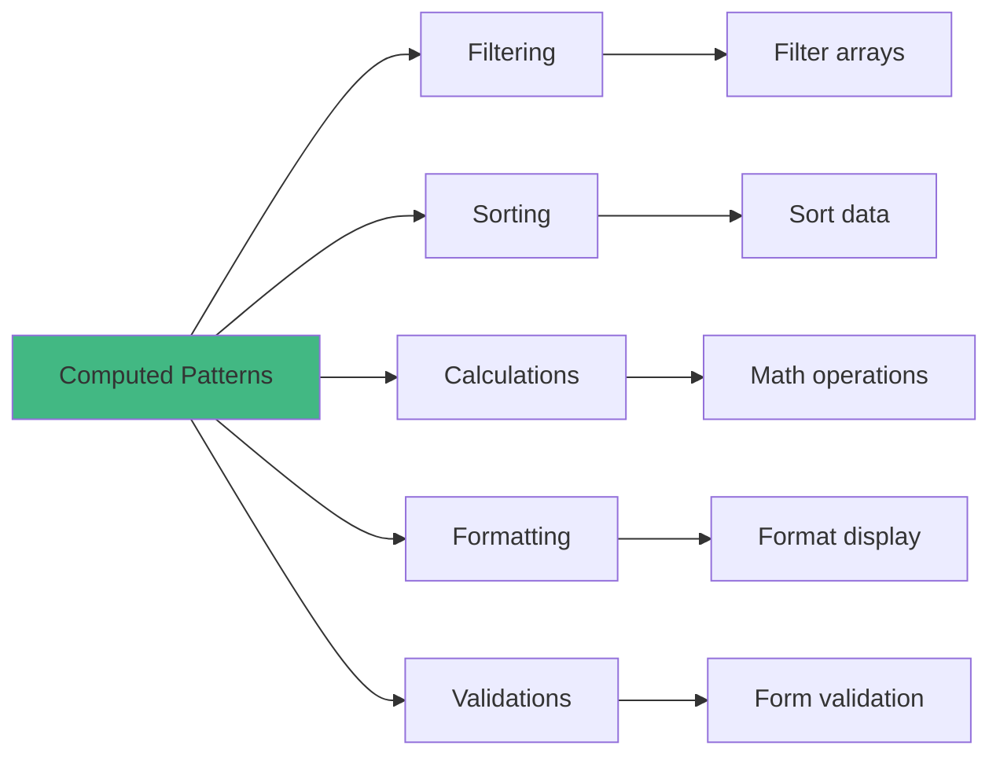
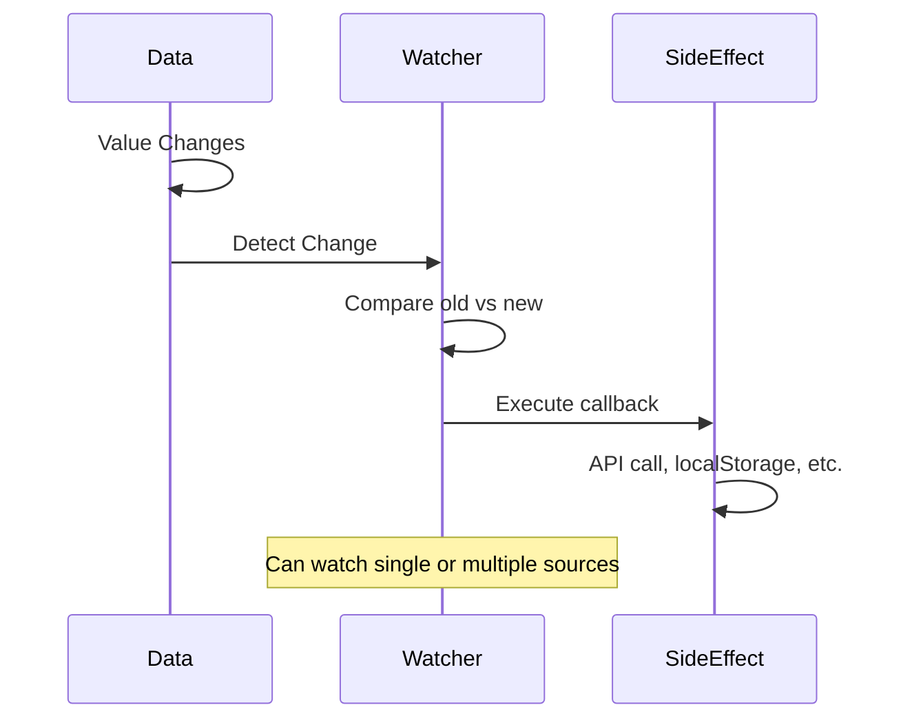
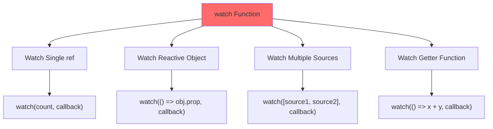
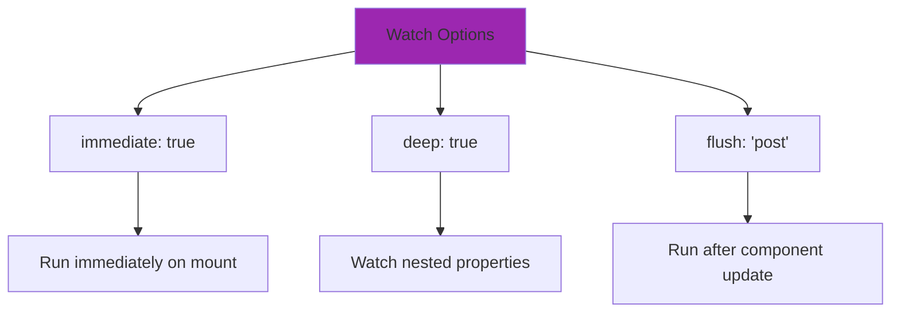
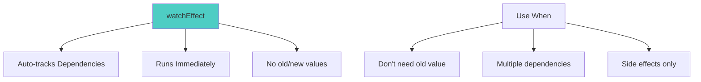
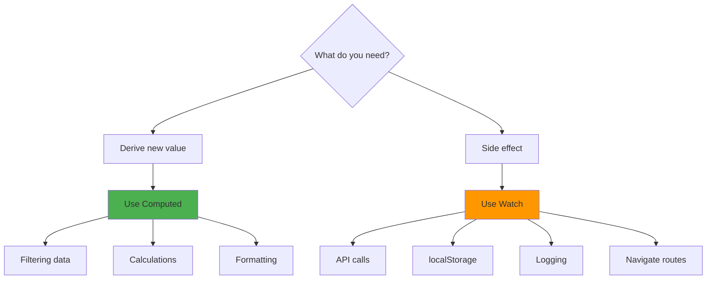
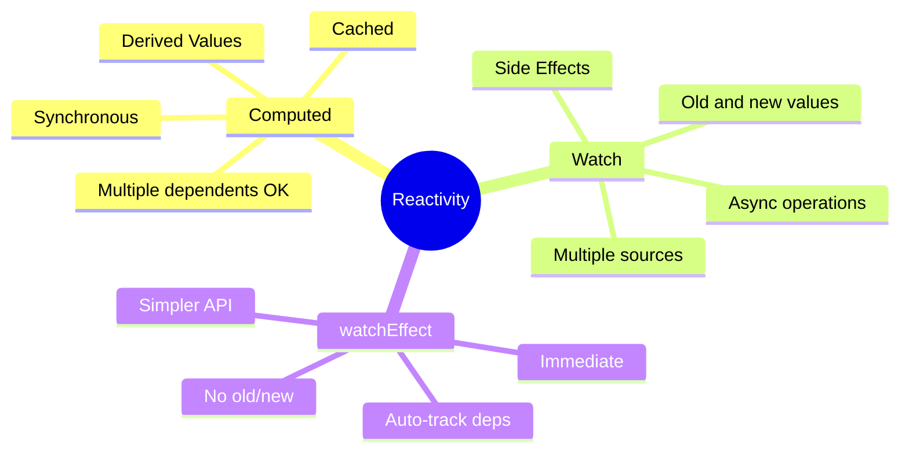

# Day 6: Computed Properties & Watchers 🔍

**Duration:** 3-4 hours  
**Difficulty:** ⭐⭐⭐ Hard

---

## 📖 Learning Objectives

- Understand computed properties vs methods
- Master computed property caching
- Learn watch() and watchEffect()
- Handle deep watching for objects/arrays
- Know when to use computed vs watchers

---

## 🧮 Computed Properties Concept



**Computed properties are cached based on their reactive dependencies.**

---

## 📊 Computed vs Methods



### Comparison Example:

```vue
<template>
  <div>
    <!-- Method: Called every re-render -->
    <p>{{ calculateTotal() }}</p>
    <p>{{ calculateTotal() }}</p> <!-- Computed twice! -->
    
    <!-- Computed: Cached, computed once -->
    <p>{{ totalPrice }}</p>
    <p>{{ totalPrice }}</p> <!-- Uses cached value -->
  </div>
</template>

<script setup lang="ts">
import { ref, computed } from 'vue'

const items = ref([
  { name: 'Item 1', price: 10 },
  { name: 'Item 2', price: 20 }
])

// Method: Runs every time it's called
const calculateTotal = () => {
  console.log('Method called')
  return items.value.reduce((sum, item) => sum + item.price, 0)
}

// Computed: Cached, only re-runs when items changes
const totalPrice = computed(() => {
  console.log('Computed called')
  return items.value.reduce((sum, item) => sum + item.price, 0)
})
</script>
```

**Result:** Method logs twice, Computed logs once (cached)!

---

## 🎯 Computed Property Patterns



### 1. Filtering Data:
```vue
<script setup lang="ts">
import { ref, computed } from 'vue'

const searchQuery = ref('')
const items = ref(['Apple', 'Banana', 'Cherry', 'Date'])

const filteredItems = computed(() => {
  return items.value.filter(item => 
    item.toLowerCase().includes(searchQuery.value.toLowerCase())
  )
})
</script>
```

### 2. Sorting Data:
```vue
<script setup lang="ts">
const products = ref([
  { name: 'Laptop', price: 999 },
  { name: 'Mouse', price: 29 },
  { name: 'Keyboard', price: 79 }
])

const sortedProducts = computed(() => {
  return [...products.value].sort((a, b) => a.price - b.price)
})
</script>
```

### 3. Calculations:
```vue
<script setup lang="ts">
const cartItems = ref([
  { name: 'Item 1', price: 10, quantity: 2 },
  { name: 'Item 2', price: 20, quantity: 1 }
])

const subtotal = computed(() => {
  return cartItems.value.reduce((sum, item) => 
    sum + (item.price * item.quantity), 0
  )
})

const tax = computed(() => subtotal.value * 0.1)
const total = computed(() => subtotal.value + tax.value)
</script>
```

### 4. Formatting:
```vue
<script setup lang="ts">
const user = ref({
  firstName: 'John',
  lastName: 'Doe'
})

const fullName = computed(() => {
  return `${user.value.firstName} ${user.value.lastName}`
})

const initials = computed(() => {
  return `${user.value.firstName[0]}${user.value.lastName[0]}`
})
</script>
```

---

## 👁️ Watchers Concept



**Watchers perform side effects in response to data changes.**

---

## 🔍 watch() API



### Watch Single Source:
```vue
<script setup lang="ts">
import { ref, watch } from 'vue'

const count = ref(0)

// Watch a single ref
watch(count, (newValue, oldValue) => {
  console.log(`Count changed from ${oldValue} to ${newValue}`)
})
</script>
```

### Watch Object Property (getter):
```vue
<script setup lang="ts">
import { reactive, watch } from 'vue'

const user = reactive({
  name: 'John',
  age: 30
})

// Watch specific property
watch(
  () => user.age,
  (newAge, oldAge) => {
    console.log(`Age changed from ${oldAge} to ${newAge}`)
  }
)
</script>
```

### Watch Multiple Sources:
```vue
<script setup lang="ts">
const firstName = ref('John')
const lastName = ref('Doe')

watch(
  [firstName, lastName],
  ([newFirst, newLast], [oldFirst, oldLast]) => {
    console.log(`Name changed from ${oldFirst} ${oldLast} to ${newFirst} ${newLast}`)
  }
)
</script>
```

---

## 🔬 Deep Watching



### Deep Watch Object:
```vue
<script setup lang="ts">
import { reactive, watch } from 'vue'

const user = reactive({
  profile: {
    name: 'John',
    address: {
      city: 'New York'
    }
  }
})

// Deep watch - detects nested changes
watch(
  () => user.profile,
  (newProfile) => {
    console.log('Profile changed:', newProfile)
  },
  { deep: true } // Enable deep watching
)

// Now this will trigger the watcher:
user.profile.address.city = 'Los Angeles'
</script>
```

### Immediate Watch:
```vue
<script setup lang="ts">
const searchQuery = ref('')

watch(
  searchQuery,
  (newQuery) => {
    // Fetch search results
    console.log('Searching for:', newQuery)
  },
  { immediate: true } // Run immediately on mount
)
</script>
```

---

## ⚡ watchEffect()



### watchEffect Example:
```vue
<script setup lang="ts">
import { ref, watchEffect } from 'vue'

const count = ref(0)
const multiplier = ref(2)

// Auto-tracks count AND multiplier
watchEffect(() => {
  console.log(`Result: ${count.value * multiplier.value}`)
})

// Changes to either count or multiplier trigger this watcher
count.value = 5 // Logs: "Result: 10"
multiplier.value = 3 // Logs: "Result: 15"
</script>
```

---

## 🆚 Computed vs Watch



### Use Computed For:
- Deriving values from existing data
- Filtering, sorting, formatting
- Calculations
- **Synchronous** operations

### Use Watch For:
- API calls based on data changes
- Saving to localStorage
- **Asynchronous** operations
- Side effects (logging, analytics)

---

## 🛠️ Real-World Example: Search with Debounce

```vue
<template>
  <div>
    <input v-model="searchQuery" placeholder="Search..." />
    <p v-if="loading">Searching...</p>
    <ul>
      <li v-for="result in searchResults" :key="result">
        {{ result }}
      </li>
    </ul>
  </div>
</template>

<script setup lang="ts">
import { ref, watch } from 'vue'

const searchQuery = ref('')
const searchResults = ref<string[]>([])
const loading = ref(false)

// Watch with debounce
let timeoutId: ReturnType<typeof setTimeout>

watch(searchQuery, (newQuery) => {
  // Clear previous timeout
  clearTimeout(timeoutId)
  
  // Set new timeout (debounce)
  timeoutId = setTimeout(async () => {
    if (newQuery.length < 3) {
      searchResults.value = []
      return
    }
    
    loading.value = true
    
    // Simulate API call
    await new Promise(resolve => setTimeout(resolve, 1000))
    
    searchResults.value = [
      `Result 1 for "${newQuery}"`,
      `Result 2 for "${newQuery}"`,
      `Result 3 for "${newQuery}"`
    ]
    
    loading.value = false
  }, 500) // 500ms debounce
})
</script>
```

---

## ✅ Practice Exercise

Build a **Shopping Cart Calculator** with:

**Features:**
1. Add items with name, price, quantity
2. Computed properties for:
   - Subtotal
   - Tax (10%)
   - Discount (if subtotal > $100, 5% off)
   - Final total
3. Watch for cart changes and:
   - Save to localStorage
   - Log to console
4. Filter items by price range (computed)
5. Sort items by price or name (computed)

See `shopping-cart.vue` for starter code.

---

## 📌 Key Takeaways



---

## 🔗 Cheat Sheet

| Feature | Computed | watch() | watchEffect() |
|---------|----------|---------|---------------|
| **Purpose** | Derive value | Side effects | Side effects |
| **Caching** | ✅ Yes | ❌ No | ❌ No |
| **Dependencies** | Auto-tracked | Explicit | Auto-tracked |
| **Old value** | ❌ No | ✅ Yes | ❌ No |
| **Immediate** | ❌ No | ⚙️ Optional | ✅ Yes |
| **Async** | ❌ No | ✅ Yes | ✅ Yes |

---

**Tomorrow:** Week 1 Project - Todo App! 🎉
