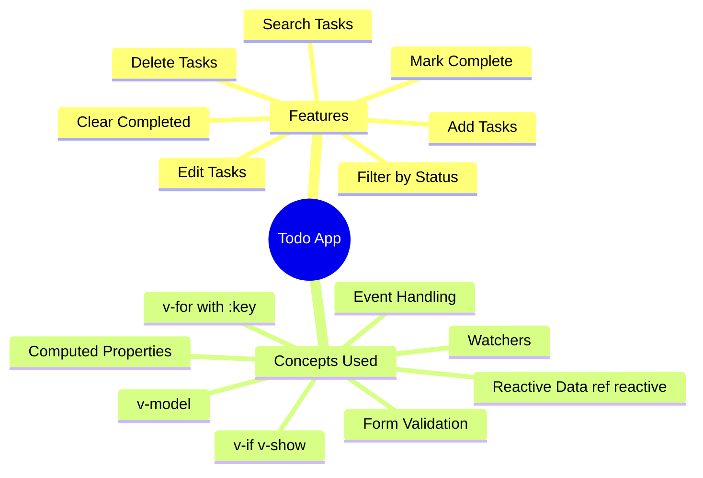
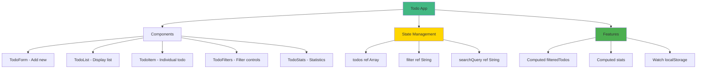
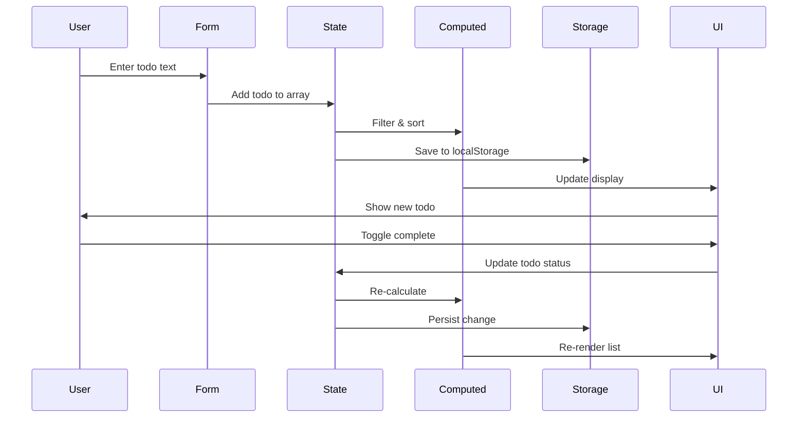
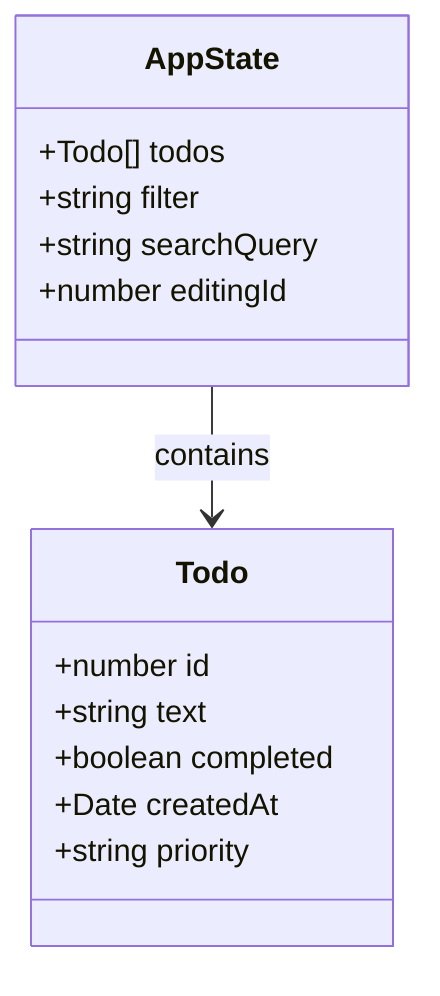
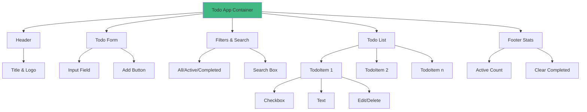
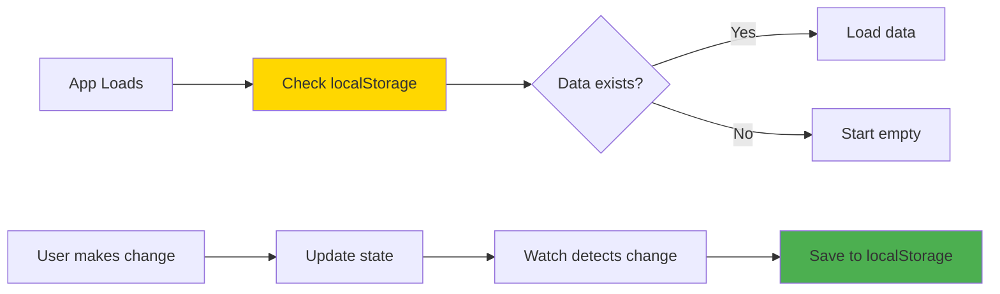
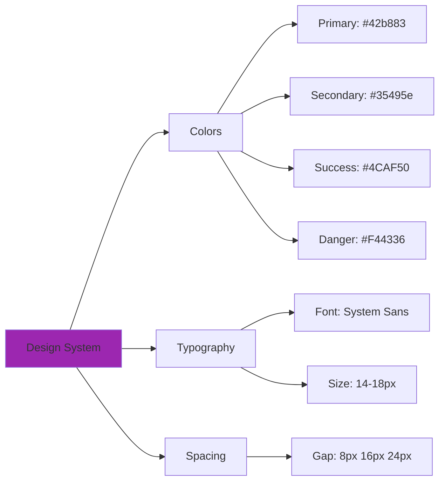
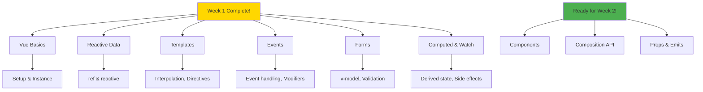

# Day 7: Week 1 Project - Todo App 🎯

**Duration:** 4-6 hours  
**Difficulty:** ⭐⭐⭐ Project Day

---

## 🎯 Project Overview

Build a **feature-rich Todo Application** that demonstrates all concepts learned in Week 1!



---

## 📋 Requirements

### **Must Have Features:**
1. ✅ Add new todos
2. ✅ Mark todos as complete/incomplete
3. ✅ Delete individual todos
4. ✅ Edit existing todos
5. ✅ Filter by: All, Active, Completed
6. ✅ Clear all completed todos
7. ✅ Todo counter (active/completed)
8. ✅ Persist to localStorage
9. ✅ Form validation (no empty todos)
10. ✅ Search/filter todos

### **Nice to Have:**
- Priority levels (High, Medium, Low)
- Due dates
- Categories/tags
- Dark mode toggle
- Animations

---

## 🏗️ Application Architecture



---

## 🔄 Data Flow Diagram



---

## 📊 State Structure

```typescript
interface Todo {
  id: number
  text: string
  completed: boolean
  createdAt: Date
  priority?: 'high' | 'medium' | 'low'
}

interface AppState {
  todos: Todo[]
  filter: 'all' | 'active' | 'completed'
  searchQuery: string
  editingId: number | null
}
```



---

## 🎨 UI Layout



---

## 💻 Implementation Steps

### **Step 1: Setup (15 min)**
```bash
# Create new Vue project
npm create vite@latest todo-app -- --template vue-ts
cd todo-app
npm install
npm run dev
```

### **Step 2: Create Data Structure (20 min)**
Define interfaces and initial state

### **Step 3: Build TodoForm Component (30 min)**
- Input field with v-model
- Add button
- Validation
- Handle submit

### **Step 4: Build TodoList (40 min)**
- Display todos with v-for
- Checkbox to toggle completion
- Delete button
- Edit functionality

### **Step 5: Add Filtering (30 min)**
- Filter buttons (All/Active/Completed)
- Computed property for filtered todos
- Search functionality

### **Step 6: Add Statistics (20 min)**
- Count active todos
- Count completed todos
- Show total

### **Step 7: LocalStorage (20 min)**
- Watch todos and save
- Load on mount

### **Step 8: Polish & Styling (1-2 hours)**
- CSS styling
- Transitions
- Responsive design

---

## 🔍 Key Computed Properties

```vue
<script setup lang="ts">
import { ref, computed, watch } from 'vue'

// Filtered todos based on active filter
const filteredTodos = computed(() => {
  let result = todos.value
  
  // Apply status filter
  switch (filter.value) {
    case 'active':
      result = result.filter(t => !t.completed)
      break
    case 'completed':
      result = result.filter(t => t.completed)
      break
  }
  
  // Apply search
  if (searchQuery.value) {
    result = result.filter(t => 
      t.text.toLowerCase().includes(searchQuery.value.toLowerCase())
    )
  }
  
  return result
})

// Statistics
const stats = computed(() => ({
  total: todos.value.length,
  active: todos.value.filter(t => !t.completed).length,
  completed: todos.value.filter(t => t.completed).length
}))
</script>
```

---

## 💾 LocalStorage Integration



```vue
<script setup lang="ts">
// Load from localStorage
const loadTodos = () => {
  const saved = localStorage.getItem('todos')
  if (saved) {
    todos.value = JSON.parse(saved)
  }
}

// Watch and save
watch(
  todos,
  (newTodos) => {
    localStorage.setItem('todos', JSON.stringify(newTodos))
  },
  { deep: true }
)

// Load on mount
loadTodos()
</script>
```

---

## ✅ Testing Checklist

Before considering your project complete, test these scenarios:

**Basic Operations:**
- [ ] Add a todo
- [ ] Add multiple todos
- [ ] Try to add empty todo (should be prevented)
- [ ] Mark todo as complete
- [ ] Mark todo as incomplete
- [ ] Edit a todo
- [ ] Delete a todo

**Filtering:**
- [ ] Switch to "Active" filter
- [ ] Switch to "Completed" filter
- [ ] Switch back to "All"
- [ ] Search for todos by text

**Persistence:**
- [ ] Add todos and refresh page (should persist)
- [ ] Complete todos and refresh (status should persist)
- [ ] Clear all completed and refresh

**Edge Cases:**
- [ ] What happens with 0 todos?
- [ ] What happens with 100 todos?
- [ ] Long todo text handling
- [ ] Special characters in todo text

---

## 🎨 Styling Guidelines



---

## 🚀 Bonus Challenges

Once you complete the basic app, try these:

1. **Priority System**: Add High/Medium/Low priority with color coding
2. **Due Dates**: Add date picker and show overdue todos
3. **Categories**: Tag todos with categories (Work, Personal, Shopping)
4. **Drag & Drop**: Reorder todos by dragging
5. **Dark Mode**: Toggle between light/dark themes
6. **Export/Import**: Download todos as JSON
7. **Animations**: Add Vue transitions for add/remove
8. **Keyboard Shortcuts**: Press 'N' for new todo, 'Escape' to cancel edit

---

## 📁 Project Files

Your project should have:
```
src/
├── App.vue              (Main app container)
├── components/
│   ├── TodoForm.vue     (Add/Edit form)
│   ├── TodoList.vue     (List container)
│   ├── TodoItem.vue     (Individual todo)
│   ├── TodoFilters.vue  (Filter buttons)
│   └── TodoStats.vue    (Statistics)
├── types/
│   └── Todo.ts          (TypeScript interfaces)
└── composables/
    └── useTodos.ts      (Reusable todo logic)
```

---

## 📸 Expected Result

Your final app should look professional and include:
- Clean, modern UI
- Smooth interactions
- Clear visual feedback
- Responsive design
- No bugs in core functionality

See `TodoApp.vue` for complete reference implementation!

---

## 🎓 What You Learned This Week



---

## 🎉 Congratulations!

You've completed Week 1! You now understand:
- ✅ Vue reactivity system
- ✅ Template syntax and directives
- ✅ Event handling
- ✅ Form bindings
- ✅ Computed properties
- ✅ Watchers
- ✅ Building a complete application

**Next Week:** Components, Props, Composition API! 🚀

---

**Take a break, celebrate your progress, then move to Week 2!** 🎊
