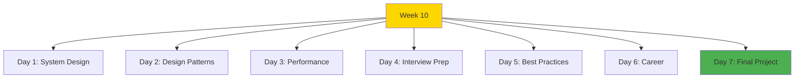

# Week 10: Advanced Topics & Mastery - Index 📑

**Your final week guide**

---

## 🗂️ Week Structure

---

## 📅 Daily Breakdown

### **Day 1 (Day 64): System Design Mastery** ⭐⭐⭐⭐

- 📖 [`day1/README.md`](day1/README.md)
- Architecture patterns
- Scalability strategies
- Database optimization
- Caching & load balancing

**Topics:** Microservices, Event-driven, CQRS, Sharding, Replication

---

### **Day 2 (Day 65): Advanced Design Patterns** ⭐⭐⭐⭐

- 📖 [`day2/README.md`](day2/README.md)
- Creational patterns
- Structural patterns
- Behavioral patterns
- React-specific patterns

**Topics:** Singleton, Factory, Observer, Strategy, Compound Components

---

### **Day 3 (Day 66): Performance Deep Dive** ⭐⭐⭐⭐

- 📖 [`day3/README.md`](day3/README.md)
- React optimization
- Code splitting
- Database optimization
- Profiling tools

**Topics:** Memoization, Virtual scrolling, Bundle analysis, Core Web Vitals

---

### **Day 4 (Day 67): Interview Preparation** ⭐⭐⭐⭐

- 📖 [`day4/README.md`](day4/README.md)
- Coding challenges
- System design interviews
- Behavioral questions
- React/Next.js questions

**Topics:** Data structures, Algorithms, STAR method, Technical questions

---

### **Day 5 (Day 68): Best Practices** ⭐⭐⭐

- 📖 [`day5/README.md`](day5/README.md)
- Code quality
- Testing strategies
- Documentation
- Security

**Topics:** Clean code, ESLint, Prettier, Git workflow

---

### **Day 6 (Day 69): Career Development** ⭐⭐⭐

- 📖 [`day6/README.md`](day6/README.md)
- Portfolio building
- Resume optimization
- LinkedIn profile
- Networking

**Topics:** Job search, Salary negotiation, Personal branding

---

### **Day 7 (Day 70): Final Capstone** 🎯

- 📖 [`day7/README.md`](day7/README.md)
- Final project
- Journey reflection
- Celebration!

**Build:** One final showcase project with ALL skills

---

## 🎯 Learning Checklist

**System Design:**

- [ ] Day 1 Complete
- [ ] Architecture patterns
- [ ] Scalability strategies
- [ ] Real-world examples

**Design Patterns:**

- [ ] Day 2 Complete
- [ ] Creational patterns
- [ ] Structural patterns
- [ ] React patterns

**Performance:**

- [ ] Day 3 Complete
- [ ] Optimization techniques
- [ ] Profiling tools
- [ ] Bundle analysis

**Interview Prep:**

- [ ] Day 4 Complete
- [ ] Coding practice
- [ ] System design practice
- [ ] Behavioral prep

**Best Practices:**

- [ ] Day 5 Complete
- [ ] Code quality
- [ ] Testing setup
- [ ] Documentation

**Career:**

- [ ] Day 6 Complete
- [ ] Portfolio live
- [ ] Resume ready
- [ ] LinkedIn optimized

**Final Project:**

- [ ] Day 7 Complete
- [ ] Capstone deployed
- [ ] Journey reflected
- [ ] Celebrated! 🎉

---

## 💻 Code Statistics

**Week 10 Totals:**

- 📖 **15 comprehensive files**
- 💻 **50+ code examples**
- 📊 **80+ Mermaid diagrams**
- 🎯 **1 final capstone project**
- 🎓 **70-day journey complete!**

---

## 🚀 Quick Navigation

| Day | Focus | Difficulty | Output |
|-----|-------|------------|--------|
| 1 | System Design | ⭐⭐⭐⭐ | Architecture skills |
| 2 | Design Patterns | ⭐⭐⭐⭐ | Pattern mastery |
| 3 | Performance | ⭐⭐⭐⭐ | Optimization skills |
| 4 | Interviews | ⭐⭐⭐⭐ | Interview-ready |
| 5 | Best Practices | ⭐⭐⭐ | Code quality |
| 6 | Career | ⭐⭐⭐ | Job-ready |
| 7 | Capstone | 🎯 | Final project |

---

## 💡 Key Takeaways

> **"System design is about trade-offs."**

> **"Know when to apply design patterns."**

> **"Premature optimization is the root of all evil."**

> **"Practice makes perfect for interviews."**

> **"Clean code is a love letter to future self."**

> **"Your portfolio is your best resume."**

> **"Day 70: You're a full-stack developer!"**

---

**Continue to:** [`WEEK10_SUMMARY.md`](WEEK10_SUMMARY.md)

**Previous Week:** [`../week9/README.md`](../week9/README.md)

**You're completing an amazing journey!** 🎓
