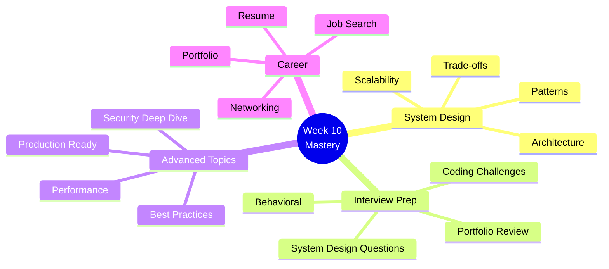

# Week 10: Advanced Topics & Mastery 🎓

**Focus:** System design, interview prep, advanced patterns, final mastery

---

## 📚 Daily Topics

| Day | Focus | Key Topics |
|-----|-------|------------|
| **Day 64** | System Design | Architecture patterns, scalability, trade-offs |
| **Day 65** | Design Patterns | Advanced patterns, best practices |
| **Day 66** | Performance Deep Dive | Optimization techniques, profiling |
| **Day 67** | Interview Preparation | Coding challenges, system design |
| **Day 68** | Best Practices | Code quality, testing, documentation |
| **Day 69** | Career Development | Portfolio, resume, networking |
| **Day 70** | **Final Project** | Capstone showcase, deployment |

---

## 🏗️ Week Focus

---

## ✅ Week Objectives

- [ ] Master system design principles
- [ ] Learn advanced design patterns
- [ ] Deep dive into performance optimization
- [ ] Prepare for technical interviews
- [ ] Establish best practices
- [ ] Build professional portfolio
- [ ] Create resume and LinkedIn
- [ ] Complete capstone project
- [ ] Deploy final showcase
- [ ] Celebrate 70 days of learning!

---

## 🎯 Learning Outcomes

By end of Week 10:
- ✅ System design mastery
- ✅ Interview-ready skills
- ✅ Advanced optimization techniques
- ✅ Production best practices
- ✅ Complete portfolio
- ✅ Job search strategy
- ✅ Final capstone deployed
- ✅ **70-day journey complete!**

---

**Start Day 64!** 🚀
