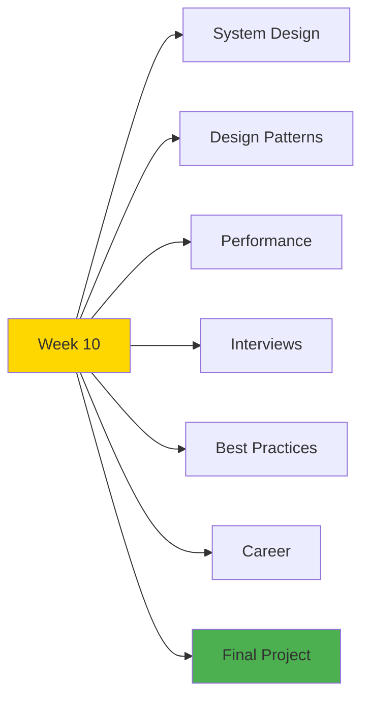

# 🎓 Week 10: Start Here - Final Week

**Welcome to Week 10 - Advanced Topics & Mastery!**

---

## 📚 What You'll Master This Week

The final week focuses on advanced topics, interview preparation, and career readiness!

---

## 📅 7-Day Plan

| Day | Topic | Focus | Hours |
|-----|-------|-------|-------|
| **Day 1** | System Design | Architecture, Scalability | 4-6h |
| **Day 2** | Design Patterns | Advanced Patterns | 4-6h |
| **Day 3** | Performance | Optimization Deep Dive | 4-6h |
| **Day 4** | Interview Prep | Coding & System Design | 4-6h |
| **Day 5** | Best Practices | Code Quality | 3-5h |
| **Day 6** | Career Development | Portfolio, Resume | 3-5h |
| **Day 7** | Final Capstone | **Day 70! 🎉** | 6-8h |

**Total:** 28-42 hours

---

## 🎯 Learning Path

### **Start Here:**

1. Review [`INDEX.md`](INDEX.md) for overview
2. Begin with [`day1/README.md`](day1/README.md)
3. Complete each day systematically
4. Build final capstone project on Day 7

---

## 🎓 Week Objectives

By the end of Week 10, you will:

✅ Master system design principles  
✅ Understand advanced design patterns  
✅ Optimize applications for production  
✅ Be interview-ready (coding + system design)  
✅ Know best practices for code quality  
✅ Have a professional portfolio & resume  
✅ Complete your 70-day journey! 🎉  

---

## 🚦 Prerequisites

- ✅ Week 9 completed (Real-World Projects)
- ✅ All 15 projects built
- ✅ Strong understanding of full-stack development
- ✅ Ready for advanced topics
- ✅ Excited to complete the journey!

---

## 💡 Pro Tips

> 💡 **Tip 1:** This week is about consolidation and mastery
>
> 💡 **Tip 2:** Focus on understanding, not memorization
>
> 💡 **Tip 3:** Practice system design problems daily
>
> 💡 **Tip 4:** Update your portfolio throughout the week
>
> 💡 **Tip 5:** Day 70 is special - celebrate your achievement!

---

## ✅ Success Checklist

- [ ] System design mastery
- [ ] Design patterns understood
- [ ] Performance optimization applied
- [ ] Interview questions practiced
- [ ] Best practices established
- [ ] Portfolio completed
- [ ] Resume finalized
- [ ] Final project deployed
- [ ] 70 days completed! 🎊

---

## 🎉 This is It

**You're on the final week!**

After 63 days of intense learning and building 15 projects, you're now ready for the advanced topics that will make you interview-ready and career-ready!

**Let's finish strong!** 💪

---

**Start your final week:** [`day1/README.md`](day1/README.md)

**Or review the plan:** [`INDEX.md`](INDEX.md)

---

**Let's complete this incredible journey!** 🚀
