# Day 1 (Day 64): System Design Mastery 🏗️

**Duration:** 4-6 hours | **Difficulty:** ⭐⭐⭐⭐ Advanced

---

## 📖 Learning Objectives

- Master system design principles
- Understand scalability patterns
- Learn architecture trade-offs
- Design distributed systems
- Handle system design interviews

---

## 🎯 System Design Fundamentals

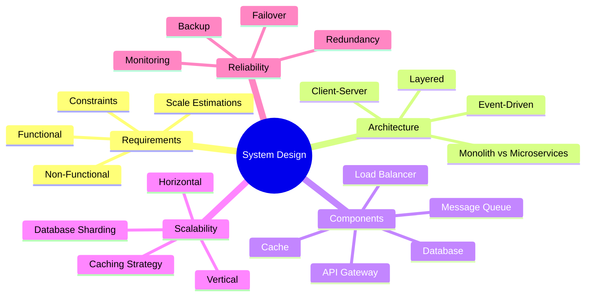

---

## 📊 System Design Process

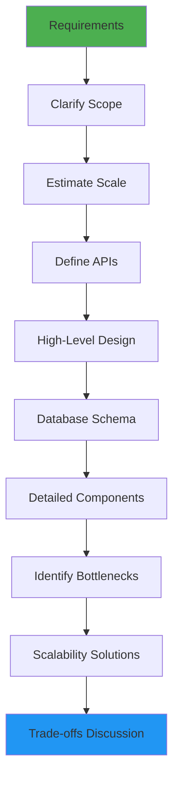

---

## 🏗️ Common Architecture Patterns

### **1. Microservices Architecture**

**See:** [`examples/microservices-architecture.md`](examples/microservices-architecture.md)

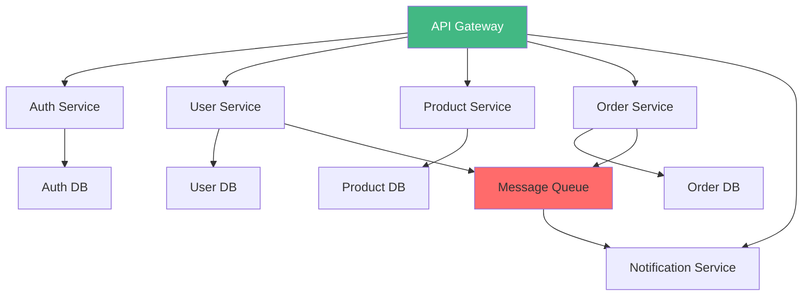

**Key Characteristics:**
- Independent deployment
- Technology diversity
- Fault isolation
- Scalability per service
- Complexity trade-off

**When to Use:**
- Large, complex applications
- Multiple teams
- Different scaling requirements
- Long-term evolution needs

---

### **2. Event-Driven Architecture**

**See:** [`examples/event-driven-system.md`](examples/event-driven-system.md)

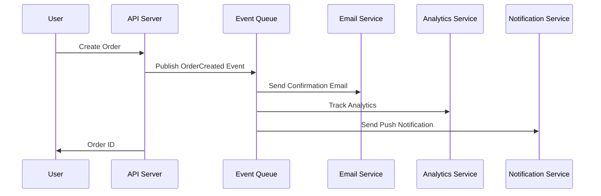

**Benefits:**
- Loose coupling
- Asynchronous processing
- Easy to add new consumers
- Better fault tolerance

---

### **3. CQRS (Command Query Responsibility Segregation)**

**See:** [`examples/cqrs-pattern.md`](examples/cqrs-pattern.md)

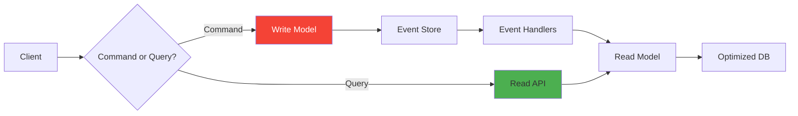

---

## 📈 Scalability Strategies

### **Horizontal vs Vertical Scaling**

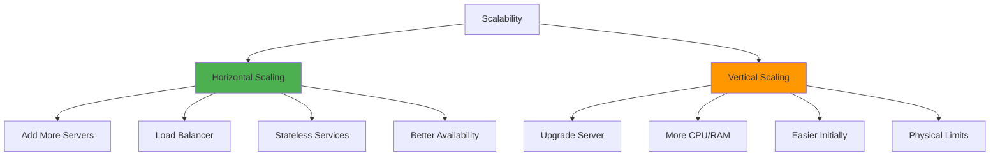

**Horizontal Scaling (Preferred):**
```typescript
// Example: Stateless API design for horizontal scaling
// See: examples/stateless-api.ts

// ❌ BAD - Uses in-memory state
let userSessions = new Map()

export async function POST(req: Request) {
  const session = userSessions.get(userId)
  // Problem: session only exists on this server instance
}

// ✅ GOOD - Uses external state (Redis/DB)
export async function POST(req: Request) {
  const session = await redis.get(`session:${userId}`)
  // Works across all server instances
}
```

---

## 🗄️ Database Strategies

### **Database Sharding**

**See:** [`examples/database-sharding.md`](examples/database-sharding.md)

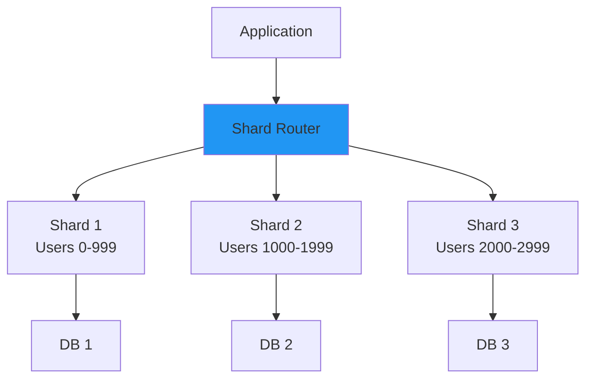

**Sharding Strategies:**
1. **Range-based:** User IDs 0-1000, 1001-2000
2. **Hash-based:** hash(userId) % num_shards
3. **Geography-based:** US users, EU users
4. **Directory-based:** Lookup table

---

### **Database Replication**

**See:** [`examples/database-replication.ts`](examples/database-replication.ts)

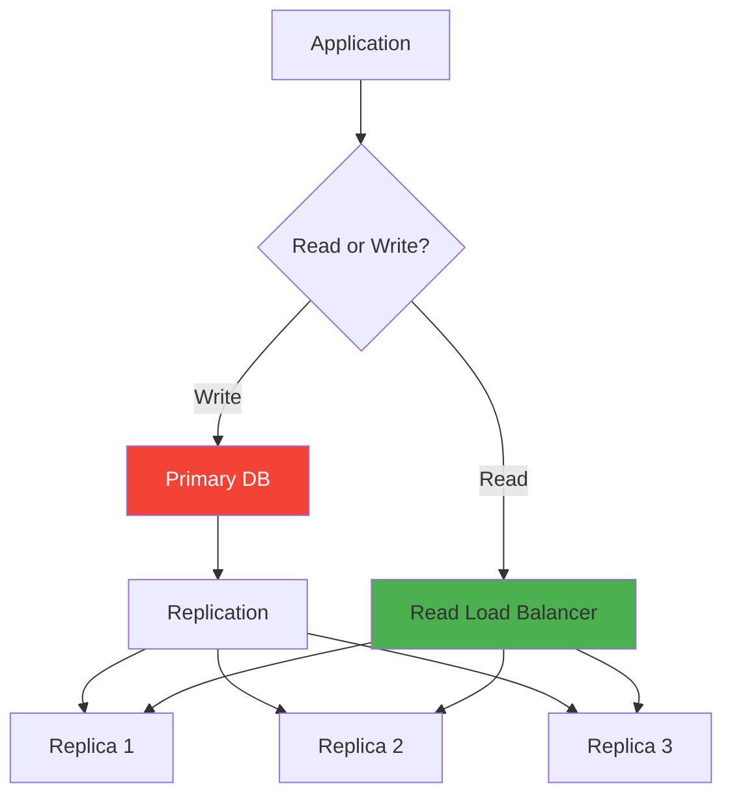

---

## 🚀 Caching Strategies

### **Multi-Layer Caching**

**See:** [`examples/caching-strategy.ts`](examples/caching-strategy.ts)

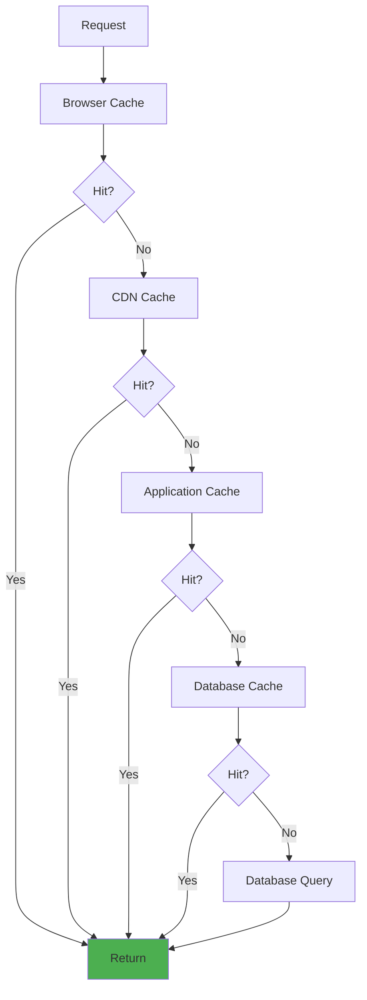

**Cache Patterns:**
1. **Cache-Aside:** Application manages cache
2. **Read-Through:** Cache loads from DB
3. **Write-Through:** Write to cache and DB
4. **Write-Behind:** Async DB writes

---

## ⚖️ Load Balancing

**See:** [`examples/load-balancer-config.md`](examples/load-balancer-config.md)

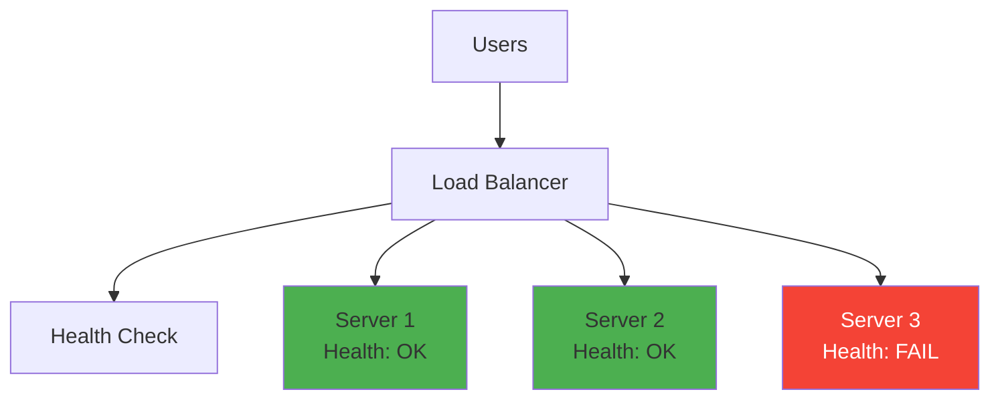

**Algorithms:**
- **Round Robin:** Distribute evenly
- **Least Connections:** To server with fewest connections
- **IP Hash:** Same user to same server
- **Weighted:** Based on server capacity

---

## 🔄 Message Queues

**See:** [`examples/message-queue-pattern.md`](examples/message-queue-pattern.md)

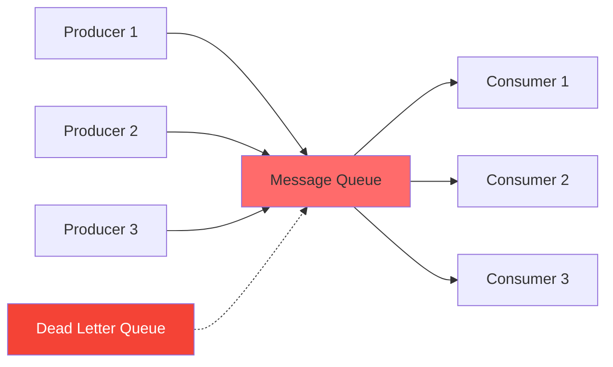

**Use Cases:**
- Async processing
- Task queues
- Event distribution
- Rate limiting
- Retry logic

---

## 🎯 Real-World Examples

### **Example 1: Design URL Shortener**

**See:** [`examples/url-shortener-design.md`](examples/url-shortener-design.md)

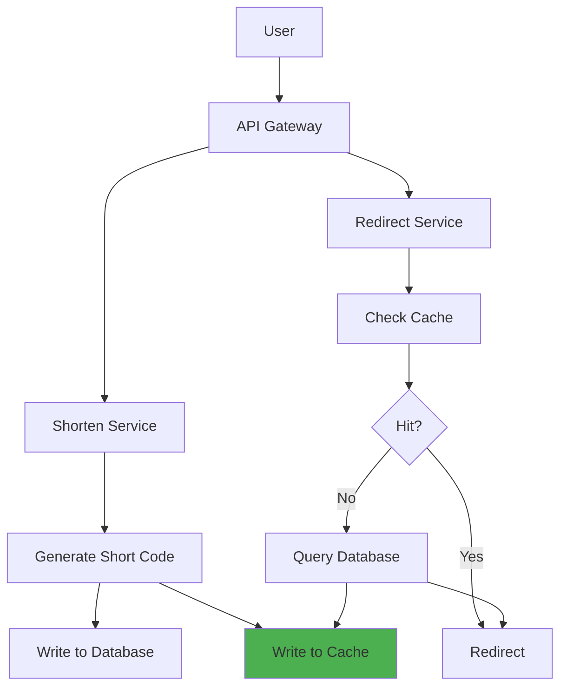

---

### **Example 2: Design Twitter**

**See:** [`examples/twitter-design.md`](examples/twitter-design.md)

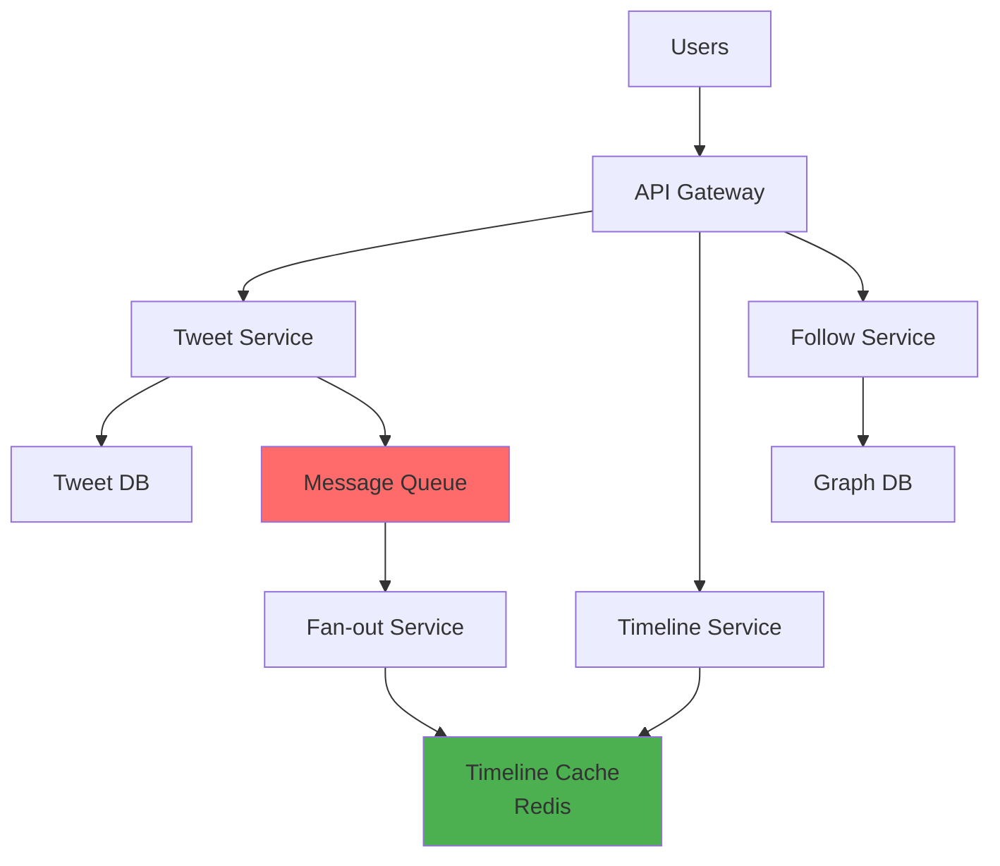

---

### **Example 3: Design WhatsApp**

**See:** [`examples/whatsapp-design.md`](examples/whatsapp-design.md)

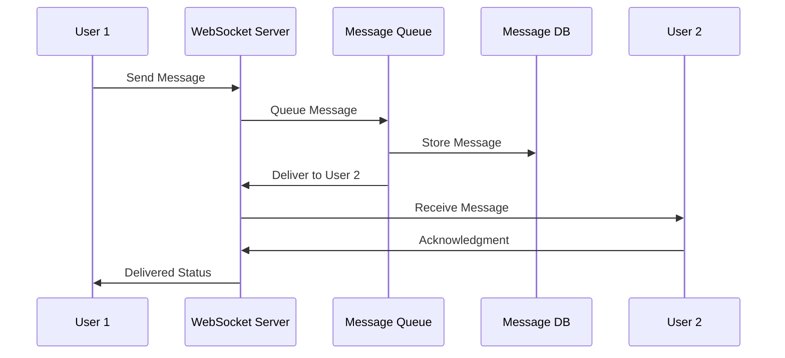

---

## 📝 System Design Interview Tips

### **Framework: RESHADED**

1. **R**equirements (Functional & Non-Functional)
2. **E**stimation (Users, Storage, Bandwidth)
3. **S**ystem Interface (API endpoints)
4. **H**igh-level Design (Architecture diagram)
5. **A**PI & Database Design
6. **D**etailed Component Design
7. **E**valuate (Bottlenecks, Trade-offs)
8. **D**iscuss Alternatives

---

## ✅ Practice Exercises

1. **Design Instagram**
   - Photo upload and storage
   - News feed generation
   - Following system
   - See: [`examples/instagram-design.md`](examples/instagram-design.md)

2. **Design Uber**
   - Real-time location tracking
   - Matching algorithm
   - ETA calculation
   - See: [`examples/uber-design.md`](examples/uber-design.md)

3. **Design Netflix**
   - Video streaming
   - Recommendation system
   - CDN strategy
   - See: [`examples/netflix-design.md`](examples/netflix-design.md)

---

## 📚 Additional Resources

- **Code Examples:** See [`examples/`](examples/) directory
- **Architecture Diagrams:** All diagrams are Mermaid-based
- **Implementation References:** Check Next.js example implementations

---

**Tomorrow:** Design Patterns Deep Dive! 🎨
