# Day 2 (Day 65): Advanced Design Patterns 🎨

**Duration:** 4-6 hours | **Difficulty:** ⭐⭐⭐⭐ Advanced

---

## 📖 Learning Objectives

- Master advanced design patterns
- Apply patterns in Next.js/React
- Understand when to use each pattern
- Implement production-ready patterns
- Avoid common anti-patterns

---

## 🎯 Design Patterns Overview

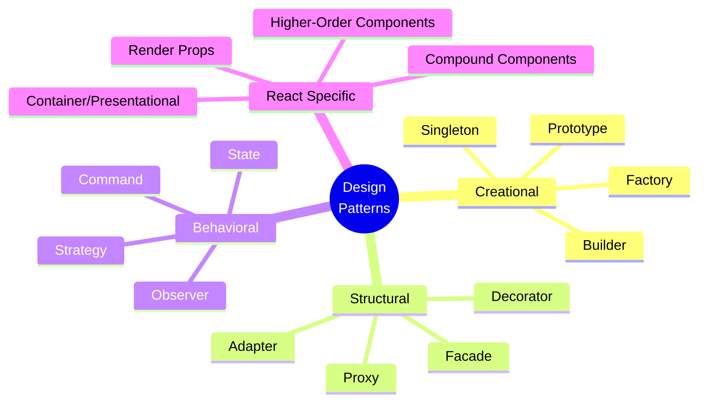

---

## 🏗️ Creational Patterns

### **1. Singleton Pattern**

**Use Case:** Database connection, configuration, logging

**See:** [`examples/singleton-pattern.ts`](examples/singleton-pattern.ts)

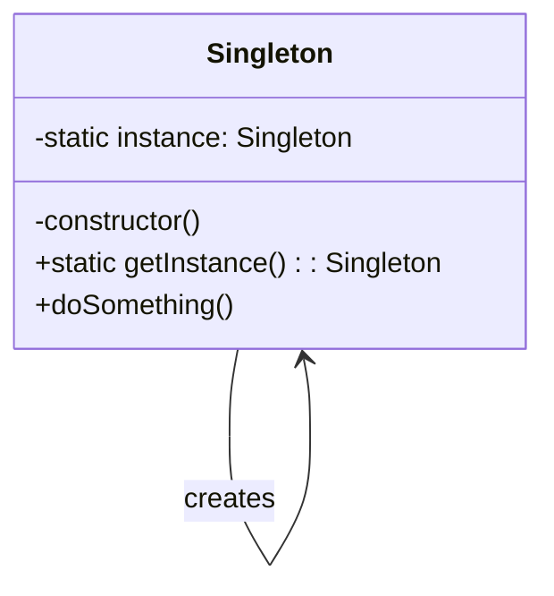

**When to Use:**
- Single database connection
- Configuration management
- Logger instance
- Cache manager

**Example:**
```typescript
// See: examples/singleton-pattern.ts
class DatabaseConnection {
  private static instance: DatabaseConnection
  
  private constructor() {
    // Private constructor prevents direct instantiation
  }
  
  static getInstance(): DatabaseConnection {
    if (!DatabaseConnection.instance) {
      DatabaseConnection.instance = new DatabaseConnection()
    }
    return DatabaseConnection.instance
  }
}
```

---

### **2. Factory Pattern**

**Use Case:** Object creation based on conditions

**See:** [`examples/factory-pattern.ts`](examples/factory-pattern.ts)

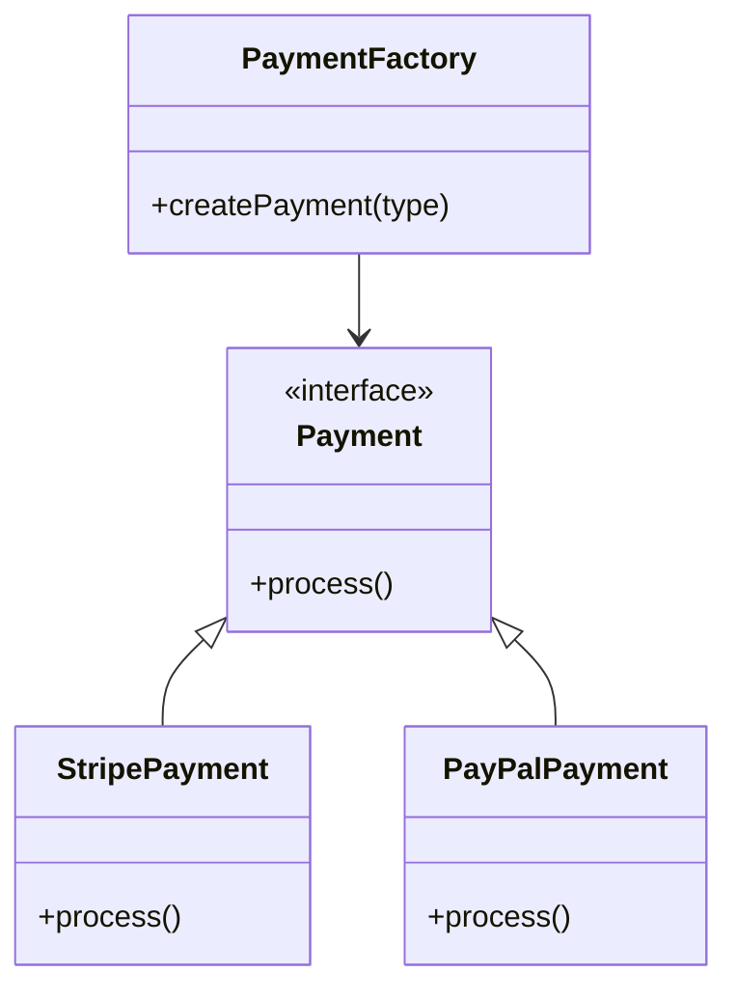

**Example:**
```typescript
// See: examples/factory-pattern.ts
class PaymentFactory {
  createPayment(type: 'stripe' | 'paypal'): Payment {
    switch(type) {
      case 'stripe': return new StripePayment()
      case 'paypal': return new PayPalPayment()
    }
  }
}
```

---

### **3. Builder Pattern**

**Use Case:** Complex object construction

**See:** [`examples/builder-pattern.ts`](examples/builder-pattern.ts)

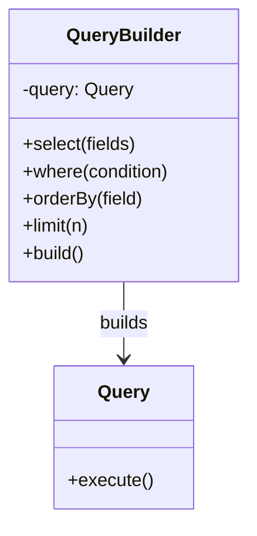

**Example:**
```typescript
// See: examples/builder-pattern.ts
const query = new QueryBuilder()
  .select(['name', 'email'])
  .where({ active: true })
  .orderBy('created_at')
  .limit(10)
  .build()
```

---

## 🔄 Structural Patterns

### **4. Adapter Pattern**

**Use Case:** Interface compatibility

**See:** [`examples/adapter-pattern.ts`](examples/adapter-pattern.ts)

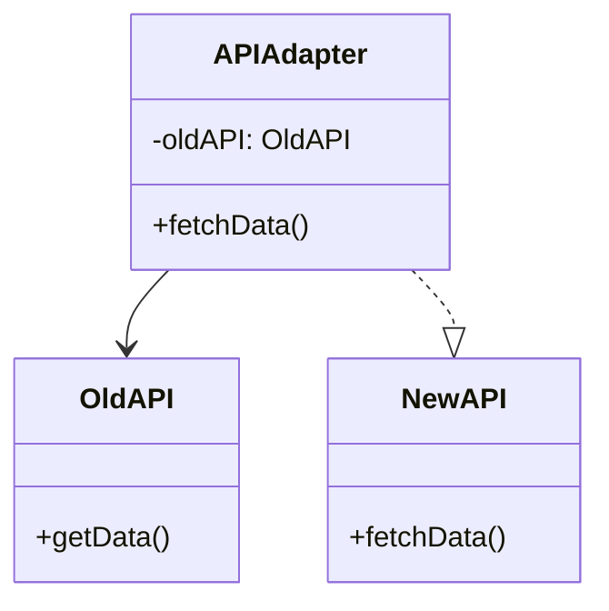

---

### **5. Decorator Pattern**

**Use Case:** Add functionality dynamically

**See:** [`examples/decorator-pattern.ts`](examples/decorator-pattern.ts)

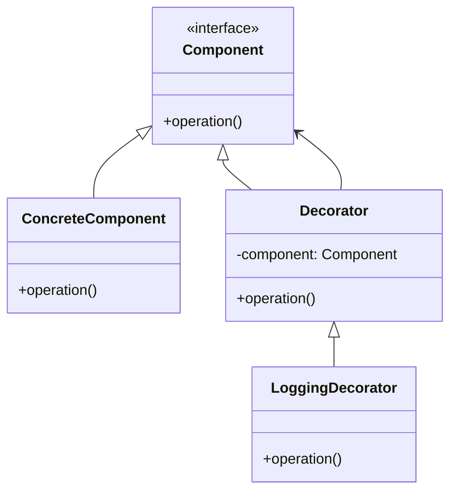

**Example:**
```typescript
// See: examples/decorator-pattern.ts
function withLogging(Component) {
  return function LoggedComponent(props) {
    console.log('Rendering:', Component.name)
    return <Component {...props} />
  }
}
```

---

### **6. Proxy Pattern**

**Use Case:** Control access, caching, validation

**See:** [`examples/proxy-pattern.ts`](examples/proxy-pattern.ts)

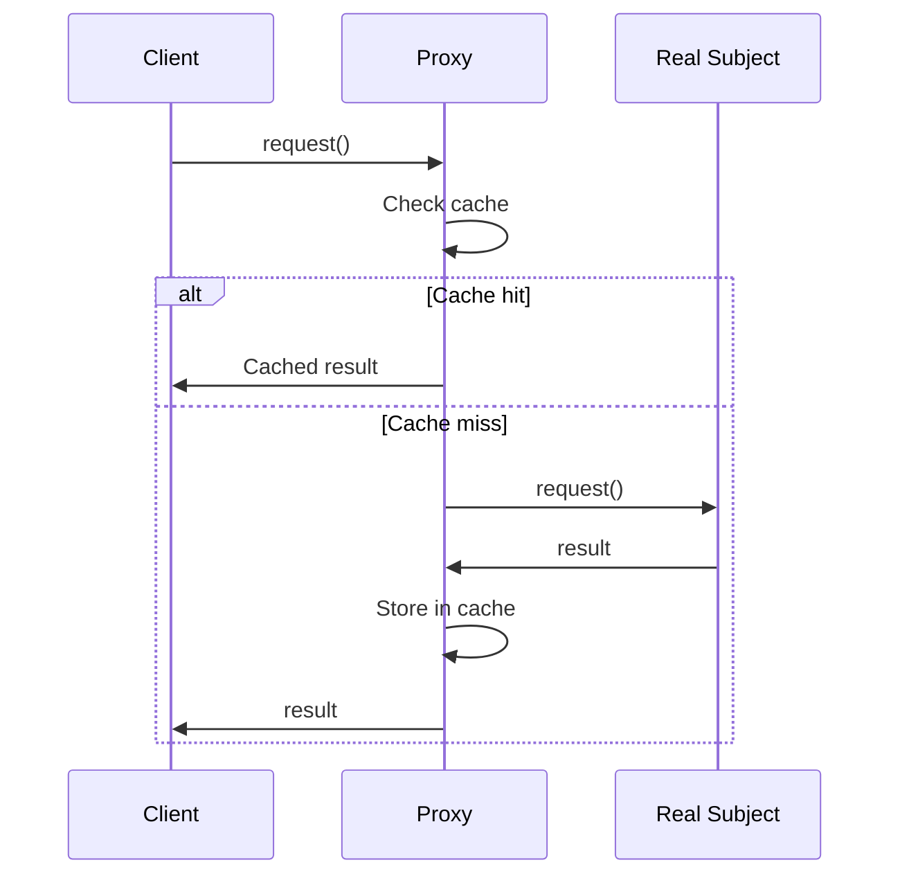

---

## 🎭 Behavioral Patterns

### **7. Observer Pattern (Pub/Sub)**

**Use Case:** Event handling, state management

**See:** [`examples/observer-pattern.ts`](examples/observer-pattern.ts)

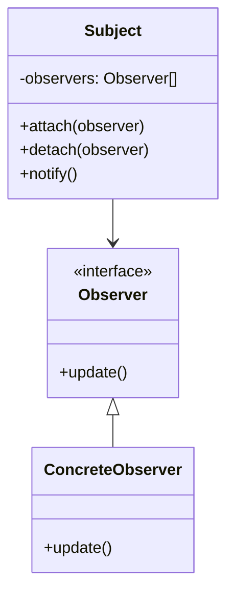

**Example:**
```typescript
// See: examples/observer-pattern.ts
class EventEmitter {
  private listeners = new Map()
  
  on(event: string, callback: Function) {
    if (!this.listeners.has(event)) {
      this.listeners.set(event, [])
    }
    this.listeners.get(event).push(callback)
  }
  
  emit(event: string, data: any) {
    this.listeners.get(event)?.forEach(cb => cb(data))
  }
}
```

---

### **8. Strategy Pattern**

**Use Case:** Interchangeable algorithms

**See:** [`examples/strategy-pattern.ts`](examples/strategy-pattern.ts)

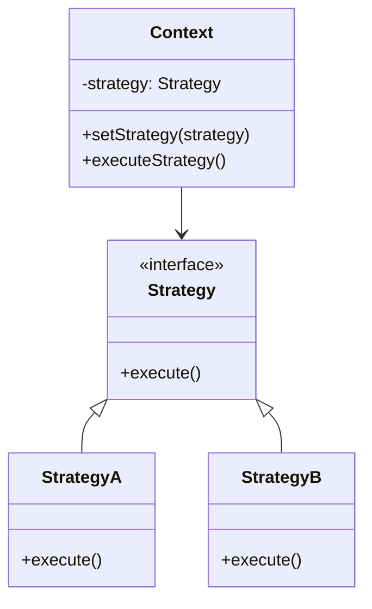

**Example:**
```typescript
// See: examples/strategy-pattern.ts
class PaymentProcessor {
  constructor(private strategy: PaymentStrategy) {}
  
  process(amount: number) {
    return this.strategy.process(amount)
  }
}
```

---

### **9. State Pattern**

**Use Case:** Object behavior changes with state

**See:** [`examples/state-pattern.ts`](examples/state-pattern.ts)

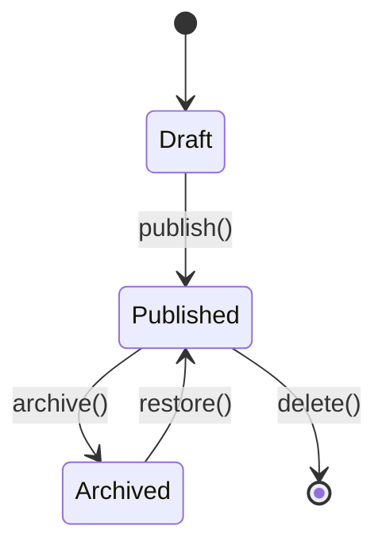

---

### **10. Command Pattern**

**Use Case:** Encapsulate requests, undo/redo

**See:** [`examples/command-pattern.ts`](examples/command-pattern.ts)

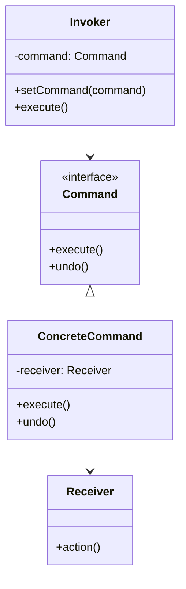

---

## ⚛️ React/Next.js Specific Patterns

### **11. Container/Presentational Pattern**

**See:** [`components/container-presentational-example.tsx`](components/container-presentational-example.tsx)

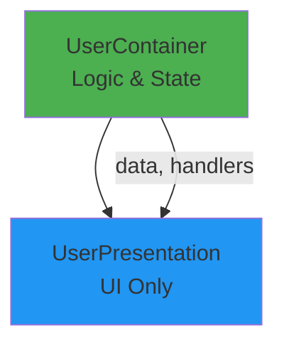

**Example:**
```typescript
// Container (Logic)
function UserContainer() {
  const [user, setUser] = useState()
  // ... logic
  
  return <UserPresentation user={user} />
}

// Presentational (UI)
function UserPresentation({ user }) {
  return <div>{user.name}</div>
}
```

---

### **12. Compound Components**

**See:** [`components/compound-components-example.tsx`](components/compound-components-example.tsx)

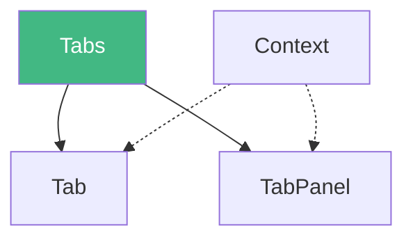

**Example:**
```typescript
// See: components/compound-components-example.tsx
<Tabs defaultValue="tab1">
  <Tab value="tab1">Tab 1</Tab>
  <Tab value="tab2">Tab 2</Tab>
  
  <TabPanel value="tab1">Content 1</TabPanel>
  <TabPanel value="tab2">Content 2</TabPanel>
</Tabs>
```

---

### **13. Render Props**

**See:** [`components/render-props-example.tsx`](components/render-props-example.tsx)

```typescript
// See: components/render-props-example.tsx
<DataFetcher
  url="/api/users"
  render={({ data, loading }) => (
    loading ? <Spinner /> : <UserList users={data} />
  )}
/>
```

---

### **14. Higher-Order Components (HOC)**

**See:** [`components/hoc-example.tsx`](components/hoc-example.tsx)

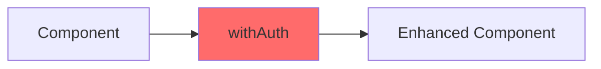

**Example:**
```typescript
// See: components/hoc-example.tsx
function withAuth(Component) {
  return function AuthenticatedComponent(props) {
    const { user } = useAuth()
    
    if (!user) return <Redirect to="/login" />
    
    return <Component {...props} user={user} />
  }
}
```

---

### **15. Custom Hooks Pattern**

**See:** [`lib/custom-hooks-example.ts`](lib/custom-hooks-example.ts)

```typescript
// See: lib/custom-hooks-example.ts
function useLocalStorage(key, initialValue) {
  const [value, setValue] = useState(() => {
    return localStorage.getItem(key) || initialValue
  })
  
  useEffect(() => {
    localStorage.setItem(key, value)
  }, [key, value])
  
  return [value, setValue]
}
```

---

## 🚫 Anti-Patterns to Avoid

### **1. Prop Drilling**

```typescript
// ❌ BAD - Passing props through many levels
<A data={data}>
  <B data={data}>
    <C data={data}>
      <D data={data} /> {/* Finally used here */}
    </C>
  </B>
</A>

// ✅ GOOD - Use Context or state management
const DataContext = createContext()

<DataContext.Provider value={data}>
  <A>
    <B>
      <C>
        <D /> {/* Uses useContext(DataContext) */}
      </C>
    </B>
  </A>
</DataContext.Provider>
```

---

### **2. Huge Components**

**See:** [`examples/component-splitting.tsx`](examples/component-splitting.tsx)

```typescript
// ❌ BAD - 500+ line component
function MassiveComponent() {
  // Too much logic, too many responsibilities
}

// ✅ GOOD - Split into smaller components
function UserDashboard() {
  return (
    <>
      <UserHeader />
      <UserStats />
      <UserActivity />
      <UserSettings />
    </>
  )
}
```

---

### **3. Premature Optimization**

```typescript
// ❌ BAD - Optimizing before measuring
useMemo(() => simple calculation, [])

// ✅ GOOD - Profile first, optimize what matters
// Only use useMemo/useCallback for expensive operations
```

---

## 🎯 Pattern Selection Guide

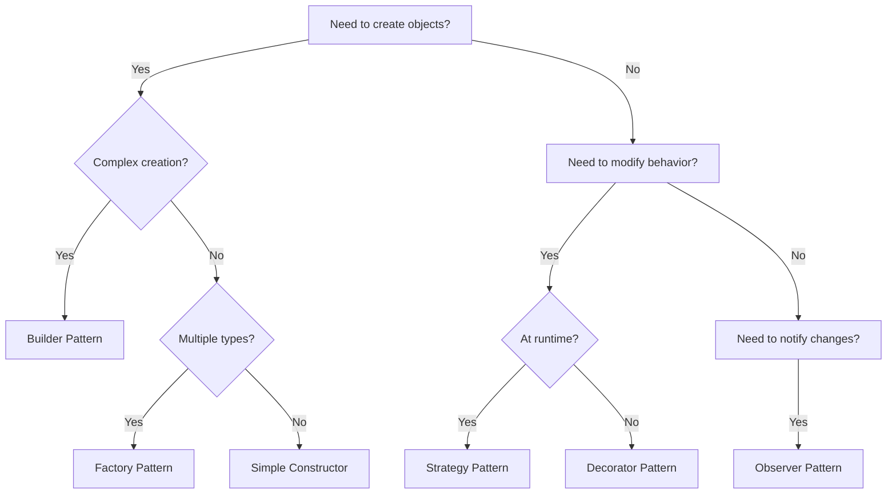

---

## ✅ Practice Exercises

1. **Implement Middleware Pattern**
   - See: [`examples/middleware-pattern.ts`](examples/middleware-pattern.ts)
   
2. **Create Custom Hook**
   - See: [`lib/use-pagination.ts`](lib/use-pagination.ts)
   
3. **Build Compound Component**
   - See: [`components/accordion-example.tsx`](components/accordion-example.tsx)

---

## 📚 Additional Resources

- **All Examples:** See [`examples/`](examples/) directory
- **Components:** See [`components/`](components/) directory
- **Hooks:** See [`lib/`](lib/) directory

---

**Tomorrow:** Performance Deep Dive! ⚡
