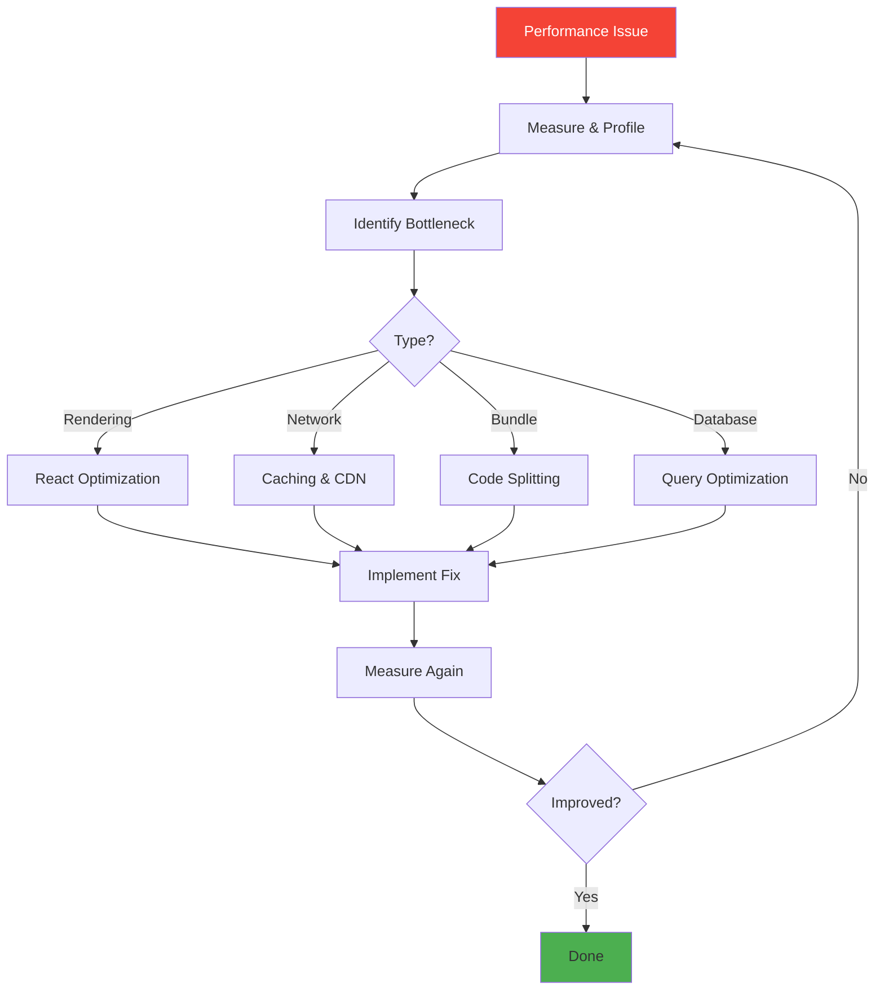
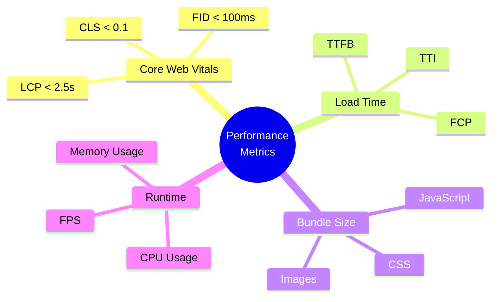
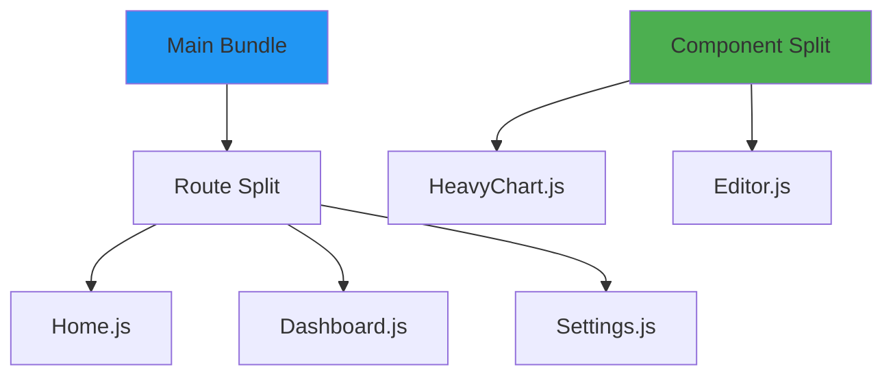
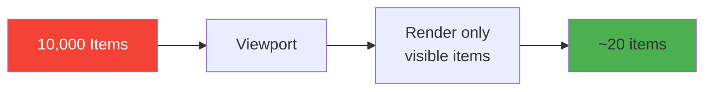
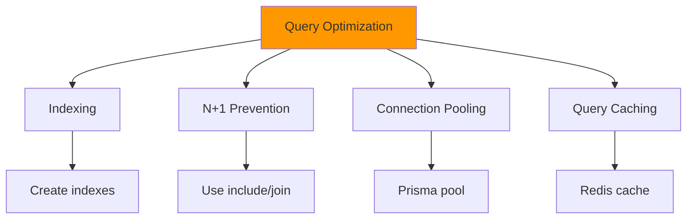
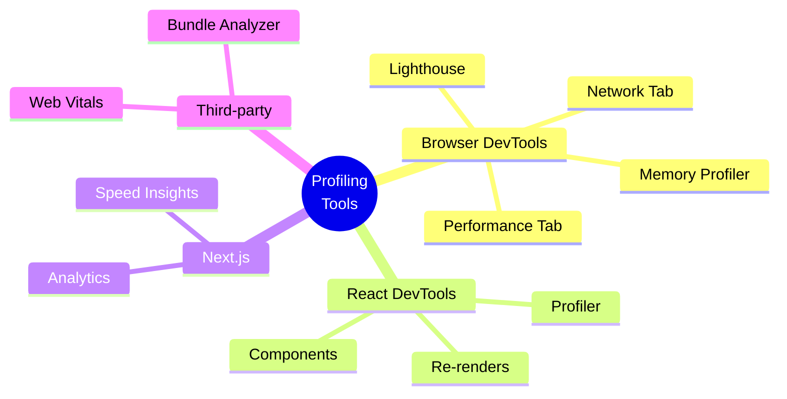
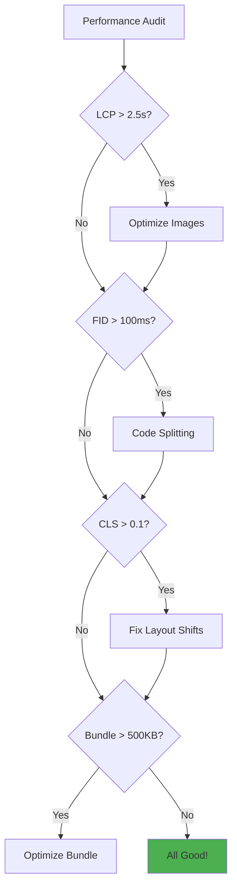

# Day 3 (Day 66): Performance Deep Dive ⚡

**Duration:** 4-6 hours | **Difficulty:** ⭐⭐⭐⭐ Advanced

---

## 📖 Learning Objectives

- Master performance optimization techniques
- Profile and measure performance
- Optimize React/Next.js applications
- Implement advanced caching strategies
- Handle performance bottlenecks

---

## 🎯 Performance Optimization Flow



---

## 📊 Performance Metrics



---

## ⚛️ React Performance Optimization

### **1. Memoization**

**See:** [`examples/memoization-examples.tsx`](examples/memoization-examples.tsx)

```typescript
// useMemo - Expensive calculations
const expensiveValue = useMemo(() => {
  return heavyComputation(data)
}, [data])

// useCallback - Function references
const handleClick = useCallback(() => {
  doSomething(id)
}, [id])

// React.memo - Component memoization
const MemoizedComponent = React.memo(ExpensiveComponent)
```

---

### **2. Code Splitting**

**See:** [`examples/code-splitting.tsx`](examples/code-splitting.tsx)



```typescript
// Dynamic imports
const HeavyChart = dynamic(() => import('./HeavyChart'), {
  loading: () => <Spinner />,
  ssr: false
})

// Conditional loading
const AdminPanel = dynamic(() => import('./AdminPanel'))

function Dashboard() {
  const { isAdmin } = useUser()
  
  return (
    <div>
      {isAdmin && <AdminPanel />}
    </div>
  )
}
```

---

### **3. Virtual Scrolling**

**See:** [`examples/virtual-scroll.tsx`](examples/virtual-scroll.tsx)



---

### **4. Debouncing & Throttling**

**See:** [`lib/performance-utils.ts`](lib/performance-utils.ts)

```typescript
// Debounce - Wait for pause
const debouncedSearch = useDe

bounce((query) => {
  search(query)
}, 500)

// Throttle - Limit frequency
const throttledScroll = useThrottle(() => {
  handleScroll()
}, 100)
```

---

## 🚀 Next.js Specific Optimizations

### **Image Optimization**

**See:** [`examples/image-optimization.tsx`](examples/image-optimization.tsx)

```typescript
import Image from 'next/image'

// Optimized with blur placeholder
<Image
  src="/hero.jpg"
  alt="Hero"
  width={1200}
  height={600}
  priority
  placeholder="blur"
  blurDataURL="data:image/jpeg;base64,..."
/>

// Responsive images
<Image
  src="/product.jpg"
  alt="Product"
  fill
  sizes="(max-width: 768px) 100vw,
         (max-width: 1200px) 50vw,
         33vw"
/>
```

---

### **Font Optimization**

```typescript
import { Inter, Roboto_Mono } from 'next/font/google'

const inter = Inter({
  subsets: ['latin'],
  display: 'swap',
  variable: '--font-inter',
})

export default function RootLayout({ children }) {
  return (
    <html lang="en" className={inter.variable}>
      <body>{children}</body>
    </html>
  )
}
```

---

## 🗄️ Database Optimization

**See:** [`examples/database-optimization.ts`](examples/database-optimization.ts)



```typescript
// ❌ BAD - N+1 query problem
const users = await db.user.findMany()
for (const user of users) {
  user.posts = await db.post.findMany({ where: { userId: user.id } })
}

// ✅ GOOD - Single query with include
const users = await db.user.findMany({
  include: { posts: true }
})

// ✅ BETTER - With pagination and select
const users = await db.user.findMany({
  take: 20,
  skip: page * 20,
  select: {
    id: true,
    name: true,
    posts: {
      select: { id: true, title: true },
      take: 5
    }
  }
})
```

---

## 📦 Bundle Optimization

**See:** [`examples/bundle-analysis.md`](examples/bundle-analysis.md)

```bash
# Analyze bundle
ANALYZE=true npm run build

# View bundle composition
npm run analyze
```

**Techniques:**

1. **Tree Shaking** - Remove unused code
2. **Code Splitting** - Lazy load routes/components
3. **Dynamic Imports** - Load on demand
4. **Remove Unused Dependencies**

---

## 🎯 Profiling Tools



---

## ⚡ Real-World Optimization Example

**See:** [`examples/optimization-case-study.tsx`](examples/optimization-case-study.tsx)

### **Before Optimization:**

```typescript
// ❌ Problems:
// - Re-renders on every prop change
// - Expensive calculation on every render
// - Large bundle size
// - No code splitting

function ProductList({ products, filters }) {
  const filtered = products.filter(p => {
    return expensiveFilter(p, filters) // Runs every render
  })
  
  return (
    <div>
      {filtered.map(product => (
        <ExpensiveProductCard key={product.id} product={product} />
      ))}
    </div>
  )
}
```

### **After Optimization:**

```typescript
// ✅ Optimized:
// - Memoized filtering
// - Memoized components
// - Virtual scrolling
// - Code splitting

const ProductList = React.memo(function ProductList({ products, filters }) {
  const filtered = useMemo(() => {
    return products.filter(p => expensiveFilter(p, filters))
  }, [products, filters])
  
  return (
    <VirtualList
      items={filtered}
      renderItem={(product) => (
        <MemoizedProductCard key={product.id} product={product} />
      )}
    />
  )
})

const MemoizedProductCard = React.memo(ProductCard)
```

---

## 📈 Performance Checklist



**Key Optimizations:**

- [ ] Enable caching (Redis, CDN)
- [ ] Optimize images (WebP, lazy load)
- [ ] Code splitting (routes, components)
- [ ] Database indexing
- [ ] Reduce bundle size
- [ ] Use React.memo wisely
- [ ] Implement virtual scrolling for long lists
- [ ] Debounce expensive operations
- [ ] Enable compression (gzip, brotli)
- [ ] Use Web Workers for heavy computation

---

## 🔧 Performance Monitoring

**See:** [`lib/performance-monitoring.ts`](lib/performance-monitoring.ts)

```typescript
// Track Core Web Vitals
import { getCLS, getFID, getFCP, getLCP, getTTFB } from 'web-vitals'

function sendToAnalytics(metric) {
  fetch('/api/analytics', {
    method: 'POST',
    body: JSON.stringify(metric)
  })
}

getCLS(sendToAnalytics)
getFID(sendToAnalytics)
getFCP(sendToAnalytics)
getLCP(sendToAnalytics)
getTTFB(sendToAnalytics)
```

---

## ✅ Practice Exercises

1. **Optimize Heavy List**
   - See: [`examples/list-optimization.tsx`](examples/list-optimization.tsx)

2. **Reduce Bundle Size**
   - See: [`examples/bundle-optimization.md`](examples/bundle-optimization.md)

3. **Database Query Optimization**
   - See: [`examples/query-optimization.ts`](examples/query-optimization.ts)

---

**Tomorrow:** Interview Preparation! 💼
