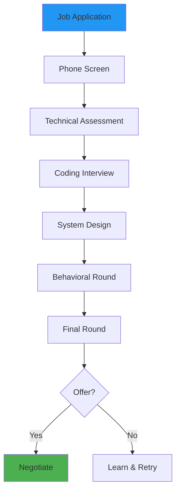
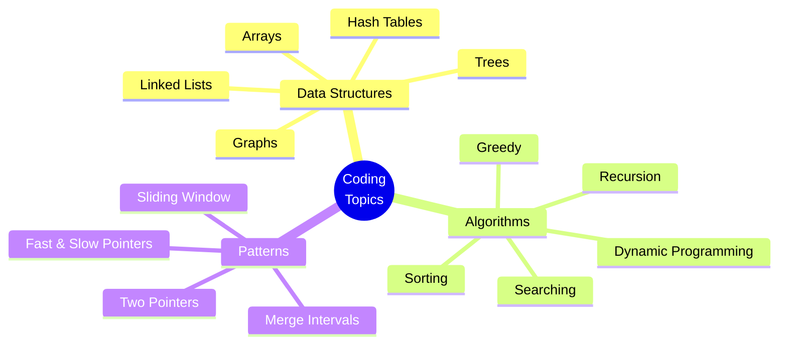
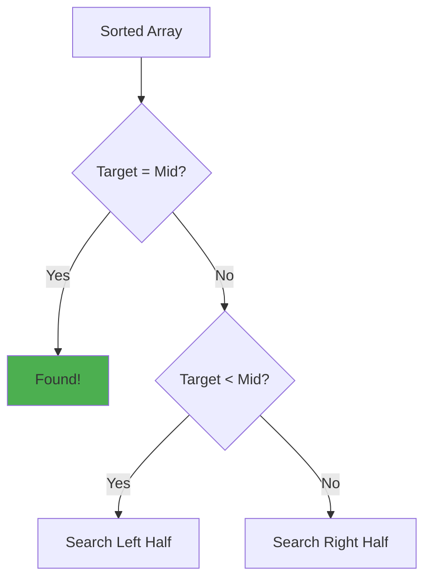
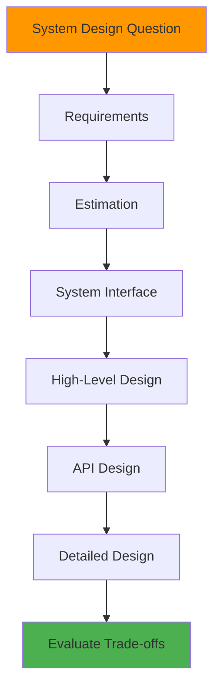
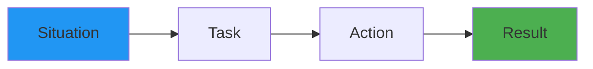
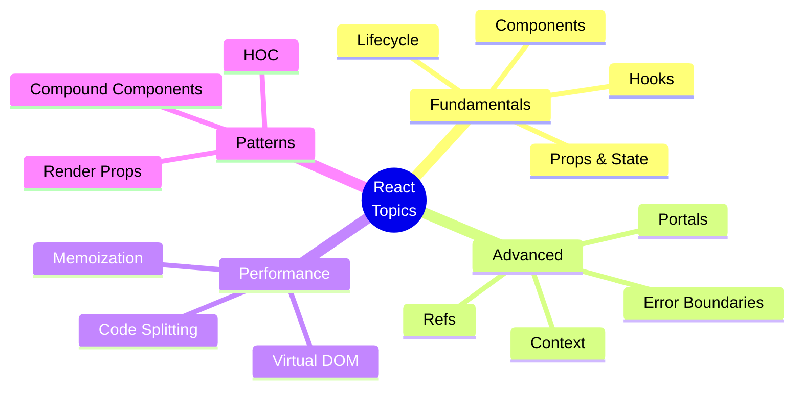
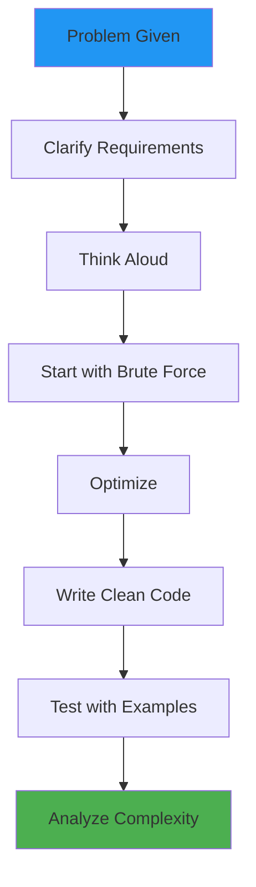

# Day 4 (Day 67): Interview Preparation 💼

**Duration:** 4-6 hours | **Difficulty:** ⭐⭐⭐⭐ Advanced

---

## 📖 Learning Objectives

- Master technical interview strategies
- Practice coding challenges
- Prepare for system design interviews
- Handle behavioral questions
- Build confidence for interviews

---

## 🎯 Interview Process Flow



---

## 💻 Coding Interview Preparation

### **Common Topics**



---

### **Problem-Solving Framework: UMPIRE**

1. **U**nderstand - Clarify the problem
2. **M**atch - Identify pattern
3. **P**lan - Design solution
4. **I**mplement - Write code
5. **R**eview - Test and optimize
6. **E**valuate - Time/space complexity

---

## 🧩 Common Coding Patterns

### **1. Two Pointers**

**See:** [`examples/two-pointers.ts`](examples/two-pointers.ts)

```typescript
// Example: Find pair that sums to target
function twoSum(arr: number[], target: number): number[] {
  let left = 0
  let right = arr.length - 1
  
  while (left < right) {
    const sum = arr[left] + arr[right]
    
    if (sum === target) {
      return [left, right]
    } else if (sum < target) {
      left++
    } else {
      right--
    }
  }
  
  return []
}
```

---

### **2. Sliding Window**

**See:** [`examples/sliding-window.ts`](examples/sliding-window.ts)

```typescript
// Example: Maximum sum of k consecutive elements
function maxSumSubarray(arr: number[], k: number): number {
  let maxSum = 0
  let windowSum = 0
  
  // Initial window
  for (let i = 0; i < k; i++) {
    windowSum += arr[i]
  }
  maxSum = windowSum
  
  // Slide window
  for (let i = k; i < arr.length; i++) {
    windowSum = windowSum - arr[i - k] + arr[i]
    maxSum = Math.max(maxSum, windowSum)
  }
  
  return maxSum
}
```

---

### **3. Binary Search**

**See:** [`examples/binary-search.ts`](examples/binary-search.ts)



---

### **4. Dynamic Programming**

**See:** [`examples/dynamic-programming.ts`](examples/dynamic-programming.ts)

```typescript
// Example: Fibonacci with memoization
function fibonacci(n: number, memo: Map<number, number> = new Map()): number {
  if (n <= 1) return n
  
  if (memo.has(n)) {
    return memo.get(n)!
  }
  
  const result = fibonacci(n - 1, memo) + fibonacci(n - 2, memo)
  memo.set(n, result)
  
  return result
}
```

---

## 🏗️ System Design Interview

### **Approach: RESHADED Framework**



**Key Areas:**

1. **Requirements** (Functional & Non-Functional)
2. **Estimation** (Users, Storage, Bandwidth)
3. **System Interface** (API endpoints)
4. **High-Level Design** (Architecture diagram)
5. **API Design** (Request/Response)
6. **Detailed Design** (Components, Database)
7. **Evaluate** (Bottlenecks, Trade-offs)

---

### **Common System Design Questions**

**See:** [`examples/`](examples/) directory for detailed solutions

1. **Design URL Shortener**
   - See: [`examples/url-shortener-interview.md`](examples/url-shortener-interview.md)

2. **Design Twitter**
   - See: [`examples/twitter-interview.md`](examples/twitter-interview.md)

3. **Design Instagram**
   - See: [`examples/instagram-interview.md`](examples/instagram-interview.md)

4. **Design Uber**
   - See: [`examples/uber-interview.md`](examples/uber-interview.md)

5. **Design Netflix**
   - See: [`examples/netflix-interview.md`](examples/netflix-interview.md)

---

## 🎭 Behavioral Interview

### **STAR Method**



**Common Questions:**

- Tell me about yourself
- Why do you want to work here?
- Describe a challenging project
- How do you handle conflict?
- What's your biggest weakness?

**See:** [`examples/behavioral-questions.md`](examples/behavioral-questions.md)

---

## 💬 React/Next.js Specific Questions

### **React Questions**



**Common Questions:**

1. What is Virtual DOM?
2. Explain React lifecycle
3. What are hooks?
4. Difference between useState and useRef?
5. How does Context work?
6. What is reconciliation?
7. When to use useMemo vs useCallback?

**See:** [`examples/react-interview-questions.md`](examples/react-interview-questions.md)

---

### **Next.js Questions**

1. Server Components vs Client Components?
2. How does App Router work?
3. What are Server Actions?
4. Explain caching in Next.js
5. ISR vs SSG vs SSR?
6. How to optimize images?
7. What is Middleware?

**See:** [`examples/nextjs-interview-questions.md`](examples/nextjs-interview-questions.md)

---

## 🔧 JavaScript/TypeScript Questions

**See:** [`examples/js-interview-questions.ts`](examples/js-interview-questions.ts)

```typescript
// Common topics:
// 1. Closures
// 2. Promises & async/await
// 3. Event loop
// 4. Prototypes
// 5. `this` keyword
// 6. ES6+ features
// 7. Type system (TypeScript)
```

---

## 🎯 Live Coding Tips



**Best Practices:**

1. ✅ Ask clarifying questions
2. ✅ Think out loud
3. ✅ Start with brute force
4. ✅ Optimize iteratively
5. ✅ Write clean, readable code
6. ✅ Test with edge cases
7. ✅ Discuss trade-offs
8. ✅ State time/space complexity

**Avoid:**

1. ❌ Jumping into code immediately
2. ❌ Silent coding
3. ❌ Getting stuck on perfection
4. ❌ Ignoring edge cases
5. ❌ Not testing solution

---

## 📝 Practice Resources

### **Coding Practice**

**See:** [`examples/coding-practice.md`](examples/coding-practice.md)

**Recommended Platforms:**

- LeetCode (most popular)
- HackerRank
- CodeSignal
- AlgoExpert

**Study Plan:**

- **Week 1-2:** Easy problems (Arrays, Strings)
- **Week 3-4:** Medium problems (Trees, Graphs)
- **Week 5-6:** Hard problems (DP, Advanced)
- **Week 7-8:** Mock interviews

---

### **System Design Practice**

**Recommended Resources:**

- Designing Data-Intensive Applications (Book)
- System Design Primer (GitHub)
- ByteByteGo (YouTube)
- Exponent (Mock interviews)

---

## 🎤 Mock Interview Checklist

**Before Interview:**

- [ ] Research company
- [ ] Review job description
- [ ] Prepare questions to ask
- [ ] Test equipment (camera, mic)
- [ ] Have paper and pen ready

**During Interview:**

- [ ] Take time to think
- [ ] Communicate clearly
- [ ] Ask questions
- [ ] Be honest about unknowns
- [ ] Show enthusiasm

**After Interview:**

- [ ] Send thank you email
- [ ] Reflect on performance
- [ ] Note questions asked
- [ ] Follow up appropriately

---

## 💡 Sample Interview Questions

### **Algorithm Questions**

**See implementation:** [`examples/interview-algorithms.ts`](examples/interview-algorithms.ts)

1. Reverse a linked list
2. Find cycle in linked list
3. Binary tree traversal
4. Longest substring without repeating characters
5. Merge k sorted lists
6. LRU Cache implementation
7. Word search in 2D grid

---

### **React/Next.js Questions**

**See detailed answers:** [`examples/react-nextjs-answers.md`](examples/react-nextjs-answers.md)

1. Build an autocomplete component
2. Implement infinite scroll
3. Create a debounced search
4. Build a modal with portal
5. Implement useLocalStorage hook
6. Create protected route component

---

## ✅ Interview Day Checklist

**Preparation:**

- [ ] Good night's sleep
- [ ] Professional setup
- [ ] Practice problems reviewed
- [ ] Questions for interviewer prepared
- [ ] Portfolio/projects ready to discuss

**During:**

- [ ] Arrive/join 5 minutes early
- [ ] Professional demeanor
- [ ] Clear communication
- [ ] Show problem-solving process
- [ ] Ask thoughtful questions

**After:**

- [ ] Send thank you email within 24 hours
- [ ] Reflect and take notes
- [ ] Follow up if no response in 1 week

---

**Tomorrow:** Best Practices & Code Quality! 📚
