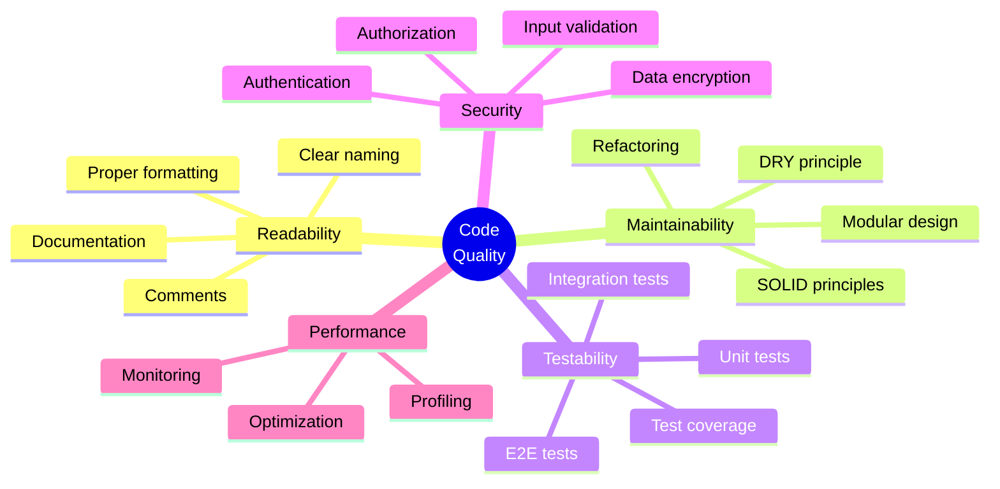
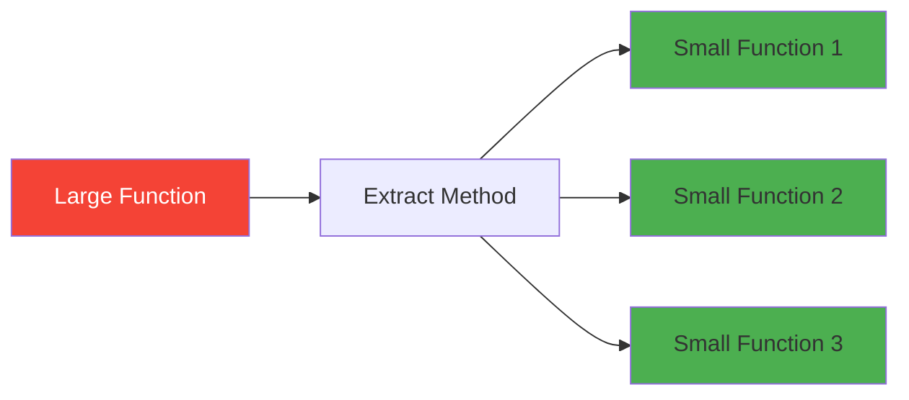
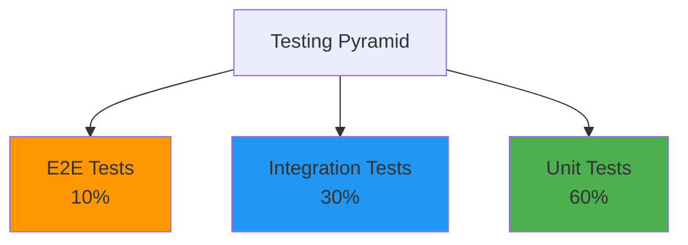
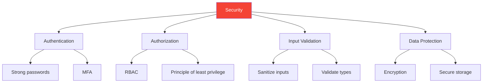
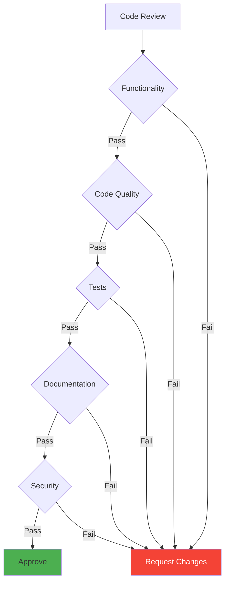
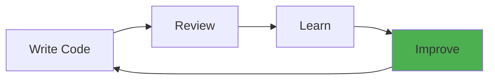

# Day 5 (Day 68): Best Practices & Code Quality 📚

**Duration:** 3-5 hours | **Difficulty:** ⭐⭐⭐ Intermediate

---

## 📖 Learning Objectives

- Master code quality principles
- Implement best practices
- Write maintainable code
- Set up proper tooling
- Establish team standards

---

## 🎯 Code Quality Pillars



---

## 📝 Clean Code Principles

### **1. Meaningful Names**

**See:** [`examples/naming-conventions.ts`](examples/naming-conventions.ts)

```typescript
// ❌ BAD - Unclear names
const d = new Date()
const x = users.filter(u => u.a)
function calc(a, b) { return a + b }

// ✅ GOOD - Clear, descriptive names
const currentDate = new Date()
const activeUsers = users.filter(user => user.isActive)
function calculateTotal(price, quantity) {
  return price * quantity
}
```

---

### **2. Functions Should Do One Thing**

```typescript
// ❌ BAD - Does too much
function processUser(user) {
  validateUser(user)
  saveToDatabase(user)
  sendEmail(user)
  logActivity(user)
  updateCache(user)
}

// ✅ GOOD - Single responsibility
function validateUser(user) { /* ... */ }
function saveUser(user) { /* ... */ }
function notifyUser(user) { /* ... */ }

async function processUser(user) {
  await validateUser(user)
  await saveUser(user)
  await notifyUser(user)
}
```

---

### **3. Keep Functions Small**



**Rule of Thumb:** If a function is more than 20-30 lines, consider splitting it.

---

## 🏗️ Project Structure Best Practices

**See:** [`examples/project-structure.md`](examples/project-structure.md)

```
src/
├── app/                  # Next.js pages
├── components/           # Reusable components
│   ├── ui/              # Base UI components
│   └── features/        # Feature-specific components
├── lib/                  # Utility functions
├── hooks/                # Custom hooks
├── types/                # TypeScript types
├── constants/            # Constants
├── config/               # Configuration
└── tests/                # Test files
```

---

## 🔧 Essential Tooling

### **1. ESLint Configuration**

**See:** [`examples/.eslintrc.json`](examples/.eslintrc.json)

```json
{
  "extends": [
    "next/core-web-vitals",
    "prettier"
  ],
  "rules": {
    "no-console": "warn",
    "no-unused-vars": "error",
    "prefer-const": "error"
  }
}
```

---

### **2. Prettier Configuration**

**See:** [`examples/.prettierrc`](examples/.prettierrc)

```json
{
  "semi": false,
  "singleQuote": true,
  "tabWidth": 2,
  "trailingComma": "es5",
  "printWidth": 100
}
```

---

### **3. TypeScript Configuration**

**See:** [`examples/tsconfig.json`](examples/tsconfig.json)

```json
{
  "compilerOptions": {
    "strict": true,
    "noUnusedLocals": true,
    "noUnusedParameters": true,
    "noImplicitReturns": true
  }
}
```

---

## 🧪 Testing Best Practices

**See:** [`examples/testing-examples/`](examples/testing-examples/)



### **Unit Testing**

```typescript
// user.test.ts
import { validateEmail } from './user'

describe('validateEmail', () => {
  it('should validate correct email', () => {
    expect(validateEmail('user@example.com')).toBe(true)
  })
  
  it('should reject invalid email', () => {
    expect(validateEmail('invalid')).toBe(false)
  })
})
```

---

### **Component Testing**

```typescript
// Button.test.tsx
import { render, screen, fireEvent } from '@testing-library/react'
import { Button } from './Button'

describe('Button', () => {
  it('should call onClick when clicked', () => {
    const handleClick = jest.fn()
    render(<Button onClick={handleClick}>Click me</Button>)
    
    fireEvent.click(screen.getByText('Click me'))
    
    expect(handleClick).toHaveBeenCalledTimes(1)
  })
})
```

---

## 📚 Documentation Standards

### **Code Comments**

```typescript
/**
 * Calculates the total price with tax
 * @param price - Base price
 * @param taxRate - Tax rate as decimal (e.g., 0.08 for 8%)
 * @returns Total price including tax
 * @example
 * calculatePriceWithTax(100, 0.08) // Returns 108
 */
function calculatePriceWithTax(price: number, taxRate: number): number {
  return price * (1 + taxRate)
}
```

---

### **README Standards**

**See:** [`examples/README-template.md`](examples/README-template.md)

Essential sections:

1. Project description
2. Installation
3. Usage examples
4. API documentation
5. Contributing guidelines
6. License

---

## 🔒 Security Best Practices

**See:** [`examples/security-checklist.md`](examples/security-checklist.md)



**Key Practices:**

- ✅ Never store secrets in code
- ✅ Use environment variables
- ✅ Validate all inputs
- ✅ Sanitize user data
- ✅ Use HTTPS
- ✅ Implement rate limiting
- ✅ Keep dependencies updated

---

## 📊 Code Review Checklist



**Review Points:**

- [ ] Code works as expected
- [ ] Follows style guide
- [ ] No unnecessary complexity
- [ ] Tests included
- [ ] Documentation updated
- [ ] No security issues
- [ ] Performance considered
- [ ] Error handling present

---

## 🎨 Component Best Practices

**See:** [`components/best-practices-examples.tsx`](components/best-practices-examples.tsx)

### **1. Props Interface**

```typescript
interface ButtonProps {
  children: React.ReactNode
  onClick: () => void
  variant?: 'primary' | 'secondary'
  disabled?: boolean
  className?: string
}

export function Button({
  children,
  onClick,
  variant = 'primary',
  disabled = false,
  className = ''
}: ButtonProps) {
  return (
    <button
      onClick={onClick}
      disabled={disabled}
      className={`btn btn-${variant} ${className}`}
    >
      {children}
    </button>
  )
}
```

---

### **2. Error Boundaries**

```typescript
// components/ErrorBoundary.tsx
class ErrorBoundary extends React.Component {
  state = { hasError: false }

  static getDerivedStateFromError(error) {
    return { hasError: true }
  }

  componentDidCatch(error, errorInfo) {
    console.error('Error:', error, errorInfo)
  }

  render() {
    if (this.state.hasError) {
      return <div>Something went wrong.</div>
    }

    return this.props.children
  }
}
```

---

### **3. Loading & Error States**

```typescript
function UserProfile({ userId }) {
  const { data, loading, error } = useUser(userId)

  if (loading) return <Spinner />
  if (error) return <ErrorMessage error={error} />
  if (!data) return <NotFound />

  return <UserCard user={data} />
}
```

---

## 🔄 Git Best Practices

**See:** [`examples/git-workflow.md`](examples/git-workflow.md)

### **Commit Messages**

```
type(scope): subject

body

footer
```

**Types:**

- `feat`: New feature
- `fix`: Bug fix
- `docs`: Documentation
- `style`: Formatting
- `refactor`: Code restructuring
- `test`: Adding tests
- `chore`: Maintenance

**Example:**

```
feat(auth): add Google OAuth login

Implemented Google OAuth authentication flow with NextAuth.js.
Users can now sign in with their Google account.

Closes #123
```

---

## ✅ Daily Code Quality Checklist

**Before Committing:**

- [ ] Code linted (ESLint)
- [ ] Code formatted (Prettier)
- [ ] Types checked (TypeScript)
- [ ] Tests passing
- [ ] No console.logs
- [ ] No commented code
- [ ] Meaningful commit message

**Before PR:**

- [ ] Branch up to date
- [ ] All tests passing
- [ ] Documentation updated
- [ ] Self-reviewed code
- [ ] Screenshots added (if UI change)

---

## 📈 Continuous Improvement



**Growth Practices:**

- 📚 Read code daily
- 💬 Participate in code reviews
- 🎓 Learn new patterns
- 🔧 Refactor regularly
- 📝 Document learnings
- 👥 Share knowledge

---

**Tomorrow:** Career Development! 🚀
