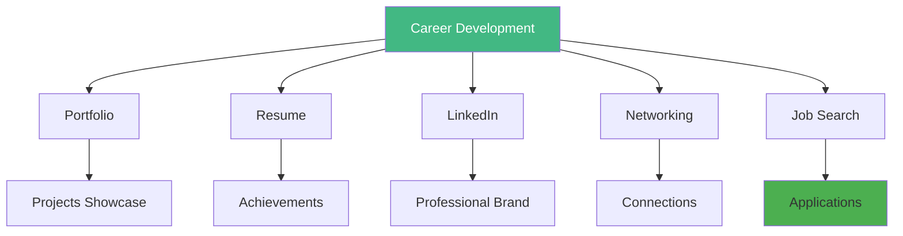
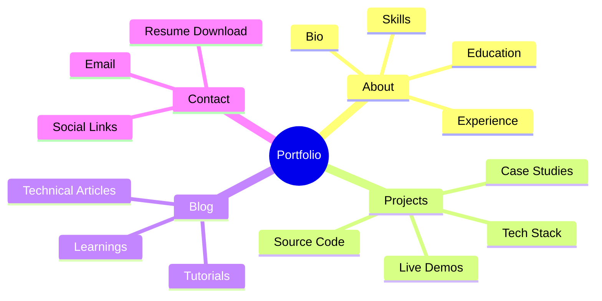
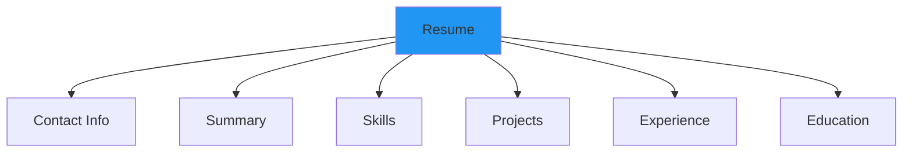
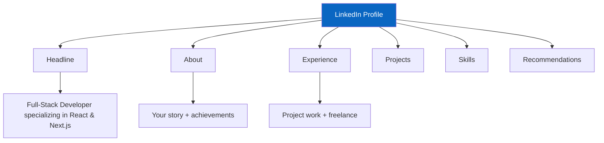
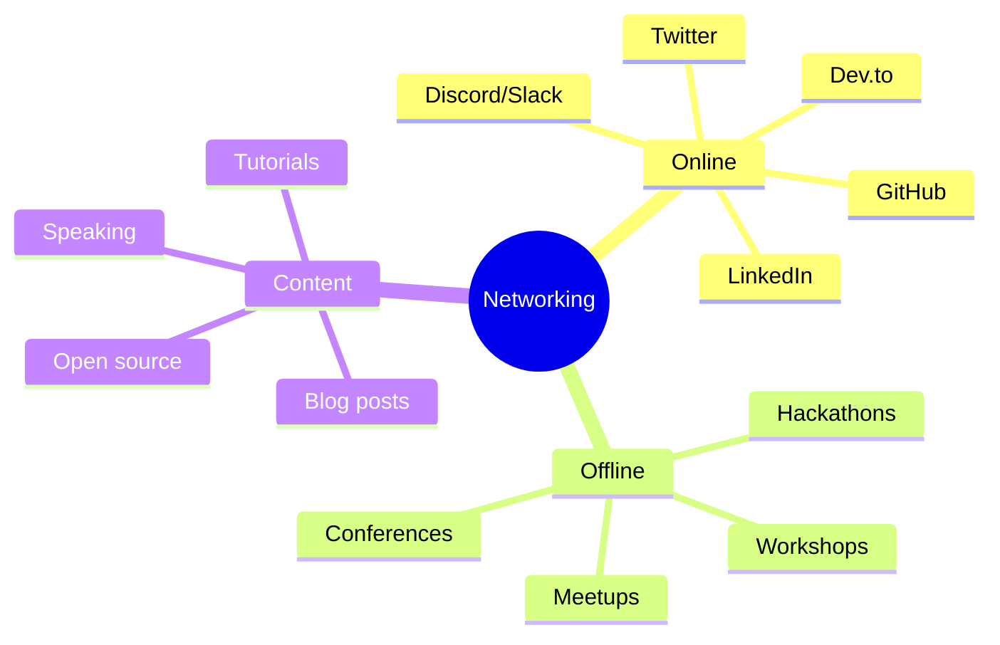
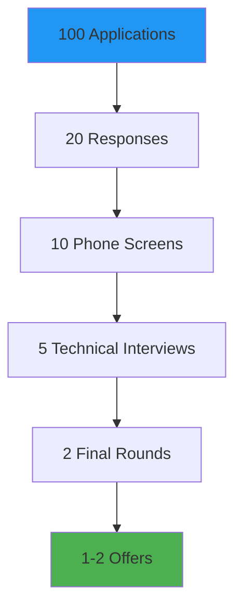
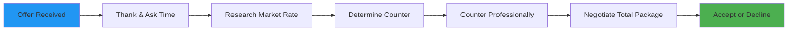
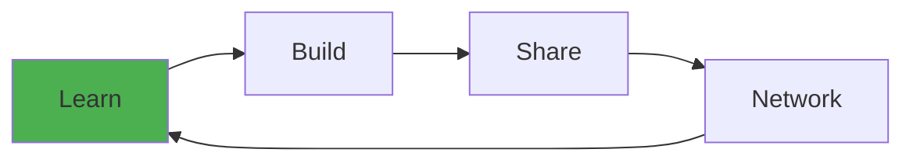

# Day 6 (Day 69): Career Development 🚀

**Duration:** 3-5 hours | **Difficulty:** ⭐⭐⭐ Intermediate

---

## 📖 Learning Objectives

- Build professional portfolio
- Create compelling resume
- Optimize LinkedIn profile
- Network effectively
- Prepare for job search

---

## 🎯 Career Development Roadmap



---

## 💼 Portfolio Development

### **Essential Components**



---

### **Project Showcase Strategy**

**See:** [`examples/portfolio-projects.md`](examples/portfolio-projects.md)

**Your 15 Projects:**

1. Todo App (Vue basics)
2. Blog System (Vue components)
3. E-commerce Store (Pinia + Router)
4. Task Manager (Advanced Vue)
5. Blog Platform (Next.js basics)
6. SaaS Dashboard (Full-stack Next.js)
7. Collaborative Editor (Real-time)
8. Enterprise SaaS (Production)
9. Social Media Platform
10. Real-Time Messaging
11. E-commerce with Stripe
12. AI-Powered App
13. Analytics Dashboard
14. Developer Portfolio
15. Open Source Contributions

**Highlight Format:**

```markdown
## [Project Name]
**Live Demo:** [URL]
**Source Code:** [GitHub URL]

**Description:** Brief project description (2-3 sentences)

**Tech Stack:** Next.js, TypeScript, Prisma, PostgreSQL, TailwindCSS

**Key Features:**
- Feature 1
- Feature 2
- Feature 3

**Challenges & Solutions:**
- Challenge faced and how you solved it
```

---

## 📄 Resume Best Practices

**See:** [`examples/resume-template.md`](examples/resume-template.md)

### **Resume Structure**



---

### **Skills Section**

```
**Technical Skills:**

Frontend:
- React, Next.js 14, Vue.js 3, TypeScript
- Tailwind CSS, Shadcn UI, Responsive Design
- React Query, Zustand, Pinia

Backend:
- Node.js, Next.js API Routes, Server Actions
- Prisma ORM, PostgreSQL, MongoDB
- RESTful APIs, GraphQL

Tools & Technologies:
- Git, GitHub, VS Code
- Vercel, Docker, CI/CD
- Jest, Playwright, Vitest

Specializations:
- Full-stack development
- Real-time applications (WebSockets)
- AI integration (OpenAI API, RAG)
- Payment systems (Stripe)
- Performance optimization
```

---

### **Project Descriptions (STAR Method)**

```
**E-commerce Platform with Stripe Integration**
- Situation: Needed real payment processing for portfolio
- Task: Implement secure checkout with real transactions
- Action: Integrated Stripe API, webhooks, order management
- Result: Successfully processed test payments, 100% webhook reliability

Tech: Next.js, Stripe, Prisma, PostgreSQL
[Live Demo] [GitHub]
```

---

## 💼 LinkedIn Optimization

**See:** [`examples/linkedin-guide.md`](examples/linkedin-guide.md)

### **Profile Sections**



---

### **Headline Template**

```
Full-Stack Developer | React, Next.js, TypeScript | Building Production-Ready Web Applications
```

---

### **About Section Template**

```
I'm a Full-Stack Developer specializing in building modern web applications with React, Next.js, and TypeScript.

🚀 What I Do:
- Build production-ready full-stack applications
- Implement real-time features with WebSockets
- Integrate AI capabilities with OpenAI API
- Optimize performance for Core Web Vitals
- Design scalable system architectures

💻 Technical Expertise:
Frontend: React, Next.js 14, Vue.js, TypeScript
Backend: Node.js, Prisma, PostgreSQL
Tools: Git, Docker, Vercel, GitHub Actions

📊 Achievements:
- Built 15+ production applications
- Completed 70-day intensive full-stack bootcamp
- Contributed to open source projects
- Mastered system design principles

🔗 Portfolio: [your-site.com]
📧 Email: [your-email]
```

---

## 🌐 Networking Strategies

**See:** [`examples/networking-guide.md`](examples/networking-guide.md)



---

### **Where to Network**

1. **LinkedIn**
   - Connect with developers
   - Engage with posts
   - Share your learnings
   - Join groups

2. **Twitter/X**
   - Follow tech leaders
   - Share progress
   - #100DaysOfCode
   - Build in public

3. **GitHub**
   - Contribute to open source
   - Star interesting projects
   - Follow developers
   - Showcase projects

4. **Dev.to**
   - Write technical articles
   - Share tutorials
   - Engage with community

5. **Discord/Slack Communities**
   - Join tech communities
   - Help others
   - Ask questions
   - Network

---

## 🎯 Job Search Strategy

**See:** [`examples/job-search-guide.md`](examples/job-search-guide.md)

### **Job Search Funnel**



**Success Rate:** ~1-2% from application to offer
**Strategy:** Apply broadly, follow up, stay organized

---

### **Where to Apply**

**Job Boards:**

- LinkedIn Jobs
- Indeed
- AngelList (Startups)
- We Work Remotely (Remote)
- Remote.co
- Stack Overflow Jobs

**Direct:**

- Company websites
- Referrals (best success rate)
- Networking
- Recruiters

**Freelance:**

- Upwork
- Toptal
- Freelancer
- Fiverr

---

### **Application Tracking**

**See:** [`examples/job-tracker-template.md`](examples/job-tracker-template.md)

| Company | Position | Applied | Status | Next Step |
|---------|----------|---------|--------|-----------|
| Company A | Frontend Dev | 2025-01-01 | Phone Screen | Prepare |
| Company B | Full-Stack | 2025-01-02 | Applied | Wait |
| Company C | React Dev | 2025-01-03 | Technical | Study |

---

## 💰 Salary Negotiation

**See:** [`examples/salary-negotiation.md`](examples/salary-negotiation.md)

### **Research First**

- **Levels.fyi** - Tech salary data
- **Glassdoor** - Company reviews + salaries
- **PayScale** - Salary comparisons
- **LinkedIn Salary** - Industry insights

### **Negotiation Framework**



**Tips:**

- Always negotiate
- Know your worth
- Consider total package (benefits, stock, bonus)
- Be professional
- Have a target range
- Don't be the first to mention numbers

---

## 📧 Email Templates

### **Application Follow-up**

**See:** [`examples/email-templates.md`](examples/email-templates.md)

```
Subject: Following up on [Position] application

Hi [Hiring Manager],

I applied for the [Position] role on [Date] and wanted to follow up on my application.

I'm very excited about the opportunity to work at [Company] because [specific reason].

My experience with [relevant skills] aligns well with the requirements, and I've built [relevant project] which demonstrates [relevant capability].

Would you be available for a brief call to discuss how I could contribute to your team?

Best regards,
[Your Name]
[LinkedIn] | [Portfolio] | [GitHub]
```

---

## 🎓 Continuous Learning



**Stay Current:**

- Follow tech blogs
- Read documentation
- Take courses
- Attend webinars
- Join communities
- Contribute to open source

---

## ✅ Career Development Checklist

**Portfolio:**

- [ ] Professional website deployed
- [ ] All 15 projects showcased
- [ ] Live demos working
- [ ] GitHub repos organized
- [ ] Blog with articles
- [ ] Contact form functional

**Resume:**

- [ ] ATS-friendly format
- [ ] Quantified achievements
- [ ] Keywords included
- [ ] Projects highlighted
- [ ] Reviewed by peers
- [ ] PDF version ready

**LinkedIn:**

- [ ] Professional photo
- [ ] Compelling headline
- [ ] Complete about section
- [ ] All projects added
- [ ] Skills endorsed
- [ ] Active engagement

**Job Search:**

- [ ] Target companies identified
- [ ] Applications sent
- [ ] Follow-ups scheduled
- [ ] Interview prep done
- [ ] Network expanding

---

**Tomorrow:** Final Capstone Project! 🎯
