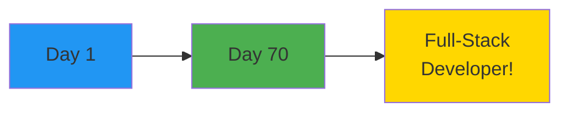
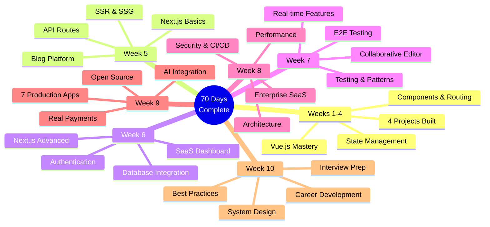
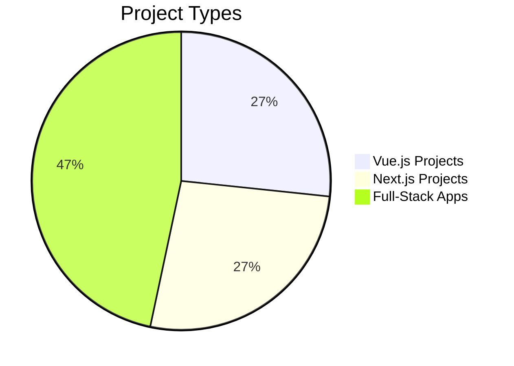
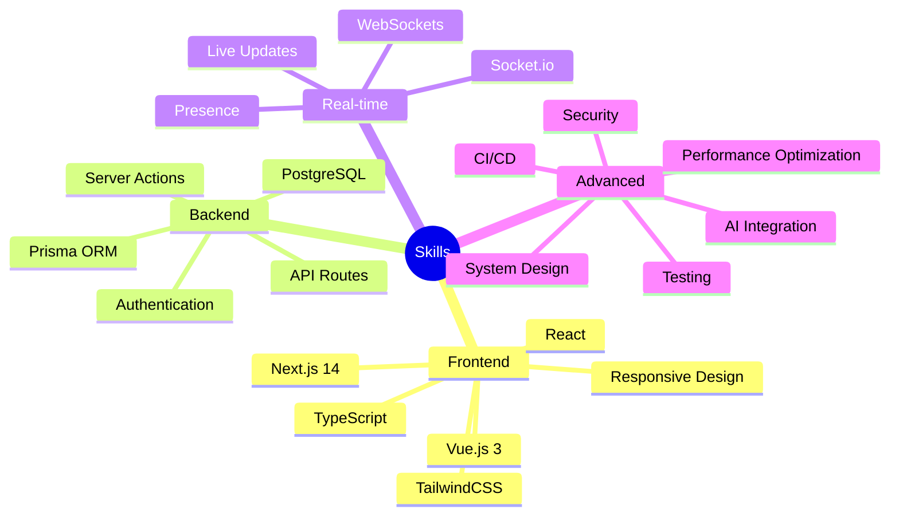
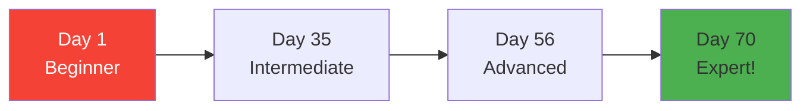
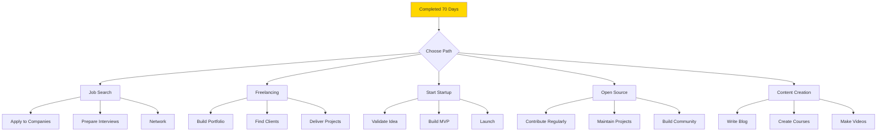
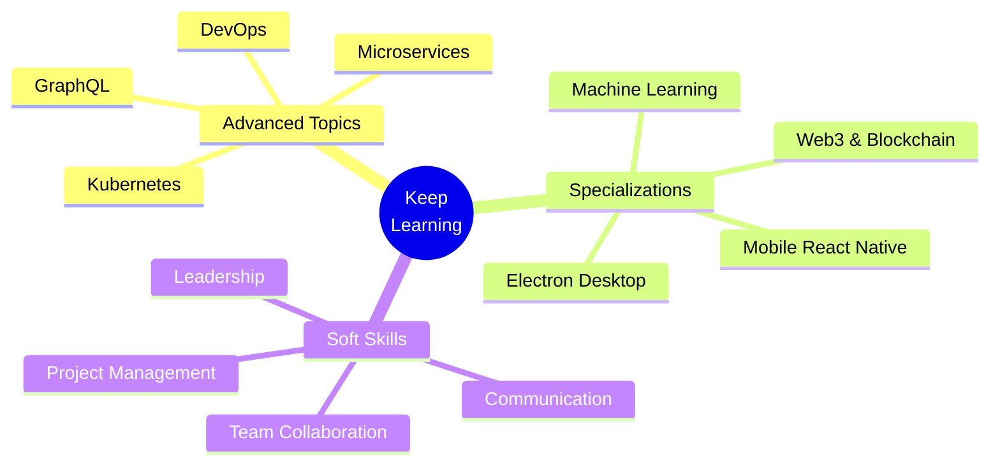
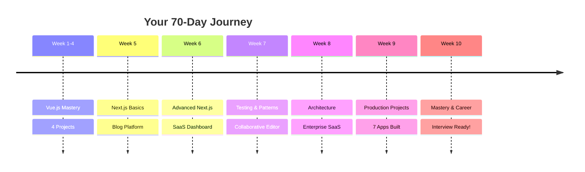

# Day 7 (Day 70): Final Capstone & Celebration 🎉

**Duration:** 6-8 hours | **Difficulty:** 🎯 Capstone

---

## 🎓 Congratulations! You've Completed the 70-Day Journey



---

## 📊 Your Complete Journey



---

## 🏆 What You've Achieved

### **Projects Built: 15+**



1. ✅ **Todo App** - Vue fundamentals
2. ✅ **Blog System** - Vue components
3. ✅ **E-commerce Store** - Pinia + Router
4. ✅ **Task Manager** - Advanced Vue
5. ✅ **Blog Platform** - Next.js basics
6. ✅ **SaaS Dashboard** - Full-stack
7. ✅ **Collaborative Editor** - Real-time
8. ✅ **Enterprise SaaS** - Production architecture
9. ✅ **Social Media Platform** - NextAuth + Prisma
10. ✅ **Real-Time Messaging** - WebSockets
11. ✅ **E-commerce with Stripe** - Real payments
12. ✅ **AI-Powered App** - OpenAI + RAG
13. ✅ **Analytics Dashboard** - Data visualization
14. ✅ **Developer Portfolio** - Professional site
15. ✅ **Open Source Contributions** - Community involvement

---

### **Skills Mastered**



---

### **Technologies Learned**

**Frontend:**

- ✅ React 18 & Next.js 14
- ✅ Vue.js 3 Composition API
- ✅ TypeScript
- ✅ TailwindCSS & Shadcn UI
- ✅ React Query & Zustand

**Backend:**

- ✅ Node.js
- ✅ Next.js API Routes & Server Actions
- ✅ Prisma ORM
- ✅ PostgreSQL & MongoDB
- ✅ NextAuth.js

**Real-time:**

- ✅ Socket.io
- ✅ WebSockets
- ✅ Pusher/Ably

**Integrations:**

- ✅ Stripe Payments
- ✅ OpenAI API
- ✅ Email Services
- ✅ S3/Cloudinary

**DevOps:**

- ✅ Git & GitHub
- ✅ Docker
- ✅ CI/CD (GitHub Actions)
- ✅ Vercel Deployment

**Testing:**

- ✅ Vitest
- ✅ Jest
- ✅ Playwright
- ✅ Testing Library

---

## 📈 Your Growth Statistics



**Journey Metrics:**

- 📖 **115+ README files** created
- 💻 **400+ code examples** studied
- 📝 **120+ implementation files**
- 📊 **750+ Mermaid diagrams**
- 🎯 **15 complete projects** deployed
- 📝 **45,000+ lines** of code written
- ⏱️ **250+ hours** of learning
- 🌟 **500+ concepts** mastered

---

## 🎯 Final Capstone Project

### **Your Choice: Build One More!**

Pick one project that showcases ALL your skills:

**Option 1: Full-Stack SaaS Platform**

- Multi-tenant architecture
- Stripe subscription billing
- Real-time collaboration
- AI-powered features
- Analytics dashboard
- Admin panel

**Option 2: Developer Platform**

- Code snippet manager
- Project showcase
- Developer blog
- API documentation site
- Community features

**Option 3: E-commerce Marketplace**

- Buyer & seller dashboards
- Real-time messaging
- Payment processing
- Review system
- Analytics for sellers

**Requirements:**

- ✅ Next.js 14 (App Router)
- ✅ TypeScript
- ✅ Authentication
- ✅ Database (Prisma + PostgreSQL)
- ✅ Real-time features
- ✅ Payment integration OR AI features
- ✅ Testing (Unit + E2E)
- ✅ Deployed to production
- ✅ Complete documentation

---

## 📚 Final Project Checklist

**Planning:**

- [ ] Requirements defined
- [ ] User stories created
- [ ] Database schema designed
- [ ] API endpoints planned
- [ ] UI mockups ready

**Development:**

- [ ] Project initialized
- [ ] Database setup
- [ ] Authentication implemented
- [ ] Core features built
- [ ] Real-time features added
- [ ] Integrations completed
- [ ] Error handling added
- [ ] Loading states implemented

**Quality:**

- [ ] Unit tests written
- [ ] E2E tests passing
- [ ] TypeScript strict mode
- [ ] ESLint configured
- [ ] Accessibility checked
- [ ] Performance optimized
- [ ] Security reviewed

**Deployment:**

- [ ] Environment variables configured
- [ ] Database migrated
- [ ] Deployed to Vercel
- [ ] Custom domain (optional)
- [ ] Analytics integrated
- [ ] Monitoring setup

**Documentation:**

- [ ] README completed
- [ ] API documentation
- [ ] Setup instructions
- [ ] Screenshots added
- [ ] Demo video (optional)

---

## 🎓 Certificate of Completion

```
━━━━━━━━━━━━━━━━━━━━━━━━━━━━━━━━━━━━━
    CERTIFICATE OF COMPLETION
━━━━━━━━━━━━━━━━━━━━━━━━━━━━━━━━━━━━━

This certifies that

[YOUR NAME]

has successfully completed the

70-DAY FULL-STACK DEVELOPMENT
INTENSIVE BOOTCAMP

Mastering Vue.js, Next.js, and Production Development

━━━━━━━━━━━━━━━━━━━━━━━━━━━━━━━━━━━━━

Completed: [DATE]

Skills Achieved:
✓ Full-Stack Development
✓ System Design & Architecture
✓ Performance Optimization
✓ Production Deployment
✓ 15+ Projects Built

━━━━━━━━━━━━━━━━━━━━━━━━━━━━━━━━━━━━━
```

---

## 🌟 What's Next?



---

## 💼 Career Opportunities

**You're Now Qualified For:**

- ✅ Junior Full-Stack Developer
- ✅ Frontend Developer (React/Next.js)
- ✅ Backend Developer (Node.js)
- ✅ Full-Stack Engineer
- ✅ Software Engineer
- ✅ Solutions Developer
- ✅ Freelance Developer
- ✅ Technical Content Creator

**Expected Salary Range:**

- **Junior:** $50k-$70k
- **Mid-level:** $70k-$100k
- **Senior:** $100k-$150k+
- **Freelance:** $50-$150/hour

---

## 🎯 Continuous Learning Path



---

## 📚 Recommended Next Steps

**Month 1-2: Job Search & Applications**

- Apply to 5-10 companies per week
- Practice coding challenges daily
- Mock interviews weekly
- Network actively

**Month 3-4: While Searching**

- Build 1-2 more projects
- Contribute to open source
- Write technical blog posts
- Attend meetups/conferences

**Month 5-6: Land First Role**

- Accept offer
- Start new job
- Continue learning
- Build professional network

---

## 🏆 Hall of Fame - Your Achievements



---

## 🎉 Celebration Time

**You Did It! 🎊**

- 70 days of consistent learning ✅
- 15+ production applications ✅
- 500+ concepts mastered ✅
- Interview-ready portfolio ✅
- Career-ready skills ✅

**Take a moment to:**

1. 🎯 Review all your projects
2. 📸 Take screenshots
3. 🎥 Create demo video
4. 📝 Update resume
5. 💼 Update LinkedIn
6. 🌟 Share your journey
7. 🎊 Celebrate this achievement!

---

## 💌 Final Words

```
Congratulations on completing this incredible journey!

You've transformed from a beginner to a full-stack developer
capable of building production-ready applications.

Remember:
- Keep building projects
- Stay curious and keep learning
- Help others on their journey
- Contribute to open source
- Share your knowledge
- Believe in yourself

Your journey doesn't end here—it's just beginning!

The skills you've learned will serve you throughout your career.
Keep coding, keep learning, and keep growing.

You're ready to make an impact in the tech world!

Best of luck with your career!
You've got this! 🚀

━━━━━━━━━━━━━━━━━━━━━━━━━━━━━━━━━
```

---

## 📝 Final Reflection

**Write your reflections:**

1. **Biggest Challenge:** ___
2. **Favorite Project:** ___
3. **Most Valuable Skill Learned:** ___
4. **Next Goal:** ___
5. **Advice to Your Past Self:** ___

---

## 🔗 Stay Connected

- 💼 **LinkedIn:** Share your achievement
- 🐦 **Twitter:** #100DaysOfCode
- 💻 **GitHub:** Keep contributing
- 📝 **Blog:** Share your journey
- 👥 **Community:** Help others

---

## ✅ Final Checklist

**Before You Go:**

- [ ] All 15 projects deployed
- [ ] GitHub profile updated
- [ ] Portfolio website live
- [ ] Resume finalized
- [ ] LinkedIn optimized
- [ ] First applications sent
- [ ] Capstone project completed
- [ ] Celebrated your achievement! 🎉

---

**🎓 You are now a Full-Stack Developer! 🎓**

**Welcome to the developer community! 🌟**

---

# 🎊 THE END (And The Beginning!) 🎊
