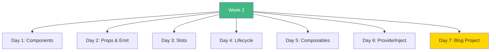
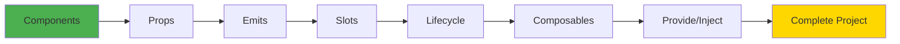
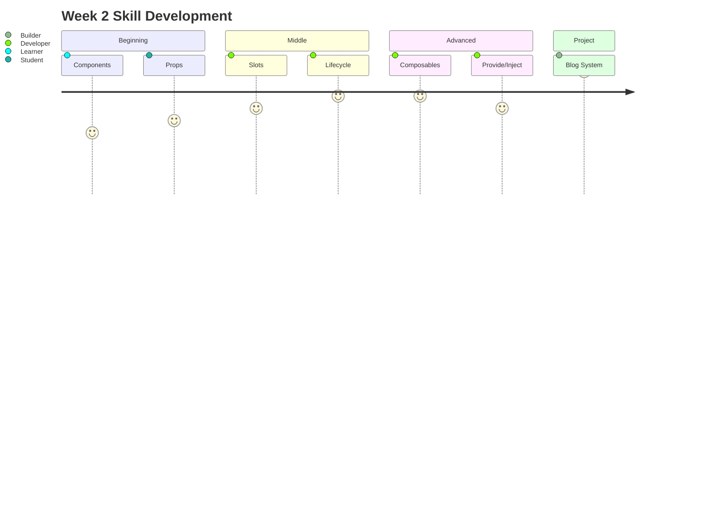

# Week 2: Components & Composition API - Index 📑

**Your complete Week 2 learning guide**

---

## 🗂️ Week Structure

---

## 📅 Daily Breakdown

### **Day 1 (Day 8): Components Basics** ⭐⭐
- 📖 [`day1/README.md`](day1/README.md)
- 💻 `UserCard.vue` - Complete user card
- 💻 `Counter.vue` - Counter component
- 💻 `Alert.vue` - Alert component
- 💻 `ComponentExample.vue` - All examples

**Topics:** SFC structure, registration, naming, best practices

---

### **Day 2 (Day 9): Props & Emit** ⭐⭐⭐
- 📖 [`day2/README.md`](day2/README.md)
- 💻 `PropsExample.vue` - Props patterns
- 💻 `EmitExample.vue` - Events demo
- 💻 `Counter.vue` - Smart counter with props/emits

**Topics:** Props types, validation, emits, v-model, one-way data flow

---

### **Day 3 (Day 10): Slots** ⭐⭐⭐
- 📖 [`day3/README.md`](day3/README.md)
- 💻 `Card.vue` - Default slot
- 💻 `Layout.vue` - Named slots
- 💻 `ProductList.vue` - Scoped slots
- 💻 `Modal.vue` - Complex slot usage

**Topics:** Default, named, scoped slots, content distribution

---

### **Day 4 (Day 11): Lifecycle Hooks** ⭐⭐⭐
- 📖 [`day4/README.md`](day4/README.md)
- 💻 `LifecycleExample.vue` - Lifecycle demo
- 💻 `Timer.vue` - Timer with lifecycle
- 💻 `Counter.vue` - Counter with hooks

**Topics:** onMounted, onUpdated, onUnmounted, cleanup

---

### **Day 5 (Day 12): Composables** ⭐⭐⭐
- 📖 [`day5/README.md`](day5/README.md)
- 📝 `useCounter.ts` - Counter composable
- 📝 `useFetch.ts` - Fetch composable
- 📝 `useLocalStorage.ts` - Storage composable
- 📝 `useToggle.ts` - Toggle composable
- 📝 `useMouse.ts` - Mouse tracker
- 💻 `ComposableExamples.vue` - Usage examples

**Topics:** Composable pattern, code reuse, custom hooks

---

### **Day 6 (Day 13): Provide/Inject** ⭐⭐
- 📖 [`day6/README.md`](day6/README.md)
- 📝 `keys.ts` - Injection keys
- 💻 `ProvideInjectExample.vue` - Main demo
- 💻 `ChildComponent.vue` - Child usage
- 💻 `GrandchildComponent.vue` - Deep injection

**Topics:** Dependency injection, provide, inject, type safety

---

### **Day 7 (Day 14): Blog Project** 🎯
- 📖 [`day7/README.md`](day7/README.md)
- Project specification
- Architecture diagram
- Implementation guide

**Build:** Complete blog system with all Week 2 concepts

---

## 📊 Concept Dependencies

---

## 🎯 Learning Checklist

**Components:**
- [ ] Day 1 Complete
- [ ] Create SFC
- [ ] Understand component anatomy
- [ ] Local vs global registration

**Communication:**
- [ ] Day 2 Complete
- [ ] Pass props
- [ ] Emit events
- [ ] Custom v-model

**Slots:**
- [ ] Day 3 Complete
- [ ] Default slots
- [ ] Named slots
- [ ] Scoped slots

**Lifecycle:**
- [ ] Day 4 Complete
- [ ] onMounted usage
- [ ] Cleanup patterns
- [ ] All lifecycle hooks

**Composables:**
- [ ] Day 5 Complete
- [ ] Create composable
- [ ] Extract logic
- [ ] Reuse across components

**Provide/Inject:**
- [ ] Day 6 Complete
- [ ] provide() data
- [ ] inject() in descendants
- [ ] Type-safe keys

**Project:**
- [ ] Day 7 Complete
- [ ] Blog system built
- [ ] All concepts used
- [ ] Working application

---

## 💻 Code Statistics

**Week 2 Totals:**
- 📖 **7 README files**
- 💻 **25+ Vue components**
- 📝 **6 composable functions**
- 📊 **60+ Mermaid diagrams**
- 🎯 **1 complete project**

---

## 🚀 Quick Navigation

| Day | Topic | Difficulty | Files |
|-----|-------|------------|-------|
| 1 | Components | ⭐⭐ | 5 files |
| 2 | Props & Emit | ⭐⭐⭐ | 4 files |
| 3 | Slots | ⭐⭐⭐ | 6 files |
| 4 | Lifecycle | ⭐⭐⭐ | 4 files |
| 5 | Composables | ⭐⭐⭐ | 7 files |
| 6 | Provide/Inject | ⭐⭐ | 5 files |
| 7 | Project | 🎯 | Spec |

---

## 📈 Skill Progression

---

## 💡 Key Takeaways

> **"Components are the building blocks. Props flow down, events flow up."**

> **"Slots provide flexibility. Composables enable reuse."**

> **"Lifecycle hooks let you control timing. Provide/Inject avoids prop drilling."**

---

**Continue to:** [`WEEK2_SUMMARY.md`](WEEK2_SUMMARY.md)

**Next Week:** [`../week3/README.md`](../week3/README.md)

**Happy Component Building!** 🚀
