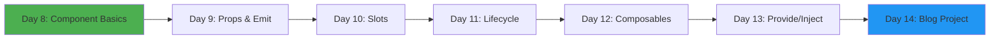
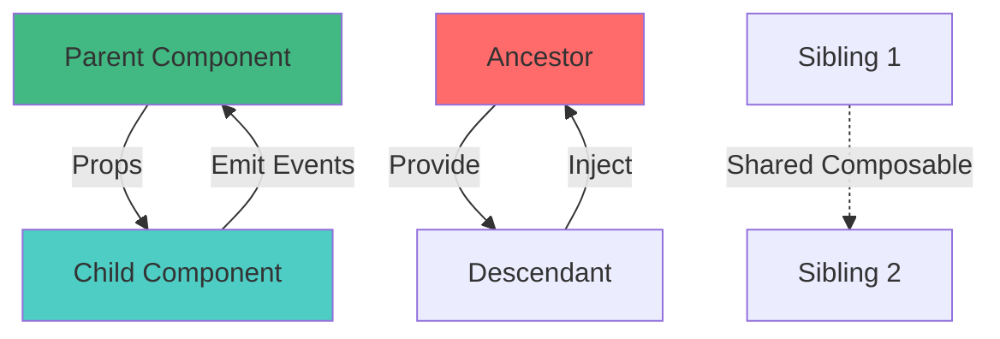
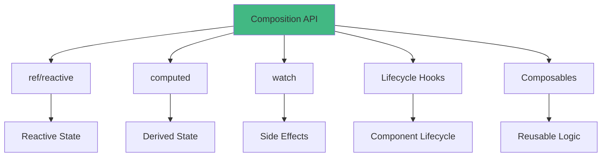

# Week 2: Composition API & Components 🧩

**Focus:** Building reusable components and mastering Vue's Composition API

---

## 📊 Weekly Flow

---

## 📚 Daily Topics

| Day | Topic | Key Concepts | Difficulty |
|-----|-------|--------------|------------|
| **Day 8** | Component Basics | SFC, registration, naming conventions | ⭐⭐ |
| **Day 9** | Props & Emit | Parent-child communication, validation | ⭐⭐ |
| **Day 10** | Slots | Default, named, scoped slots | ⭐⭐⭐ |
| **Day 11** | Lifecycle Hooks | onMounted, onUpdated, onUnmounted | ⭐⭐ |
| **Day 12** | Composables | Reusable logic, use* pattern | ⭐⭐⭐ |
| **Day 13** | Provide/Inject | Dependency injection | ⭐⭐⭐ |
| **Day 14** | **Mini Project** | Blog component system | ⭐⭐⭐ |

---

## 🎯 Component Communication

---

## 🔧 Composition API Patterns

---

## 📂 Week Project: Blog System

Build a blog with:

- `PostList` component (list of posts)
- `PostCard` component (individual post preview)
- `PostDetail` component (full post view)
- `CommentSection` component (nested comments)
- Reusable composables (`useFetch`, `useLocalStorage`)

---

**Start with Day 8!** 🚀
