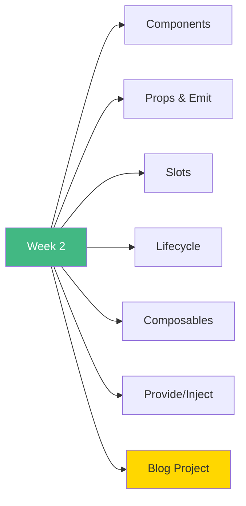

# 🚀 Week 2: Start Here!

**Welcome to Week 2 - Components & Composition API!**

---

## 📚 What You'll Learn This Week

---

## 📅 7-Day Plan

| Day | Topic | Time | Difficulty |
|-----|-------|------|------------|
| **Day 1** | Components Basics | 3-4h | ⭐⭐ |
| **Day 2** | Props & Emit | 3-4h | ⭐⭐⭐ |
| **Day 3** | Slots | 3-4h | ⭐⭐⭐ |
| **Day 4** | Lifecycle Hooks | 3-4h | ⭐⭐⭐ |
| **Day 5** | Composables | 3-4h | ⭐⭐⭐ |
| **Day 6** | Provide/Inject | 2-3h | ⭐⭐ |
| **Day 7** | Blog Project | 4-6h | 🎯 |

**Total:** 22-28 hours

---

## 🎯 Your Learning Path

### **Start Here:**
1. Read [`INDEX.md`](INDEX.md) - Complete navigation
2. Begin with [`day1/README.md`](day1/README.md)
3. Work through each day sequentially
4. Complete the Blog Project on Day 7

---

## 📦 What's Included

### **Each Day Contains:**
- 📖 Comprehensive README with theory
- 💻 Working Vue component examples
- 📊 Multiple Mermaid diagrams
- ✅ Practice exercises
- 🔗 Clear learning objectives

### **Week 2 Files:**
- 7 daily lesson READMEs
- 25+ Vue component examples
- 6 reusable composables
- 1 complete project specification
- 60+ Mermaid diagrams

---

## 🎓 Learning Outcomes

By the end of Week 2, you will:

✅ Build reusable components  
✅ Master parent-child communication  
✅ Create flexible components with slots  
✅ Manage component lifecycle  
✅ Extract logic into composables  
✅ Use dependency injection  
✅ Build complete applications  

---

## 🚦 Prerequisites

Before starting Week 2, ensure you've completed:
- ✅ Week 1: Vue.js Fundamentals
- ✅ Understand reactive data (ref, reactive)
- ✅ Comfortable with template syntax
- ✅ Know directives (v-if, v-for, v-model)

---

## 📖 Recommended Study Pattern

### **Daily Routine:**
1. **Morning (1h):** Read the day's README
2. **Afternoon (2-3h):** Study and run examples
3. **Evening (1h):** Complete practice exercises

### **Weekly Goals:**
- Days 1-3: Foundation (Components, Props, Slots)
- Days 4-5: Advanced (Lifecycle, Composables)
- Day 6: Patterns (Provide/Inject)
- Day 7: Integration (Blog Project)

---

## 🎨 Visual Learning

Every lesson includes Mermaid diagrams for:
- Component architecture
- Data flow patterns
- Lifecycle sequences
- Communication patterns
- Decision trees

**Perfect for visual learners!**

---

## 💡 Pro Tips

> 💡 **Tip 1:** Components should be small and focused
>
> 💡 **Tip 2:** Props down, events up (one-way data flow)
>
> 💡 **Tip 3:** Use slots for flexible content
>
> 💡 **Tip 4:** Extract reusable logic into composables
>
> 💡 **Tip 5:** The Blog Project ties everything together!

---

## 🆘 If You Get Stuck

1. Re-read the README for that day
2. Study the Mermaid diagrams
3. Run and modify the examples
4. Check Vue.js official docs
5. Review Week 1 concepts if needed

---

## ✅ Success Checklist

Before moving to Week 3, ensure you can:

- [ ] Create and use components
- [ ] Pass props and emit events
- [ ] Use all three slot types
- [ ] Manage component lifecycle
- [ ] Create custom composables
- [ ] Use provide/inject
- [ ] Build a complete app

---

## 🎉 Ready to Begin?

**Start your journey:** [`day1/README.md`](day1/README.md)

**Or review the full plan:** [`INDEX.md`](INDEX.md)

---

**Let's build amazing components!** 🚀
