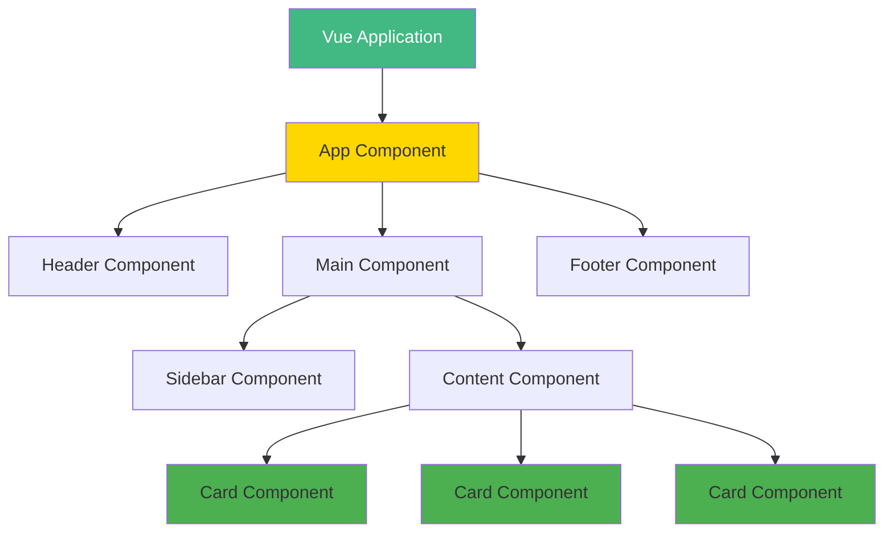
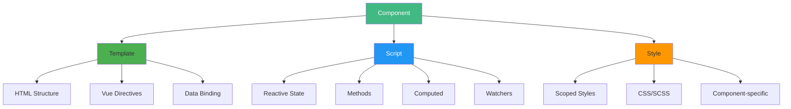
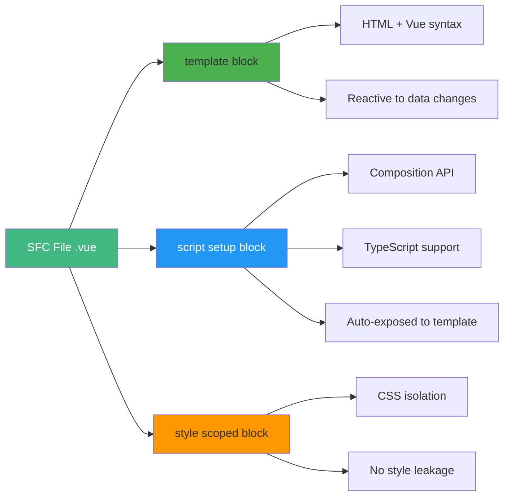
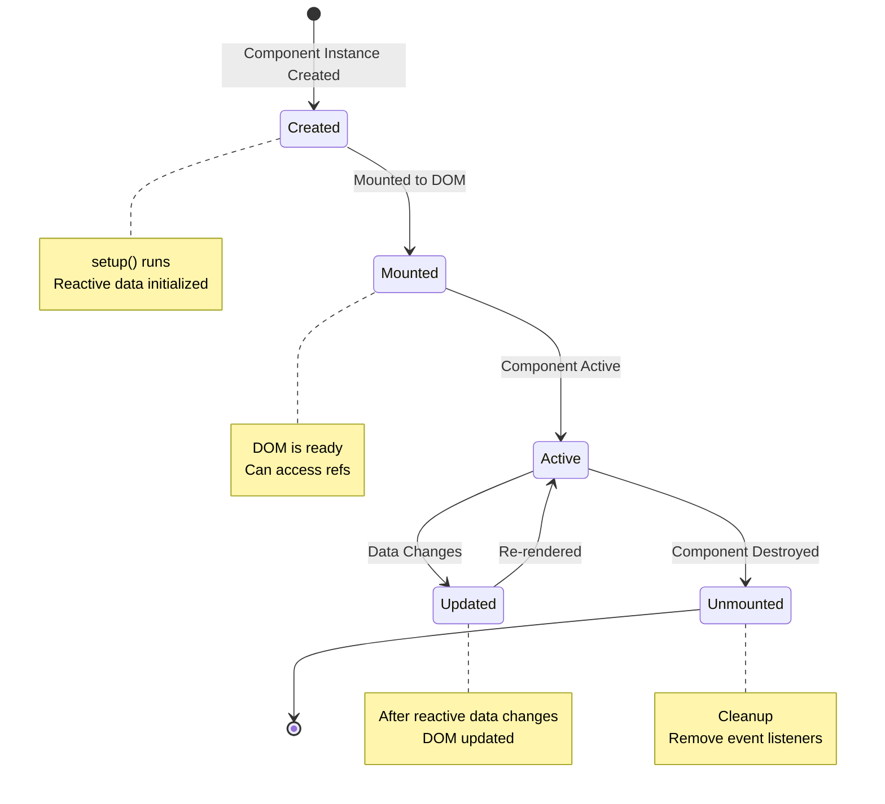
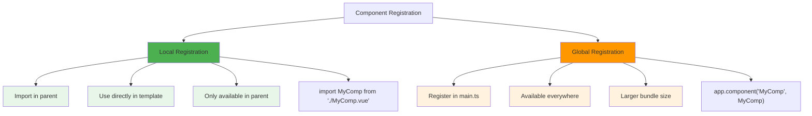
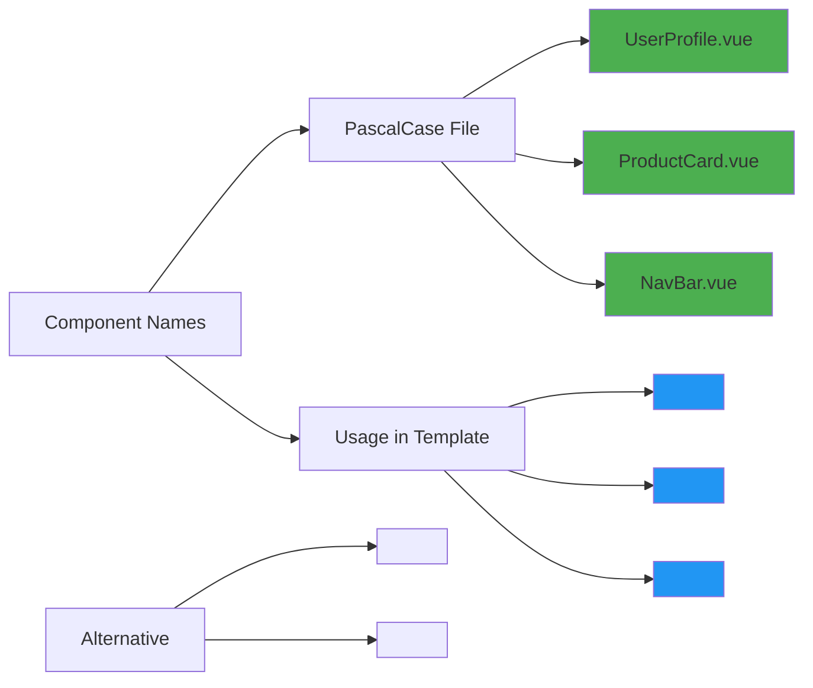
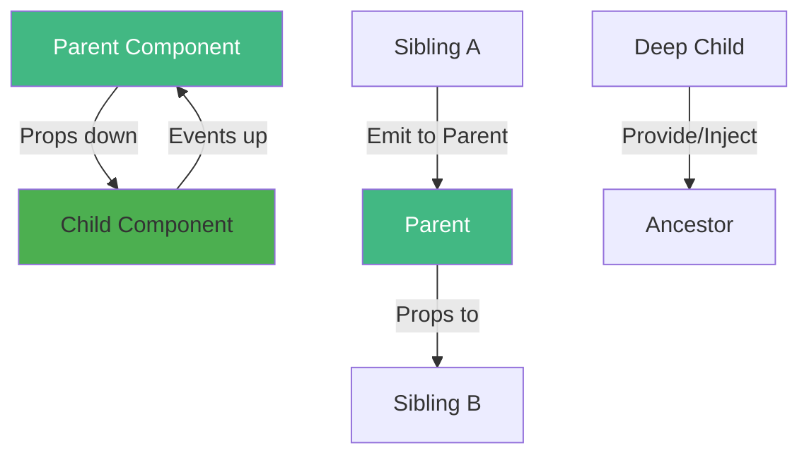
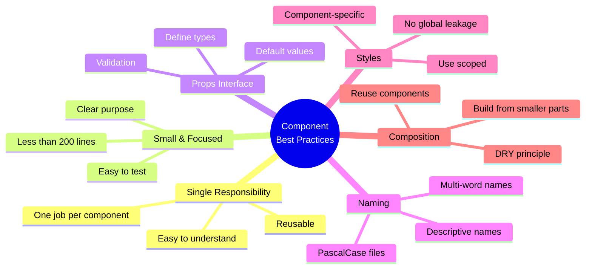
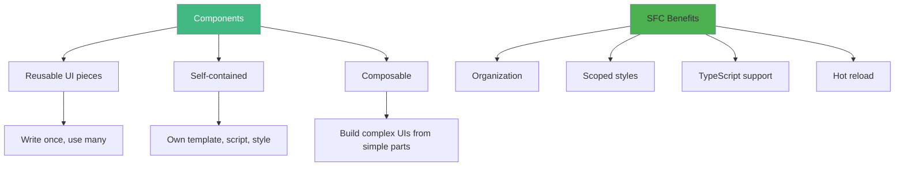

# Day 1 (Day 8): Components Basics 🧩

**Duration:** 3-4 hours  
**Difficulty:** ⭐⭐ Medium

---

## 📖 Learning Objectives

- Understand component architecture
- Create single file components (SFC)
- Component registration (local vs global)
- Component naming conventions
- Component communication overview
- Reusable component patterns

---

## 🧩 What Are Components?



**Components are reusable, self-contained pieces of UI that can be composed together.**

---

## 🏗️ Component Architecture



---

## 📄 Single File Component (SFC) Structure

```vue
<template>
  <!-- HTML template -->
  <div class="component">
    <h1>{{ title }}</h1>
    <button @click="handleClick">Click Me</button>
  </div>
</template>

<script setup lang="ts">
// JavaScript/TypeScript logic
import { ref } from 'vue'

interface Props {
  title: string
}

const props = defineProps<Props>()
const count = ref(0)

const handleClick = () => {
  count.value++
  console.log('Clicked!', count.value)
}
</script>

<style scoped>
/* Component-specific CSS */
.component {
  padding: 20px;
  background: #f5f5f5;
  border-radius: 8px;
}

h1 {
  color: #42b883;
}
</style>
```

---

## 🎨 Component Anatomy



---

## 🔄 Component Lifecycle Overview



---

## 📝 Creating Your First Component

### **Step 1: Create the Component File**

```vue
<!-- components/HelloWorld.vue -->
<template>
  <div class="hello">
    <h1>{{ greeting }}</h1>
    <p>{{ message }}</p>
    <button @click="changeGreeting">Change Greeting</button>
  </div>
</template>

<script setup lang="ts">
import { ref } from 'vue'

const greeting = ref('Hello, Vue!')
const message = ref('Welcome to component-based development')

const changeGreeting = () => {
  greeting.value = greeting.value === 'Hello, Vue!' 
    ? 'Hi there!' 
    : 'Hello, Vue!'
}
</script>

<style scoped>
.hello {
  text-align: center;
  padding: 2rem;
  background: linear-gradient(135deg, #667eea 0%, #764ba2 100%);
  color: white;
  border-radius: 10px;
}

button {
  margin-top: 1rem;
  padding: 0.5rem 1rem;
  background: white;
  color: #667eea;
  border: none;
  border-radius: 5px;
  cursor: pointer;
  font-weight: bold;
}

button:hover {
  transform: scale(1.05);
}
</style>
```

### **Step 2: Use the Component**

```vue
<!-- App.vue -->
<template>
  <div id="app">
    <HelloWorld />
  </div>
</template>

<script setup lang="ts">
import HelloWorld from './components/HelloWorld.vue'
</script>
```

---

## 🌍 Component Registration



### **Local Registration (Recommended)**
```vue
<script setup lang="ts">
// Automatically registered in this component
import UserCard from './components/UserCard.vue'
import ProductList from './components/ProductList.vue'
</script>

<template>
  <UserCard />
  <ProductList />
</template>
```

### **Global Registration (Use Sparingly)**
```typescript
// main.ts
import { createApp } from 'vue'
import App from './App.vue'
import BaseButton from './components/BaseButton.vue'

const app = createApp(App)

// Register globally
app.component('BaseButton', BaseButton)

app.mount('#app')
```

---

## 📛 Component Naming Conventions



**Best Practices:**
- ✅ Use **PascalCase** for component files: `UserCard.vue`
- ✅ Use **PascalCase** in templates: `<UserCard />`
- ✅ Multi-word names: `UserProfile`, not `User`
- ✅ Descriptive names: `ProductCard`, not `Card`

---

## 🔄 Component Communication Overview



**We'll learn these in upcoming days:**
- **Day 2:** Props (parent → child)
- **Day 3:** Emits (child → parent)
- **Day 4:** Slots (content distribution)
- **Day 6:** Provide/Inject (ancestor → descendant)

---

## 🎯 Component Best Practices



---

## 💻 Practical Examples

### **Example 1: Button Component**

```vue
<!-- components/BaseButton.vue -->
<template>
  <button 
    class="base-button"
    :class="[variant, size]"
    @click="handleClick"
  >
    <slot />
  </button>
</template>

<script setup lang="ts">
interface Props {
  variant?: 'primary' | 'secondary' | 'danger'
  size?: 'small' | 'medium' | 'large'
}

const props = withDefaults(defineProps<Props>(), {
  variant: 'primary',
  size: 'medium'
})

const emit = defineEmits<{
  click: []
}>()

const handleClick = () => {
  emit('click')
}
</script>

<style scoped>
.base-button {
  padding: 0.5rem 1rem;
  border: none;
  border-radius: 4px;
  cursor: pointer;
  font-weight: 600;
  transition: all 0.3s;
}

.primary {
  background: #42b883;
  color: white;
}

.secondary {
  background: #f5f5f5;
  color: #333;
}

.danger {
  background: #f44336;
  color: white;
}

.small {
  font-size: 12px;
  padding: 0.25rem 0.5rem;
}

.medium {
  font-size: 14px;
}

.large {
  font-size: 16px;
  padding: 0.75rem 1.5rem;
}
</style>
```

### **Example 2: Card Component**

See `UserCard.vue` for complete example.

---

## ✅ Practice Exercise

Create these components:

1. **Alert Component**
   - Props: type (success/warning/error), message
   - Displays colored alert box
   - Close button emits event

2. **Avatar Component**
   - Props: src, alt, size
   - Displays user avatar
   - Fallback to initials if no image

3. **Badge Component**
   - Props: count, color
   - Displays notification badge
   - Hide if count is 0

---

## 📌 Key Takeaways



- ✅ Components are the building blocks of Vue apps
- ✅ Use `.vue` Single File Components
- ✅ Prefer local registration over global
- ✅ Follow PascalCase naming convention
- ✅ Keep components small and focused
- ✅ Use scoped styles to prevent leakage

---

**Tomorrow:** Props & Emit - Parent-Child Communication! 📡
