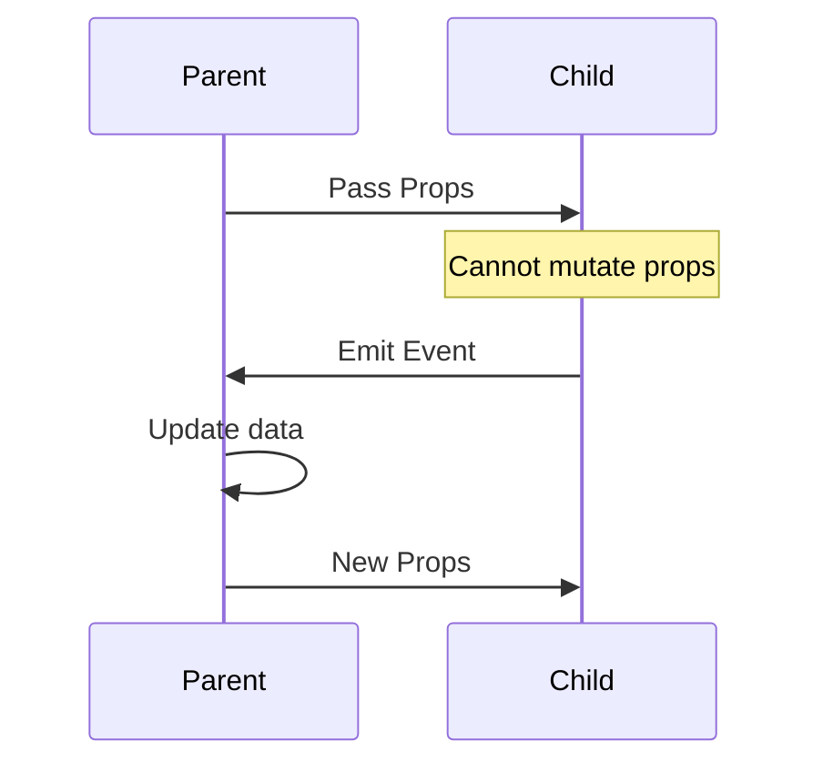
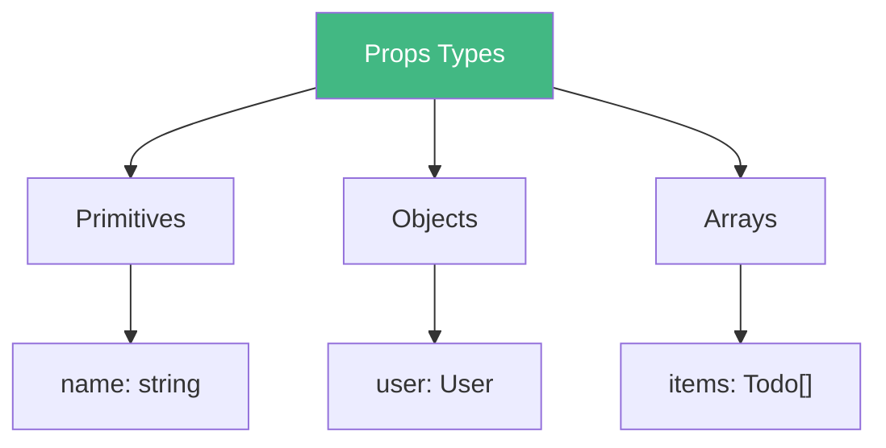
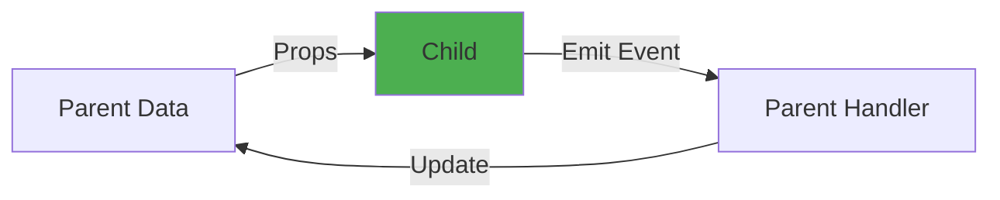

# Day 2 (Day 9): Props & Emit 📡

**Duration:** 3-4 hours | **Difficulty:** ⭐⭐⭐ Hard

---

## 📖 Learning Objectives

- Master props (parent → child)
- Master emits (child → parent)
- Understand one-way data flow
- Create custom v-model components

---

## 🔄 Communication Flow



---

## 📤 Props Basics

```vue
<!-- Child.vue -->
<script setup lang="ts">
interface Props {
  name: string
  age: number
  role?: string
}

const props = withDefaults(defineProps<Props>(), {
  role: 'User'
})
</script>

<template>
  <div>{{ name }} - {{ age }} - {{ role }}</div>
</template>

<!-- Parent.vue -->
<template>
  <Child name="Alice" :age="28" />
</template>
```

---

## 📊 Props Patterns



---

## ⚠️ One-Way Data Flow



**Rule:** Props are read-only in child components!

---

## 📤 Emits Basics

```vue
<!-- Child.vue -->
<script setup lang="ts">
const emit = defineEmits<{
  update: [value: string]
  delete: [id: number]
}>()

const handleUpdate = (val: string) => {
  emit('update', val)
}
</script>

<!-- Parent.vue -->
<template>
  <Child @update="handleUpdate" @delete="handleDelete" />
</template>
```

---

## 🔄 Custom v-model

```vue
<!-- CustomInput.vue -->
<template>
  <input 
    :value="modelValue"
    @input="$emit('update:modelValue', $event.target.value)"
  />
</template>

<script setup lang="ts">
defineProps<{ modelValue: string }>()
defineEmits<{ 'update:modelValue': [value: string] }>()
</script>

<!-- Parent.vue -->
<template>
  <CustomInput v-model="text" />
</template>
```

---

## ✅ Practice Exercise

Build a **Counter Component** with:
- Props: `initialValue`, `step`, `max`, `min`
- Emits: `change`, `max-reached`, `min-reached`
- Buttons: increment, decrement, reset
- Display current value

See example files for implementation!

---

**Tomorrow:** Slots - Content Distribution! 🎰
