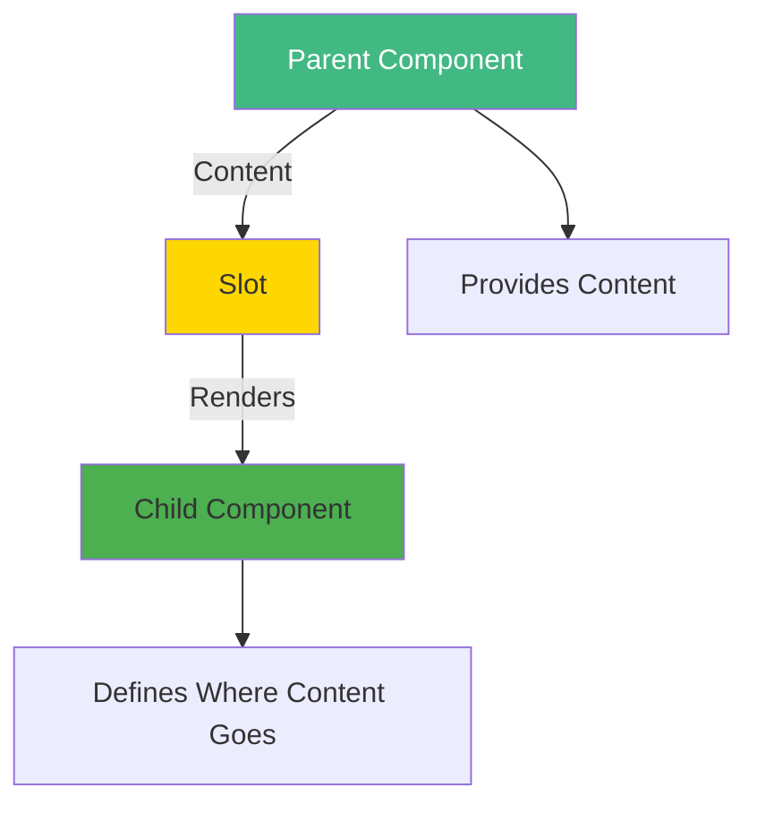
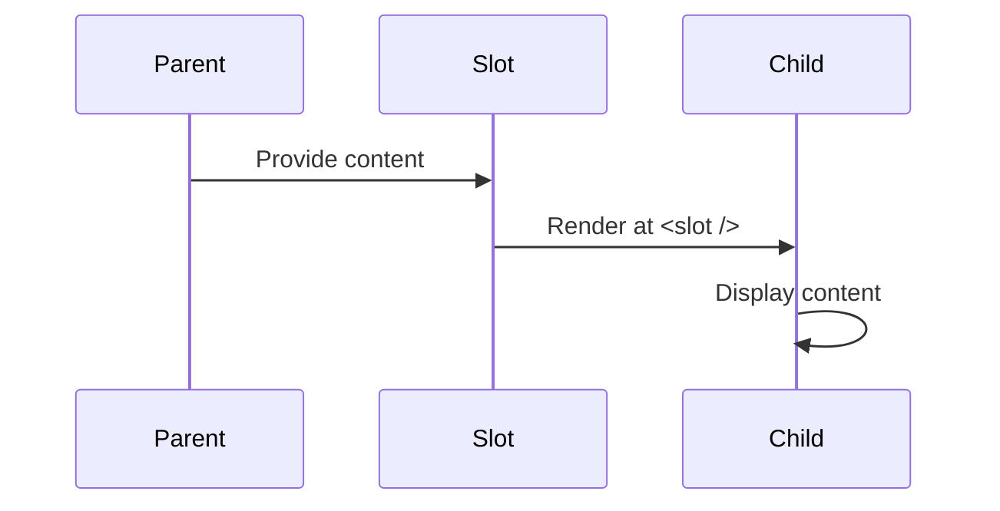
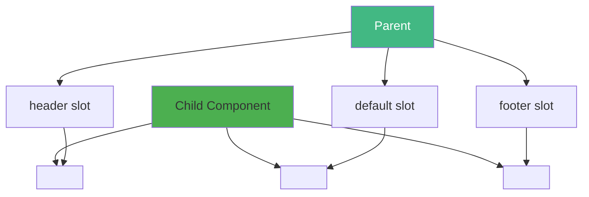
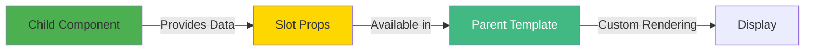
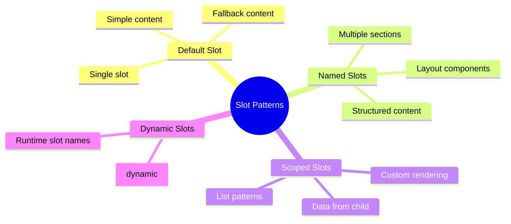
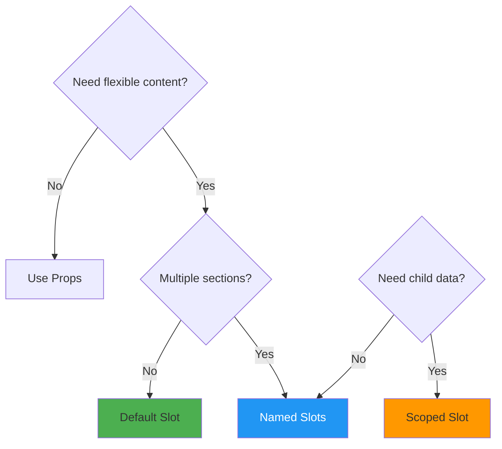

# Day 3 (Day 10): Slots - Content Distribution 🎰

**Duration:** 3-4 hours | **Difficulty:** ⭐⭐⭐ Hard

---

## 📖 Learning Objectives

- Understand slots for content distribution
- Master default slots
- Use named slots
- Implement scoped slots
- Create flexible, reusable components

---

## 🎰 What Are Slots?



**Slots allow parents to inject content into child components.**

---

## 📦 Default Slot



### **Basic Example:**
```vue
<!-- Card.vue (Child) -->
<template>
  <div class="card">
    <slot>Default content if no slot provided</slot>
  </div>
</template>

<!-- Parent.vue -->
<template>
  <Card>
    <h2>Custom Title</h2>
    <p>Custom paragraph content!</p>
  </Card>
</template>
```

---

## 🏷️ Named Slots



### **Named Slots Example:**
```vue
<!-- Layout.vue (Child) -->
<template>
  <div class="layout">
    <header>
      <slot name="header">Default Header</slot>
    </header>
    
    <main>
      <slot>Default Main Content</slot>
    </main>
    
    <footer>
      <slot name="footer">Default Footer</slot>
    </footer>
  </div>
</template>

<!-- Parent.vue -->
<template>
  <Layout>
    <template #header>
      <h1>My Page Title</h1>
    </template>
    
    <p>Main content goes here</p>
    <p>Multiple elements allowed</p>
    
    <template #footer>
      <p>© 2024 My App</p>
    </template>
  </Layout>
</template>
```

---

## 🔍 Scoped Slots



### **Scoped Slot Example:**
```vue
<!-- List.vue (Child) -->
<template>
  <div class="list">
    <div v-for="item in items" :key="item.id">
      <slot :item="item" :index="item.id">
        {{ item.name }}
      </slot>
    </div>
  </div>
</template>

<script setup lang="ts">
interface Props {
  items: Array<{ id: number; name: string; price: number }>
}

defineProps<Props>()
</script>

<!-- Parent.vue -->
<template>
  <List :items="products">
    <template #default="{ item, index }">
      <div class="custom-item">
        <strong>{{ index }}:</strong> {{ item.name }} - ${{ item.price }}
      </div>
    </template>
  </List>
</template>
```

---

## 🎨 Slot Patterns



---

## 🏗️ Real-World: Modal Component

```vue
<!-- Modal.vue -->
<template>
  <Teleport to="body">
    <div v-if="show" class="modal-overlay" @click="handleClose">
      <div class="modal-container" @click.stop>
        <div class="modal-header">
          <slot name="header">
            <h2>Modal Title</h2>
          </slot>
          <button @click="handleClose" class="close-btn">×</button>
        </div>
        
        <div class="modal-body">
          <slot>Modal content</slot>
        </div>
        
        <div class="modal-footer">
          <slot name="footer">
            <button @click="handleClose">Close</button>
          </slot>
        </div>
      </div>
    </div>
  </Teleport>
</template>

<script setup lang="ts">
interface Props {
  show: boolean
}

defineProps<Props>()

const emit = defineEmits<{
  close: []
}>()

const handleClose = () => {
  emit('close')
}
</script>

<!-- Usage -->
<template>
  <Modal :show="showModal" @close="showModal = false">
    <template #header>
      <h2>Custom Header</h2>
    </template>
    
    <p>This is my custom modal content!</p>
    
    <template #footer>
      <button @click="save">Save</button>
      <button @click="showModal = false">Cancel</button>
    </template>
  </Modal>
</template>
```

---

## 📊 Slot Decision Tree



---

## ✅ Practice Exercise

Build a **Card Component** with:
- Named slots: `header`, `default`, `footer`
- Scoped slot for custom item rendering
- Props: `title`, `collapsible`
- Emit: `toggle` event

Build a **DataTable Component** with:
- Scoped slot for custom column rendering
- Named slot for table header
- Props: `data`, `columns`

---

**Tomorrow:** Lifecycle Hooks! ⏰
