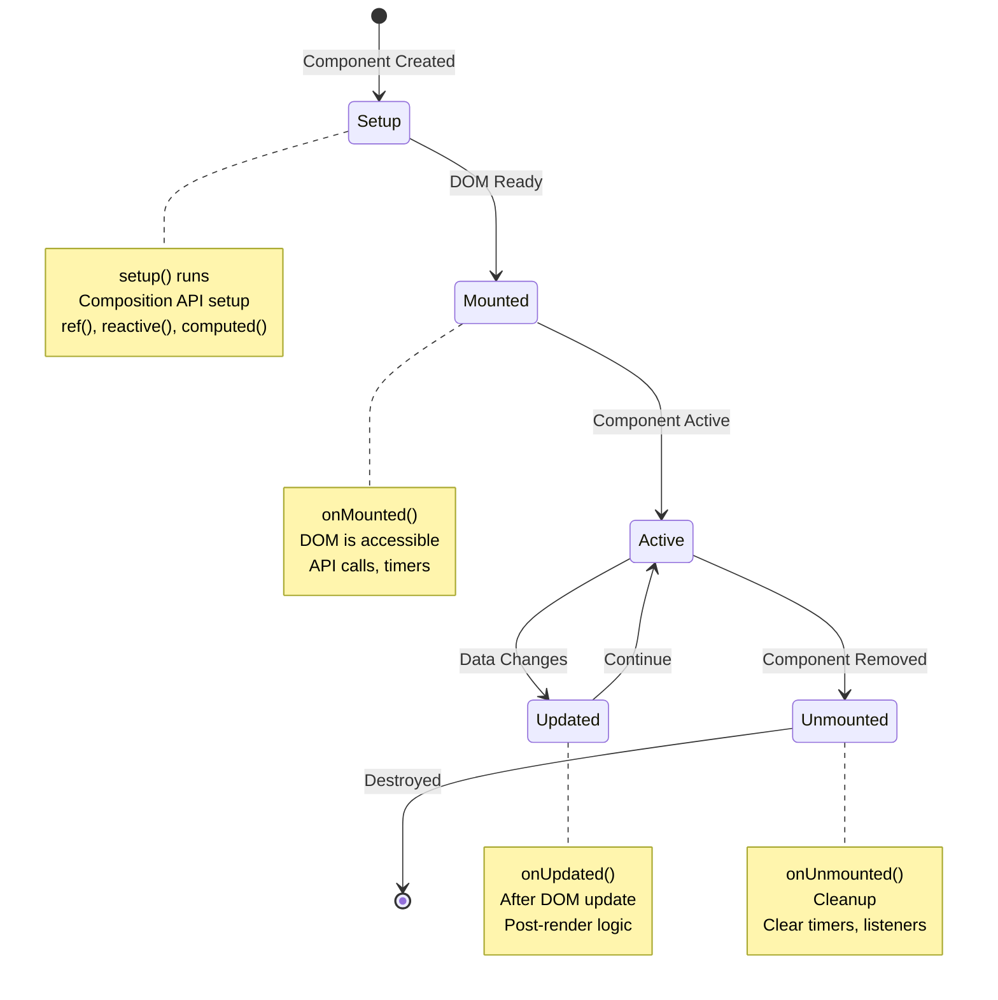
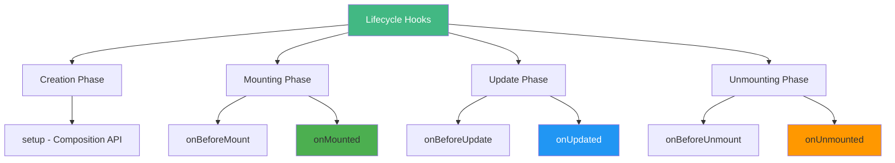
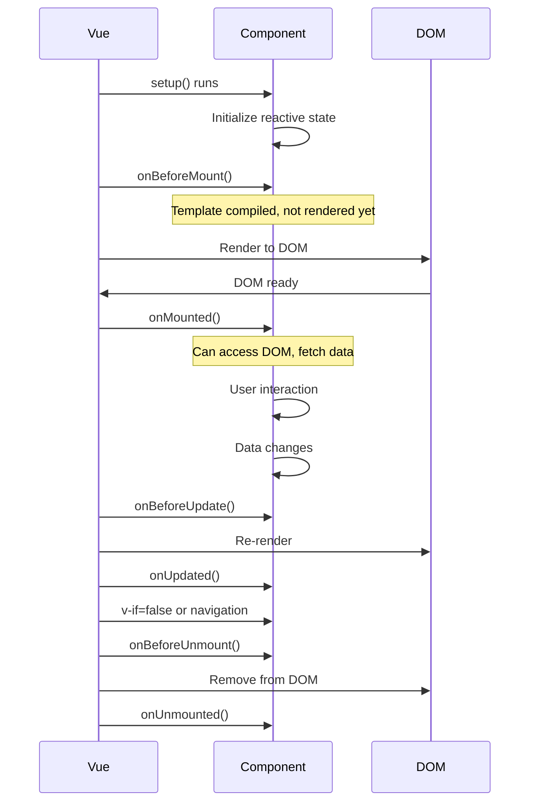
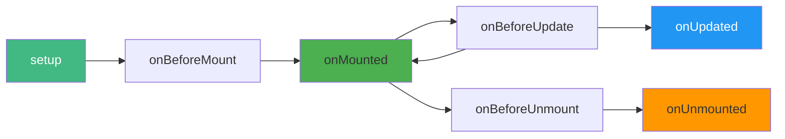
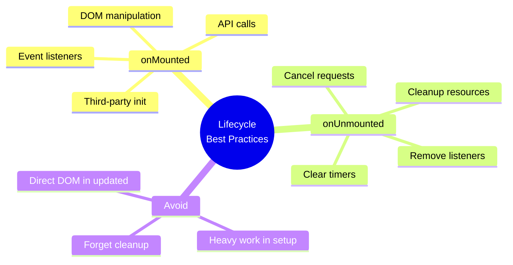

# Day 4 (Day 11): Lifecycle Hooks ⏰

**Duration:** 3-4 hours | **Difficulty:** ⭐⭐⭐ Hard

---

## 📖 Learning Objectives

- Understand component lifecycle
- Master lifecycle hooks
- Use onMounted, onUpdated, onUnmounted
- Handle async operations in lifecycle
- Clean up resources properly

---

## 🔄 Component Lifecycle



---

## 🎯 Lifecycle Hooks Overview



---

## 📝 Basic Lifecycle Hooks

### **onMounted - After DOM is Ready**
```vue
<template>
  <div ref="container">
    <h1>{{ title }}</h1>
  </div>
</template>

<script setup lang="ts">
import { ref, onMounted } from 'vue'

const container = ref<HTMLElement>()
const title = ref('Hello')

onMounted(() => {
  console.log('Component mounted!')
  console.log('DOM element:', container.value)
  
  // Safe to:
  // - Access DOM elements
  // - Fetch data from API
  // - Set up event listeners
  // - Initialize third-party libraries
})
</script>
```

### **onUpdated - After Component Updates**
```vue
<script setup lang="ts">
import { ref, onUpdated } from 'vue'

const count = ref(0)

onUpdated(() => {
  console.log('Component updated!')
  console.log('New count:', count.value)
  
  // Runs after any reactive data changes
  // DOM has been updated
})
</script>
```

### **onUnmounted - Before Component is Destroyed**
```vue
<script setup lang="ts">
import { onMounted, onUnmounted } from 'vue'

let intervalId: number

onMounted(() => {
  intervalId = setInterval(() => {
    console.log('Tick')
  }, 1000)
})

onUnmounted(() => {
  console.log('Cleaning up...')
  clearInterval(intervalId)
  
  // Clean up:
  // - Clear timers
  // - Remove event listeners
  // - Cancel API requests
  // - Disconnect websockets
})
</script>
```

---

## ⏰ Lifecycle Execution Order



---

## 🎨 Common Patterns

### **Pattern 1: Fetch Data on Mount**
```vue
<script setup lang="ts">
import { ref, onMounted } from 'vue'

interface User {
  id: number
  name: string
  email: string
}

const users = ref<User[]>([])
const loading = ref(false)
const error = ref<string>()

onMounted(async () => {
  loading.value = true
  
  try {
    const response = await fetch('https://api.example.com/users')
    users.value = await response.json()
  } catch (e) {
    error.value = 'Failed to fetch users'
  } finally {
    loading.value = false
  }
})
</script>
```

### **Pattern 2: Set up Event Listeners**
```vue
<script setup lang="ts">
import { onMounted, onUnmounted } from 'vue'

const handleResize = () => {
  console.log('Window resized:', window.innerWidth)
}

onMounted(() => {
  window.addEventListener('resize', handleResize)
})

onUnmounted(() => {
  window.removeEventListener('resize', handleResize)
})
</script>
```

### **Pattern 3: Timer/Interval**
```vue
<script setup lang="ts">
import { ref, onMounted, onUnmounted } from 'vue'

const seconds = ref(0)
let intervalId: number

onMounted(() => {
  intervalId = setInterval(() => {
    seconds.value++
  }, 1000)
})

onUnmounted(() => {
  clearInterval(intervalId)
})
</script>
```

### **Pattern 4: Third-Party Library Init**
```vue
<script setup lang="ts">
import { ref, onMounted, onUnmounted } from 'vue'
import Chart from 'chart.js/auto'

const chartRef = ref<HTMLCanvasElement>()
let chartInstance: Chart

onMounted(() => {
  if (chartRef.value) {
    chartInstance = new Chart(chartRef.value, {
      type: 'bar',
      data: { /* chart data */ }
    })
  }
})

onUnmounted(() => {
  chartInstance?.destroy()
})
</script>

<template>
  <canvas ref="chartRef"></canvas>
</template>
```

---

## 🔍 All Lifecycle Hooks



| Hook | When | Use Case |
|------|------|----------|
| `setup` | Component created | Initialize state |
| `onBeforeMount` | Before mounting | Rarely used |
| `onMounted` | DOM ready | Fetch data, DOM access |
| `onBeforeUpdate` | Before re-render | Rarely used |
| `onUpdated` | After re-render | Post-update logic |
| `onBeforeUnmount` | Before destroy | Confirm navigation |
| `onUnmounted` | Component destroyed | Cleanup |

---

## 💡 Best Practices



---

## ⚠️ Common Mistakes

```vue
<!-- ❌ BAD: Forgetting cleanup -->
<script setup lang="ts">
onMounted(() => {
  setInterval(() => {
    console.log('Memory leak!')
  }, 1000)
  // ❌ No cleanup! Interval runs forever
})
</script>

<!-- ✅ GOOD: Proper cleanup -->
<script setup lang="ts">
let intervalId: number

onMounted(() => {
  intervalId = setInterval(() => {
    console.log('Safe!')
  }, 1000)
})

onUnmounted(() => {
  clearInterval(intervalId)
})
</script>
```

---

## ✅ Practice Exercise

Build a **Timer Component** with:
- Start/Stop/Reset buttons
- Display elapsed time
- Use onMounted to start
- Use onUnmounted to cleanup
- Store state in localStorage
- Resume on remount

Build a **Data Fetcher** component:
- Fetch on mount
- Show loading state
- Handle errors
- Cancel on unmount

---

**Tomorrow:** Composables - Reusable Logic! 🔧
