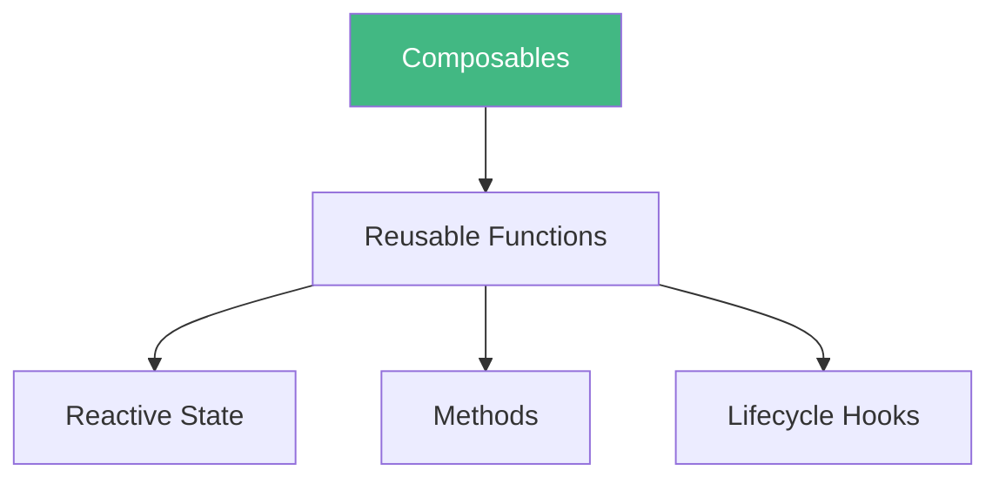

# Day 5 (Day 12): Composables 🔧

**Duration:** 3-4 hours | **Difficulty:** ⭐⭐⭐ Hard

---

## 📖 Learning Objectives

- Understand composables
- Extract reusable logic
- Create custom composables
- Master composition patterns

---

## 🔧 What Are Composables?



**Composables = Functions that use Composition API to share stateful logic**

---

## 📝 Basic Pattern

```typescript
// composables/useCounter.ts
import { ref } from 'vue'

export function useCounter(initial = 0) {
  const count = ref(initial)
  
  const increment = () => count.value++
  const decrement = () => count.value--
  
  return { count, increment, decrement }
}

// Use in component
<script setup lang="ts">
import { useCounter } from '@/composables/useCounter'

const { count, increment, decrement } = useCounter(10)
</script>
```

---

## 🎯 Common Composables

### **1. useFetch**
```typescript
export function useFetch<T>(url: string) {
  const data = ref<T>()
  const loading = ref(false)
  const error = ref()
  
  const fetch = async () => {
    loading.value = true
    try {
      const res = await fetch(url)
      data.value = await res.json()
    } catch (e) {
      error.value = e
    } finally {
      loading.value = false
    }
  }
  
  return { data, loading, error, refetch: fetch }
}
```

### **2. useLocalStorage**
```typescript
export function useLocalStorage<T>(key: string, initial: T) {
  const data = ref<T>(initial)
  
  const stored = localStorage.getItem(key)
  if (stored) data.value = JSON.parse(stored)
  
  watch(data, (val) => {
    localStorage.setItem(key, JSON.stringify(val))
  }, { deep: true })
  
  return data
}
```

### **3. useToggle**
```typescript
export function useToggle(initial = false) {
  const state = ref(initial)
  const toggle = () => { state.value = !state.value }
  return { state, toggle }
}
```

---

## ✅ Practice Exercise

Create these composables:
1. **useMouse** - Track mouse position
2. **useDebounce** - Debounce input
3. **useClickOutside** - Detect clicks outside element

See examples for implementations!

---

**Tomorrow:** Provide/Inject! 🎁
