# Day 6 (Day 13): Provide/Inject 🎁

**Duration:** 2-3 hours | **Difficulty:** ⭐⭐ Medium

---

## 📖 Learning Objectives

- Understand dependency injection
- Use provide/inject for deep props
- Avoid prop drilling
- Share app-wide state

---

## 🎁 Provide/Inject Concept

```mermaid
graph TD
    A[Ancestor] -->|provide| B[Injection Key]
    B -->|available to| C[Child]
    B -->|available to| D[Deep Child]
    B -->|available to| E[Deeper Child]
    
    F[Without Provide/Inject] --> G[Props Through Every Level]
    G --> H[Prop Drilling ❌]
    
    style A fill:#42b883,color:#fff
    style B fill:#FFD700
    style H fill:#F44336,color:#fff
```



---

## 📝 Basic Usage

### **Provide (Parent/Ancestor)**
```vue
<script setup lang="ts">
import { provide, ref } from 'vue'

const theme = ref('dark')
const user = ref({ name: 'Alice', role: 'admin' })

// Provide to all descendants
provide('theme', theme)
provide('user', user)
</script>
```

### **Inject (Child/Descendant)**
```vue
<script setup lang="ts">
import { inject } from 'vue'

// Inject from ancestor
const theme = inject('theme')
const user = inject('user')

console.log(theme.value) // 'dark'
console.log(user.value.name) // 'Alice'
</script>
```

---

## 🔑 Injection Keys (Type Safety)

```typescript
// keys.ts
import type { InjectionKey, Ref } from 'vue'

export interface User {
  name: string
  role: string
}

export const ThemeKey: InjectionKey<Ref<string>> = Symbol('theme')
export const UserKey: InjectionKey<Ref<User>> = Symbol('user')

// Provide with key
provide(ThemeKey, ref('dark'))

// Inject with key (type-safe!)
const theme = inject(ThemeKey) // Ref<string>
```

---

## 🎯 Real-World Example


### **Implementation:**
```vue
<!-- App.vue -->
<script setup lang="ts">
import { provide, ref } from 'vue'

const theme = ref('light')
const toggleTheme = () => {
  theme.value = theme.value === 'light' ? 'dark' : 'light'
}

provide('theme', theme)
provide('toggleTheme', toggleTheme)
</script>

<!-- DeepChild.vue -->
<script setup lang="ts">
import { inject } from 'vue'

const theme = inject('theme')
const toggleTheme = inject('toggleTheme')
</script>

<template>
  <div :class="`theme-${theme}`">
    <button @click="toggleTheme">Toggle Theme</button>
  </div>
</template>
```

---

## ✅ Practice Exercise

Build a **Theme System** with:
- App-wide theme provider
- Theme toggle
- Multiple components using theme
- Type-safe injection keys

Build an **Auth Context**:
- User state in root
- Login/logout methods
- Access user in any component

---

**Tomorrow:** Week 2 Project! 🎉
