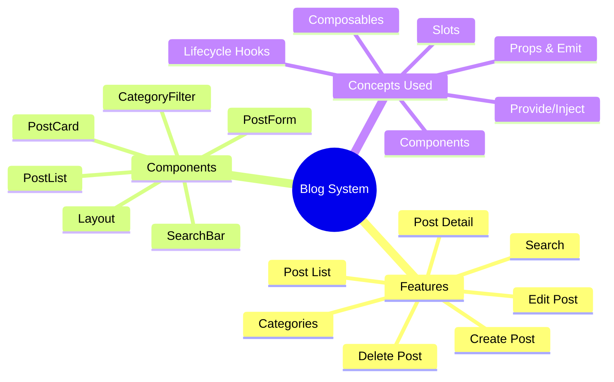
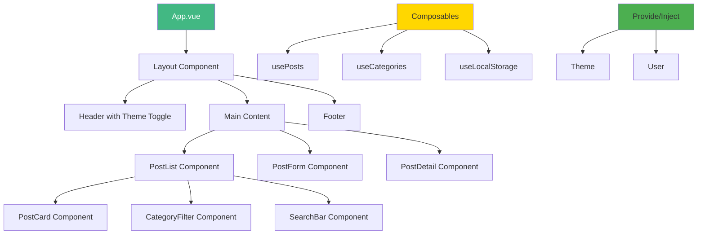
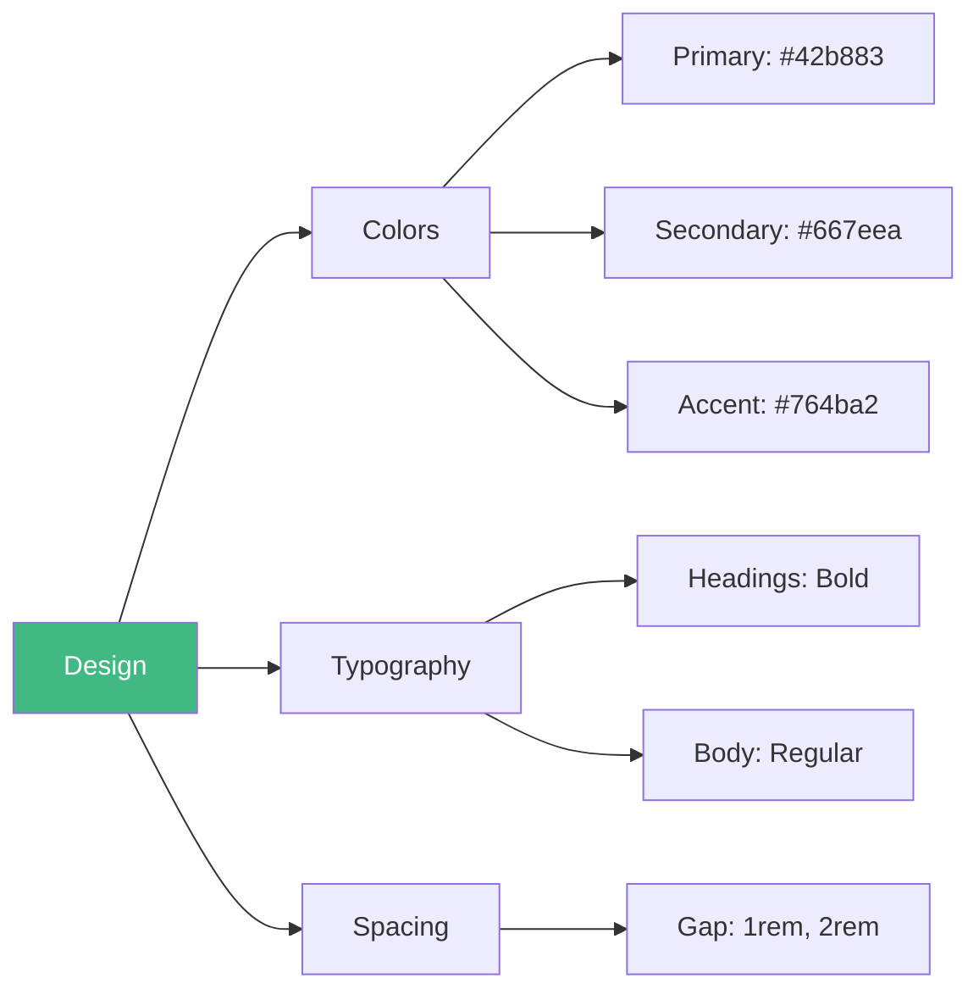
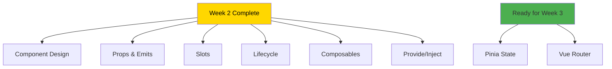

# Day 7 (Day 14): Week 2 Project - Blog System 📝

**Duration:** 4-6 hours | **Difficulty:** ⭐⭐⭐ Project

---

## 🎯 Project Overview

Build a **Component-Based Blog System** using all Week 2 concepts!



---

## 📋 Requirements

### **Must Have:**
1. ✅ Post list with cards
2. ✅ Create new posts
3. ✅ Edit existing posts
4. ✅ Delete posts
5. ✅ Category filtering
6. ✅ Search posts
7. ✅ View post details
8. ✅ Responsive design
9. ✅ localStorage persistence
10. ✅ Component composition

### **Technical Requirements:**
- Use at least 8 components
- Props & Emits for communication
- Slots for flexible content
- Composables for logic reuse
- Lifecycle hooks for data loading
- Provide/Inject for theme

---

## 🏗️ Architecture



---

## 📊 Data Structure

```typescript
interface Post {
  id: number
  title: string
  content: string
  author: string
  category: string
  createdAt: Date
  updatedAt?: Date
}

interface Category {
  id: string
  name: string
  color: string
}
```

---

## 🎨 Component Breakdown

### **1. PostCard (Reusable Card)**
- Props: `post`
- Emits: `view`, `edit`, `delete`
- Slots: `actions`

### **2. PostList (Container)**
- Props: `posts`, `loading`
- Uses: PostCard components
- Handles: filtering, sorting

### **3. PostForm (Create/Edit)**
- Props: `initialPost?` (for editing)
- Emits: `save`, `cancel`
- Validation logic

### **4. Layout (Page Structure)**
- Named slots: `header`, `default`, `footer`
- Inject: `theme`

---

## 🔧 Required Composables

### **usePosts.ts**
```typescript
export function usePosts() {
  const posts = useLocalStorage<Post[]>('blog-posts', [])
  
  const addPost = (post: Omit<Post, 'id'>) => {
    // Implementation
  }
  
  const updatePost = (id: number, updates: Partial<Post>) => {
    // Implementation
  }
  
  const deletePost = (id: number) => {
    // Implementation
  }
  
  return { posts, addPost, updatePost, deletePost }
}
```

### **useCategories.ts**
```typescript
export function useCategories() {
  const categories = ref<Category[]>([
    { id: 'tech', name: 'Technology', color: '#42b883' },
    { id: 'design', name: 'Design', color: '#667eea' },
    // More categories...
  ])
  
  return { categories }
}
```

---

## 🎯 Implementation Steps

### **Phase 1: Setup (30 min)**
1. Create project structure
2. Define interfaces
3. Create composables

### **Phase 2: Core Components (2 hours)**
4. Build PostCard
5. Build PostList
6. Build PostForm

### **Phase 3: Features (2 hours)**
7. Add filtering
8. Add search
9. Add categories

### **Phase 4: Polish (1-2 hours)**
10. Theme system with provide/inject
11. Animations
12. Responsive design
13. Error handling

---

## ✅ Testing Checklist

**Post Operations:**
- [ ] Create a new post
- [ ] View post details
- [ ] Edit existing post
- [ ] Delete post
- [ ] Cancel editing

**Filtering:**
- [ ] Filter by category
- [ ] Search by title
- [ ] Clear filters
- [ ] Multiple filters

**Persistence:**
- [ ] Data saves to localStorage
- [ ] Data loads on mount
- [ ] Refresh keeps data

**UI/UX:**
- [ ] Responsive on mobile
- [ ] Theme toggle works
- [ ] Smooth animations
- [ ] Loading states

---

## 🎨 Design System



---

## 🚀 Bonus Features

Once basic app works:

1. **Image Upload** - Add images to posts
2. **Tags** - Multiple tags per post
3. **Comments** - Add comment system
4. **Favorites** - Mark posts as favorites
5. **Export/Import** - Download/upload JSON
6. **Dark Mode** - Full theme system
7. **Reading Time** - Calculate reading time
8. **Markdown Support** - Write in Markdown

---

## 📁 File Structure

```
src/
├── App.vue
├── components/
│   ├── Layout.vue
│   ├── Header.vue
│   ├── Footer.vue
│   ├── PostCard.vue
│   ├── PostList.vue
│   ├── PostForm.vue
│   ├── PostDetail.vue
│   ├── CategoryFilter.vue
│   ├── SearchBar.vue
│   └── ThemeToggle.vue
├── composables/
│   ├── usePosts.ts
│   ├── useCategories.ts
│   └── useLocalStorage.ts
├── types/
│   └── index.ts
└── keys.ts (for provide/inject)
```

---

## 🎓 What You'll Learn



---

## 📌 Key Takeaways

- ✅ Component composition and reuse
- ✅ Parent-child communication patterns
- ✅ Flexible components with slots
- ✅ Lifecycle management
- ✅ Logic extraction with composables
- ✅ Dependency injection
- ✅ Building complete applications

---

**Next Week:** Pinia & Vue Router! 🚀

**Congratulations on completing Week 2!** 🎉
