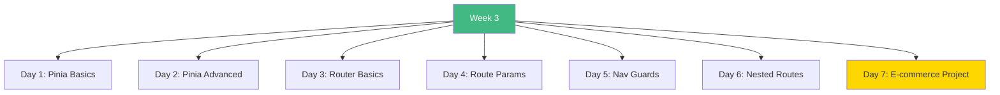

# Week 3: State Management & Routing - Index 📑

**Your complete Week 3 learning guide**

---

## 🗂️ Week Structure

---

## 📅 Daily Breakdown

### **Day 1 (Day 15): Pinia Basics** ⭐⭐⭐

- 📖 [`day1/README.md`](day1/README.md)
- 📝 `stores/counter.ts` - Counter store
- 📝 `stores/user.ts` - User auth store
- 📝 `stores/todos.ts` - Todo store with persistence
- 💻 `PiniaExamples.vue` - All examples

**Topics:** Stores, state, getters, actions, persistence

---

### **Day 2 (Day 16): Pinia Advanced** ⭐⭐⭐

- 📖 [`day2/README.md`](day2/README.md)
- Async actions
- Error handling
- Loading states
- Store composition
- Optimistic updates

**Topics:** Advanced patterns, async operations, real-world examples

---

### **Day 3 (Day 17): Vue Router Basics** ⭐⭐⭐

- 📖 [`day3/README.md`](day3/README.md)
- 📝 `router/index.ts` - Router configuration
- 💻 `views/HomeView.vue` - Home page
- 💻 `views/AboutView.vue` - About page

**Topics:** Client-side routing, navigation, router-link, router-view

---

### **Day 4 (Day 18): Route Parameters** ⭐⭐⭐

- 📖 [`day4/README.md`](day4/README.md)
- Dynamic routes
- Route params
- Query strings
- Watching route changes

**Topics:** Params, query, dynamic segments, navigation with data

---

### **Day 5 (Day 19): Navigation Guards** ⭐⭐⭐

- 📖 [`day5/README.md`](day5/README.md)
- Global guards
- Per-route guards
- Component guards
- Auth protection

**Topics:** beforeEach, beforeEnter, route protection, auth

---

### **Day 6 (Day 20): Nested Routes** ⭐⭐

- 📖 [`day6/README.md`](day6/README.md)
- Nested routes
- Layout components
- Multiple router-views
- Route hierarchy

**Topics:** Layouts, nested routing, dashboard patterns

---

### **Day 7 (Day 21): E-commerce Project** 🎯

- 📖 [`day7/README.md`](day7/README.md)
- Complete project specification
- Architecture & design
- Implementation guide

**Build:** Full e-commerce store with Pinia & Router

---

## 🎯 Learning Checklist

**Pinia State Management:**

- [ ] Day 1 Complete
- [ ] Create stores
- [ ] Define state, getters, actions
- [ ] Handle async operations
- [ ] Store composition
- [ ] Persist state

**Vue Router:**

- [ ] Day 3 Complete
- [ ] Setup router
- [ ] Create routes
- [ ] Navigate between pages
- [ ] Use route params
- [ ] Handle query strings
- [ ] Implement guards
- [ ] Build nested routes

**Project:**

- [ ] Day 7 Complete
- [ ] E-commerce built
- [ ] All concepts used
- [ ] Production-ready

---

## 💻 Code Statistics

**Week 3 Totals:**

- 📖 **7 README files**
- 📝 **10+ store files**
- 💻 **15+ view components**
- 📊 **50+ Mermaid diagrams**
- 🎯 **1 complete e-commerce project**

---

## 🚀 Quick Navigation

| Day | Topic | Difficulty | Focus |
|-----|-------|------------|-------|
| 1 | Pinia Basics | ⭐⭐⭐ | Stores |
| 2 | Pinia Advanced | ⭐⭐⭐ | Async |
| 3 | Router Basics | ⭐⭐⭐ | Navigation |
| 4 | Route Params | ⭐⭐⭐ | Dynamic |
| 5 | Nav Guards | ⭐⭐⭐ | Auth |
| 6 | Nested Routes | ⭐⭐ | Layouts |
| 7 | Project | 🎯 | Integration |

---

## 💡 Key Takeaways

> **"Pinia provides centralized state. Router manages navigation. Together they power modern SPAs."**

> **"Store composition enables powerful patterns. Guards protect routes. Nested routes create layouts."**

---

**Continue to:** [`WEEK3_SUMMARY.md`](WEEK3_SUMMARY.md)

**Next Week:** [`../week4/README.md`](../week4/README.md)

**Happy Building!** 🚀
