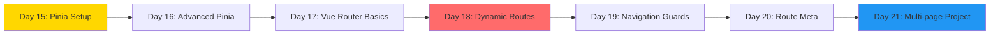
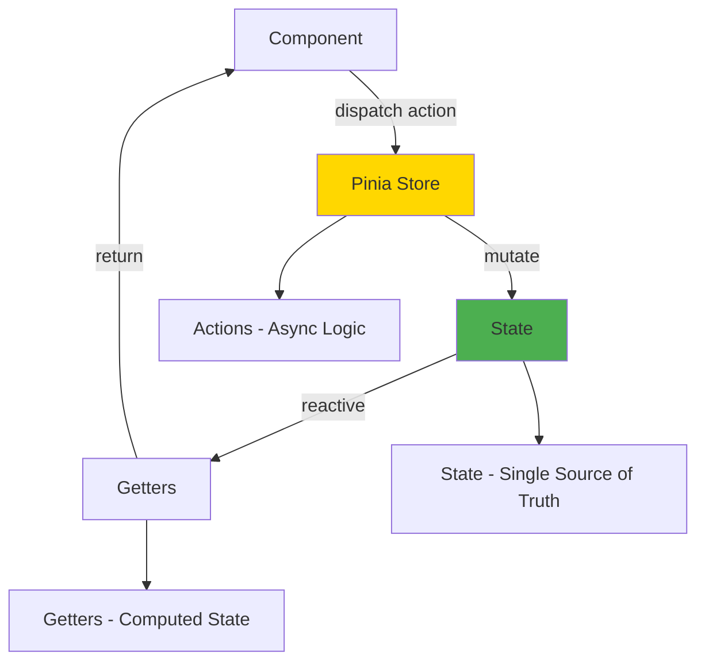
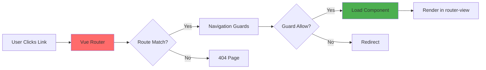

# Week 3: State Management & Routing 🗺️

**Focus:** Managing global state with Pinia and navigation with Vue Router

---

## 📊 Weekly Flow

---

## 📚 Daily Topics

| Day | Topic | Key Concepts |
|-----|-------|--------------|
| **Day 15** | Pinia Basics | Stores, state, getters, actions |
| **Day 16** | Pinia Advanced | Store composition, plugins, subscriptions |
| **Day 17** | Vue Router Basics | createRouter, routes, router-view |
| **Day 18** | Dynamic Routing | Route params, query strings, nested routes |
| **Day 19** | Navigation Guards | beforeEach, beforeEnter, route protection |
| **Day 20** | Route Meta & Lazy Loading | Code splitting, meta fields |
| **Day 21** | **Project: Multi-page App** | E-commerce with routing + state |

---

## 🏪 Pinia Store Pattern

---

## 🛣️ Vue Router Architecture

---

## 📂 Week Project Features

- Product catalog with categories
- Shopping cart (Pinia store)
- Product detail pages (dynamic routes)
- User authentication (navigation guards)
- Checkout flow (multi-step routing)

---

**Start Day 15!** 🚀
