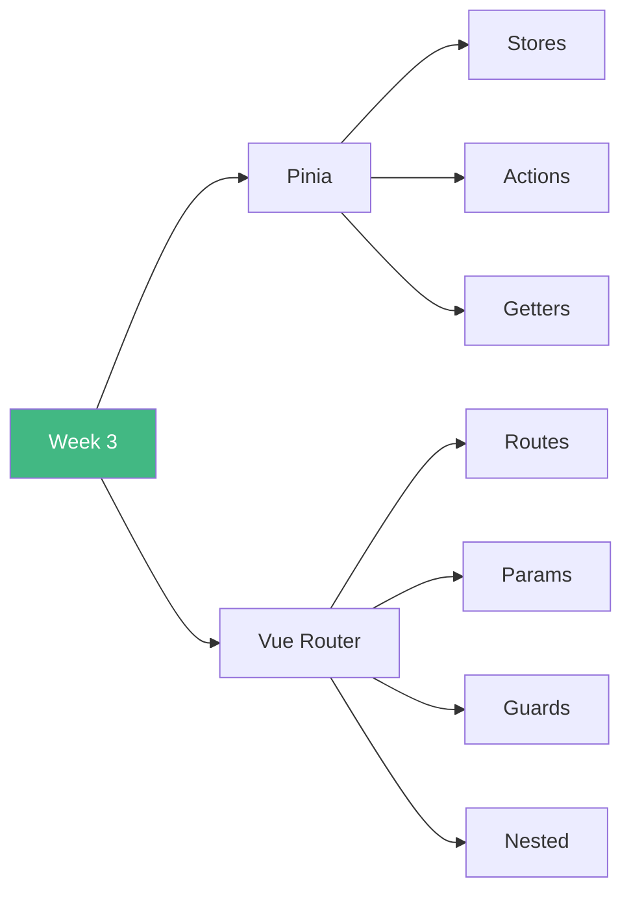

# 🚀 Week 3: Start Here!

**Welcome to Week 3 - State Management & Routing!**

---

## 📚 What You'll Learn This Week

---

## 📅 7-Day Plan

| Day | Topic | Time | Difficulty |
|-----|-------|------|------------|
| **Day 1** | Pinia Basics | 3-4h | ⭐⭐⭐ |
| **Day 2** | Pinia Advanced | 3-4h | ⭐⭐⭐ |
| **Day 3** | Router Basics | 3-4h | ⭐⭐⭐ |
| **Day 4** | Route Parameters | 3-4h | ⭐⭐⭐ |
| **Day 5** | Navigation Guards | 3-4h | ⭐⭐⭐ |
| **Day 6** | Nested Routes | 2-3h | ⭐⭐ |
| **Day 7** | E-commerce Project | 4-6h | 🎯 |

**Total:** 22-28 hours

---

## 🎯 Learning Path

### **Start Here:**
1. Read [`INDEX.md`](INDEX.md)
2. Begin with [`day1/README.md`](day1/README.md)
3. Work through each day
4. Build E-commerce project on Day 7

---

## 🎓 Learning Outcomes

By the end of Week 3, you will:

✅ Master Pinia state management  
✅ Build stores with actions & getters  
✅ Handle async operations  
✅ Setup Vue Router  
✅ Create dynamic routes  
✅ Implement auth guards  
✅ Build nested route layouts  
✅ Create production SPAs  

---

## 🚦 Prerequisites

- ✅ Week 1 & 2 completed
- ✅ Understand components
- ✅ Know props & emits
- ✅ Comfortable with composables

---

## 💡 Pro Tips

> 💡 **Tip 1:** Pinia stores are like super-powered composables
>
> 💡 **Tip 2:** Always use route names, not paths
>
> 💡 **Tip 3:** Guards protect your routes from unauthorized access
>
> 💡 **Tip 4:** The E-commerce project ties everything together!

---

## ✅ Success Checklist

- [ ] Create and use Pinia stores
- [ ] Handle async actions
- [ ] Setup Vue Router
- [ ] Use route params & query
- [ ] Implement navigation guards
- [ ] Build nested route layouts
- [ ] Complete e-commerce project

---

## 🎉 Ready to Begin?

**Start your journey:** [`day1/README.md`](day1/README.md)

**Or review the plan:** [`INDEX.md`](INDEX.md)

---

**Let's build powerful SPAs!** 🚀
