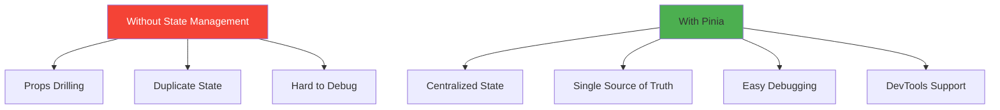
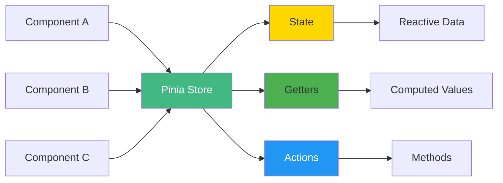
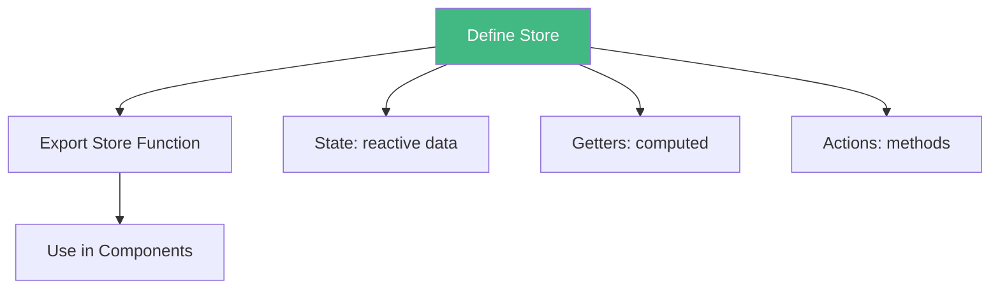
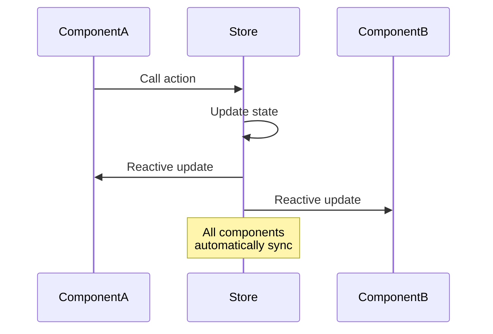
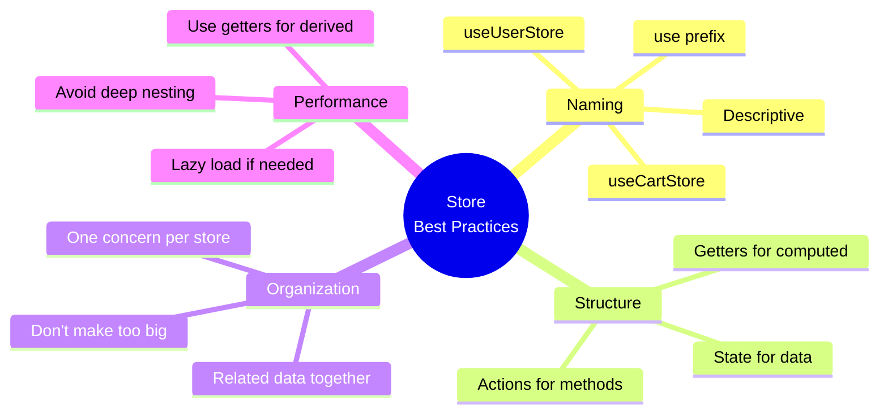
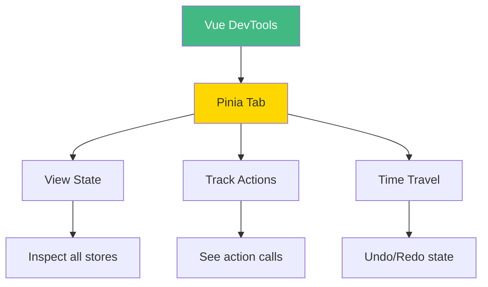
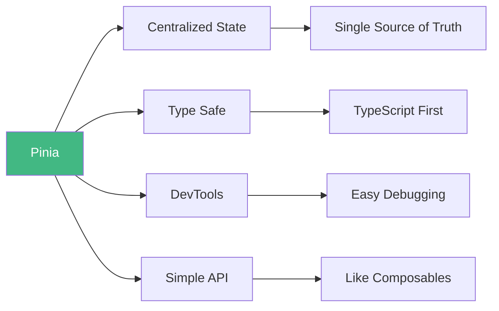

# Day 1 (Day 15): Pinia Basics - State Management 🗃️

**Duration:** 3-4 hours | **Difficulty:** ⭐⭐⭐ Hard

---

## 📖 Learning Objectives

- Understand state management need
- Install and setup Pinia
- Create stores
- Use state in components
- Master store patterns

---

## 🤔 Why State Management?



**Problem:** Sharing state across multiple components is complex!

**Solution:** Pinia - Vue's official state management library.

---

## 🗃️ Pinia Architecture



---

## 🚀 Installation

```bash
# Install Pinia
npm install pinia

# Or with yarn
yarn add pinia
```

### **Setup in main.ts:**
```typescript
// main.ts
import { createApp } from 'vue'
import { createPinia } from 'pinia'
import App from './App.vue'

const app = createApp(App)
const pinia = createPinia()

app.use(pinia)
app.mount('#app')
```

---

## 📝 Creating Your First Store



### **Counter Store Example:**
```typescript
// stores/counter.ts
import { defineStore } from 'pinia'
import { ref, computed } from 'vue'

export const useCounterStore = defineStore('counter', () => {
  // State
  const count = ref(0)
  
  // Getters (computed)
  const doubleCount = computed(() => count.value * 2)
  const isEven = computed(() => count.value % 2 === 0)
  
  // Actions
  function increment() {
    count.value++
  }
  
  function decrement() {
    count.value--
  }
  
  function reset() {
    count.value = 0
  }
  
  return {
    // State
    count,
    // Getters
    doubleCount,
    isEven,
    // Actions
    increment,
    decrement,
    reset
  }
})
```

---

## 🎯 Using Store in Components

```vue
<template>
  <div class="counter">
    <h2>Count: {{ counter.count }}</h2>
    <p>Double: {{ counter.doubleCount }}</p>
    <p>Is Even: {{ counter.isEven ? 'Yes' : 'No' }}</p>
    
    <button @click="counter.increment">+</button>
    <button @click="counter.decrement">-</button>
    <button @click="counter.reset">Reset</button>
  </div>
</template>

<script setup lang="ts">
import { useCounterStore } from '@/stores/counter'

const counter = useCounterStore()
</script>
```

---

## 🎨 Store Patterns

### **Pattern 1: Setup Syntax (Recommended)**
```typescript
export const useUserStore = defineStore('user', () => {
  const user = ref<User | null>(null)
  const isLoggedIn = computed(() => user.value !== null)
  
  function login(userData: User) {
    user.value = userData
  }
  
  function logout() {
    user.value = null
  }
  
  return { user, isLoggedIn, login, logout }
})
```

### **Pattern 2: Options Syntax**
```typescript
export const useUserStore = defineStore('user', {
  state: () => ({
    user: null as User | null
  }),
  
  getters: {
    isLoggedIn: (state) => state.user !== null
  },
  
  actions: {
    login(userData: User) {
      this.user = userData
    },
    logout() {
      this.user = null
    }
  }
})
```

---

## 🔄 Store Communication



---

## 💾 State Persistence

```typescript
// stores/cart.ts
import { defineStore } from 'pinia'
import { ref, watch } from 'vue'

export const useCartStore = defineStore('cart', () => {
  const items = ref<CartItem[]>([])
  
  // Load from localStorage on init
  const saved = localStorage.getItem('cart')
  if (saved) {
    items.value = JSON.parse(saved)
  }
  
  // Save to localStorage on change
  watch(items, (newItems) => {
    localStorage.setItem('cart', JSON.stringify(newItems))
  }, { deep: true })
  
  function addItem(item: CartItem) {
    items.value.push(item)
  }
  
  function removeItem(id: number) {
    items.value = items.value.filter(i => i.id !== id)
  }
  
  return { items, addItem, removeItem }
})
```

---

## 🎯 Real-World Example: Todo Store

```typescript
// stores/todos.ts
import { defineStore } from 'pinia'
import { ref, computed } from 'vue'

interface Todo {
  id: number
  text: string
  completed: boolean
  createdAt: Date
}

export const useTodoStore = defineStore('todos', () => {
  // State
  const todos = ref<Todo[]>([])
  const filter = ref<'all' | 'active' | 'completed'>('all')
  
  // Getters
  const filteredTodos = computed(() => {
    if (filter.value === 'active') {
      return todos.value.filter(t => !t.completed)
    }
    if (filter.value === 'completed') {
      return todos.value.filter(t => t.completed)
    }
    return todos.value
  })
  
  const stats = computed(() => ({
    total: todos.value.length,
    active: todos.value.filter(t => !t.completed).length,
    completed: todos.value.filter(t => t.completed).length
  }))
  
  // Actions
  function addTodo(text: string) {
    todos.value.push({
      id: Date.now(),
      text,
      completed: false,
      createdAt: new Date()
    })
  }
  
  function toggleTodo(id: number) {
    const todo = todos.value.find(t => t.id === id)
    if (todo) {
      todo.completed = !todo.completed
    }
  }
  
  function deleteTodo(id: number) {
    todos.value = todos.value.filter(t => t.id !== id)
  }
  
  function setFilter(newFilter: typeof filter.value) {
    filter.value = newFilter
  }
  
  return {
    todos,
    filter,
    filteredTodos,
    stats,
    addTodo,
    toggleTodo,
    deleteTodo,
    setFilter
  }
})
```

---

## 📊 Store Best Practices



---

## 🔍 Debugging with DevTools



---

## ✅ Practice Exercise

Create these stores:

1. **User Store**
   - State: user, token
   - Getters: isLoggedIn, userName
   - Actions: login, logout, updateProfile

2. **Cart Store**
   - State: items
   - Getters: total, itemCount
   - Actions: addItem, removeItem, clearCart

3. **Theme Store**
   - State: theme (light/dark)
   - Actions: toggleTheme, setTheme
   - Persist to localStorage

---

## 📌 Key Takeaways



- ✅ Pinia is Vue's official state management
- ✅ Stores centralize application state
- ✅ Use setup syntax for modern API
- ✅ Getters are like computed properties
- ✅ Actions modify state
- ✅ DevTools make debugging easy

---

**Tomorrow:** Pinia Actions & Getters Deep Dive! 🎯
