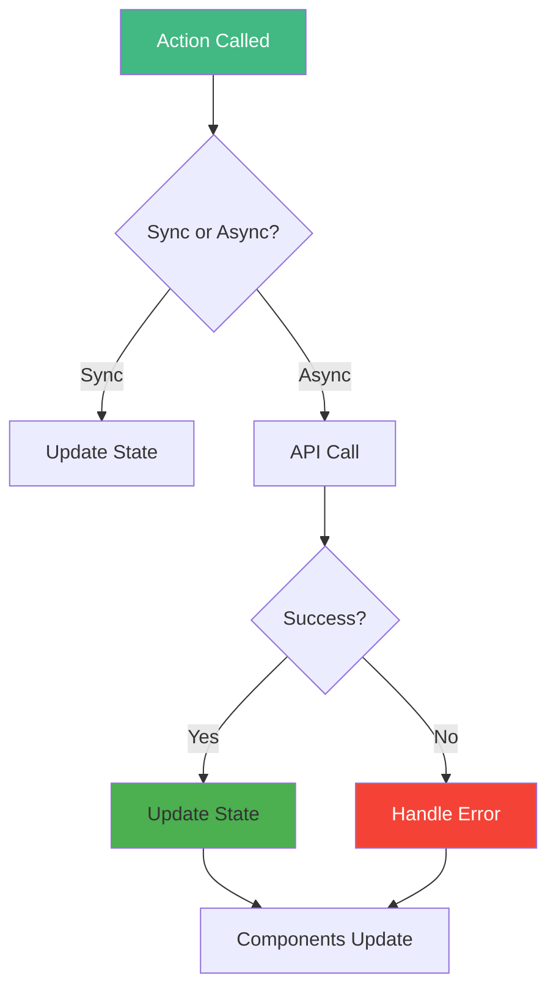
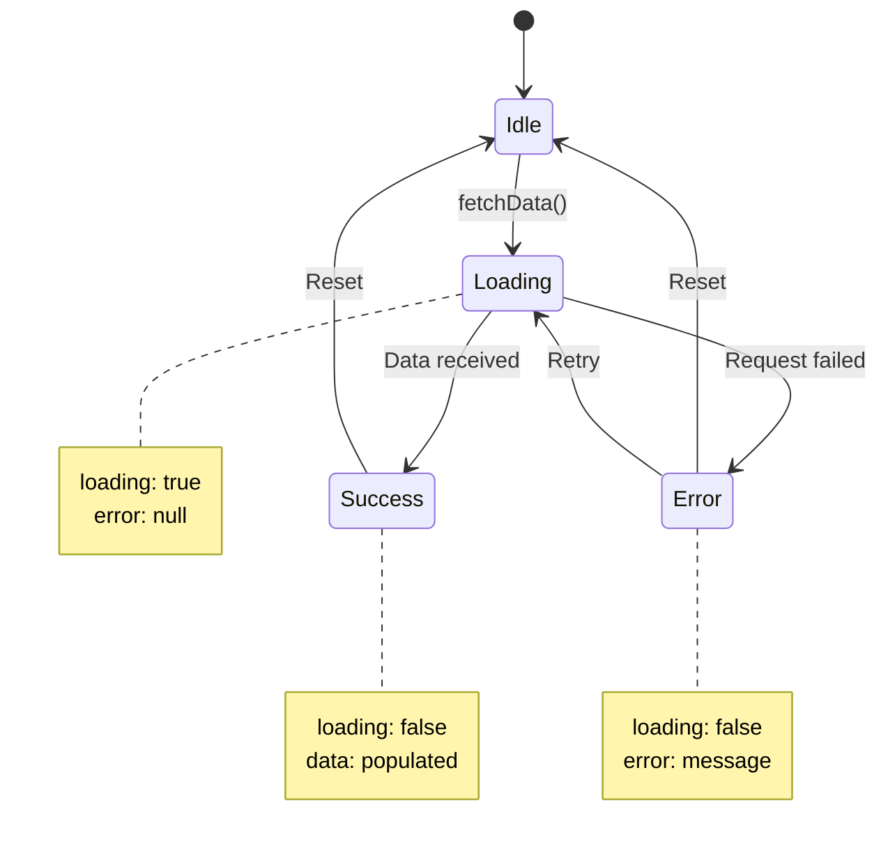
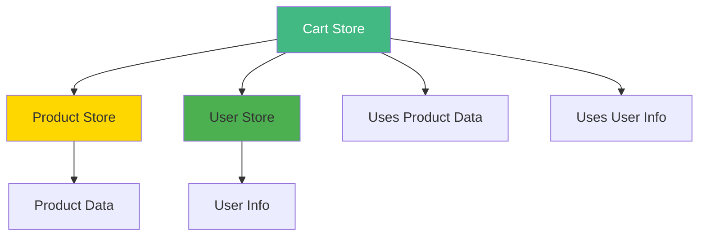

# Day 2 (Day 16): Pinia Advanced - Actions & Async 🎯

**Duration:** 3-4 hours | **Difficulty:** ⭐⭐⭐ Hard

---

## 📖 Learning Objectives

- Master Pinia actions
- Handle async operations
- Error handling in stores
- Loading states
- Store composition

---

## 🎯 Actions Deep Dive



---

## 🔄 Async Actions Pattern

```typescript
// stores/products.ts
import { defineStore } from 'pinia'
import { ref } from 'vue'

interface Product {
  id: number
  name: string
  price: number
  image: string
}

export const useProductStore = defineStore('products', () => {
  const products = ref<Product[]>([])
  const loading = ref(false)
  const error = ref<string | null>(null)
  
  async function fetchProducts() {
    loading.value = true
    error.value = null
    
    try {
      const response = await fetch('https://api.example.com/products')
      if (!response.ok) throw new Error('Failed to fetch')
      
      products.value = await response.json()
    } catch (e) {
      error.value = (e as Error).message
      console.error('Error fetching products:', e)
    } finally {
      loading.value = false
    }
  }
  
  return { products, loading, error, fetchProducts }
})
```

---

## 📊 Loading States Pattern



---

## 🎨 Complete Store Example

```typescript
// stores/posts.ts
import { defineStore } from 'pinia'
import { ref, computed } from 'vue'

interface Post {
  id: number
  title: string
  content: string
  author: string
  likes: number
  createdAt: Date
}

export const usePostStore = defineStore('posts', () => {
  // State
  const posts = ref<Post[]>([])
  const loading = ref(false)
  const error = ref<string | null>(null)
  const searchQuery = ref('')
  
  // Getters
  const filteredPosts = computed(() => {
    if (!searchQuery.value) return posts.value
    
    return posts.value.filter(post =>
      post.title.toLowerCase().includes(searchQuery.value.toLowerCase()) ||
      post.content.toLowerCase().includes(searchQuery.value.toLowerCase())
    )
  })
  
  const sortedByLikes = computed(() => {
    return [...posts.value].sort((a, b) => b.likes - a.likes)
  })
  
  // Actions
  async function fetchPosts() {
    loading.value = true
    error.value = null
    
    try {
      const response = await fetch('/api/posts')
      posts.value = await response.json()
    } catch (e) {
      error.value = 'Failed to fetch posts'
    } finally {
      loading.value = false
    }
  }
  
  async function createPost(post: Omit<Post, 'id' | 'likes' | 'createdAt'>) {
    loading.value = true
    error.value = null
    
    try {
      const response = await fetch('/api/posts', {
        method: 'POST',
        headers: { 'Content-Type': 'application/json' },
        body: JSON.stringify(post)
      })
      
      const newPost = await response.json()
      posts.value.push(newPost)
    } catch (e) {
      error.value = 'Failed to create post'
      throw e
    } finally {
      loading.value = false
    }
  }
  
  async function likePost(id: number) {
    const post = posts.value.find(p => p.id === id)
    if (!post) return
    
    // Optimistic update
    post.likes++
    
    try {
      await fetch(`/api/posts/${id}/like`, { method: 'POST' })
    } catch (e) {
      // Rollback on error
      post.likes--
      error.value = 'Failed to like post'
    }
  }
  
  return {
    posts,
    loading,
    error,
    searchQuery,
    filteredPosts,
    sortedByLikes,
    fetchPosts,
    createPost,
    likePost
  }
})
```

---

## 🔄 Store Composition



```typescript
// stores/cart.ts
import { defineStore } from 'pinia'
import { ref, computed } from 'vue'
import { useProductStore } from './products'
import { useUserStore } from './user'

export const useCartStore = defineStore('cart', () => {
  const productStore = useProductStore()
  const userStore = useUserStore()
  
  const items = ref<Array<{ productId: number; quantity: number }>>([])
  
  const cartItems = computed(() => {
    return items.value.map(item => {
      const product = productStore.products.find(p => p.id === item.productId)
      return {
        ...item,
        product,
        total: product ? product.price * item.quantity : 0
      }
    })
  })
  
  const total = computed(() => {
    return cartItems.value.reduce((sum, item) => sum + item.total, 0)
  })
  
  const discount = computed(() => {
    // Give 10% discount if user is logged in
    return userStore.isLoggedIn ? total.value * 0.1 : 0
  })
  
  const finalTotal = computed(() => total.value - discount.value)
  
  function addItem(productId: number, quantity = 1) {
    const existing = items.value.find(i => i.productId === productId)
    
    if (existing) {
      existing.quantity += quantity
    } else {
      items.value.push({ productId, quantity })
    }
  }
  
  return {
    items,
    cartItems,
    total,
    discount,
    finalTotal,
    addItem
  }
})
```

---

## ⚡ Optimistic Updates

```typescript
async function updateTodo(id: number, updates: Partial<Todo>) {
  const todo = todos.value.find(t => t.id === id)
  if (!todo) return
  
  // Save original state
  const original = { ...todo }
  
  // Optimistic update
  Object.assign(todo, updates)
  
  try {
    await fetch(`/api/todos/${id}`, {
      method: 'PATCH',
      body: JSON.stringify(updates)
    })
  } catch (e) {
    // Rollback on error
    Object.assign(todo, original)
    error.value = 'Update failed'
  }
}
```

---

## 🎯 Real-World: Auth Store

```typescript
// stores/auth.ts
import { defineStore } from 'pinia'
import { ref, computed } from 'vue'

interface User {
  id: number
  name: string
  email: string
}

export const useAuthStore = defineStore('auth', () => {
  const user = ref<User | null>(null)
  const token = ref<string | null>(null)
  const loading = ref(false)
  const error = ref<string | null>(null)
  
  const isAuthenticated = computed(() => !!token.value)
  
  async function login(email: string, password: string) {
    loading.value = true
    error.value = null
    
    try {
      const response = await fetch('/api/auth/login', {
        method: 'POST',
        headers: { 'Content-Type': 'application/json' },
        body: JSON.stringify({ email, password })
      })
      
      if (!response.ok) {
        throw new Error('Invalid credentials')
      }
      
      const data = await response.json()
      user.value = data.user
      token.value = data.token
      
      // Save to localStorage
      localStorage.setItem('token', data.token)
      localStorage.setItem('user', JSON.stringify(data.user))
    } catch (e) {
      error.value = (e as Error).message
      throw e
    } finally {
      loading.value = false
    }
  }
  
  async function logout() {
    loading.value = true
    
    try {
      await fetch('/api/auth/logout', {
        method: 'POST',
        headers: { Authorization: `Bearer ${token.value}` }
      })
    } finally {
      user.value = null
      token.value = null
      localStorage.removeItem('token')
      localStorage.removeItem('user')
      loading.value = false
    }
  }
  
  function restoreSession() {
    const savedToken = localStorage.getItem('token')
    const savedUser = localStorage.getItem('user')
    
    if (savedToken && savedUser) {
      token.value = savedToken
      user.value = JSON.parse(savedUser)
    }
  }
  
  return {
    user,
    token,
    loading,
    error,
    isAuthenticated,
    login,
    logout,
    restoreSession
  }
})
```

---

## ✅ Practice Exercise

Build a **Blog Store** with:
- Fetch posts (with pagination)
- Create new post
- Update post
- Delete post
- Like/unlike post
- Search posts
- Loading & error states
- Optimistic updates

---

**Tomorrow:** Vue Router Basics! 🛣️
