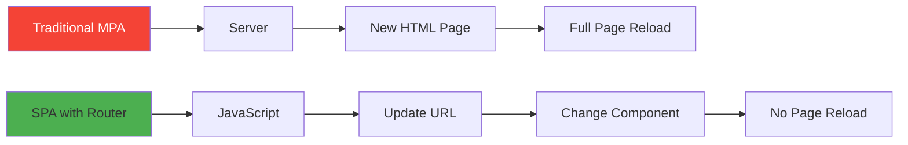
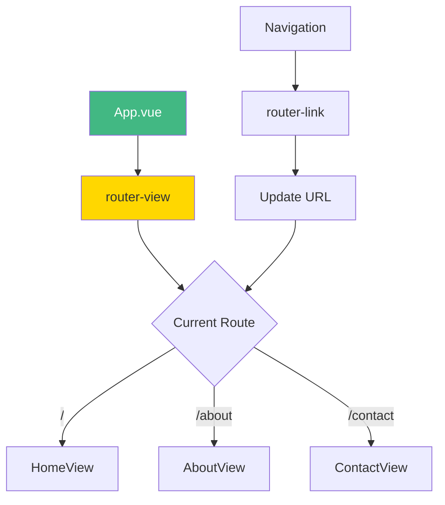
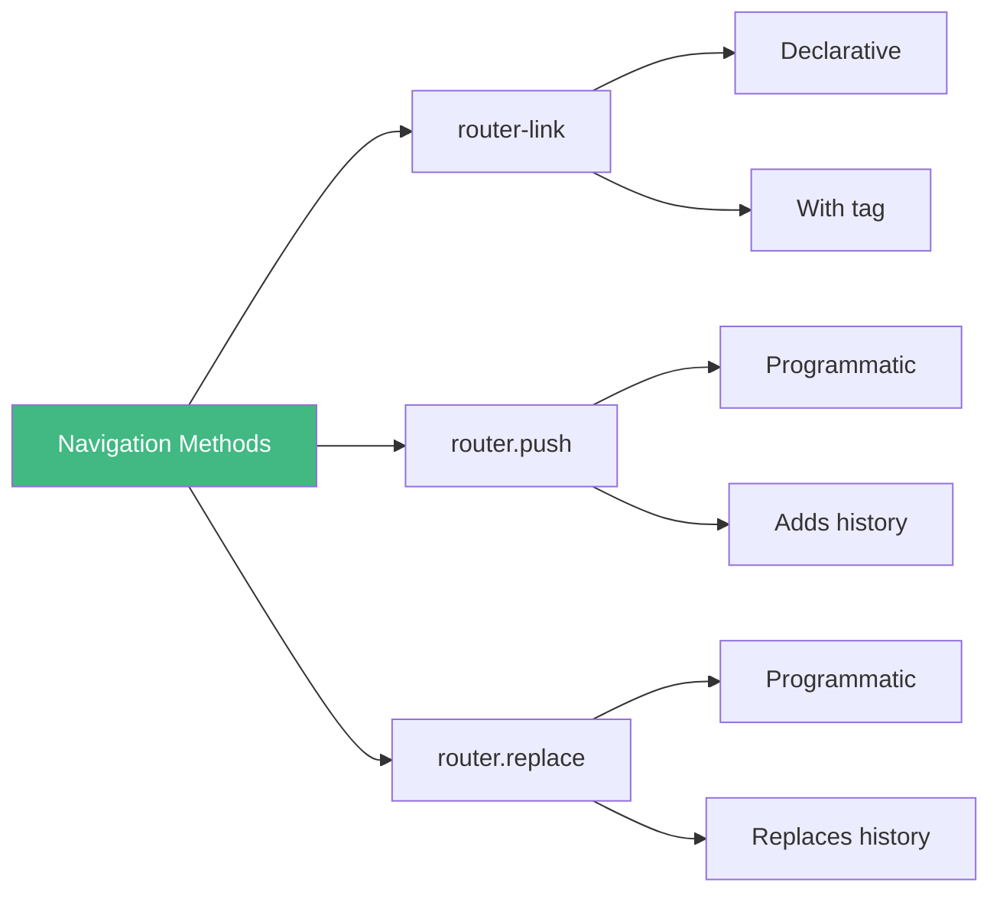
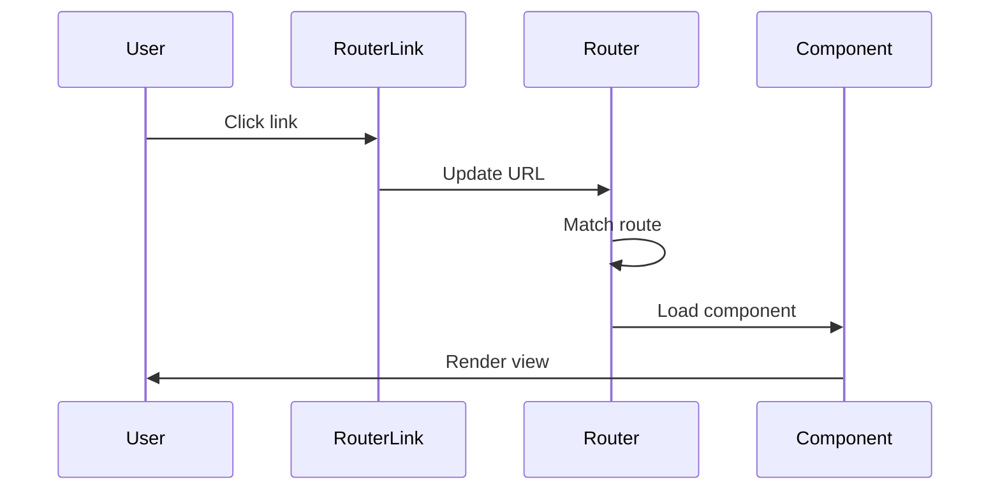

# Day 3 (Day 17): Vue Router Basics 🛣️

**Duration:** 3-4 hours | **Difficulty:** ⭐⭐⭐ Hard

---

## 📖 Learning Objectives

- Understand client-side routing
- Setup Vue Router
- Create routes and views
- Navigate between pages
- Use router-link and router-view

---

## 🛣️ What is Client-Side Routing?



---

## 🚀 Installation

```bash
npm install vue-router@4
```

### **Setup Router:**
```typescript
// router/index.ts
import { createRouter, createWebHistory } from 'vue-router'
import HomeView from '@/views/HomeView.vue'
import AboutView from '@/views/AboutView.vue'

const router = createRouter({
  history: createWebHistory(import.meta.env.BASE_URL),
  routes: [
    {
      path: '/',
      name: 'home',
      component: HomeView
    },
    {
      path: '/about',
      name: 'about',
      component: AboutView
    }
  ]
})

export default router
```

### **Register in main.ts:**
```typescript
// main.ts
import { createApp } from 'vue'
import { createPinia } from 'pinia'
import App from './App.vue'
import router from './router'

const app = createApp(App)

app.use(createPinia())
app.use(router)
app.mount('#app')
```

---

## 📐 Router Architecture



---

## 🎯 Basic Route Configuration

```typescript
const routes = [
  {
    path: '/',
    name: 'home',
    component: HomeView
  },
  {
    path: '/about',
    name: 'about',
    component: AboutView
  },
  {
    path: '/contact',
    name: 'contact',
    // Lazy loading
    component: () => import('@/views/ContactView.vue')
  },
  {
    path: '/products',
    name: 'products',
    component: () => import('@/views/ProductsView.vue')
  },
  {
    // 404 Not Found
    path: '/:pathMatch(.*)*',
    name: 'not-found',
    component: () => import('@/views/NotFoundView.vue')
  }
]
```

---

## 🔗 Navigation with router-link

```vue
<template>
  <nav>
    <!-- Basic link -->
    <router-link to="/">Home</router-link>
    
    <!-- Named route -->
    <router-link :to="{ name: 'about' }">About</router-link>
    
    <!-- With class binding -->
    <router-link 
      to="/contact"
      active-class="active"
      exact-active-class="exact-active"
    >
      Contact
    </router-link>
  </nav>
  
  <!-- Route components render here -->
  <router-view />
</template>
```

---

## 🎨 Navigation Patterns



---

## 💻 Programmatic Navigation

```vue
<script setup lang="ts">
import { useRouter } from 'vue-router'

const router = useRouter()

// Navigate to route
const goToAbout = () => {
  router.push('/about')
}

// Navigate with name
const goToContact = () => {
  router.push({ name: 'contact' })
}

// Navigate with params (we'll learn this tomorrow)
const goToProduct = (id: number) => {
  router.push({ name: 'product', params: { id } })
}

// Go back
const goBack = () => {
  router.back()
}

// Go forward
const goForward = () => {
  router.forward()
}

// Replace (no history entry)
const replaceRoute = () => {
  router.replace('/home')
}
</script>
```

---

## 📄 Creating Views

```vue
<!-- views/HomeView.vue -->
<template>
  <div class="home">
    <h1>Welcome Home</h1>
    <p>This is the home page</p>
    <button @click="goToAbout">Go to About</button>
  </div>
</template>

<script setup lang="ts">
import { useRouter } from 'vue-router'

const router = useRouter()

const goToAbout = () => {
  router.push('/about')
}
</script>

<style scoped>
.home {
  padding: 2rem;
}
</style>
```

---

## 🎯 Route Meta Fields

```typescript
const routes = [
  {
    path: '/dashboard',
    component: DashboardView,
    meta: {
      requiresAuth: true,
      title: 'Dashboard',
      layout: 'admin'
    }
  },
  {
    path: '/login',
    component: LoginView,
    meta: {
      requiresAuth: false,
      title: 'Login'
    }
  }
]
```

---

## 🎨 Active Link Styling

```vue
<template>
  <nav>
    <router-link to="/" class="nav-link">Home</router-link>
    <router-link to="/about" class="nav-link">About</router-link>
  </nav>
</template>

<style>
.nav-link {
  padding: 0.5rem 1rem;
  color: #333;
  text-decoration: none;
}

/* Active link (matches start of URL) */
.nav-link.router-link-active {
  color: #42b883;
  font-weight: bold;
}

/* Exact active link (exact match) */
.nav-link.router-link-exact-active {
  background: #42b883;
  color: white;
  border-radius: 4px;
}
</style>
```

---

## 📊 Router Flow



---

## ✅ Practice Exercise

Create a multi-page app with:
- Home page
- About page
- Services page (list of services)
- Contact page with form
- 404 Not Found page
- Navigation menu with active states
- Programmatic navigation

---

**Tomorrow:** Route Parameters & Query Strings! 🎯
