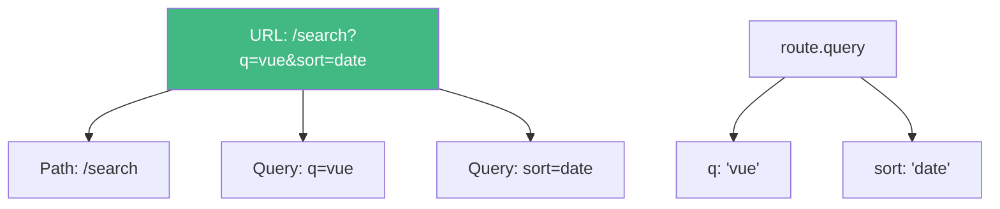

# Day 4 (Day 18): Route Parameters & Query Strings 🎯

**Duration:** 3-4 hours | **Difficulty:** ⭐⭐⭐ Hard

---

## 📖 Learning Objectives

- Use route parameters
- Access query strings
- Dynamic route matching
- Navigate with params
- Type-safe routing

---

## 🎯 Route Parameters

```mermaid
graph LR
    A[/users/:id] --> B[Dynamic Segment]
    B --> C[/users/1]
    B --> D[/users/42]
    B --> E[/users/alice]
    
    C --> F[id = 1]
    D --> G[id = 42]
    E --> H[id = alice]
    
    style A fill:#42b883,color:#fff
    style B fill:#FFD700
```

---

## 📝 Defining Parameterized Routes

```typescript
// router/index.ts
const routes = [
  {
    path: '/user/:id',
    name: 'user',
    component: () => import('@/views/UserView.vue')
  },
  {
    path: '/post/:id',
    name: 'post',
    component: () => import('@/views/PostView.vue')
  },
  {
    path: '/product/:category/:id',
    name: 'product',
    component: () => import('@/views/ProductView.vue')
  }
]
```

---

## 🔍 Accessing Route Params

```vue
<template>
  <div class="user-profile">
    <h1>User Profile</h1>
    <p>User ID: {{ userId }}</p>
    <p>Loading user data...</p>
  </div>
</template>

<script setup lang="ts">
import { useRoute } from 'vue-router'
import { computed } from 'vue'

const route = useRoute()

// Access params
const userId = computed(() => route.params.id as string)

// Or destructure
const { id } = route.params

console.log('User ID:', userId.value)
</script>
```

---

## 🎨 Navigation with Params

```vue
<script setup lang="ts">
import { useRouter } from 'vue-router'

const router = useRouter()

// Navigate with params
const viewUser = (userId: number) => {
  router.push(`/user/${userId}`)
}

// Or using name
const viewPost = (postId: number) => {
  router.push({
    name: 'post',
    params: { id: postId }
  })
}

// Multiple params
const viewProduct = (category: string, productId: number) => {
  router.push({
    name: 'product',
    params: {
      category,
      id: productId
    }
  })
}
</script>

<template>
  <div>
    <!-- Declarative -->
    <router-link :to="`/user/${userId}`">View User</router-link>
    <router-link :to="{ name: 'user', params: { id: userId } }">
      View User
    </router-link>
    
    <!-- Programmatic -->
    <button @click="viewUser(42)">View User 42</button>
  </div>
</template>
```

---

## 🔍 Query Parameters



---

## 📝 Using Query Parameters

```vue
<template>
  <div class="search">
    <h1>Search Results</h1>
    <p>Query: {{ searchQuery }}</p>
    <p>Sort: {{ sortBy }}</p>
    <p>Page: {{ currentPage }}</p>
  </div>
</template>

<script setup lang="ts">
import { useRoute } from 'vue-router'
import { computed } from 'vue'

const route = useRoute()

// Access query params
const searchQuery = computed(() => route.query.q as string || '')
const sortBy = computed(() => route.query.sort as string || 'relevance')
const currentPage = computed(() => Number(route.query.page) || 1)
</script>
```

---

## 🎯 Navigate with Query

```vue
<script setup lang="ts">
import { useRouter } from 'vue-router'

const router = useRouter()

const search = (query: string) => {
  router.push({
    path: '/search',
    query: { q: query }
  })
}

const updateFilters = (sort: string, page: number) => {
  router.push({
    path: '/search',
    query: {
      q: 'vue',
      sort,
      page
    }
  })
}
</script>

<template>
  <div>
    <!-- With query params -->
    <router-link to="/search?q=vue">Search Vue</router-link>
    <router-link :to="{ path: '/search', query: { q: 'vue', sort: 'date' } }">
      Search Vue (sorted)
    </router-link>
    
    <button @click="search('vue router')">Search</button>
  </div>
</template>
```

---

## 🔄 Watching Route Changes

```vue
<script setup lang="ts">
import { useRoute } from 'vue-router'
import { watch } from 'vue'

const route = useRoute()

// Watch for param changes
watch(() => route.params.id, (newId, oldId) => {
  console.log(`ID changed from ${oldId} to ${newId}`)
  fetchUserData(newId as string)
})

// Watch for query changes
watch(() => route.query, (newQuery) => {
  console.log('Query changed:', newQuery)
  searchProducts(newQuery.q as string)
}, { deep: true })

function fetchUserData(id: string) {
  // Fetch data based on new ID
}

function searchProducts(query: string) {
  // Search with new query
}
</script>
```

---

## 🎨 Complete Example: Product Detail

```vue
<template>
  <div class="product-detail">
    <div v-if="loading">Loading...</div>
    <div v-else-if="error">{{ error }}</div>
    <div v-else-if="product">
      <h1>{{ product.name }}</h1>
      <p>Price: ${{ product.price }}</p>
      <p>Category: {{ category }}</p>
      
      <!-- Navigate with params -->
      <button @click="viewRelated(product.relatedId)">
        View Related Product
      </button>
    </div>
  </div>
</template>

<script setup lang="ts">
import { ref, watch, onMounted } from 'vue'
import { useRoute, useRouter } from 'vue-router'

interface Product {
  id: number
  name: string
  price: number
  relatedId: number
}

const route = useRoute()
const router = useRouter()

const product = ref<Product | null>(null)
const loading = ref(false)
const error = ref<string | null>(null)

const category = computed(() => route.params.category as string)
const productId = computed(() => route.params.id as string)

async function fetchProduct() {
  loading.value = true
  error.value = null
  
  try {
    const response = await fetch(`/api/products/${productId.value}`)
    product.value = await response.json()
  } catch (e) {
    error.value = 'Failed to load product'
  } finally {
    loading.value = false
  }
}

// Fetch on mount
onMounted(fetchProduct)

// Re-fetch when ID changes
watch(() => route.params.id, fetchProduct)

function viewRelated(id: number) {
  router.push({
    name: 'product',
    params: {
      category: category.value,
      id
    }
  })
}
</script>
```

---

## 📊 Params vs Query Decision

```mermaid
flowchart TD
    A{What data?} --> B[Essential to page]
    A --> C[Optional filters]
    
    B --> D[Use Route Params]
    D --> D1[/user/:id]
    D --> D2[/post/:slug]
    
    C --> E[Use Query Params]
    E --> E1[/search?q=vue]
    E --> E2[/products?sort=price&page=2]
    
    style D fill:#4CAF50
    style E fill:#2196F3,color:#fff
```

**Use Params for:** User IDs, post slugs, required identifiers  
**Use Query for:** Filters, sorting, pagination, search terms

---

## ✅ Practice Exercise

Build a **Blog System** with:
- Post list (`/posts`)
- Post detail (`/posts/:id`)
- Search with query (`/search?q=...`)
- Filter by category (`/posts?category=tech`)
- Pagination (`/posts?page=2`)
- Navigate between posts
- Watch route changes

---

**Tomorrow:** Navigation Guards! 🛡️
