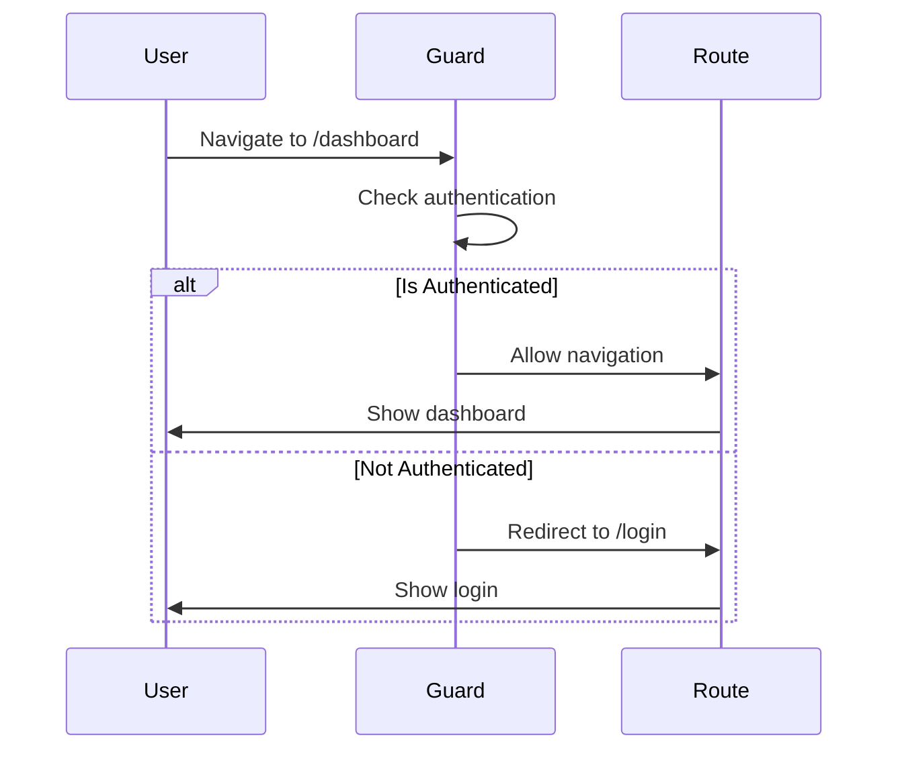
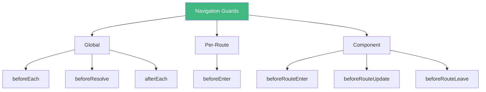
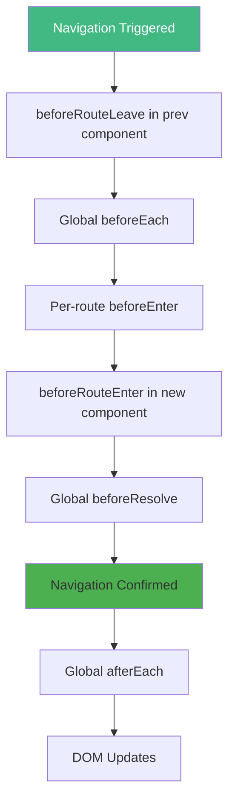

# Day 5 (Day 19): Navigation Guards 🛡️

**Duration:** 3-4 hours | **Difficulty:** ⭐⭐⭐ Hard

---

## 📖 Learning Objectives

- Understand navigation guards
- Implement auth guards
- Use beforeEach, beforeEnter
- Per-route guards
- Component guards

---

## 🛡️ What are Navigation Guards?



---

## 🎯 Types of Guards



---

## 🔐 Global Before Guard

```typescript
// router/index.ts
import { createRouter } from 'vue-router'
import { useAuthStore } from '@/stores/auth'

const router = createRouter({ /* config */ })

router.beforeEach((to, from, next) => {
  const authStore = useAuthStore()
  
  // Check if route requires auth
  if (to.meta.requiresAuth && !authStore.isAuthenticated) {
    // Redirect to login
    next({ name: 'login', query: { redirect: to.fullPath } })
  } else {
    // Allow navigation
    next()
  }
})

export default router
```

---

## 📝 Route Meta Fields

```typescript
const routes = [
  {
    path: '/dashboard',
    name: 'dashboard',
    component: () => import('@/views/DashboardView.vue'),
    meta: {
      requiresAuth: true,
      requiredRole: 'admin'
    }
  },
  {
    path: '/login',
    name: 'login',
    component: () => import('@/views/LoginView.vue'),
    meta: {
      requiresAuth: false
    }
  }
]
```

---

## 🎨 Complete Auth Example

```typescript
// router/index.ts
router.beforeEach(async (to, from, next) => {
  const authStore = useAuthStore()
  
  // Restore session if not loaded
  if (!authStore.user && localStorage.getItem('token')) {
    await authStore.restoreSession()
  }
  
  const requiresAuth = to.meta.requiresAuth
  const requiredRole = to.meta.requiredRole as string
  
  // Public route
  if (!requiresAuth) {
    next()
    return
  }
  
  // Auth required but not logged in
  if (!authStore.isAuthenticated) {
    next({
      name: 'login',
      query: { redirect: to.fullPath }
    })
    return
  }
  
  // Check role if specified
  if (requiredRole && authStore.user?.role !== requiredRole) {
    next({ name: 'unauthorized' })
    return
  }
  
  // All checks passed
  next()
})
```

---

## 🎯 Per-Route Guard

```typescript
const routes = [
  {
    path: '/admin',
    component: AdminView,
    beforeEnter: (to, from, next) => {
      const authStore = useAuthStore()
      
      if (authStore.user?.role === 'admin') {
        next()
      } else {
        next({ name: 'home' })
      }
    }
  }
]
```

---

## 🔄 Component Guards

```vue
<script setup lang="ts">
import { onBeforeRouteLeave, onBeforeRouteUpdate } from 'vue-router'

// Prevent leaving if form has unsaved changes
const hasUnsavedChanges = ref(false)

onBeforeRouteLeave((to, from, next) => {
  if (hasUnsavedChanges.value) {
    const answer = confirm('You have unsaved changes. Leave anyway?')
    if (answer) {
      next()
    } else {
      next(false)
    }
  } else {
    next()
  }
})

// Handle route updates (same component, different params)
onBeforeRouteUpdate((to, from, next) => {
  // Fetch new data for new params
  fetchData(to.params.id as string)
  next()
})
</script>
```

---

## 📊 Guard Execution Order



---

## 🎯 Real-World Examples

### **1. Auth Guard**
```typescript
router.beforeEach((to, from, next) => {
  const authStore = useAuthStore()
  
  if (to.meta.requiresAuth && !authStore.isAuthenticated) {
    next('/login')
  } else {
    next()
  }
})
```

### **2. Role-Based Access**
```typescript
router.beforeEach((to, from, next) => {
  const authStore = useAuthStore()
  const requiredRole = to.meta.role as string
  
  if (requiredRole && authStore.user?.role !== requiredRole) {
    next('/unauthorized')
  } else {
    next()
  }
})
```

### **3. Redirect if Logged In**
```typescript
router.beforeEach((to, from, next) => {
  const authStore = useAuthStore()
  
  // Redirect logged-in users away from auth pages
  if (to.meta.guestOnly && authStore.isAuthenticated) {
    next('/dashboard')
  } else {
    next()
  }
})
```

### **4. Progress Bar**
```typescript
router.beforeEach((to, from, next) => {
  // Show loading bar
  NProgress.start()
  next()
})

router.afterEach(() => {
  // Hide loading bar
  NProgress.done()
})
```

---

## 🎨 Advanced: Async Guards

```typescript
router.beforeEach(async (to, from, next) => {
  const authStore = useAuthStore()
  
  if (to.meta.requiresAuth) {
    try {
      // Verify token is still valid
      await authStore.verifyToken()
      next()
    } catch (error) {
      // Token expired, redirect to login
      next({ name: 'login', query: { expired: 'true' } })
    }
  } else {
    next()
  }
})
```

---

## ✅ Practice Exercise

Implement a complete auth system:
- Login page (redirect if already logged in)
- Protected dashboard (requires auth)
- Admin panel (requires admin role)
- Profile page (save warning on leave)
- Session verification
- Loading states during navigation
- Redirect after login

---

**Tomorrow:** Nested Routes! 📦
