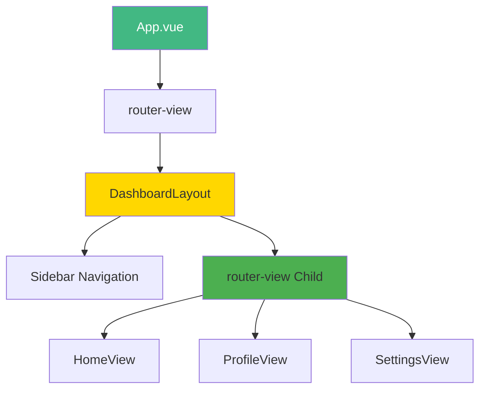

# Day 6 (Day 20): Nested Routes & Layouts 📦

**Duration:** 2-3 hours | **Difficulty:** ⭐⭐ Medium

---

## 📖 Learning Objectives

- Understand nested routes
- Create layout components
- Use multiple router-views
- Build dashboard layouts
- Master route hierarchy

---

## 📦 What are Nested Routes?

```mermaid
graph TD
    A[/dashboard] --> B[DashboardLayout]
    B --> C[/dashboard/home]
    B --> D[/dashboard/profile]
    B --> E[/dashboard/settings]
    
    C --> C1[HomeView]
    D --> D1[ProfileView]
    E --> E1[SettingsView]
    
    style A fill:#42b883,color:#fff
    style B fill:#FFD700
```

---

## 🎯 Configuring Nested Routes

```typescript
// router/index.ts
const routes = [
  {
    path: '/dashboard',
    component: DashboardLayout,
    children: [
      {
        path: '',
        name: 'dashboard-home',
        component: () => import('@/views/dashboard/HomeView.vue')
      },
      {
        path: 'profile',
        name: 'dashboard-profile',
        component: () => import('@/views/dashboard/ProfileView.vue')
      },
      {
        path: 'settings',
        name: 'dashboard-settings',
        component: () => import('@/views/dashboard/SettingsView.vue')
      }
    ]
  }
]
```

---

## 🎨 Layout Component

```vue
<!-- layouts/DashboardLayout.vue -->
<template>
  <div class="dashboard-layout">
    <aside class="sidebar">
      <nav>
        <router-link to="/dashboard">Home</router-link>
        <router-link to="/dashboard/profile">Profile</router-link>
        <router-link to="/dashboard/settings">Settings</router-link>
      </nav>
    </aside>
    
    <main class="content">
      <!-- Child routes render here -->
      <router-view />
    </main>
  </div>
</template>

<style scoped>
.dashboard-layout {
  display: flex;
  min-height: 100vh;
}

.sidebar {
  width: 250px;
  background: #2c3e50;
  color: white;
  padding: 2rem;
}

.sidebar nav {
  display: flex;
  flex-direction: column;
  gap: 1rem;
}

.sidebar a {
  color: white;
  text-decoration: none;
  padding: 0.75rem;
  border-radius: 4px;
}

.sidebar a.router-link-active {
  background: #42b883;
}

.content {
  flex: 1;
  padding: 2rem;
}
</style>
```

---

## 🏗️ Route Hierarchy



---

## 🎯 Multiple Named Views

```typescript
const routes = [
  {
    path: '/app',
    components: {
      default: MainView,
      sidebar: SidebarView,
      footer: FooterView
    }
  }
]
```

```vue
<!-- App.vue -->
<template>
  <div class="app">
    <router-view name="sidebar" />
    <router-view /> <!-- default -->
    <router-view name="footer" />
  </div>
</template>
```

---

## 🎨 Complete Example

```typescript
const routes = [
  {
    path: '/',
    component: MainLayout,
    children: [
      {
        path: '',
        name: 'home',
        component: HomeView
      },
      {
        path: 'about',
        name: 'about',
        component: AboutView
      }
    ]
  },
  {
    path: '/dashboard',
    component: DashboardLayout,
    meta: { requiresAuth: true },
    children: [
      {
        path: '',
        redirect: '/dashboard/home'
      },
      {
        path: 'home',
        component: DashboardHome
      },
      {
        path: 'users',
        children: [
          {
            path: '',
            component: UsersList
          },
          {
            path: ':id',
            component: UserDetail
          }
        ]
      }
    ]
  }
]
```

---

## ✅ Practice Exercise

Build a **Dashboard App** with:

- Main layout with sidebar
- Nested routes for different sections
- User management (list + detail)
- Settings with tabs (nested routes)
- Active link highlighting
- Breadcrumbs navigation

---

**Tomorrow:** Week 3 Project - E-commerce! 🛒
