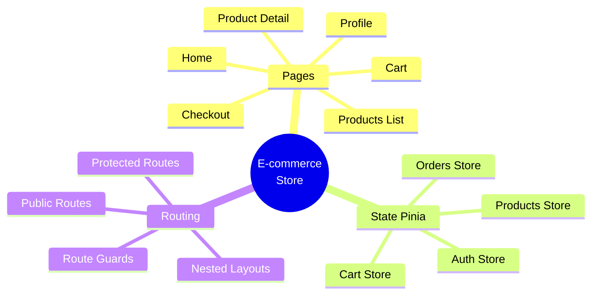
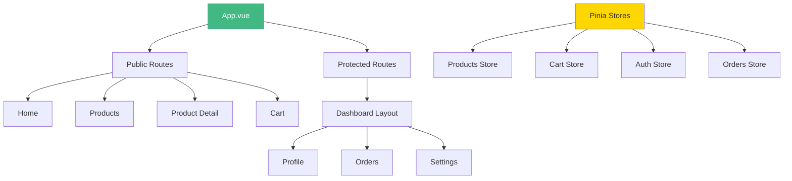

# Day 7 (Day 21): Week 3 Project - E-commerce Store 🛒

**Duration:** 4-6 hours | **Difficulty:** ⭐⭐⭐ Project

---

## 🎯 Project Overview

Build a complete **E-commerce Store** using Pinia & Vue Router!



---

## 📋 Requirements

### **Must Have:**
1. ✅ Product catalog with filtering
2. ✅ Product detail pages
3. ✅ Shopping cart
4. ✅ User authentication
5. ✅ Protected checkout
6. ✅ Order history
7. ✅ Persistent cart (localStorage)
8. ✅ Route guards for auth
9. ✅ Responsive design
10. ✅ Loading & error states

---

## 🏗️ Architecture



---

## 📊 Data Structures

```typescript
interface Product {
  id: number
  name: string
  description: string
  price: number
  image: string
  category: string
  stock: number
}

interface CartItem {
  product: Product
  quantity: number
}

interface Order {
  id: number
  items: CartItem[]
  total: number
  status: 'pending' | 'completed' | 'cancelled'
  createdAt: Date
}

interface User {
  id: number
  name: string
  email: string
  address?: string
}
```

---

## 🗺️ Route Structure

```typescript
const routes = [
  {
    path: '/',
    component: MainLayout,
    children: [
      { path: '', name: 'home', component: HomeView },
      { path: 'products', name: 'products', component: ProductsView },
      { path: 'products/:id', name: 'product-detail', component: ProductDetailView },
      { path: 'cart', name: 'cart', component: CartView },
      { path: 'login', name: 'login', component: LoginView, meta: { guestOnly: true } }
    ]
  },
  {
    path: '/account',
    component: AccountLayout,
    meta: { requiresAuth: true },
    children: [
      { path: '', redirect: '/account/profile' },
      { path: 'profile', name: 'profile', component: ProfileView },
      { path: 'orders', name: 'orders', component: OrdersView },
      { path: 'orders/:id', name: 'order-detail', component: OrderDetailView }
    ]
  },
  {
    path: '/checkout',
    name: 'checkout',
    component: CheckoutView,
    meta: { requiresAuth: true }
  }
]
```

---

## 🗃️ Required Stores

### **1. Products Store**
```typescript
export const useProductStore = defineStore('products', () => {
  const products = ref<Product[]>([])
  const loading = ref(false)
  const error = ref<string | null>(null)
  const selectedCategory = ref<string>('all')
  
  const filteredProducts = computed(() => {
    if (selectedCategory.value === 'all') return products.value
    return products.value.filter(p => p.category === selectedCategory.value)
  })
  
  async function fetchProducts() {
    // Implementation
  }
  
  function getProductById(id: number) {
    return products.value.find(p => p.id === id)
  }
  
  return { products, loading, error, filteredProducts, fetchProducts, getProductById }
})
```

### **2. Cart Store**
```typescript
export const useCartStore = defineStore('cart', () => {
  const items = ref<CartItem[]>([])
  
  const itemCount = computed(() => {
    return items.value.reduce((sum, item) => sum + item.quantity, 0)
  })
  
  const total = computed(() => {
    return items.value.reduce((sum, item) => 
      sum + (item.product.price * item.quantity), 0
    )
  })
  
  function addItem(product: Product, quantity = 1) {
    // Implementation
  }
  
  function removeItem(productId: number) {
    // Implementation
  }
  
  function updateQuantity(productId: number, quantity: number) {
    // Implementation
  }
  
  function clearCart() {
    items.value = []
  }
  
  return { items, itemCount, total, addItem, removeItem, updateQuantity, clearCart }
})
```

---

## 🎨 Key Components

### **ProductCard.vue**
- Product image
- Name, price
- Add to cart button
- Link to detail page

### **Cart.vue**
- List of cart items
- Quantity controls
- Remove item button
- Total price
- Checkout button

### **ProductDetail.vue**
- Full product info
- Image gallery
- Quantity selector
- Add to cart
- Stock availability

---

## 🔐 Navigation Guards

```typescript
router.beforeEach((to, from, next) => {
  const authStore = useAuthStore()
  
  if (to.meta.requiresAuth && !authStore.isAuthenticated) {
    next({ name: 'login', query: { redirect: to.fullPath } })
  } else if (to.meta.guestOnly && authStore.isAuthenticated) {
    next({ name: 'home' })
  } else {
    next()
  }
})
```

---

## ✅ Implementation Steps

### **Phase 1: Setup (30 min)**
1. Create stores
2. Setup router
3. Create layouts

### **Phase 2: Products (2 hours)**
4. Products list page
5. Product detail page
6. Filtering & search

### **Phase 3: Cart (2 hours)**
7. Cart functionality
8. Add/remove/update items
9. Cart persistence

### **Phase 4: Auth & Checkout (2 hours)**
10. Login/logout
11. Protected routes
12. Checkout flow
13. Order history

---

## 🎨 Features

**Must Have:**
- ✅ Browse products
- ✅ View product details
- ✅ Add to cart
- ✅ Update cart quantities
- ✅ User authentication
- ✅ Protected checkout
- ✅ Order placement

**Nice to Have:**
- 🎯 Product search
- 🎯 Category filtering
- 🎯 Sort products
- 🎯 Wishlist
- 🎯 Product reviews
- 🎯 Order tracking

---

## 🚀 Bonus Features

1. **Payment Integration** - Stripe/PayPal
2. **Image Zoom** - On product detail
3. **Related Products** - Recommendations
4. **Discount Codes** - Apply coupons
5. **Email Notifications** - Order confirmations
6. **Admin Dashboard** - Manage products
7. **Stock Management** - Track inventory

---

## ✅ Testing Checklist

**Navigation:**
- [ ] All routes work
- [ ] Protected routes redirect
- [ ] Back/forward navigation
- [ ] 404 page

**Products:**
- [ ] List displays correctly
- [ ] Filter by category
- [ ] Search works
- [ ] Detail page loads

**Cart:**
- [ ] Add to cart
- [ ] Update quantities
- [ ] Remove items
- [ ] Persists on reload

**Auth:**
- [ ] Login works
- [ ] Logout works
- [ ] Guards protect routes
- [ ] Session restores

---

## 📁 File Structure

```
src/
├── views/
│   ├── HomeView.vue
│   ├── ProductsView.vue
│   ├── ProductDetailView.vue
│   ├── CartView.vue
│   ├── CheckoutView.vue
│   ├── LoginView.vue
│   ├── ProfileView.vue
│   └── OrdersView.vue
├── components/
│   ├── ProductCard.vue
│   ├── CartItem.vue
│   ├── Navbar.vue
│   └── Footer.vue
├── layouts/
│   ├── MainLayout.vue
│   └── AccountLayout.vue
├── stores/
│   ├── products.ts
│   ├── cart.ts
│   ├── auth.ts
│   └── orders.ts
└── router/
    └── index.ts
```

---

## 🎓 What You'll Learn

- ✅ Complete Pinia state management
- ✅ Advanced Vue Router patterns
- ✅ Store composition
- ✅ Route guards & meta fields
- ✅ Nested routes & layouts
- ✅ Real-world app architecture
- ✅ E-commerce patterns

---

**Congratulations on completing Week 3!** 🎉

**Next Week:** Vue Advanced Topics! 🚀
