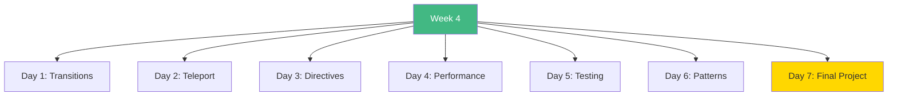

# Week 4: Advanced Vue Topics - Index 📑

**Your complete Week 4 learning guide**

---

## 🗂️ Week Structure

---

## 📅 Daily Breakdown

### **Day 1 (Day 22): Transitions & Animations** ⭐⭐⭐
- 📖 [`day1/README.md`](day1/README.md)
- 💻 `TransitionExamples.vue` - All transition patterns

**Topics:** CSS transitions, animations, TransitionGroup, JavaScript hooks

---

### **Day 2 (Day 23): Teleport & Suspense** ⭐⭐
- 📖 [`day2/README.md`](day2/README.md)
- 💻 `TeleportExamples.vue` - Modals, tooltips, notifications

**Topics:** Teleport component, Suspense, async components, modal patterns

---

### **Day 3 (Day 24): Custom Directives** ⭐⭐⭐
- 📖 [`day3/README.md`](day3/README.md)
- 📝 `directives/focus.ts` - Auto focus
- 📝 `directives/clickOutside.ts` - Outside click detection
- 📝 `directives/tooltip.ts` - Tooltip system

**Topics:** Custom directives, lifecycle hooks, DOM manipulation

---

### **Day 4 (Day 25): Performance Optimization** ⭐⭐⭐
- 📖 [`day4/README.md`](day4/README.md)
- v-once, v-memo
- Virtual scrolling
- Code splitting

**Topics:** Performance, optimization, lazy loading, bundle size

---

### **Day 5 (Day 26): Testing Basics** ⭐⭐⭐
- 📖 [`day5/README.md`](day5/README.md)
- Component testing
- Store testing
- Async testing

**Topics:** Vitest, Vue Test Utils, unit tests, integration tests

---

### **Day 6 (Day 27): Advanced Patterns** ⭐⭐
- 📖 [`day6/README.md`](day6/README.md)
- Renderless components
- Headless UI
- Compound components

**Topics:** Design patterns, reusable logic, flexible components

---

### **Day 7 (Day 28): Final Project** 🎯
- 📖 [`day7/README.md`](day7/README.md)
- Complete Task Manager
- All Week 1-4 concepts

**Build:** Production-ready task management application

---

## 🎯 Learning Checklist

**Animations:**
- [ ] Day 1 Complete
- [ ] CSS transitions
- [ ] Keyframe animations
- [ ] List animations
- [ ] JS hooks

**Advanced Components:**
- [ ] Day 2 Complete
- [ ] Teleport usage
- [ ] Suspense patterns
- [ ] Modal system

**Custom Logic:**
- [ ] Day 3 Complete
- [ ] Create directives
- [ ] Lifecycle hooks
- [ ] DOM manipulation

**Performance:**
- [ ] Day 4 Complete
- [ ] Optimize rendering
- [ ] Virtual scrolling
- [ ] Code splitting

**Testing:**
- [ ] Day 5 Complete
- [ ] Write unit tests
- [ ] Test components
- [ ] Test stores

**Patterns:**
- [ ] Day 6 Complete
- [ ] Renderless components
- [ ] Headless UI
- [ ] Compound patterns

**Final Project:**
- [ ] Day 7 Complete
- [ ] Task manager built
- [ ] All concepts applied
- [ ] Production ready

---

## 💻 Code Statistics

**Week 4 Totals:**
- 📖 **8 README files**
- 💻 **10+ component examples**
- 📝 **5+ directive files**
- 📊 **50+ Mermaid diagrams**
- 🎯 **1 complete task manager**

---

## 🚀 Quick Navigation

| Day | Topic | Difficulty | Focus |
|-----|-------|------------|-------|
| 1 | Transitions | ⭐⭐⭐ | Animations |
| 2 | Teleport | ⭐⭐ | Portal |
| 3 | Directives | ⭐⭐⭐ | DOM |
| 4 | Performance | ⭐⭐⭐ | Optimize |
| 5 | Testing | ⭐⭐⭐ | Quality |
| 6 | Patterns | ⭐⭐ | Design |
| 7 | Project | 🎯 | Integration |

---

## 💡 Key Takeaways

> **"Animations make apps feel alive. Directives add reusable DOM magic."**

> **"Performance matters. Test your code. Use proven patterns."**

> **"The final project ties everything together!"**

---

**Continue to:** [`WEEK4_SUMMARY.md`](WEEK4_SUMMARY.md)

**Review:** [`../week1/README.md`](../week1/README.md) through [`../week3/README.md`](../week3/README.md)

**You're Done!** 🎉
