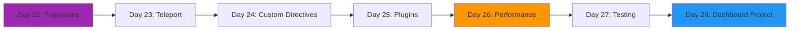
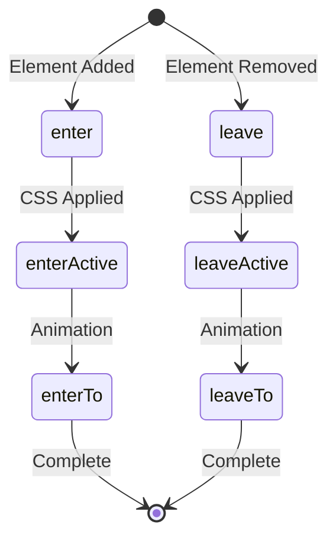
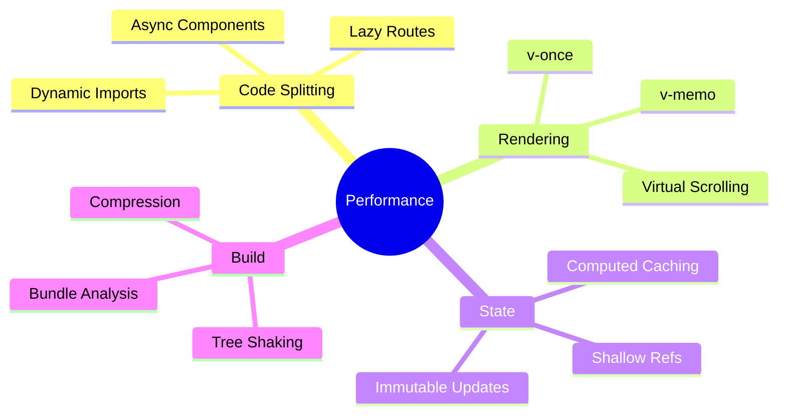

# Week 4: Advanced Vue Patterns 🚀

**Focus:** Animations, performance optimization, and advanced patterns

---

## 📊 Weekly Flow

---

## 📚 Daily Topics

| Day | Topic | Key Concepts |
|-----|-------|--------------|
| **Day 22** | Transitions & Animations | transition, transition-group, GSAP |
| **Day 23** | Teleport & Suspense | Portal pattern, async components |
| **Day 24** | Custom Directives | v-focus, v-click-outside, v-intersection |
| **Day 25** | Plugins & Global Properties | app.use(), global functions |
| **Day 26** | Performance Optimization | Virtual scrolling, lazy loading |
| **Day 27** | Testing with Vitest | Unit tests, component testing |
| **Day 28** | **Project: Animated Dashboard** | Charts, transitions, data viz |

---

## 🎨 Vue Transition System

---

## ⚡ Performance Techniques

---

## 📂 Week Project: Admin Dashboard

- Animated route transitions
- Real-time charts (Chart.js)
- Virtual scrolling table (1000+ rows)
- Custom directives (permissions, tooltips)
- Unit tests for components

---

**Start Day 22!** 🚀
