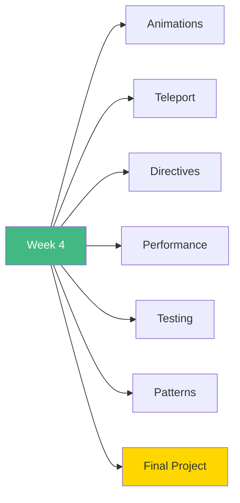

# 🚀 Week 4: Start Here!

**Welcome to Week 4 - Advanced Vue Topics!**

---

## 📚 What You'll Learn This Week

---

## 📅 7-Day Plan

| Day | Topic | Time | Difficulty |
|-----|-------|------|------------|
| **Day 1** | Transitions & Animations | 3-4h | ⭐⭐⭐ |
| **Day 2** | Teleport & Suspense | 2-3h | ⭐⭐ |
| **Day 3** | Custom Directives | 3-4h | ⭐⭐⭐ |
| **Day 4** | Performance Optimization | 3-4h | ⭐⭐⭐ |
| **Day 5** | Testing Basics | 3-4h | ⭐⭐⭐ |
| **Day 6** | Advanced Patterns | 2-3h | ⭐⭐ |
| **Day 7** | Task Manager Project | 6-8h | 🎯 |

**Total:** 22-30 hours

---

## 🎯 Learning Path

### **Start Here:**
1. Read [`INDEX.md`](INDEX.md)
2. Begin with [`day1/README.md`](day1/README.md)
3. Work through each day
4. Build Task Manager on Day 7

---

## 🎓 Learning Outcomes

By the end of Week 4, you will:

✅ Create smooth animations  
✅ Use Teleport for portals  
✅ Build custom directives  
✅ Optimize performance  
✅ Write tests  
✅ Apply advanced patterns  
✅ Build production apps  

---

## 🚦 Prerequisites

- ✅ Weeks 1-3 completed
- ✅ Understand components
- ✅ Know Pinia & Router
- ✅ Comfortable with TypeScript

---

## 💡 Pro Tips

> 💡 **Tip 1:** Animations make apps feel premium
>
> 💡 **Tip 2:** Custom directives = reusable DOM magic
>
> 💡 **Tip 3:** Performance matters - optimize early
>
> 💡 **Tip 4:** Testing saves time in the long run
>
> 💡 **Tip 5:** The final project showcases everything!

---

## ✅ Success Checklist

- [ ] Master Vue transitions
- [ ] Use Teleport effectively
- [ ] Create custom directives
- [ ] Optimize app performance
- [ ] Write component tests
- [ ] Apply advanced patterns
- [ ] Complete task manager

---

## 🎉 Ready to Begin?

**Start your journey:** [`day1/README.md`](day1/README.md)

**Or review the plan:** [`INDEX.md`](INDEX.md)

---

**Let's master advanced Vue!** 🚀
