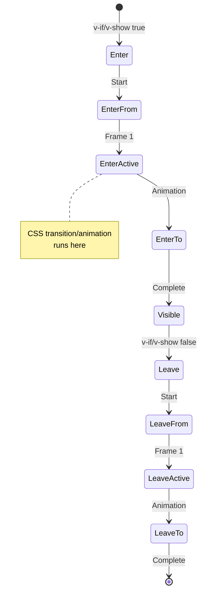
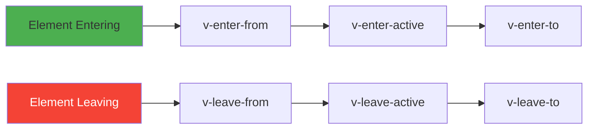
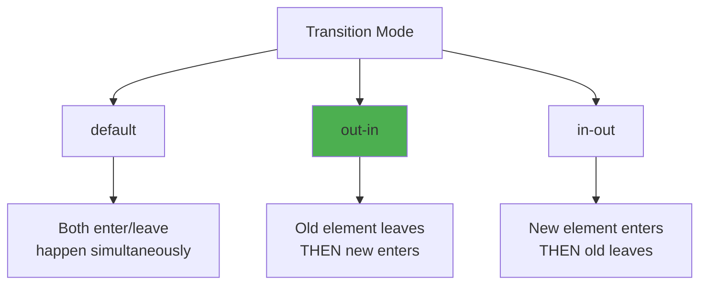

# Day 1 (Day 22): Transitions & Animations 🎬

**Duration:** 3-4 hours | **Difficulty:** ⭐⭐⭐ Hard

---

## 📖 Learning Objectives

- Master Vue transitions
- Create smooth animations
- Use Transition component
- Build transition groups
- CSS & JavaScript hooks

---

## 🎬 Vue Transition System



---

## 🎯 Basic Transition

```vue
<template>
  <div>
    <button @click="show = !show">Toggle</button>
    
    <Transition name="fade">
      <p v-if="show">Hello Vue!</p>
    </Transition>
  </div>
</template>

<script setup lang="ts">
import { ref } from 'vue'

const show = ref(true)
</script>

<style>
.fade-enter-active,
.fade-leave-active {
  transition: opacity 0.5s ease;
}

.fade-enter-from,
.fade-leave-to {
  opacity: 0;
}
</style>
```

---

## 📊 Transition Classes



**Classes Applied:**
- `v-enter-from` - Starting state (1 frame)
- `v-enter-active` - During entire transition
- `v-enter-to` - Ending state
- `v-leave-from` - Starting state
- `v-leave-active` - During entire transition
- `v-leave-to` - Ending state

---

## 🎨 Common Transition Patterns

### **1. Fade**
```css
.fade-enter-active,
.fade-leave-active {
  transition: opacity 0.5s;
}

.fade-enter-from,
.fade-leave-to {
  opacity: 0;
}
```

### **2. Slide**
```css
.slide-enter-active,
.slide-leave-active {
  transition: all 0.3s ease;
}

.slide-enter-from {
  transform: translateX(-100%);
}

.slide-leave-to {
  transform: translateX(100%);
}
```

### **3. Scale**
```css
.scale-enter-active,
.scale-leave-active {
  transition: all 0.3s;
}

.scale-enter-from,
.scale-leave-to {
  transform: scale(0);
  opacity: 0;
}
```

### **4. Bounce**
```css
.bounce-enter-active {
  animation: bounce-in 0.5s;
}

.bounce-leave-active {
  animation: bounce-in 0.5s reverse;
}

@keyframes bounce-in {
  0% {
    transform: scale(0);
  }
  50% {
    transform: scale(1.1);
  }
  100% {
    transform: scale(1);
  }
}
```

---

## 🎯 Transition Modes



```vue
<template>
  <Transition name="fade" mode="out-in">
    <component :is="currentView" />
  </Transition>
</template>
```

---

## 📋 TransitionGroup for Lists

```vue
<template>
  <div>
    <button @click="addItem">Add</button>
    <button @click="shuffle">Shuffle</button>
    
    <TransitionGroup name="list" tag="ul">
      <li v-for="item in items" :key="item.id">
        {{ item.text }}
        <button @click="remove(item.id)">×</button>
      </li>
    </TransitionGroup>
  </div>
</template>

<script setup lang="ts">
import { ref } from 'vue'

const items = ref([
  { id: 1, text: 'Item 1' },
  { id: 2, text: 'Item 2' },
  { id: 3, text: 'Item 3' }
])

let nextId = 4

function addItem() {
  items.value.push({ id: nextId++, text: `Item ${nextId}` })
}

function remove(id: number) {
  items.value = items.value.filter(item => item.id !== id)
}

function shuffle() {
  items.value = items.value.sort(() => Math.random() - 0.5)
}
</script>

<style>
.list-enter-active,
.list-leave-active {
  transition: all 0.5s ease;
}

.list-enter-from {
  opacity: 0;
  transform: translateX(30px);
}

.list-leave-to {
  opacity: 0;
  transform: translateX(-30px);
}

/* Smooth move transition */
.list-move {
  transition: transform 0.5s;
}
</style>
```

---

## 🎪 JavaScript Hooks

```vue
<template>
  <Transition
    @before-enter="onBeforeEnter"
    @enter="onEnter"
    @after-enter="onAfterEnter"
    @enter-cancelled="onEnterCancelled"
    @before-leave="onBeforeLeave"
    @leave="onLeave"
    @after-leave="onAfterLeave"
    @leave-cancelled="onLeaveCancelled"
    :css="false"
  >
    <div v-if="show">Animated with JS</div>
  </Transition>
</template>

<script setup lang="ts">
import { ref } from 'vue'

const show = ref(true)

function onBeforeEnter(el: Element) {
  const element = el as HTMLElement
  element.style.opacity = '0'
  element.style.transform = 'scale(0.5)'
}

function onEnter(el: Element, done: () => void) {
  const element = el as HTMLElement
  element.offsetHeight // Force reflow
  element.style.transition = 'all 0.5s'
  element.style.opacity = '1'
  element.style.transform = 'scale(1)'
  
  setTimeout(done, 500)
}

function onAfterEnter(el: Element) {
  console.log('Enter animation complete')
}

function onBeforeLeave(el: Element) {
  // Setup before leave
}

function onLeave(el: Element, done: () => void) {
  const element = el as HTMLElement
  element.style.transition = 'all 0.5s'
  element.style.opacity = '0'
  element.style.transform = 'scale(0)'
  
  setTimeout(done, 500)
}

function onAfterLeave(el: Element) {
  console.log('Leave animation complete')
}
</script>
```

---

## 🎨 Animation Libraries Integration

### **Using Animate.css**
```vue
<template>
  <Transition
    enter-active-class="animate__animated animate__bounceIn"
    leave-active-class="animate__animated animate__bounceOut"
  >
    <div v-if="show">Hello</div>
  </Transition>
</template>
```

### **Using GSAP**
```vue
<script setup lang="ts">
import gsap from 'gsap'

function onEnter(el: Element, done: () => void) {
  gsap.from(el, {
    scale: 0,
    opacity: 0,
    duration: 0.5,
    onComplete: done
  })
}
</script>
```

---

## 🎯 Real-World Examples

### **Modal Transition**
```vue
<template>
  <Transition name="modal">
    <div v-if="showModal" class="modal-mask" @click.self="close">
      <div class="modal-container">
        <h2>Modal Title</h2>
        <p>Modal content</p>
        <button @click="close">Close</button>
      </div>
    </div>
  </Transition>
</template>

<style>
.modal-enter-active,
.modal-leave-active {
  transition: opacity 0.3s;
}

.modal-enter-from,
.modal-leave-to {
  opacity: 0;
}

.modal-enter-active .modal-container,
.modal-leave-active .modal-container {
  transition: transform 0.3s;
}

.modal-enter-from .modal-container,
.modal-leave-to .modal-container {
  transform: scale(0.9);
}
</style>
```

---

## ✅ Practice Exercise

Build these animated components:
1. **Notification System** - Slide in/out notifications
2. **Tab Switcher** - Smooth tab transitions
3. **Image Gallery** - Fade between images
4. **Todo List** - Animated add/remove
5. **Loading Spinner** - Rotate animation
6. **Accordion** - Expand/collapse animation

---

**Tomorrow:** Teleport & Suspense! 🎪
