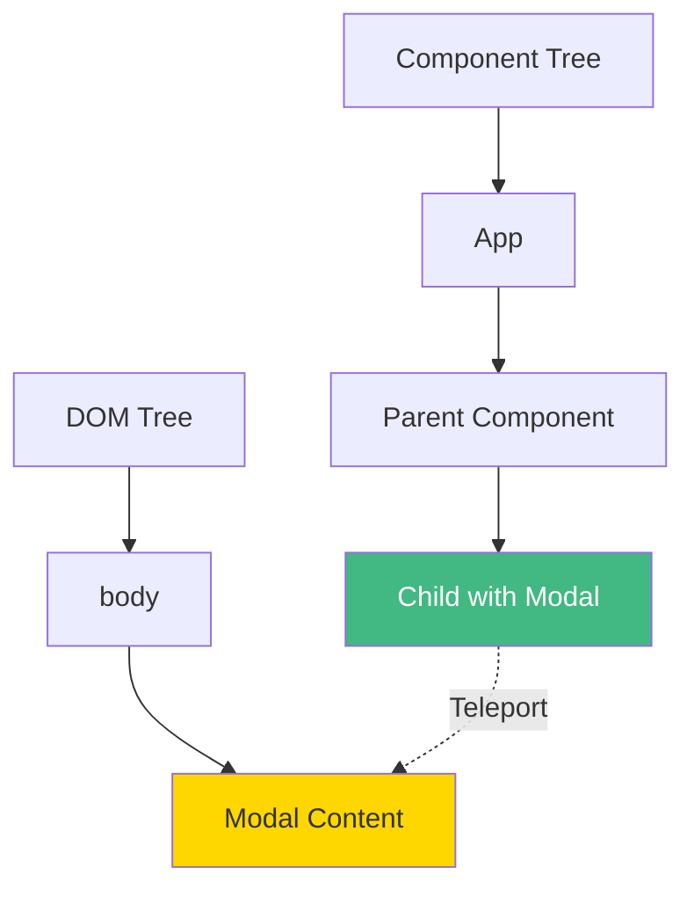
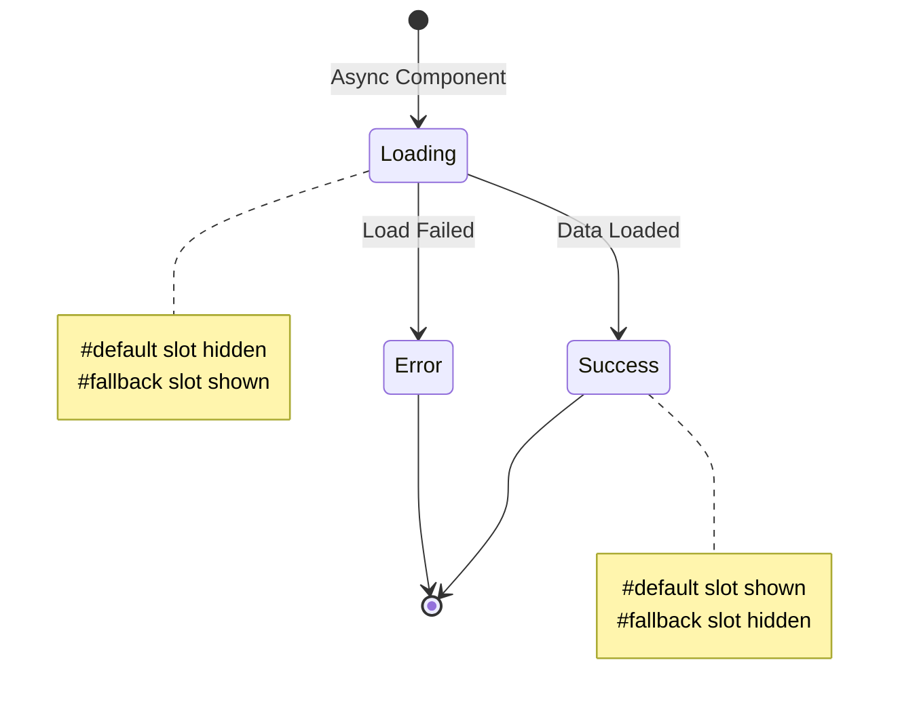

# Day 2 (Day 23): Teleport & Suspense 🎪

**Duration:** 2-3 hours | **Difficulty:** ⭐⭐ Medium

---

## 📖 Learning Objectives

- Master Teleport component
- Use Suspense for async
- Handle loading states
- Build modals & tooltips
- Async component loading

---

## 🎪 Teleport Component



**Teleport moves DOM elements to a different location!**

---

## 🎯 Basic Teleport Usage

```vue
<template>
  <div class="component">
    <button @click="showModal = true">Open Modal</button>
    
    <!-- Teleport to body -->
    <Teleport to="body">
      <div v-if="showModal" class="modal-mask">
        <div class="modal-container">
          <h2>Modal Title</h2>
          <p>Modal content</p>
          <button @click="showModal = false">Close</button>
        </div>
      </div>
    </Teleport>
  </div>
</template>

<script setup lang="ts">
import { ref } from 'vue'

const showModal = ref(false)
</script>

<style>
.modal-mask {
  position: fixed;
  top: 0;
  left: 0;
  width: 100%;
  height: 100%;
  background: rgba(0, 0, 0, 0.5);
  display: flex;
  align-items: center;
  justify-content: center;
  z-index: 9999;
}

.modal-container {
  background: white;
  padding: 2rem;
  border-radius: 8px;
  max-width: 500px;
}
</style>
```

---

## 🎨 Teleport Targets

```vue
<!-- To body -->
<Teleport to="body">
  <div>Content</div>
</Teleport>

<!-- To specific element by ID -->
<Teleport to="#modal-container">
  <div>Content</div>
</Teleport>

<!-- To class -->
<Teleport to=".tooltip-container">
  <div>Content</div>
</Teleport>

<!-- Disable teleport conditionally -->
<Teleport to="body" :disabled="!shouldTeleport">
  <div>Content</div>
</Teleport>
```

---

## 🔄 Suspense Component



---

## 📝 Basic Suspense Usage

```vue
<template>
  <Suspense>
    <!-- Component with async setup -->
    <template #default>
      <AsyncComponent />
    </template>
    
    <!-- Loading fallback -->
    <template #fallback>
      <div class="loading">Loading...</div>
    </template>
  </Suspense>
</template>

<script setup lang="ts">
import AsyncComponent from './AsyncComponent.vue'
</script>
```

### **Async Component:**
```vue
<!-- AsyncComponent.vue -->
<template>
  <div>
    <h2>{{ data.title }}</h2>
    <p>{{ data.content }}</p>
  </div>
</template>

<script setup lang="ts">
const data = await fetch('/api/data').then(r => r.json())
// Top-level await! Suspense handles the loading state
</script>
```

---

## 🎯 Complete Modal Example

```vue
<!-- ModalComponent.vue -->
<template>
  <Teleport to="body">
    <Transition name="modal">
      <div v-if="isOpen" class="modal-mask" @click.self="close">
        <div class="modal-container">
          <div class="modal-header">
            <slot name="header">
              <h2>Modal Title</h2>
            </slot>
            <button @click="close" class="close-btn">×</button>
          </div>
          
          <div class="modal-body">
            <slot></slot>
          </div>
          
          <div class="modal-footer">
            <slot name="footer">
              <button @click="close">Close</button>
            </slot>
          </div>
        </div>
      </div>
    </Transition>
  </Teleport>
</template>

<script setup lang="ts">
interface Props {
  isOpen: boolean
}

const props = defineProps<Props>()

const emit = defineEmits<{
  close: []
}>()

function close() {
  emit('close')
}
</script>

<style scoped>
.modal-mask {
  position: fixed;
  inset: 0;
  background: rgba(0, 0, 0, 0.5);
  display: flex;
  align-items: center;
  justify-content: center;
  z-index: 9999;
}

.modal-container {
  background: white;
  border-radius: 12px;
  max-width: 600px;
  width: 90%;
  max-height: 90vh;
  overflow: auto;
  box-shadow: 0 10px 40px rgba(0, 0, 0, 0.2);
}

.modal-header {
  display: flex;
  justify-content: space-between;
  align-items: center;
  padding: 1.5rem;
  border-bottom: 1px solid #eee;
}

.modal-body {
  padding: 1.5rem;
}

.modal-footer {
  padding: 1.5rem;
  border-top: 1px solid #eee;
  text-align: right;
}

.close-btn {
  background: none;
  border: none;
  font-size: 2rem;
  cursor: pointer;
  color: #999;
  line-height: 1;
}

.close-btn:hover {
  color: #333;
}

.modal-enter-active,
.modal-leave-active {
  transition: opacity 0.3s;
}

.modal-enter-from,
.modal-leave-to {
  opacity: 0;
}

.modal-enter-active .modal-container,
.modal-leave-active .modal-container {
  transition: transform 0.3s;
}

.modal-enter-from .modal-container,
.modal-leave-to .modal-container {
  transform: scale(0.9);
}
</style>
```

---

## 🎨 Tooltip with Teleport

```vue
<template>
  <div class="tooltip-trigger" @mouseenter="show" @mouseleave="hide">
    <slot></slot>
    
    <Teleport to="body">
      <div v-if="isVisible" class="tooltip" :style="tooltipStyle">
        {{ text }}
      </div>
    </Teleport>
  </div>
</template>

<script setup lang="ts">
import { ref, computed } from 'vue'

interface Props {
  text: string
}

const props = defineProps<Props>()

const isVisible = ref(false)
const triggerRect = ref<DOMRect | null>(null)

function show(e: MouseEvent) {
  isVisible.value = true
  const target = e.currentTarget as HTMLElement
  triggerRect.value = target.getBoundingClientRect()
}

function hide() {
  isVisible.value = false
}

const tooltipStyle = computed(() => {
  if (!triggerRect.value) return {}
  
  return {
    top: `${triggerRect.value.bottom + 8}px`,
    left: `${triggerRect.value.left + triggerRect.value.width / 2}px`,
    transform: 'translateX(-50%)'
  }
})
</script>

<style scoped>
.tooltip {
  position: fixed;
  background: #333;
  color: white;
  padding: 0.5rem 1rem;
  border-radius: 4px;
  font-size: 0.875rem;
  white-space: nowrap;
  z-index: 10000;
  pointer-events: none;
}
</style>
```

---

## 🔄 Advanced Suspense with Error Handling

```vue
<template>
  <Suspense @resolve="onResolve" @pending="onPending">
    <template #default>
      <AsyncComponent />
    </template>
    
    <template #fallback>
      <LoadingSpinner />
    </template>
  </Suspense>
  
  <!-- Error boundary (separate) -->
  <div v-if="error" class="error">
    {{ error.message }}
  </div>
</template>

<script setup lang="ts">
import { ref, onErrorCaptured } from 'vue'

const error = ref<Error | null>(null)

function onResolve() {
  console.log('Async component loaded')
}

function onPending() {
  console.log('Loading...')
}

onErrorCaptured((err) => {
  error.value = err
  return false // Prevent error from bubbling
})
</script>
```

---

## ✅ Practice Exercise

Build these components:
1. **Modal System** - Reusable modal with Teleport
2. **Notification Toast** - Top-right notifications
3. **Tooltip Component** - Hover tooltips
4. **Drawer/Sidebar** - Slide-in panel
5. **Async Data Table** - With Suspense
6. **Loading Overlay** - Full-screen loader

---

**Tomorrow:** Custom Directives! 🎯
